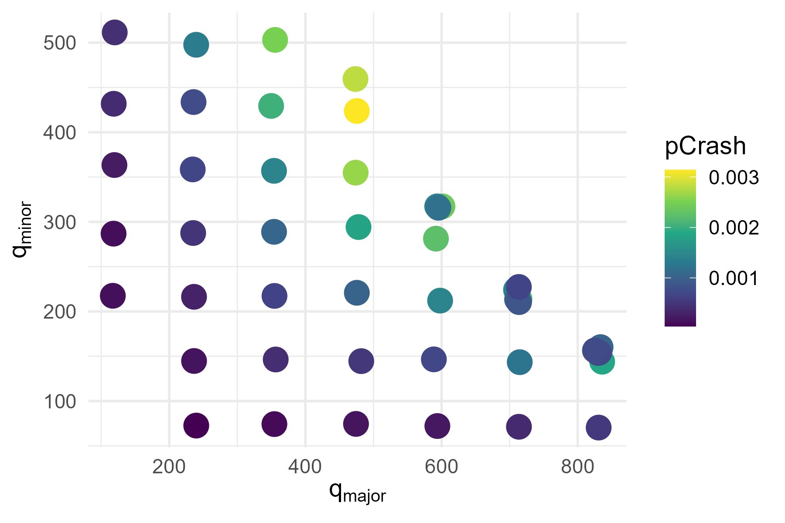

# Summary

Simulating a transportation system microscopically requires a solid framework that maps real-life features into the software. The Simulation of Urban MObility (SUMO) suite [@SUMO2018] features a wide range of software tools to facilitate research and application projects alike, and to help users to set-up a traffic simulation for a chosen real or synthetic area with minimum effort. At its heart is the simulation itself (in form of a command line, as well as a GUI application), and an editor for transportation networks (netedit), which can run any scenario from a single intersection up to a multi-modal network the size of the city of Berlin, Germany. The size is only limited by the hardware and the patience of the user. A wide range of methods is built not only into the simulation itself but also into several hundred accompanying Python tools to help assess the impact of any changes to the base scenario — such as changes in travel times, capacity, emissions, and more. In addition to that, SUMO can be controlled externally by python scripts via libsumo or the TraCI library, thereby extending furthermore what can be done with it.

# Statement of need

Microscopic simulations of multi-modal transportation networks require a description of the network, and a detailed plan how objects (motorized and non-motorized vehicles, persons, goods) move through such a network. In the case of SUMO, this is achieved by assigning a route to each object in the simulation network that it has to follow from origin to destination, starting at a particular moment in time. The sum of all these trips is the so called origin-destination matrix, which is generally time-dependent. SUMO excels especially at the detailed modelling of how individual objects move in transportation networks. It is weaker, however, when it comes to the computation of the demand itself, which can be achieved by other, more dedicated tools like [TAPAS](https://github.com/DLR-VF/TAPAS/) [@Heinrichs:2017] or MATSim [@MATSim:2016].

For larger networks, an additional step is needed to transfer the demand (the time-dependent OD-matrix) into real routes that the various objects follow through the network. This is called the dynamic traffic assignment, which assumes that there is a kind of equilibrium between the demand and the supply given by the network. This fairly old (first ideas are from 1924), but still prevailing concept was formalized by @Wardrop:1952 and @BeckmannEtAl:1955, and comes in several flavours such as user equilibrium (UE), stochastic user equilibrium (SUE) etc. SUMO contains several tools to compute these equilibria, again in the form of python scripts that repeatedly start the simulation with changing routes, until such an equilibrium is achieved.

SUMO has been designed to be useful in the assessment of a wide range of transport questions. This may start from the estimation of new control algorithms for traffic signals, to the exploration of on-demand public transport services, or to the improvement of railway operations, for which the modelling of railway systems, the vehicles as well as the infrastructure itself, has been considerably improved in recent years. It can be even utilized to simulate electrical autonomous air-taxis, however this is currently not in the main focus of the development. SUMO has been used for research, for business, and even by laypersons to answer all kind of what-if questions in transportation systems.

SUMO also features in teaching, for example in courses at the TH Wildau, TU Munich, and the TU Berlin (all in Germany), to name but a few. Many tutorials do exist, which have also been extended in order to teach traffic modelling and simulation.

# Similar and/or related packages

Especially regarding transport demand and the computation of the user equilibrium, the best-known tool for this is MATSim [@MATSim:2016]. A much less developed approach which is not simulation-based can be found in @Ortmann2022. Many smaller tools may exist, for a more traffic flow optimized tooling the user is referred to Martin Treiber's [movsim](https://github.com/movsim/movsim) [@Treiber:2010], or Open Traffic Sim [@opentrafficsim]. On the other side of the spectrum, there are simulators focusing on very detailed single-vehicle models, including their sensors, such as CARLA [@Carla].

# Outlook and use cases

The following example has been picked as a use case where the simulation induces crashes deliberately. While not the original intention, crashes and traffic safety is a highly relevant topic of research. While simple in principle, investigations are needed to better understand how to do this, and to reproduce known results from traffic safety research. One of the very early attempts in this regard is by @DarzentasEtAl1980, and we have set-up a simulation that replicates the set-up of this work. Furthermore, there are known results that state that the number of crashes at such a three-arm intersection is some safety performance function of the two flows $q_{\text{major}}$ and $q_{\text{minor}}$. It is not to be expected that SUMO reproduces this out of the box; nevertheless a first result for the simulated crash probability as a function of the two flows is presented in \autoref{fig:pCrash}.

# Acknowledgements

We acknowledge financial support by the German Aerospace Center, and by multiple projects (and the related funds) that have helped a lot during the 20+ years of SUMO's development. Furthermore we thank the Eclipse Foundation for hosting the project.

# References
