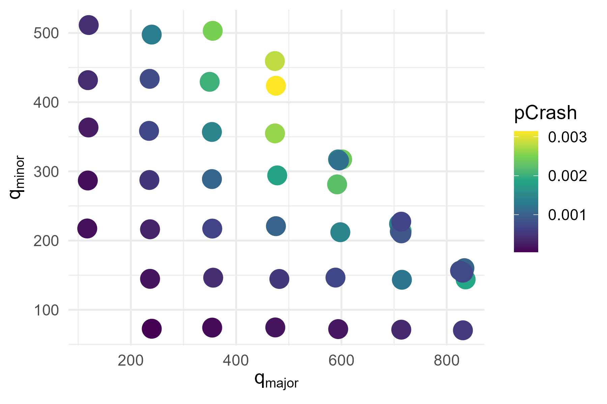

# Summary

Simulating a transportation system microscopically requires a solid framework that maps real-life characteristics into the software. The Simulation of Urban MObility (SUMO) suite [@SUMO2018] features a wide range of software tools to facilitate research and application projects alike, and to help users to set-up a traffic simulation for a chosen real-world or synthetic area with minimum effort. At its heart is the simulation itself (in form of a C++ command line, as well as a GUI application), and an editor for transportation networks (netedit), which can run any scenario from a single intersection up to a multi-modal network the size of the city of Berlin, Germany. In practice, network size is only limited by the available hardware and, perhaps, the patience of the user. A wide range of methods is built not only into the simulation itself but also into several hundred accompanying Python tools to help assess the impact of any changes to the base scenario — such as changes in travel times, capacity, emissions, and more. In addition to that, `SUMO` can be controlled externally e.g. by Python scripts via libsumo or the TraCI library, thereby extending what can be done with it.

# Statement of need

Microscopic simulations of multi-modal transportation networks require a description of the network, and a detailed plan for how objects (motorized and non-motorized vehicles, persons, goods) move through such a network. In the case of `SUMO`, this is achieved by assigning a route to each object in the simulation network that it has to follow from origin to destination, starting at a particular moment in time. The sum of all these trips is the so called origin-destination matrix, which is generally time-dependent. `SUMO` excels especially at the detailed modelling of how individual objects move in transportation networks. It is weaker, however, when it comes to the computation of the demand itself, which can be achieved by other, more dedicated tools like [TAPAS](https://github.com/DLR-VF/TAPAS/) [@Heinrichs:2017] or MATSim [@MATSim:2016].

For larger networks, an additional step is needed to convert the demand (the time-dependent origin-destination matrix) into real routes that objects follow through the network. This is called dynamic traffic assignment, which assumes that there is a kind of equilibrium between the demand and the supply given by the network. This fairly old, but still prevailing concept (first ideas date back to 1924) was formalized by @Wardrop:1952 and @BeckmannEtAl:1955, and comes in several flavors such as user equilibrium (UE), stochastic user equilibrium (SUE) etc. `SUMO` contains several tools to compute these equilibria, again in the form of Python scripts that repeatedly start the simulation with changing routes until such an equilibrium is achieved.

`SUMO` has been designed to be useful in the assessment of a wide range of transport questions. These include the estimation of new control algorithms for traffic signals, the exploration of on-demand public transport services, and the improvement of railway operations, for which the modelling of railway systems, vehicles, and infrastructure has been considerably improved in recent years. It can be even utilized to simulate electrical autonomous air-taxis, however this is currently not in the main focus of the development. `SUMO` has been used for research, for business, and even by laypersons to answer all kind of what-if questions in transportation systems.

The software is also integrated into teaching at the TH Wildau, TU Munich, and TU Berlin (all in Germany), to name but a few. Many tutorials do exist, which have also been extended in order to teach traffic modelling and simulation[^1].

[^1]: See: [https://sumo.dlr.de/docs/Tutorials/](https://sumo.dlr.de/docs/Tutorials/)

# Software design

`SUMO` was initiated over 25 years ago, when no comparable open-source traffic simulation framework existed, making the development of a new software platform the only viable option. The software is a modular framework with a simulation core that emphasizes computational efficiency and deterministic execution on shared-memory systems, prioritising single-core performance over multi-core parallelization (still in progress). It is complemented by graphical applications, command-line tools, and utilities for network generation, demand modelling, visualization, and analysis. Portability was a key design objective, achieved through the use of C++, Python, and platform-independent libraries to support Windows, Linux, and macOS. Interoperability with external software is provided through standardized XML-based input and output formats, with additional support for CSV and Parquet exports, as well as APIs such as TraCI and libsumo for simulation control and co-simulation.

`SUMO` is complemented by a set of bundled extensions included in the distribution, which originate from external development efforts. These components, such as hybridPy, Cadyts, LiSuM, and SAGA, extend `SUMO` functionality for tasks such as demand generation, calibration, traffic signal control integration, and activity-based demand modelling, with varying levels of maintenance and support.[^2]

[^2]: See: [https://sumo.dlr.de/docs/Contributed/](https://sumo.dlr.de/docs/Contributed/)

# Research impact statement

Since its inception in 2001, `SUMO` has established itself as one of the world's leading open-source traffic simulation platforms. It has been downloaded nearly half a million times by users from 203 countries[^3] and is maintained by DLR's core development team and an active community with more than 78000 commits from over 230 contributors on GitHub, accompanied by approximately 627,000 words of online documentation. Continuous development is reflected in a regular release cycle, with up to four new versions published each year, all of which are recorded on Zenodo since 2023 ([SUMO releases](https://zenodo.org/records/20312733)). The scientific impact is demonstrated by over 13,000 citations across its five most cited publications on Google Scholar. The ecosystem is further supported by the `SUMO` conference (since 2013), which attracts around 50–100 participants annually and includes tutorials, Q&A sessions, scientific talks, posters, and workshops. Since 2018, `SUMO` has also been a project within the Eclipse Foundation.

Overall, these metrics highlight SUMO's significant impact on transportation research and its role as a widely recognized platform for studying multimodal traffic operations, intelligent railway and transportation systems, as well as emerging mobility concepts.

[^3]: See: [sourceforge.net/projects/sumo](https://sourceforge.net/projects/sumo/files/sumo/stats/map?dates=2002-01-13%20to%202026-06-11)

# Similar and/or related packages

Especially regarding transport demand and the computation of the user equilibrium, the best-known tool for this is MATSim [@MATSim:2016]. A much less developed approach which is not simulation-based can be found in @Ortmann2022. Many smaller tools may exist, for a more traffic flow optimized tooling the user is referred to Martin Treiber's [movsim](https://github.com/movsim/movsim) [@Treiber:2010], or Open Traffic Sim [@opentrafficsim]. On the other side of the spectrum, there are simulators focusing on very detailed single-vehicle models, including their sensors, such as CARLA [@Carla].

# Outlook and use cases

The following example has been picked as a use case where the simulation induces crashes deliberately. While not the original intention in SUMO's design, crashes and traffic safety are highly relevant topics of research. While this may seem simple in principle, investigations are needed to better understand how to simulate this in order to reproduce known results from traffic safety research. One of the very early attempts in this regard was made by @DarzentasEtAl1980, and we have set up a simulation that replicates the setup of this work. Furthermore, there are known results that state that the number of crashes at such a three-arm intersection is a safety performance function of the two flows $q_{\text{major}}$ and $q_{\text{minor}}$. It is not to be expected that `SUMO` reproduces this out of the box; nevertheless a first result for the simulated crash probability as a function of the two flows is presented in \autoref{fig:pCrash}.

# AI usage disclosure

In general, the `SUMO` code base has been and continues to be maintained by the development team over the past 25 years without the use of generative AI. That said, in recent years some AI tools have proven useful for solving individual issues and have partly replaced traditional searches on platforms such as Stack Overflow. In particular, the translation of the software into currently 17 languages by the community is probably supported by AI-based translation tools[^4]. Therefore, some degree of AI-assisted contribution to `SUMO` as an open-source project cannot be generally excluded.

[^4]: See: [SUMO Translating](https://sumo.dlr.de/docs/Developer/Translating.html)

# Acknowledgements

We acknowledge financial support by the German Aerospace Center, and by multiple projects (and the related funds) that have helped a lot during the 20+ years of SUMO's development. Furthermore we thank the Eclipse Foundation for hosting the project.

# References
