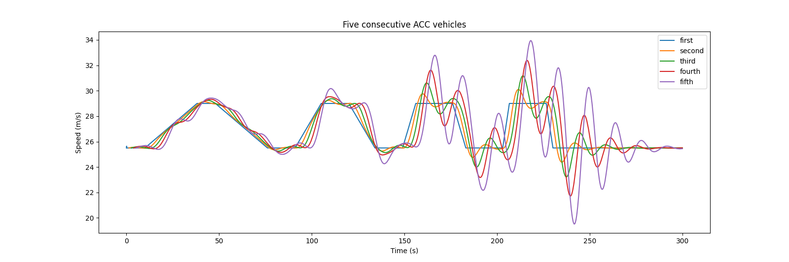

# Overview

The integrated ACC car-following model is based on the work of Milanés &
Shladover [\[1\]](#references) and Xiao, Wang & van Arem [\[2\]](#references), wherein the developed
control law in the ACC control algorithm is explicitly divided into
three modes: (i) speed (or cruising) control, (ii) gap control
and (iii) gap-closing control. A fourth mode (i.e. collision avoidance mode) has
been introduced within the project [TransAID](https://www.transaid.eu), when the ACC model was first integrated to SUMO [\[3\]](#references).

Note, that the additional modes (iii) and (iv) aim to enable stable and safe car-following behavior in SUMO, 
whereas the original publication [\[1\]](#references) reveals string instabilities in experimental data and simulations 
for vehicle platoons with ACC controllers (see [String Instabilities in ACC Platoons](#string_instabilities_in_acc_platoons)).

see also [CACC model](CACC.md).

## (i) Speed control mode

The speed control mode is designed to maintain the pre-defined by the
driver desired speed and is activated when there are no preceding
vehicles in the range covered by the sensors or preceding vehicles exist
in a spacing larger of 120 m.

## (ii) Gap control mode

The gap control mode aims to maintain a constant time gap between the
ACC-equipped vehicle and its predecessor and is activated when the gap
and speed deviations (with respect to the preceding vehicle) are
concurrently smaller than 0.2 m and 0.1 m/s, respectively.

## (iii) Gap-closing control mode

The gap-closing controller enables the smooth transition from speed
control mode to gap control mode and is triggered when the spacing to
the preceding vehicle is smaller than 100 m. If the spacing is between
100 m and 120 m, the ACC-equipped vehicle retains the previous control
strategy to provide hysteresis in the control loop and perform a smooth
transfer between the two strategies.

## (iv) Collision avoidance control mode

The collision avoidance mode prevents rear-end collisions when safety
critical conditions prevail. This mode is activated when the spacing to
the preceding vehicle is smaller than 100 m and the gap deviation is
negative.

Also, if the `followSpeed` computed by the ACC model grows higher than the safe `followSpeed` as computed by the default *Krauss* model by a given margin (configured by `collisionAvoidanceOverride`), the speed is limited to the value of *Krauss*-speed + margin. The override margin defaults to 2m/s.

# String Instabilities in ACC Platoons
Milanés & Shladover [\[1\]](#references) showed in their experiments that the proposed ACC controller is string instable. Although ACC controllers can be calibrated to be string stable, e.g. Gunter et al. [\[4\]](#references) raise concern that commercial vehicles mostly deploy ACC controllers that are string instable due to driving comfort reasons.

To investigate stability effects of vehicle platoons deploying the original ACC model with SUMO, it's possible to disable the modes (iii) and (iv) by resetting the following parameters to:

| Mode | Attribute | Value |
| --- | --- | --- |
| iii | gapClosingControlGainSpeed | 0.07 |
| iii | gapClosingControlGainSpace | 0.23 |
| iv | collisionAvoidanceGainSpeed | 0.07 |
| iv | collisionAvoidanceGainSpace | 0.23 |

Note, that the parameter `collisionAvoidanceOverride` (default: 2) affects the mode (iv) by overriding the followSpeed when deemed unsafe by the given margin. To eliminate this case, which slightly affects the platooning behavior, but not the string instability itself, this parameter may be set to to a much larger value (i.e. 100) to avoid the effect.

The default parameters of the ACC model can be found here: [Car-Following Model Parameters](../Definition_of_Vehicles,_Vehicle_Types,_and_Routes.md#car-following_model_parameters)

Given the parametrization from the table, you could replicate the platoon oscillation as in Fig.12 in [\[1\]](#references) with SUMO:

# Notes

- The implemented model can be found in [{{SUMO}}/src/microsim/cfmodels/MSCFModel_ACC.cpp]({{Source}}src/microsim/cfmodels/MSCFModel_ACC.cpp).
- Literature on the developed ACC driving model and its implementation
  can be found
  [here](https://www.transaid.eu/wp-content/uploads/2017/Deliverables/WP3/TransAID_D3.1_Modelling-simulation-and-assessment-of-vehicle-automations.pdf).
- This part of SUMO was developed and extended within the project
  [TransAID](https://www.transaid.eu).
- The model is primarily intended for use in specific traffic
  situations.
- When there is no leader vehicle, the model uses the same speed as the Krauss model to approach junctions and speed limits

!!! caution
    The model is known to produce collisions at the default step-length of 1s. Better results can be achieved by setting a lower step length (e.g. 0.1s).

# References

1.  Milanés, V., & Shladover, S. E. (2014). Modeling cooperative and
    autonomous adaptive cruise control dynamic responses using
    experimental data. Transportation Research Part C: Emerging
    Technologies, 48, pp. 285–300.
    <https://doi.org/10.1016/j.trc.2014.09.001>
2.  Xiao, L., Wang, M., & van Arem, B. (2017). Realistic Car-Following
    Models for Microscopic Simulation of Adaptive and Cooperative
    Adaptive Cruise Control Vehicles. Transportation Research Record:
    Journal of the Transportation Research Board, 2623, pp. 1–9.
    <https://doi.org/10.3141/2623-01>
3.	Porfyri, K. N., Mintsis, E., & Mitsakis, E. (2018). Assessment of ACC and CACC systems using SUMO. 
	EPiC Series in Engineering, 2, 82-93. 
	<https://doi.org/10.29007/r343>
4.  G. Gunter et al., "Are Commercially Implemented Adaptive Cruise Control Systems String Stable?," 
	in IEEE Transactions on Intelligent Transportation Systems, vol. 22, no. 11, pp. 6992-7003, Nov. 2021. 
	<https://doi.org/10.1109/TITS.2020.3000682>
