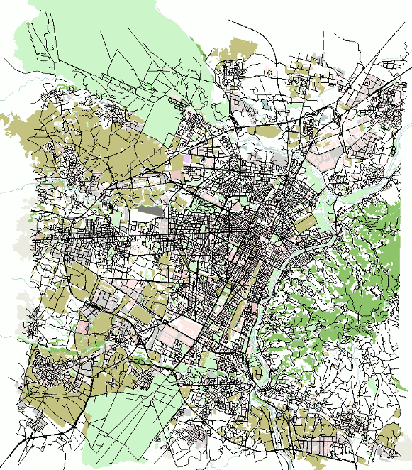

# We need your Help!

Building a scenario is a lot of work. If you have built a SUMO scenario
you can share (under a sufficiently open license), please
[contact us](../Contact.md).

# Bologna

A small-scale scenario based on the city of Bologna. The large
roundabout can be found at 44.494554,11.314393. These scenarios were
developed as part of the [iTETRIS project](http://www.ict-itetris.eu). A
[publication](http://elib.dlr.de/89354) on these scenarios was presented
at [SUMO
Conference 2014](https://sumo.dlr.de/docs/Publications.html#SUMO_2014): L.
Bieker, D. Krajzewicz, A. Morra, C. Michelacci and F. Cartolano,
"Traffic simulation for all: a real world traffic scenario from the city
of Bologna", SUMO2014, p 19-26

- [Bologna Scenario on GitHub](https://github.com/DLR-TS/sumo-scenarios/tree/master/bologna/)
- (Old release) [Download .zip files from SourceForge](http://sourceforge.net/projects/sumo/files/traffic_data/scenarios/Bologna_small)

# Brunswick

- [Brunswick Scenario on GitHub](https://github.com/DLR-TS/sumo-scenarios/tree/master/brunswick)

# Dublin - Irish Motorway, National road and city centre 

- [Main Page](https://github.com/maxime-gueriau/ITSC2020_CAV_impact)
- Publication: Quantifying the impact of connected and autonomous vehicles on traffic efficiency and safety in mixed traffic" by Maxime Gueriau and Ivana Dusparic, presented at the The 23rd IEEE International Conference on Intelligent Transportation Systems (ITSC 2020)

# Ingolstadt traffic scenario
## InTAS

- [Main Page](https://github.com/silaslobo/InTAS)
- [Presentation video](https://www.youtube.com/watch?v=UgPeBxXzDHc)

## SUMO Ingolstadt
Created in the SAVe:, SAVeNoW and KIVI research projects
- [Main Page](https://github.com/TUM-VT/sumo_ingolstadt)

# Luxembourg SUMO Traffic (LuST)

- [Main Page](https://github.com/lcodeca/LuSTScenario)
- [Releases](https://github.com/lcodeca/LuSTScenario/releases)
- [Documentation](https://github.com/lcodeca/LuSTScenario/blob/master/docs/LuSTDocumentation.md)
- Publication: Lara CODECA, Raphael FRANK, Thomas ENGEL. December 2015. Luxembourg SUMO Traffic (LuST) Scenario: 24 Hours of Mobility
for Vehicular Networking Research in Proceedings of the 7th IEEE
Vehicular Networking Conference (VNC15).

# Monaco SUMO Traffic (MoST)

- [Main Page](https://github.com/lcodeca/MoSTScenario)
- [Releases](https://github.com/lcodeca/MoSTScenario/releases)
- Publication: L. Codeca, J. Härri, "Towards Multimodal Mobility
Simulation of C-ITS: The Monaco SUMO Traffic Scenario" VNC 2017,
IEEE Vehicular Networking Conference November 27-29, 2017, Torino,
Italy.

# Stuttgart Open Motorway Project (STOMP)

- [Main Page](https://github.com/boschresearch/stuttgart-sumo-traffic-scenario)
- Publication: David Förster, Hans Löhr, Anne Grätz, Jonathan Petit, and Frank Kargl, "An Evaluation of Pseudonym Changes for Vehicular Networks in Large-scale, Realistic Traffic Scenarios", IEEE Transactions on Intelligent Transportation Systems 19.10 (2017): 3400-3405, doi: [10.1109/TITS.2017.2775519](https://doi.org/10.1109/TITS.2017.2775519).

# Turin SUMO Traffic (TuST)
A large-scale mesoscopic traffic simulation of a 600-sqkm area around the Municipality of Turin.

- [Main Page](https://github.com/marcorapelli/TuSTScenario)
- Publications:
  - M. Rapelli, C. Casetti and G. Gagliardi, “Vehicular Traffic Simulation in the City of Turin from Raw Data” in IEEE Transactions on Mobile Computing, April 2021. DOI: 10.1109/TMC.2021.3075985 [pre-print](https://ieeexplore.ieee.org/document/9416842)
  - M. Rapelli, C. Casetti and G. Gagliardi, "TuST: from Raw Data to Vehicular Traffic Simulation in Turin," 2019 IEEE/ACM 23rd International Symposium on Distributed Simulation and Real Time Applications (DS-RT), Cosenza, Italy, 2019, pp. 1-8, doi: 10.1109/DS-RT47707.2019.8958652. [pre-print](https://ieeexplore.ieee.org/document/8958652)

!!! note
    It requires [git-lfs](https://git-lfs.github.com/) to download

# TAPASCologne

   
The "TAPAS Cologne" simulation scenario
describes the traffic within the city of Cologne, Germany for a whole
day. The original demand data stems from TAPAS, a system which computes
mobility wishes for an area population generated based on information
about travelling habits of Germans and on information about the
infrastructure of the area they live in.

More information about the system can be found within this [publication
on TAPAS](http://elib.dlr.de/45058/02/SRL_81_-_Beitrag_Varschen.pdf).
The original data was using a closed-source road network and was mapped
onto one stemming from the [OpenStreetMap
project](http://www.openstreetmap.de/).

There is further information about
[TAPASCologne](../Data/Scenarios/TAPASCologne.md).

# TAVF-Hamburg

A scenario from the [TAVF](https://tavf.hamburg/en/) test track for automated and
connected driving in Hamburg.

- [TAVF-Hamburg Scenario on GitHub](https://github.com/DLR-TS/sumo-scenarios/tree/master/TAVF-Hamburg)

# Further real-world scenarios

- [Bologna Ringway](http://academic.lucabedogni.it/the-bologna-ringway-dataset/).
    Scenario built within the [COLOMBO R&D
    project](https://web.archive.org/web/20170716120720/http://www.colombo-fp7.eu/).

!!! caution
    This scenario is known to have lots of collisions due to unsafe traffic lights and some invalid junction definitions. It is also quite jammed.

# Synthetic scenarios

Synthetic - or abstract - scenarios only resemble typical layouts of
real-world junctions and arterials without mapping a very specific one.
Some synthetic scenarios of the [COLOMBO R&D
project](https://web.archive.org/web/20170716120720/http://www.colombo-fp7.eu/) are examples of the German guideline
RiLSA. They are described in [D1.1 "Scenario Specifications and Required
Modifications to Simulation
Tools"](https://web.archive.org/web/20170808122505/http://elib.dlr.de/98046/1/COLOMBO_D1.1_ScenariosExtensions_v2.4.pdf)(chapter
4).

- Download: [4 RiLSA \*.zip files](http://sourceforge.net/projects/sumo/files/traffic_data/scenarios/RiLSA)

# Wildau

This scenario can be followed as a tutorial - it showcases how routes can be generated within a network, using counting data.

- [Wildau Scenario on GitHub](https://github.com/DLR-TS/sumo-scenarios/tree/master/Wildau)

# Test cases

SUMO comes with a large set of tests which are run at least once per day (and most are run on each repository commit).
You can [extract them](../Tutorials/index.md#using_examples_from_the_test_suite) and use them as basis for your own (small) scenarios.
