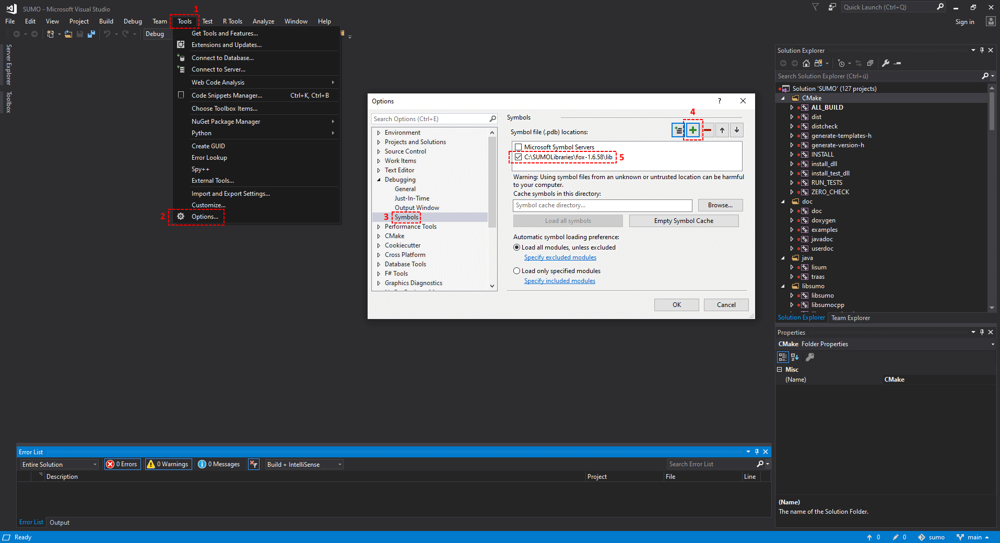

Besides using a debugger (e.g. [gdb](https://www.gnu.org/s/gdb/)) with
the debug build (see below), the SUMO source code offers debugging
macros at several locations, which are usually deactivated (e.g.,
commented out). Activating the macros can yield a detailed program
output, that can be configured by given parameters.

## Debug Build

To create debugging symbols during the build, see the build instructions
for your operating system ([Linux](../Installing/Linux_Build.md) /
[Windows](../Installing/Windows_Build.md) /
[macOS](../Installing/MacOS_Build.md)). The corresponding binaries
receive the suffix `D` (e.g. `sumoD` instead of `sumo`). The debug
configuration defines a preprocessor macro `_DEBUG` that may be used to
encapsulate debug specific code. For simple text debugging, local macros
should be used that can be switched on and off more flexibly, see below.

## Local Debug Macros

The recommended style for inserting reusable debugging code in SUMO is
encapsulation by preprocessor directives. This is done by placing a
`#define DEBUG_THIS_CODE` at the beginning of a source (preferably just
below any other `#include` or `#define` macros). The debugging code
(e.g. some output to `std::cout`) should then be surrounded by

```
#ifdef DEBUG_THIS_CODE
    ...
#endif
```

Thus, it can be switched on and off by (un)commenting the
`#define DEBUG_THIS_CODE` line.

Sometimes it is useful to combine this with a condition for more
specific debugging output. For instance, if only output for the vehicle
with ID 'my_new_ferrari' is needed while looping through all vehicles,
you should insert a corresponding debug condition

```
#define DEBUG_COND (veh.getID() == "my_new_ferrari")
```

(at the same location as the `#define DEBUG_THIS_CODE`) and encapsulate
the debug code further as

```
#ifdef DEBUG_THIS_CODE
    if DEBUG_COND {
        ...
    }
#endif
```

Note that this presupposes that `veh` is a reference to the current
vehicle, which is being looped over. It is worth mentioning that you can
also define debug conditions with arguments to become a bit more
flexible. For example:

```
#define DEBUG_COND(x) (x != 0 && x->getID() == "my_new_ferrari")
    ...
#ifdef DEBUG_THIS_CODE
    if DEBUG_COND(veh_pointer) {
        ...
    }
#endif
```

Debugging macros already exist at several locations (see some of these
before implementing your own):

- src/microsim/MSLane.cpp
- src/microsim/MSLink.cpp
- src/microsim/MSVehicle.cpp
- src/microsim/lcmodel/MSLCM_LC2013.cpp
- src/guisim/GUIVehicle.cpp
- src/guisim/GUILane.cpp

## Selection based vehicle debugging

The header `utils/common/StdDefs.h` provides the String
`gDebugSelectedVehicle`, which always holds the id of the last vehicle,
which was selected in the GUI, and can be used in the debugging
conditions to obtain a dynamic debugging selection (provided the
corresponding macro is activated).

## Debugging external libraries

Debugging symbols (`.pdb` files) are available **for some** of the external libraries included in [SUMOLibraries](https://github.com/DLR-TS/SUMOLibraries). To use them in Visual Studio, simply add the path of the desired symbol to the "Symbol file locations" in the Options menu. Do so by going to *Tools* > *Options...* > *Debugging* > *Symbols* and adding the path to the `.pdb` file of the desired external library as a new location (see the example image below). The `.pdb` files are usually located in the **lib** or **bin** directory, for each library.

<br>
*Example: Adding the FOX debugging symbol*

### FOX Toolkit message logging

The FOX Toolkit library uses a macro to output debugging messages of varying importance. Every message gets a numeric level assigned and will get printed only in debug mode. In order to receive the messages, it is necessary to provide the command line parameter `-tracelevel <INT>` to sumo-guiD. Only messages with an assigned level below the given level will be printed to the console.
