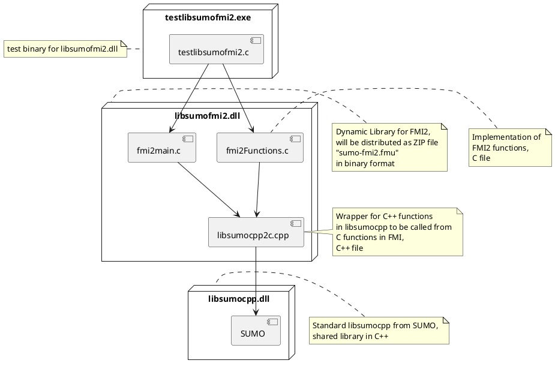

# FMI

There is ongoing work towards building FMI 2 support for SUMO - especially libsumo.

```plantuml
@startuml
node "testlibsumofmi2.exe" {
   [testlibsumofmi2.c] as testlibsumofmi2
}


node "libsumofmi2.dll" {
   [libsumocpp2c.cpp] as libsumocpp2c
   [fmi2main.c] as fmi2main
   [fmi2Functions.c] as fmi2Functions
}

node "libsumocpp.dll" {
   [SUMO]
}


[testlibsumofmi2] --> [fmi2main]
[testlibsumofmi2] --> [fmi2Functions]
[fmi2Functions] --> [libsumocpp2c]
[fmi2main] --> [libsumocpp2c]
[libsumocpp2c]  --> [SUMO]

note left of testlibsumofmi2.exe 
 test binary for libsumofmi2.dll
end note

note left of libsumofmi2.dll 
 Dynamic Library for FMI2, 
 will be distributed as ZIP file
 "sumo-fmi2.fmu"
 in binary format
end note

note left of [fmi2Functions]
 Implementation of 
 FMI2 functions,
 C file
end note

note right of [libsumocpp2c]
 Wrapper for C++ functions 
 in libsumocpp to be called from 
 C functions in FMI, 
 C++ file
end note

note left of libsumocpp.dll
 Standard libsumocpp from SUMO, 
 shared library in C++
end note
@enduml
```
