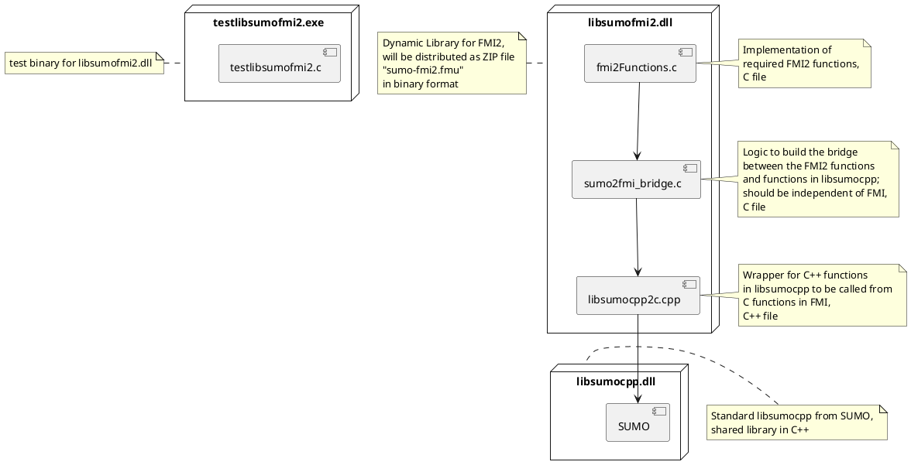

# FMI

There is ongoing work towards building [FMI v2](https://fmi-standard.org/) support for SUMO by utilizing libsumo.

## Goal

The initial goal is to build a prototype which is able to load and run a SUMO simulation via `libsumocpp` while supporting a few selected libsumo functions.
Currently, these functions are (cf. ScalarVariables in `src/fmi/modelDescription.xml`):

 - vehicle.getIDCount
 - vehicle.moveToXY
 - vehicle.getParameterWithKey
 - vehicle.getLaneID
 - vehicle.getPosition

!!! note
    libsumo functions are currently added manually for the prototype. There are plans to automatically generate available libsumo functions for the FMI.

## Architecture

The current architecture to build the functionality for a Functional Mockup Unit (FMU) is as follows (corresponding source code is located in `src/fmi`).



## FMU Usage

Due to limitations of [version 2 of the FMI standard](https://github.com/modelica/fmi-standard/releases/download/v2.0.3/FMI-Specification-2.0.3.pdf), e.g., output scalar variables cannot be given parameters directly, we implemented a *stateful approach*.
For example, if we need the current position of a vehicle, we retrieve the (output) value of the `vehicle.getPosition` scalar variable.
However, due to the above-mentioned limitation of FMI v2, we first need to set the input parameter value for `vehicle.getPosition`, which is the vehicle ID.
For this purpose, we utilize the generic `setGetterParameters` input scalar variable right before retrieving the output variable, as indicated by the following Python code snippet:

```python
fmu.setString([valueRefs['setGetterParameters']], ["ego"])
resultList = fmu.getString([valueRefs['vehicle.getPosition']])
```

Note that `setGetterParameters`, as its name implies, is a generic catch-all input scalar variable to set the input parameters for the subsequent retrieval of an output scalar variable's value.
In case of multiple input parameters, e.g., for `vehicle.getParameterWithKey`, parameter values need to be concatenated to a single string with a space delimiter.
Similarly, output values are returned as a concatenated string with the same delimiter:

```python
fmu.setString([valueRefs['setGetterParameters']], ["ego meaningOfLife"])
resultList = fmu.getString([valueRefs['vehicle.getParameterWithKey']])
key = resultList[0].decode('UTF-8').split()[0]
value = resultList[0].decode('UTF-8').split()[1]
```

This convention of passing values as concatenated strings stems from the limitation of FMI v2 that vectors and other complex data types are not yet supported.


## Interfacing the SUMO FMU with Python

The [FMPy](https://fmpy.readthedocs.io/en/latest/) Python package can be used to simulate as well as validate FMUs and is the recommended way to interface the SUMO FMU with Python.
Installing FMPy on Linux is done with:

```
python -m pip install fmpy
```

An easy way to get started with FMPy is to check out the `runner.py` for the SUMO fmi test suite located in `tests/complex/fmi` (the code snippets from above can be found here, as well).