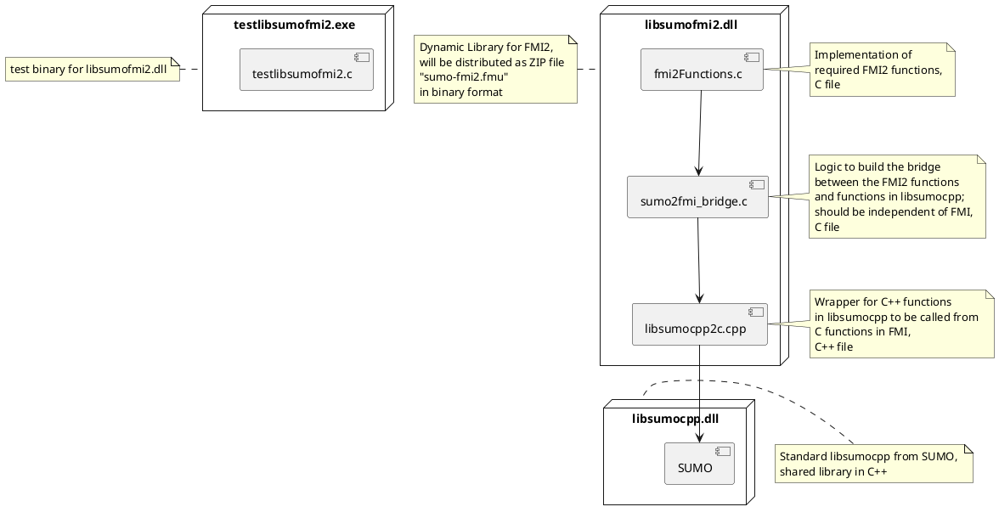

# FMI

There is ongoing work towards building FMI 2 support for SUMO - especially libsumo.

## Goal

The initial goal is to build a prototype which is able to load a SUMO simulation via `libsumocpp`, run the simulation and provide the total amount of vehicles in the simulation as a scalar variable. 

## Architecture

The current architecture to build the functionality for a functional mockup unit (FMU) is as followed. The source code is located in the `src/fmi` folder.



## FMI 2.0 Compliance Checking

Compliance with FMI 2.0 is checked with [FMU Compliance Checker](https://github.com/modelica-tools/FMUComplianceChecker). It can be installed after cloning according to the build instructions.

The validation can be triggered on macOS with

```
fmuCheck.darwin64 /PATH/TO/SUMO/FMI/sumo-fmi2.fmu 
```

On some macOS systems, the validation may fail with the following message: *Interceptors are not working*. This can be fixed with the following call:

```
DYLD_INSERT_LIBRARIES=/Library/Developer/CommandLineTools/usr/lib/clang/11.0.3/lib/darwin/libclang_rt.asan_osx_dynamic.dylib fmuCheck.darwin64 /PATH/TO/SUMO/FMI/sumo-fmi2.fmu 
```
