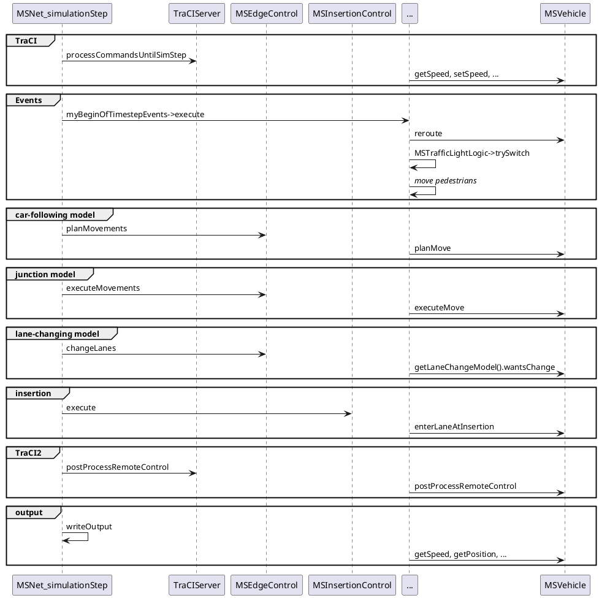
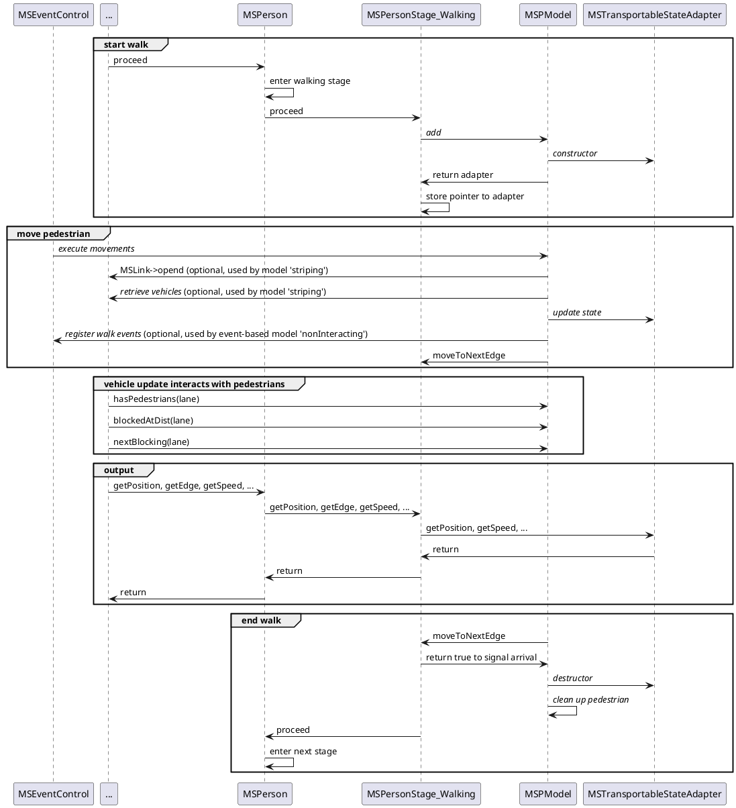

# Main Vehicle Update Loop

sumo and sumo-gui call both the method `MSNet::simulationStep`. 
This sketch describes the further communication of this method 
with the other elements of the simulation and the update cycle for the vehicles.

# Pedestrian Lifecycle and update Loop

Persons in SUMO are modelled by the distinct [stages](../../Specification/Persons.md#simulation_behavior) *walk*, *ride*, *stop* and *access*. 
The simulation behavior of a person in stage *walk* is controlled by the pedestrian model configured via option **--pedestrian.model**.

The model must inherit from [class MSPModel]() and provide instances of [MSTransportableStateAdapter]() for each pedestrian. The adapter instances are used by the simulation to retrieve the state of the pedestrian (i.e. position and speed). The MSPModel is responsible for signaling when the pedestrian changes to another edge. The following sketch describes the interation.

!!! note
    abstract methods that must be overridden by the model implementation are in *italics*

