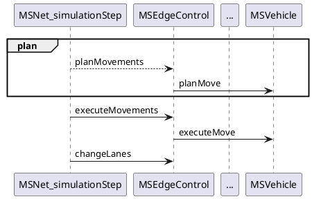

# Basic

SUMO and SUMO-GUI call both the method `MSNet::simulationStep`. 
This sketch describes the further communication of this method 
with the other elements of the simulation.

```plantuml
@startuml
participant MSNet_simulationStep as simstep
participant MSEdgeControl
participant ...
participant MSVehicle

group plan
simstep --> MSEdgeControl : planMovements
MSEdgeControl -> MSVehicle : planMove
end
simstep -> MSEdgeControl : executeMovements
MSEdgeControl -> MSVehicle : executeMove
simstep -> MSEdgeControl : changeLanes
@enduml
```
