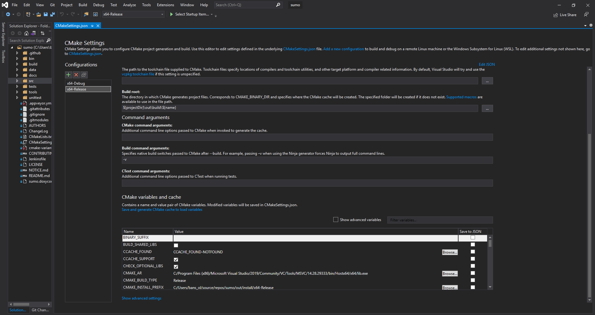
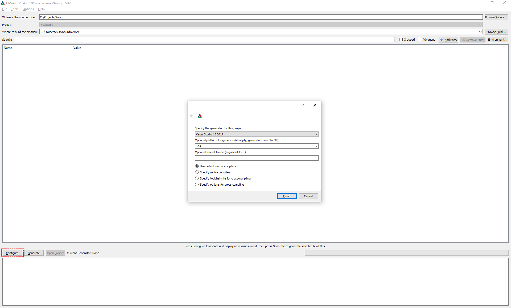
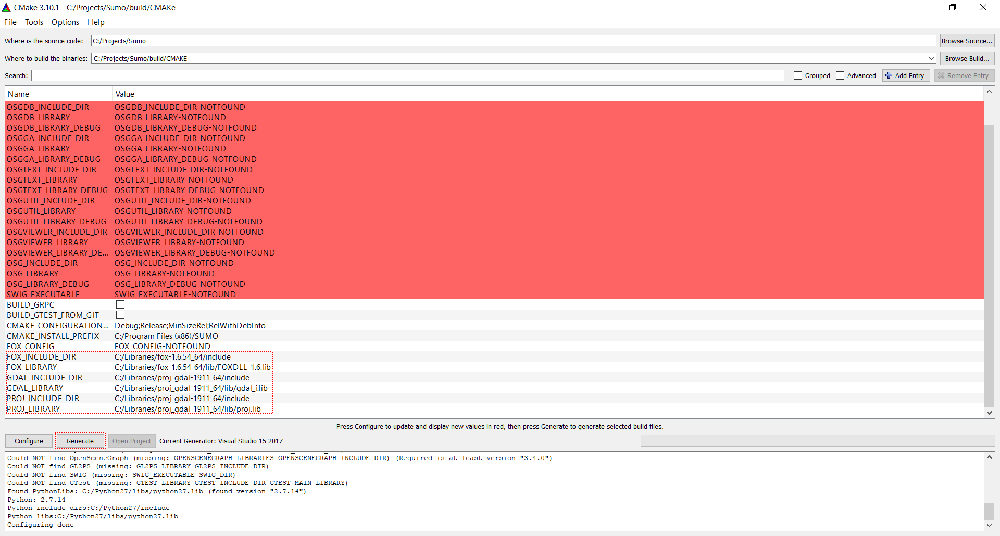
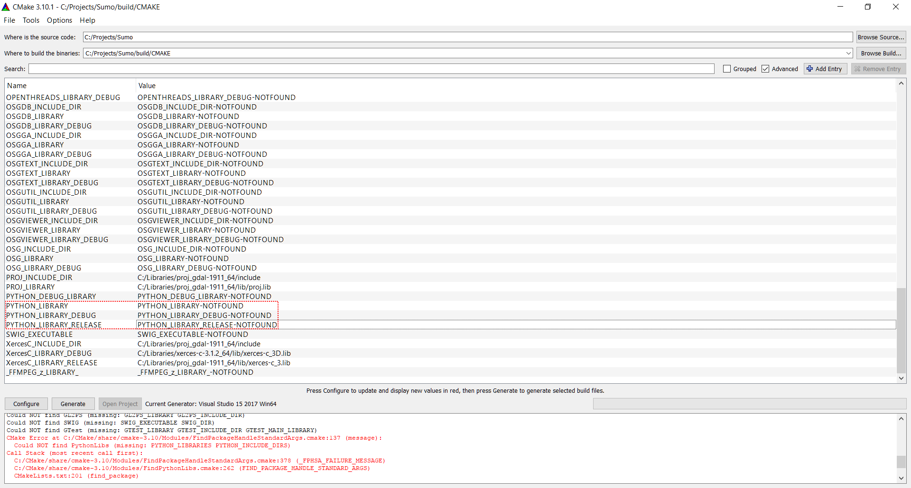
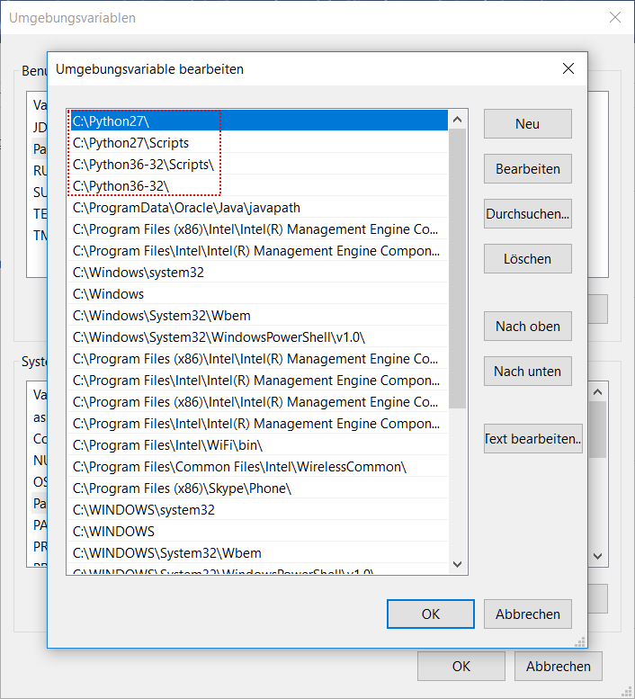
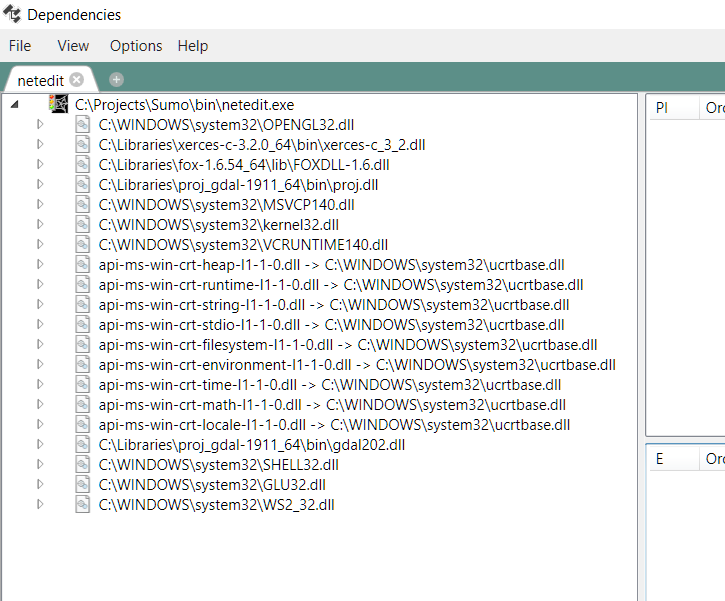

This document describes how to build SUMO under Windows using only
freely available (this does **not** mean "open source") tools.
Instructions on how to build SUMO on Windows using an Open Source
toolchain are included in our [building on
Linux](../Installing/Linux_Build.md) page. Please note that you
may also [download pre-build Windows binaries](../Downloads.md).

## Prerequisites

- A [Visual Studio Community, Professional or Enterprise 2015 or later](https://www.visualstudio.com) installation
- [CMake for Windows](https://cmake.org/download)
- Python 3.X
- SUMO sources (either an unpacked src zip or a git clone, see
  [Getting the source code](../Installing/Linux_Build.md#getting_the_source_code))
- Installed Libraries (Xerces-C, Proj, Fox) preferably by cloning <https://github.com/DLR-TS/SUMOLibraries/>
  - Make sure that the `SUMO_LIBRARIES` environment variable points to your cloned directory in case you didn't put the libraries in the same directory as the SUMO repository
  - Note that in case you don't have admin rights, you can still configure environment variables for you only

## Recommended Windows setup

- Download [Visual Studio Community Edition](https://www.visualstudio.com/vs/community/)
  - Start the installer and select:
    - Python development (including native tools)
    - Desktop development with C++


- Clone https://github.com/eclipse/sumo or open your existing local SUMO folder
- Go to team explorer
  - Choose Manage Connections, then "Local Git"->Clone https://github.com/DLR-TS/SUMOLibraries
- Now be patient until CMake starts configuring
  - If it does not or you want to reconfigure choose *Project->Generate Cache* (if this option is not there you may need to wait a little longer until Visual Studio has picked up everything)
- Select *Build->Build All* (*CMake->Build All* in earlier versions)
- Set the [SUMO_HOME](../Basics/Basic_Computer_Skills.md#sumo_home) environment variable
- Install Texttest https://sourceforge.net/projects/texttest/files/latest/download

CMake settings can easily be modified, loaded and saved using *Project -> CMake Settings* in Visual Studio.

   
Editing the CMake settings using Visual Studio

### Optional but still recommended steps

- Install [Notepad++](https://notepad-plus-plus.org/)
- Install [TortoiseGit](https://tortoisegit.org/)
- Install [Git command line tools](https://git-scm.com/download/win) (this is mandatory if you install TortoiseGit)

- If you decide to use the Python which comes with Visual Studio
  - Test start a python script and add association
  - Add Python to the path (also the Scripts dir), find it at `C:\Program Files (x86)\Microsoft Visual Studio\Shared\Python37_64`
  - Install pyautogui, matplotlib, rtree, pyproj, lxml, pipwin following the instructions https://docs.microsoft.com/en-us/visualstudio/python/tutorial-working-with-python-in-visual-studio-step-05-installing-packages?view=vs-2019
- If not, use `pip install pyautogui matplotlib pyproj lxml pipwin`, possibly with the `--user` option if you don't have admin rights

- Run `pipwin install rtree` (or download Rtree [from here](https://www.lfd.uci.edu/~gohlke/pythonlibs/#rtree) and install it manually)
- (after 30 days) Setup a Microsoft account (if you do not already have one) and register your Visual Studio

## Further notes

If you need a different python version or want to test with multiple Pythons you can either install them directly from Visual Studio or [Download Python for Windows](http://www.python.org/download/) and install it. Most SUMO tools should work with Python 2 and 3. Please make sure that you install the recommended python modules as explained above and that the `PATH` environment variable contains the directory where the desired Python interpreter is.

If you want to clone / checkout a special SUMO version, you can of course do it from the command line (if you have installed the command line tools)
using `git clone --recursive https://github.com/eclipse/sumo` or download and extract a source package, see [Downloads](../Downloads.md).

The command for the [Libraries](#libraries) is: `git clone --recursive https://github.com/DLR-TS/SUMOLibraries`. If you do not place the libraries in the same folder as SUMO, you will need to set the **SUMO_LIBRARIES** environment variable to the directory.

If Visual Studio fails at first try, it is probably because the SUMOLibraries are not cloned yet or are in an unusual location. The errors are due to Xerces not being found. Try:

- Select *Project->"Generate Cache"* to try again (it is *CMake->Generate* in earlier Visual Studio versions) or see [below](#troubleshooting).

### Adapting settings

If you need to modify settings, you can edit the `CMakeCache.txt` by opening it in your favorite text editor or via the *Project->CMake-Cache* menu. The following things might be useful:

- If the libraries are not found, set `SUMO_LIBRARIES:PATH` to something like `C:/Users/testus/source/repos/SUMOLibraries`) and retry
- If a wrong Python interpreter or library is found, edit the PYTHON_* variables
- If you want to disable building the GUI (Fox) or usage of Proj, set the according library entries to an empty string

To make a debug build, you should ***not*** change CMAKE_BUILD_TYPE in the cache file. You should choose a different configuration in the GUI instead.

## Libraries

We provide a central location for getting all dependent libraries at
<https://github.com/DLR-TS/SUMOLibraries>. The easiest way is to clone
this repository and define an environment variable `SUMO_LIBRARIES`
pointing to the resulting directory. They are build using Visual Studio
2019, but may be used with earlier and later versions as well. You may
need to install the Visual C++ 2019 Runtime Distributable for running
SUMO (tested with Visual Studio 2019). 

For details on building your
own and also on how to use different versions and additional libraries
see [Installing/Windows_Libraries](../Installing/Windows_Libraries.md).
Make sure that the subdirectories `fox-1.6.54/lib`, `proj_gdal-1911/bin`
and `xerces-c-3.2.0/bin` are in PATH. Note: for 32 bits compilations
folders are `32bits/fox-1.6.54/lib`, `32bits/proj_gdal-1911/bin` and
`32bits/xerces-c-3.2.0/bin`. You can add both to the path but always add the
64 bit version first.

## Install python packages

Compiling netedit requires a list of python packages to generate templates. Install it using pip:

```
pip install google lxml rtree pandas matplotlib pulp pyproj ezdxf scipy fmpy ortools texttest pyautogui pyperclip
```

## Manual CMake configuration

### Method 1: Via CMake GUI

- Start the CMake gui
- Select the source path (e.g. D:\\projects\\sumo)
- Select the build path (e.g. D:\\projects\\sumo\\cmake-build)
  - It can be identical to the source path, but we recommend to separate them
  - Build directory will be created if necessary
- Start configuration by pressing the "Configure" button
  - Select compiler (the default should do)
- Create the Visual Studio solution by clicking on "Generate"
- Open the generated solution (.sln file) (e.g. *D:\\projects\\sumo\\cmake-build\\SUMO.sln*) using the File Explorer or by clicking on "Open Project"
- Build the configurations you want
  - Binaries will appear in D:\\projects\\sumo\\bin

Visual guide:

   
Selecting Solution (Visual Studio, Eclipse, etc.) in the CMake gui

   
Libraries successfully configured

   
Generated solution

### Method 2: Via CMake command line

- Go to the source path (e.g. `cd D:\projects\sumo`)
- Create a build directory (e.g. `mkdir cmake-build && cd cmake-build`)
- Run CMake with the correct Visual Studio version (e.g. `cmake .. -G "Visual Studio 16 2019 Win64"`)
  - For a list of all possible generators run `cmake --help`
- Open the solution *D:\\projects\\sumo\\cmake-build\\SUMO.sln*
  - Or build from the command line using `cmake --build . --config Release`

## Tests

If you plan to extend SUMO yourself, or just want to know whether
everything compiled OK, it is strongly recommended to have a look at
[Developer/Tests](../Developer/Tests.md). This tool makes it
easier to check whether some existing functionality was broken by
the extensions.

## CLang

If you want to compile using CLang in Windows, just add "ClangCL" in CMake's "Optional Toolset" (-T).

## Troubleshooting

- Note on installation paths: MSVC seems to have difficulties with
  include and library paths containing spaces (for instance
  `C:\Program Files`). Thus try to avoid installing SUMO or any of the
  libraries in such paths.
- Python cannot be found
  - Make sure that there are not two different Python versions
    installed
  - Python libraries can be specified manually (e.g.
    <PythonFolder\>\\libs\\python<version\>.lib)

   
Python library fields in the CMake Cache

   
Two different Python versions at the same time

### Linker reports something similar to "LINK : fatal error LNK1104: cannot open file 'C:\\Program.obj'"

You probably have installed a library to a path containing white spaces
in its name. In such a case, the according environment variable should
be embedded in quotes (").

Example: set FOX="D:\\my libs\\fox-1.6.36"

### Failure on pre-build event (missing version.h or \*typemap.h)

If Visual Studio reports a failed pre-build event you can safely ignore
this, unless you are building from the [source code
repository](../FAQ.md#how_do_i_access_the_code_repository). In
this case you should probably install Python. Even if Python is
installed the file associations may be broken which causes the
generation of `src/version.h` via the `tools/build/version.py` script to fail. Either
repair your file associations or undefine **HAVE_VERSION_H** in
`src/windows_config.h`.

If you did install Python correctly, double check that it passes
[command line
arguments](http://stackoverflow.com/questions/2640971/windows-is-not-passing-command-line-arguments-to-python-programs-executed-from-t).
For a quick fix, you can also execute the following commands manually:

```
tools\build\version.py
tools\build\typemap.py
```

### Execution cannot proceed because MSVCR120.dll/MSVCR140.dll was not found

Install Microsoft [Visual C++ Redistributable Packages for Visual
Studio 2012](https://www.microsoft.com/en-US/download/details.aspx?id=30679)
(for MSVCR120.dll) or [Microsoft Visual C++ Redistributable Packages for
Visual Studio 2015](https://www.visualstudio.com/downloads/) (for
MSVCR140.dll). You can check if all dependencies are correct using
[Dependencies](https://lucasg.github.io/Dependencies/).



### In debug mode, execution cannot proceed because MSVCR120D.dll/MSVCR140D.dll was not found

Your version of Visual Studio doesn't support Debugging, you can only compile in release mode.

## How to build JuPedSim and then build SUMO with JuPedSim

### Build JuPedSim

1\. You need to clone the repository https://github.com/JuPedSim/jpscore and checkout the _SUMO-Integration_ branch.

2\. You need to install vcpkg (documentation available [here](https://vcpkg.io/en/getting-started.html)). We need vcpkg to install JuPedSim's dependencies.

3\. You need to change the default platform used when installing packages. To do so, set the dedicated environment variable as follows:

```
export VCPKG_DEFAULT_TRIPLET=x64-windows
```
Note that the scope of this variable is terminal-bound: if you close your terminal you will have to set the variable again.
	
4\. Then we use vcpkg in a certain way to install a specific version of the _fmt_ library (later versions give compilation issues with JuPedSim). To do so, we use the following manifest file:
```json
{
  "name": "jupedsim",
  "dependencies": [
    {
      "name": "fmt",
      "version>=": "8.0.1"
    },
  "builtin-baseline": "35443ee2753f46c52ac342fa6c9c48e9f5eb9105"
}
```

The last line is compulsory. Store it as _vcpkg.json_ and put it at the root directory of vcpkg, on the same level as _vcpkg.exe_. Then simply run `vcpkg.exe install`, vcpkg will detect your manifest file and download the packages inside accordingly. At the moment this is the only way to download a package with a specific version.

5\. Now delete the manifest file. Using vcpkg too, download and compile the other third-party dependencies with the command generic command `vcpkg.exe install package-name:triplet` (a default triplet has been set above):
    
```
vcpkg.exe install boost zlib spdlog poly2tri glm cgal pybind11
```
	
Note that the _triplet_ `x64-windows` is used for both the _Release_ and the _Debug_ compilation modes.

6\. Copy the files for the _fmt_ library that are located in `/c/Users/[username]/[path-to-vcpkg]/vcpkg_installed/x64-windows` into `/c/Users/[username]/[path-to-vcpkg]/installed/x64-windows` so that all the third-party libraries share a common tree. In case you want to build the _Debug_ binaries, you also need to copy `/c/Users/[username]/[path-to-vcpkg]/installed/x64-windows/debug/lib/poly2tri.lib` to `/c/Users/[username]/[path-to-vcpkg]/installed/x64-windows/lib/poly2tri.lib` (replacement).
 
7\. In the 'jpscore' directory, create a 'build' directory (or better: a 'build_release' directory, in case you also want _Debug_ binaries). From that directory, run CMake as follows:
	
```
cmake -DCMAKE_BUILD_TYPE=Release -DCMAKE_PREFIX_PATH=/c/Users/[username]/[path-to-vcpkg]/installed/x64-windows/ -DBUILD_JPSVIS=OFF -G"Visual Studio 15 2017 Win64" ..
```
	
The flag `BUILD_JPSVIS` is turned off to disable the build of JuPedSim's visualization tool. Use `-DCMAKE_BUILD_TYPE=Debug` for _Debug_ binaries.
 
8\. Then open the Visual Studio solution file that has been created in that directory, select either the _Debug_ or _Release_ mode at the bottom of Visual Studio and then build.

9\. You can copy to some place the freshly built binaries by launching the following command from your build directory:
	
```console
cmake --install . --prefix /c/Users/[username]/[path-to-jpscore]/install
```

You will need this installation path later when compiling SUMO with JuPedSim. Add `--config Debug` to the previous command line for _Debug_ binaries.

### Build SUMO with JuPedSim

1\. Build SUMO as usual, Visual Studio will say that it can't find JuPedSim. Then in the CMake cache file, search for the `JUPEDSIM_DIR` variable and set it with the installation path mentioned above:

```console
JUPEDSIM_DIR:PATH=C:\Users\[username]\[path-to-jpscore]\install
```

Notice how the path is written (Windows-style convention).
	
2\. Then rebuild SUMO; JuPedSim is found.

3\. The JuPedSIM and third-party binaries need to be copied to the SUMO 'bin' directory for execution (`jupedsim.dll`, `mpfr-6.dll`, `gmp-10.dll`, `spdlog.dll` and `fmt.dll`). These binaries are located in the 'build/bin' subdirectory of jpscore or in the subdirectory 'installed' of vcpkg (or 'installed/debug' for _Debug_ binaries; in that case some binaries have an additional 'd' at the end).

4\. Also note that in order to use JuPedSim, you need to put `<pedestrian.model value="jupedsim"/>` in your SUMO config file.
