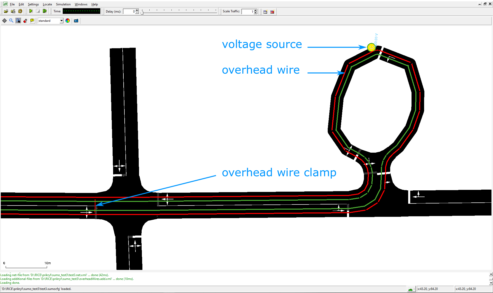
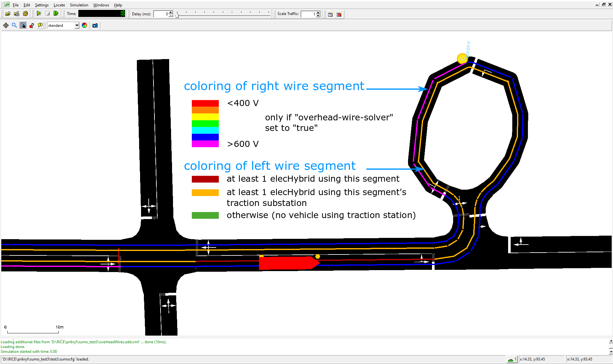

# Overview

Since version 1.5.0 SUMO extends the original [electric](Electric.md) vehicle model with a model that simulates
also internal electric parameters of an battery-assisted trolleybus, i.e. a vehicle that is being powered by overhead wires and
has also a battery pack installed. The battery pack is charged from the overhead wires rather than from a standalone charging station.

The model allows not only for vehicle 
simulation, but the simulation may also include detailed electrical simulation of the overhead wire circuit behavior.
It was implemented by Jakub Ševčík and Jan Přikryl from the [RICE FEE UWB Pilsen](https://rice.zcu.cz/en). 
The core of the model is implemented in the [vehicle device](../Developer/How_To/Device.md) *device.elechybrid*.
The model is defined as a set of [*additional features*](../index.md#additional_features).
The features provided and used by the model are traction substations that provide power to the overhead wire
network, a set of overhead wires (which can be placed over any lane in the network) representing a contact line
providing energy to ElecHybrid vehicles, including wire clamps/links, and a new output options
**--elechybrid-output** {{DT_FILE}}, **--overheadwiresegments-output** {{DT_FILE}} and **--substations-output** {{DT_FILE}}.

A conceptual test case for the implementation can be found in [\[1\]].

## Defining Battery-assisted Trolleybuses

To define an electric vehicle with an in-motion charging system, it must be equipped with a hybrid electric device *device.elechybrid*.
This may be accomplished explicitly by using the option **--device.elechybrid.explicit <vehID1,vehID2,...\>** or simply by
setting **--device.elechybrid.probability 1** to provide the device to all vehicles. Alternatively, the device may be
specified using the [generic vehicle parameters](../Definition_of_Vehicles,_Vehicle_Types,_and_Routes.md#devices).

Additional properties of the vehicle and its electrical components are defined via
[parameters of the vehicle or its type](../Simulation/GenericParameters.md). The values related to *device.elechybrid* have
the following meanings:

| key                           | Value Type | Default         | Description                                                      |
| ----------------------------- | ---------- | --------------- | ---------------------------------------------------------------- |
| maximumBatteryCapacity        | float      | 0 Wh            | Maximum battery capacity *E<sub>max</sub>*                       |
| overheadWireChargingPower     | float      | 0 W             | Constant additional power drawn from an overhead wire if charging a battery |
| maximumPower                  | float      | 100000 W        | Maximum power of the vehicle electric **drive**                  |
| vehicleMass                   | float      | 1000 kg         | Vehicle mass *m<sub>veh</sub>*                                   |
| frontSurfaceArea              | float      | 5 m<sup>2</sup> | Front surface area *A<sub>veh</sub>*                             |
| airDragCoefficient            | float      | 0.6             | Air drag coefficient *c<sub>w</sub>*                             |
| internalMomentOfInertia       | float      | 0.01 kg         | Not a *moment*, but the mass of internal rotating elements       |
| radialDragCoefficient         | float      | 0.5             | Radial drag coefficient c<sub>rad</sub>                          |
| rollDragCoefficient           | float      | 0.01            | Rolling resistance coefficient *c<sub>roll</sub>*                |
| constantPowerIntake           | float      | 1000 W          | Constant consumption of vehicle (auxiliary) systems *P<sub>const</sub>*      |
| propulsionEfficiency          | float      | 0.9             | Drive efficiency *η<sub>prop</sub>*                              |
| recuperationEfficiency        | float      | 0.8             | Recuperation efficiency (constant) *η<sub>recup</sub>*           |
| recuperationEfficiencyByDecel | float      | 0.0             | Recuperation efficiency (by deceleration)                        |

!!! note
    In contrast with the battery device, the `maximumPower` parameter defines the maximum power of vehicle electric 
    motor. The rest of the parameters in the table are common for model of electric energy consumption and have the same meaning.

An example of a vehicle with hybrid electric attribute is almost identical with that of an electric vehicle:

```xml
<routes>
    <vType id="trolleybus" accel="0.8" decel="1.0" length="12" maxSpeed="18.0" sigma="0.0" minGap="2.5"
           emissionClass="Energy/unknown"  vClass="bus" guiShape="bus/trolley" color="0,1,0">
      <param key="maximumBatteryCapacity" value="50000"/>
      <param key="overheadWireChargingPower" value="10000"/>
      <param key="maximumPower" value="200000"/>
      <param key="vehicleMass" value="10000"/>
      <param key="frontSurfaceArea" value="7.5"/>
      <param key="airDragCoefficient" value="0.59"/>
      <param key="internalMomentOfInertia" value="0.01"/>
      <param key="radialDragCoefficient" value="0.5"/>
      <param key="rollDragCoefficient" value="0.061"/>
      <param key="constantPowerIntake" value="5000"/>
      <param key="propulsionEfficiency" value="0.9"/>
      <param key="recuperationEfficiency" value="0.9"/>
      <param key="recuperationEfficiencyByDecel" value="0."/>
      <param key="" value=""/>
    </vType>
</routes>
```

The initial energy content of the battery (by default 0.0 Wh) can be set in the vehicle definitions:

```xml
<routes>
    <vehicle id="0" type="trolleybus" depart="0" route="route1" color="1,0,0">
        <param key="actualBatteryCapacity" value="5000"/>
    </vehicle>
</routes>
```

## Traction Substation

A traction substation represents a transformer station that is responsible for powering a certain
set of overhead wire circuits. The current implementation of this element is quite simple: the
substation provides information about the nominal voltage of the overhead wire at the point where 
the substation feeder line is connected to the circuit, and it also specifies the maximum current
that can be drawn from the feeder (this imposes a maximum power limit on that substation). 

| key                 | Value Type | Value range       | Default | Description                                                          |
| ------------------- | ---------- | ----------------- | ------- | -------------------------------------------------------------------- |
| **id**              | string     | id                |         | Traction substation ID (must be unique)                              |
| **voltage**         | float      | voltage \> 0      | 600 V   | Voltage of at connection point for the overhead wire                 |
| **currentLimit**    | float      | currentLimit \> 0 | 400 A   | Current limit of the feeder line                                     |

```xml
<additionals>
    <tractionSubstation id="Sub1" voltage="600" currentLimit="1000"/>
</additionals>
```

!!! note
    The `currentLimit` parameter of the substation is silently ignored and does not trigger 
    a power limit of the feeder in SUMO 1.10.0

## Overhead Wires

An overhead wire circuit is a set of overhead wires that are connected to a certain traction substation.
The circuit may contain clamps/links that interconnect different parts of the circuit and that improve its
electric parameters of the circuit when it is under higher load (a pair of clamps/links typically 
interconnects two positive and two negative overhead wires for both travel directions at some 
point on the same street).

We also allow the substation feeder line to be connected to more than a single place in the circuit, which 
is another measure to ensure more uniform distribution of power in the circuit.

The overhead wire network is part of [*additional features*](../index.md#additional_features)
provided by SUMO. It is constructed by specifying one or more `<overheadWire>` elements, representing 
a continuous section of traction wire. Each of this sections consists of `<overheadWireSegment>` elements
that are defined on lanes of the SUMO network.
Each segment may be shorter than the lane length, and a beginning or ending offset may be specified &ndash; this
is typically used in trolleybus network to start or end the overhead wire at a bus stop where the trolley poles
are put on/off the overhead wire. At least one such segment has to be connected to a substation to form a circuit.

!!! note "Note \#1"
    Additional segments are automatically created for internal lanes of an intersection, unless the lane is explicitly
    ignored using `forbiddenInnerLanes` attribute in the definition of the `<overheadWire>` element (see below).

!!! note "Note \#2"
    The current implementation does not allow users to specify the exact point in a segment where
    the substation is connected. This is a simplification that in our experience causes a negligible error
    in circuit simulation results.

| key                 | Value Type | Value range            | Default     | Description                                                               |
| ------------------- | ---------- | ---------------------- | ----------- | ------------------------------------------------------------------------- |
| **id**              | string     | id                     |             | Overhead wire segment ID (must be unique)                                 |
| **lane**            | string     | valid lane id          |             | Lane over which the segment is placed                                     |
| **voltageSource**   | boolean    | *true* or *false*      | *false*     | If *true*, the beginning point of the segment is connected to a substation  |
| **startPos**        | float      | 0 <= *x* < lane.length | 0           | Starting position in the specified lane                                   |
| **endPos**          | float      | 0 < *x* <= lane.length | lane.length | Ending position in the specified lane                                     |


Overhead wire segments are defined in an additional file using the following format:
```xml
<additionals>
    <overheadWireSegment id="ovrhdSgmnt_gneE0_0" lane="gneE0_0" voltageSource="true" />
    <overheadWireSegment id="ovrhdSgmnt_gneE1_0" lane="gneE1_0" />
    <overheadWireSegment id="ovrhdSgmnt_gneE3_0" lane="gneE3_0" />
    <overheadWireSegment id="ovrhdSgmnt_gneE4_0" lane="gneE4_0" />
    <overheadWireSegment id="ovrhdSgmnt_gneE5_0" lane="gneE5_0" voltageSource="true"/>
    <overheadWireSegment id="ovrhdSgmnt_-gneE3_0" lane="-gneE3_0" />
    <overheadWireSegment id="ovrhdSgmnt_-gneE1_0" lane="-gneE1_0" />
    <overheadWireSegment id="ovrhdSgmnt_-gneE0_0" lane="-gneE0_0"  startPos="0.0" endPos="40." />
</additionals>
```

We can also try to improve electric parameters of the circuit by specifying *overhead wire clamps* that interconnect 
selected overhead wire segments (these are typically overhead wire segments in the opposite directions on the same street):

| key                     | Value Type | Value range         | Default | Description                                                                                 |
| ----------------------- | ---------- | ------------------- | ------- | ------------------------------------------------------------------------------------------- |
| **id**                  | string     | ID                  |         | Overhead wire clamp ID (must be unique)                                                     |
| **substationId**        | string     | valid substation ID |         | Substation which can employ the overhead wire clamp                                         |
| **idSegmentStartClamp** | string     | valid segment ID    |         | ID of the overhead wire segment, to the start of which the overhead wire clamp is connected |
| **idSegmentEndClamp**   | string     | valid segment ID    |         | ID of the overhead wire segment, to the end of which the overhead wire clamp is connected   |   

An example of using the `<overheadWireClamp>` element connecting the contact line segments on
lanes `-gneE0_0` and `gneE0_0` is given below:
```xml
<additionals>
    <overheadWireClamp id="clamp1" substationId="Sub1" 
        idSegmentStartClamp="ovrhdSgmnt_-gneE0_0" idSegmentEndClamp="ovrhdSgmnt_gneE0_0" />
</additionals>
```    

Once the overhead wire segments (and overhead wire clamps) have been specified, an electric circuit can be defined
using the `<overheadWire>` element with the following attributes:  

| key                     | Value Type | Value range                       | Default | Description                                                    |
| ----------------------- | ---------- | --------------------------------- | ------- | -------------------------------------------------------------- |
| **segments**            | string[]   | list of overhead wire segment IDs |         | Segments that form the given circuit                           |
| **substationId**        | string     | valid substation ID               |         | Substation to which the circuit is connected                   |
| **clamps**              | string[]   | list of overhead wire clamp IDs   |         | Overhead wire clamps which interconnect overhead wire segments |
| **forbiddenInnerLanes** | string[]   | list of forbidden lane IDs        |         | Inner lanes, where placing of overhead wire is restricted      |

```xml
<additionals>
    <overheadWire segments="ovrhdSgmnt_gneE0_0 ovrhdSgmnt_gneE1_0 ovrhdSgmnt_gneE3_0 ovrhdSgmnt_gneE4_0 ovrhdSgmnt_gneE5_0 ovrhdSgmnt_-gneE3_0 ovrhdSgmnt_-gneE1_0 ovrhdSgmnt_-gneE0_0"
                  substationId="Sub1" clamps="clamp1" forbiddenInnerLanes=":gneJ4_2_0" />
</additionals>
```

The overhead wire powering/charging system is represented in the graphical user interface as a two-wire system:


Representation of the overhead wire in GUI

If a vehicle equipped with *device.elechybrid* drives under the wire, the overhead wire segment colors
display a *(currently hardcoded)* color map indicating actual traction wire voltage, and also the number
of connected ElecHybrid vehicles on that segment -- see image below. 


Color of overhead wire in case that some power is supplied to a vehicle

## Simulation setting

It is possible to activate or deactivate overhead wire solver, enable or disable the recuperation of energy from vehicles to overhead wire, and apply or ignore substation's electric current limits in the overhead wire solver. The above mentioned properties are set in configuration file using the following format. 

```xml
<configuration>
    ...
    <processing>
        <overhead-wire-solver value="true"/>
        <overhead-wire-recuperation value="true"/>
        <overhead-wire-substation-current-limits value="true"/>
    </processing>
    ...
</configuration>
```

All three mentioned values are set to "true" by default.

## Outputs

The *device.elechybrid* and its related objects provide several output streams:
* traction substation output
* overhead wire segment output
* electric hybrid vehicle output

### Overhead wire segments output

The option `--overheadwiresegments-output "overheadWires.out.xml"` or its config file equivalent
```xml
<output>
    <overheadwiresegments-output value="overheadWires.out.xml"/>
</output>
```
generates a full report of energy provided by overhead wire segments.

The output file `overheadWires.out.xml` has the following structure:

```xml
<overheadWireSegments-export>
    <overheadWireSegment id="ovrhdSgmnt_gneE0_0" tractionSubstationId="Sub1" totalEnergyCharged="0.00" chargingSteps="0" lane="gneE0_0"/>
    <overheadWireSegment id="ovrhdSgmnt_gneE1_0" tractionSubstationId="Sub1" totalEnergyCharged="0.00" chargingSteps="0" lane="gneE1_0"/>
    ...
    <overheadWireSegment id="ovrhdSgmnt_gneE5_0" tractionSubstationId="Sub1" totalEnergyCharged="250.92" chargingSteps="11" lane="gneE5_0">
        <vehicle id="test1" type="trolleybus" totalEnergyChargedIntoVehicle="250.92" chargingBegin="1.00" chargingEnd="11.00" maximumBatteryCapacity="46000.00">
            <step time="1.00" chargingStatus="charging" energyCharged="16.17" partialCharge="16.17" voltage="699.98" actualBatteryCapacity="23011.11"/>
            <step time="2.00" chargingStatus="charging" energyCharged="20.66" partialCharge="36.83" voltage="699.94" actualBatteryCapacity="23022.22"/>
            ...
        </vehicle>
        ...
    </overheadWireSegment>
    ...
    <overheadWireSegment id="ovrhd_inner_:gneJ1_0_1" tractionSubstationId="Sub2" totalEnergyCharged="30.15" chargingSteps="1" lane=":gneJ1_0_1">
        <vehicle id="test1" type="trolleybus" totalEnergyChargedIntoVehicle="30.15" chargingBegin="12.00" chargingEnd="12.00" maximumBatteryCapacity="46000.00">
            <step time="12.00" chargingStatus="charging" energyCharged="30.15" partialCharge="30.15" voltage="698.54" actualBatteryCapacity="23133.33"/>
        </vehicle>
    </overheadWireSegment>
    ...
</overheadWireSegments-export>
```

For the entire overhead wire segment described by the `<overheadWireSegment>` tag we output the following attributes:

| Name                     | Type   | Units | Description                                                 |
| ------------------------ | ------ | ----- | ----------------------------------------------------------- |
| **id**                   | string |       | Overhead wire segment ID                                    |
| **tractionSubstationId** | string |       | Traction substation ID                                      |
| **totalEnergyCharged**   | float  | Wh    | Total energy supplied by overhead wire segment into eleHybrid vehicles (minus energy recuperated into overhead wire segment) during the entire simulation      |
| **chargingSteps**        | int    |       | Number of simulation steps in which some vehicle is connected to the segment |
| **lane**                 | string |       | Lane ID of the segment                |

For each vehicle that has been powered (or that has recuperated energy) on a given segment:

| Name                              | Type   | Units | Description                                           |
| --------------------------------- | ------ | ----- | ----------------------------------------------------- |
| **id**                            | string |       | ID of vehicle that is being powered by the segment    |
| **type**                          | string |       | Type of vehicle                                       |
| **totalEnergyChargedIntoVehicle** | float  | Wh    | Energy provided during the travel on the segment |
| **chargingBegin**                 | float  | s     | Time step in which vehicle starts to be connected to segment  |
| **chargingEnd**                   | float  | s     | Time step in which vehicle finishes to be connected to segment   |
| **maximumBatteryCapacity**        | float  | Wh    | Maximum battery capacity of the vehicle       |

For every time step in that the vehicle is being powered by the segment:

| Name                       | Type  | Units | Description                                                     |
| -------------------------- | ----- | ----- | --------------------------------------------------------------- |
| **time**                   | float | s     | Current time step of the simulation                             |
| **energyCharged**          | float | Wh    | Energy charged in the current time step                         |
| **partialCharge**          | float | Wh    | Energy charged by the segment since vehicle entered the segment |
| **voltage**                | float | V     | Current voltage in the overhead wire                            |
| **actualBatteryCapacity**  | float | Wh    | Current battery capacity of vehicle                             |

### Electric Substation output

Option `--substations-output "nameOfFile.xml"` generates a full report of energy provided by substations:

```xml
<output>
    <substations-output value="substations.out.xml"/>
</output>
```

File `substations.out.xml` has the following structure:

```xml
<substations-export>
    <tractionSubstation id="Sub1" totalEnergyCharged="-1360.85" length="316.63" numVoltageSources="2" numClamps="1" chargingSteps="50">
        <step time="1.00" vehicleIDs="elecHybrid_0" numVehicles="1" chargingStatus="" energyCharged="-15.13" current="90.75" currents="80.1860 10.5661" voltage="600.00" alphaCircuitSolver="1.00" alphaFlag="0"/>
        <step time="2.00" vehicleIDs="elecHybrid_0" numVehicles="1" chargingStatus="" energyCharged="-18.58" current="111.51" currents="96.9147 14.5929" voltage="600.00" alphaCircuitSolver="1.00" alphaFlag="0"/>
        ...
    </tractionSubstation>
    ...
</substations-export>
```

For the `<tractionSubstation>` entry representing a traction substation:

| Name                    | Type   | Units | Description                                                                |
| ----------------------- | ------ | ----- | -------------------------------------------------------------------------- |
| **id**                  | string |       | Traction substation ID                                                     |
| **totalEnergyCharged**  | float  | Wh    | Sum of energy charged by all voltage sources into overhead wires during the entire simulation  |
| **length**              | float  | m     | The length of the section powered by the substation                         |
| **numVoltageSources**   | int    |       | Number of voltage sources (i.e., number of connections of the substation to the circuit) |
| **numClamps**           | int    |       | Number of overhead wire clamps in the section powered by the substation     |
| **chargingSteps**       | int    |       | Number of simulation steps in which the substation provided energy                |

!!! note
    The `totalEnergyCharged` attribute denotes the energy is supplied *from* the substation *to* a vehicle and
    therefore it is typically negative.The value would be positive only in case that regenerative
    braking into a hypothetical substation battery back is allowed and the vehicles regenerate more energy than the substation
    provided to them.

Every time step in which the substation is active is represented by the `<step>` element with the following attributes:

| Name                   | Type     | Units | Description                                                                |
| ---------------------- | -------- | ----- | -------------------------------------------------------------------------- |
| **time**               | float    | s     | Current timestep                                                        |
| **vehicleIDs**         | string[] |       | List of IDs of vehicles powered by the substation                          |
| **numVehicles**        | int      |       | Number of vehicles powered by the substation                               |
| **energyCharged**      | float    | Wh    | Energy  charged by substation in the current time step                               |
| **current**            | float    | A     | Sum of currents flowing from the substation (i.e., through all voltage sources )                            |
| **currents**           | floats[] | A     | Currents flowing through all voltage sources                    |
| **voltage**            | float    | V     | Nominal voltage of the traction substation                             |
| **alphaCircuitSolver** | float    |       | Value of parameter *&alpha;* used in the circuit solver                    |
| **alphaFlag**          | int (enum)  | | Value of the internal flag giving the reason why *&alpha;* has to be used  |

!!! note
    Also in this case the `energyCharged` is negative as it flow _from_ the substation in most cases

## ElectricHybrid output

There are three output parameters to be set in the SUMO configuration file to collect the statistics from the *device.elechybrid*. 
The typical usage will be
```xml
<configuration>
    ...
    <output>
        <elechybrid-output value="trolleybus.elecHybrid.out.xml"/>
        <elechybrid-output.precision value="4"/>
        <elechybrid-output.aggregated value="true"/>
        <overheadwiresegments-output value="overheadWires.out.xml"/>
        <substations-output value="substations.out.xml"/>
        ...
    </output>
</configuration>
```

This declaration will activate an *aggregated* ElectricHybrid output into `trolleybus.elecHybrid.out.xml` file
with floats being represented up to 4 decimal places:

```xml
<elecHybrid-export-aggregated>
    <timestep time="0.00">
        <vehicle id="test1" maximumBatteryCapacity="46000.0000" actualBatteryCapacity="23000.0000" energyConsumed="0.0000" energyCharged="0.0000" power="-nan(ind)" overheadWireId="" tractionSubstationId="" current="-nan(ind)" circuitVoltage="-nan(ind)" alphaCircuitSolver="-nan(ind)" speed="0.0000" acceleration="0.0000" distance="0.0000" x="-1.4500" y="46.3800" z="0.0000" slope="0.0000" lane="gneE0_0" posOnLane="0.0000"/>
        <vehicle id="test2" maximumBatteryCapacity="46000.0000" actualBatteryCapacity="23000.0000" energyConsumed="0.0000" energyCharged="0.0000" power="-nan(ind)" overheadWireId="" tractionSubstationId="" current="-nan(ind)" circuitVoltage="-nan(ind)" alphaCircuitSolver="-nan(ind)" speed="0.0000" acceleration="0.0000" distance="0.0000" x="36.1600" y="33.7600" z="0.0000" slope="0.0000" lane="-gneE10_0" posOnLane="0.0000"/>
    </timestep>
    <timestep time="1.00">
        <vehicle id="test1" maximumBatteryCapacity="46000.0000" actualBatteryCapacity="23011.1111" energyConsumed="5.0570" energyCharged="11.1111" power="58205.3716" overheadWireId="ovrhdSgmnt_gneE0_0_0" tractionSubstationId="trSubstation1" current="83.1523" circuitVoltage="699.9850" alphaCircuitSolver="1.0000" speed="0.8000" acceleration="0.8000" distance="0.8000" x="-0.6502" y="46.3729" z="0.0000" slope="0.0000" lane="gneE0_0" posOnLane="0.8000"/>
        <vehicle id="test2" maximumBatteryCapacity="46000.0000" actualBatteryCapacity="23011.1111" energyConsumed="5.0570" energyCharged="11.1111" power="58205.3716" overheadWireId="ovrhdSgmnt_-gneE10_0_6" tractionSubstationId="trSubstation2" current="97.0738" circuitVoltage="599.5992" alphaCircuitSolver="1.0000" speed="0.8000" acceleration="0.8000" distance="0.8000" x="36.1308" y="32.9604" z="0.0000" slope="0.0000" lane="-gneE10_0" posOnLane="0.8000"/>
    </timestep>
    ...
</elecHybrid-export-aggregated>    
```

Time step parameters:

| Name                   | Type   | Description                                                                                                               |
| ---------------------- | ------ | ------------------------------------------------------------------------------------------------------------------------- |
| **time**               | float  | Current timestep                                                                                                          |

Vehicle parameters:

| Name                       | Type   | Units | Description                                                                                                               |
| -------------------------- | ------ | ----- | ------------------------------------------------------------------------------------------------------------------------- |
| **id**                     | string |       | ID of vehicle that is being powered by the segment                                                                        |
| **maximumBatteryCapacity** | float  | Wh    | Maximum battery capacity of the vehicle                                                                                |
| **actualBatteryCapacity**  | float  | Wh    | Energy of the battery at this time step                                                                  |
| **energyConsumed**         | float  | Wh    | Energy consumption at this time step                                                                             |
| **energyCharged**          | float  | Wh    | Energy charged into the battery pack |
| **power**                  | float  | W     | Power demand (requested power) from the overhead wire                                                                    |
| **overheadWireId**         | string |       | The ID of an overhead wire that is currently powering the vehicle, empty if not under a wire                              |
| **tractionSubstationId**   | string |       | The ID of an substation that is feeding the current overhead wire, empty if not under a wire                                       |
| **current**                | float  | A     | Current drawn from the overhead wire                                                                             |
| **circuitVoltage**         | float  | V     | The actual voltage at the connection point of the pantograph / trolley poles                                                                             |
| **alphaCircuitSolver**     | float  |       | Circuit solver stabilization parameter *&alpha;*, 0 <= *&alpha;* <= 1, 1 in case that the substation is not overloaded and all power demands were satisfied, NaN if not applicable. |
| **speed**                  | float  | m/s   | Speed of vehicle in this timestep                                                                                         |
| **acceleration**           | float  | m/s<sup>2</sup> | Acceleration of vehicle in this timestep                                                                                  |
| **distance**               | float  | m     | The distance covered by the vehicle from the start of simulation                                                          |
| **x**                      | float  |       | absolute position x of vehicle in the map                                                                                 |
| **y**                      | float  |       | absolute position y of vehicle in the map                                                                                 |
| **z**                      | float  |       | absolute position z of vehicle in the map                                                                                 |
| **slope**                  | float  | deg   | slope of the edge in degrees                                                                                              |
| **lane**                   | string |       | ID of the lane that the vehicle is currently on                                                                           |
| **posOnLane**              | float  | m     | Position of vehicle on its current lane                                                                                   |                                             |

If a detailed output of the vehicles has been requested using `<elecHybrid-output.aggregated value="false"/>`, 
the ElectricHybrid output generates the number of files, corresponding to the number of vehicles equipped with 
*device.elechybrid*. The file names follow the rule: 
```
filename = `elechybrid-output` value + "_" + `id` of vehicle + ".xml".
```

The non-aggregated output files have the following structure:

```xml
<elecHybrid-export vehicle="test1" maximumBatteryCapacity="46000.00" recuperationEnabled="1">
    <timestep time="0.00" actualBatteryCapacity="23000.0000" energyConsumed="0.0000" energyCharged="0.0000" power="-nan(ind)" overheadWireId="" tractionSubstationId="" current="-nan(ind)" circuitVoltage="-nan(ind)" alphaCircuitSolver="-nan(ind)" speed="0.0000" acceleration="0.0000" distance="0.0000" x="-1.4500" y="46.3800" z="0.0000" slope="0.0000" lane="gneE0_0" posOnLane="0.0000"/>
    <timestep time="1.00" actualBatteryCapacity="23011.1111" energyConsumed="5.0570" energyCharged="11.1111" power="58205.3716" overheadWireId="ovrhdSgmnt_gneE0_0_0" tractionSubstationId="trSubstation1" current="83.1523" circuitVoltage="699.9850" alphaCircuitSolver="1.0000" speed="0.8000" acceleration="0.8000" distance="0.8000" x="-0.6502" y="46.3729" z="0.0000" slope="0.0000" lane="gneE0_0" posOnLane="0.8000"/>
    <timestep time="2.00" actualBatteryCapacity="23022.2222" energyConsumed="9.5487" energyCharged="11.1111" power="74375.3992" overheadWireId="ovrhdSgmnt_gneE0_0_0" tractionSubstationId="trSubstation1" current="106.2593" circuitVoltage="699.9424" alphaCircuitSolver="1.0000" speed="1.6000" acceleration="0.8000" distance="2.4000" x="0.9494" y="46.3586" z="0.0000" slope="0.0000" lane="gneE0_0" posOnLane="2.4000"/>
    ...
</elecHybrid-export>
```

Vehicle parameters:

| Name                       | Type   | Units | Description                                                                             |
| -------------------------- | ------ | ----- | --------------------------------------------------------------------------------------- |
| **vehicle**                | string |       | ID of vehicle                                                                           |
| **maximumBatteryCapacity** | float  | Wh    | Maximum battery capacity of the vehicle                                         |
| **recuperationEnabled**     | bool  | | 1 if the regenerative braking into the overhead wire is allowed, 0 in the opposite case |

The user can enable/disable the regenerative braking into the overhead wire using `overhead-wire-recuperation` tag in SUMO configuration file (see section [Simulation setting](#simulation_setting) above).

Timestep parameters:

| Name                       | Type   | Units | Description                                                                                                               |
| -------------------------- | ------ | ----- | ------------------------------------------------------------------------------------------------------------------------- |
| **time**                   | float  | s     | Current timestep                                                                                                          |
| **actualBatteryCapacity**  | float  | Wh    | Energy of the battery at this time step                                                                  |
| **energyConsumed**         | float  | Wh    | Energy consumption at this time step                                                                             |
| **energyCharged**          | float  | Wh    | Energy charged into the battery pack |
| **power**                  | float  | W     | Power demand (requested power) from the overhead wire                                                                    |
| **overheadWireId**         | string |       | The ID of an overhead wire that is currently powering the vehicle, empty if not under a wire                              |
| **tractionSubstationId**   | string |       | The ID of an substation that is feeding the current overhead wire, empty if not under a wire                                       |
| **current**                | float  | A     | Current drawn from the overhead wire                                                                             |
| **circuitVoltage**         | float  | V     | The actual voltage at the connection point of the pantograph / trolley poles                                                                             |
| **alphaCircuitSolver**     | float  |       | Circuit solver stabilization parameter *&alpha;*, 0 <= *&alpha;* <= 1, 1 in case that the substation is not overloaded and all power demands were satisfied, NaN if not applicable. |
| **speed**                  | float  | m/s   | Speed of vehicle in this timestep                                                                                         |
| **acceleration**           | float  | m/s<sup>2</sup> | Acceleration of vehicle in this timestep                                                                                  |
| **distance**               | float  | m     | The distance covered by the vehicle from the start of simulation                                                          |
| **x**                      | float  |       | absolute position x of vehicle in the map                                                                                 |
| **y**                      | float  |       | absolute position y of vehicle in the map                                                                                 |
| **z**                      | float  |       | absolute position z of vehicle in the map                                                                                 |
| **slope**                  | float  | deg   | slope of the edge in degrees                                                                                              |
| **lane**                   | string |       | ID of the lane that the vehicle is currently on                                                                           |
| **posOnLane**              | float  | m     | Position of vehicle on its current lane                                                                                   |                                             |

## Emission Output

As with electric vehicles, the [Emission model](../Models/Emissions.md#outputs)-outputs of
SUMO can be used together with the ElectricHybrid device when setting the
`<vType>`-parameter `emissionClass="Energy/unknown"`.

## Model Details

All information about the implemented device can be found in our SUMO 2019 paper.

## Known Limitations

### Charging Stations

As the ElectricHybrid device is based on Battery, standard chargers may be in theory used for opportunity charging the vehicle internal
energy storage. This functionality is however not yet supported.

### Saving and Loading Simulation State

The ElectricHybrid device does not currently support saving and loading its internal state.

### TraCI

TraCI connection has not been tested yet and it is probably not functional.

### Other Limitations

As of SUMO 1.11.0 we are aware of the following:

* <strike>current limits are ignored by the traction substations</strike>
* colormap for coloring the overhead wire voltage is hardcoded
* mesoscopic mode has not been thoroughly tested
* placing more than one overhead wire segment on the specific lane has not been thoroughly tested and is not supported yet
* <span style="color: red;">overhead wires can be evaluated only at substation level or at segment level as the `<overheadWire>` element has no ID</span>


### Publications

[1] [Ševčík, J., Přikryl, J. A Vehicle Device Tailored for Hybrid Trolleybuses 
   and Overhead Wires Implementation in SUMO. In: Weber, M., Bieker-Walz, L.,
   Hilbrich, R., Behrisch, M. (eds.), SUMO2019. EPiC Series in Computing, vol. 62, 
   pp. 145--157. EasyChair (2019)](https://www.easychair.org/publications/download/bhmq)

[2] [Ševčík, J., Adam, L., Přikryl, J., Šmídl V. Solvability of the power flow problem 
   in DC overhead wire circuit modeling. *Applications of Mathematics* (2021),
   doi: 10.21136/AM.2021.0280-20](https://doi.org/10.21136/AM.2021.0280-20)
