# Netedit common edit modes

The following modes are available in all super modes (Network, Demand and Data).

# Inspect

Inspect and modify attributes of edges, lanes, junctions, connections and additional network items (i.e. bus stops). 
When there are multiple objects in the same location, the inspection frame will indicate their number and allow switching between them.

Repeatedly clicking on the same location will also cycle through all elements at the same location.

## Setting Attributes

Modifications have to be confirmed by hitting <Enter\> (except for Boolean attributes). If the entered value is not appropriate for the modified attribute, the value will turn red to indicate the problem.

Some attributes have pre-computed values (i.e. edge length) but can be overrule by user-defined input. Pre-computed values are indicated in blue.

## Inspecting Lanes

By default, clicking on an edge will inspect the edge object. To inspect individual lanes of an edge either

- shift-click on the lane
- deactivate the "click selects edges" toggle button in the top bar (shortcut Alt+4) and then left-click on lanes
- inspect an edge an then right-click a lane in the hierarchy view and select 'inspect'
  
## Inspecting Connections

After opening the network, junctions must be recomputed at least once (F5). Computation happens automatically when switching to connection mode or traffic light mode. After network computation, either of the following can be used to inspect and edit connection attributes while in inspect mode:
    
- activate 'show connections' toggle button in the button bar (shortcut Alt + 5) and the left-click on a connection
- inspect an edge and then right-click a connection in the hierarchy view (lane->outgoing->connections) and select 'inspect'

## Inspecting Selections

When inspecting an element that is [selected](#select) along with multiple elements of the same type this mode behaves differently:

- Only non-unique attributes are listed (i.e. lane-width but not lane-ID)
- If the elements differ in their attributes, the whole range of occurring values is shown
- All selected elements of the same type are modified at the same time when setting a new value

## Generic Parameters
Most simulation objects support [Generic Parameters](../Simulation/GenericParameters.md) to express custom user data and supplemental configurations. They can be edited with the 'Edit parameters' dialog which is accessible with the 'Edit parameters' button. 

In inspect mode, a serialized form of the parameters is also given. In this form, all parameters are concatenated using the '=' sign between key and value and by using the '|' sign between parameters. Serialization of key value pars that use these separating characters in their key or value is currently not supported by netedit (though permitted by SUMO). 
The serialized form is useful in select mode when selecting objects with a particular parameter.

## Edge template

When inspecting an edge, the extra buttons *set Edge ... as Template* and *Copy ... into edge ...* appear in the inspection frame. These can be used to set default attributes for [Create Edges](editModesNetwork.md#create_edges) and to copy attributes between edges.

The following (non-unique) attributes are set/copied:

- speed
- priority
- numLanes
- allow/disallow
- type
- spreadType
- width

When copying attributes from one edge to another, lane-specific attributes will be copied as well.

### Examples

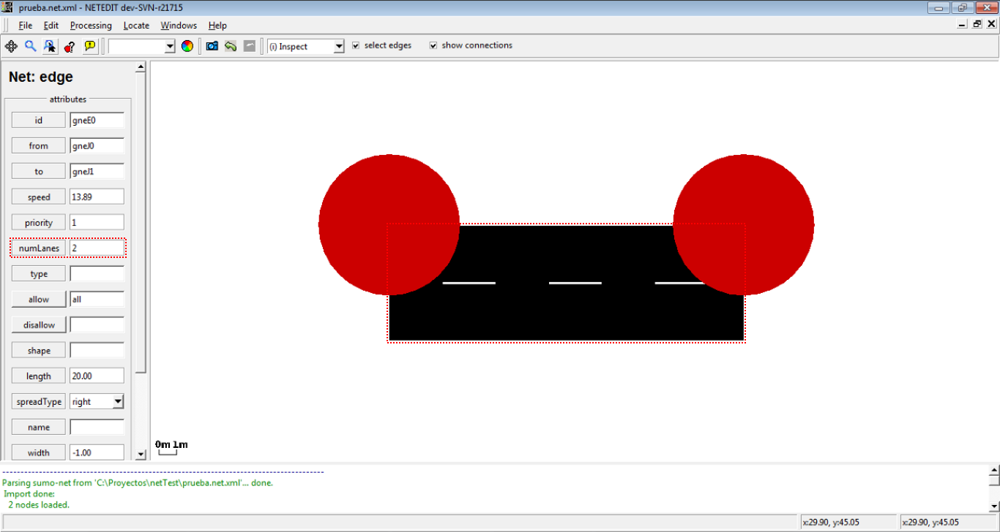   
Changing the number of lanes of an edge

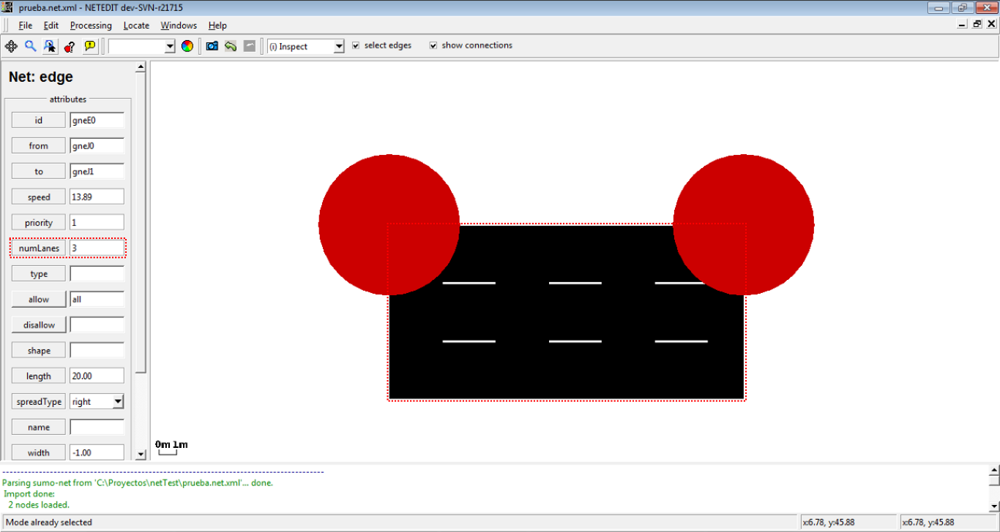   
Number of lanes of the edge changed

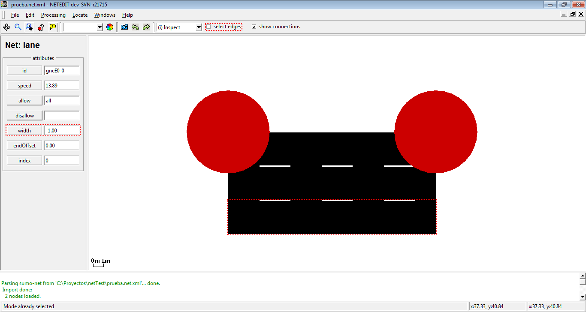   
Changing the width of a lane. Note that option "select edges" is disabled

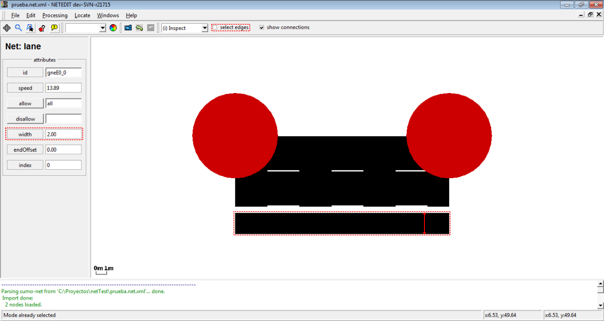   
Width of lane changed (gaps will disappear upon triggering recomputation with **F5**)

# Delete

The Delete mode is used to remove an element of your network. The following is possible:

- Delete junctions (and all adjoining edges)
- Delete edges
- Delete geometry points of an edge
- Delete a lane (when option *selection edges* is disabled)
- Delete connections (available, when *show connections* is enabled)
- Delete crossings
- Delete additionals

The delete frame own a list of elements that is filled automatically with the childs of the current element under the cursor. This list of child elements can be marked using Control + left-Click, and every child can be centered, inspected or removed individually with a right click over an element.

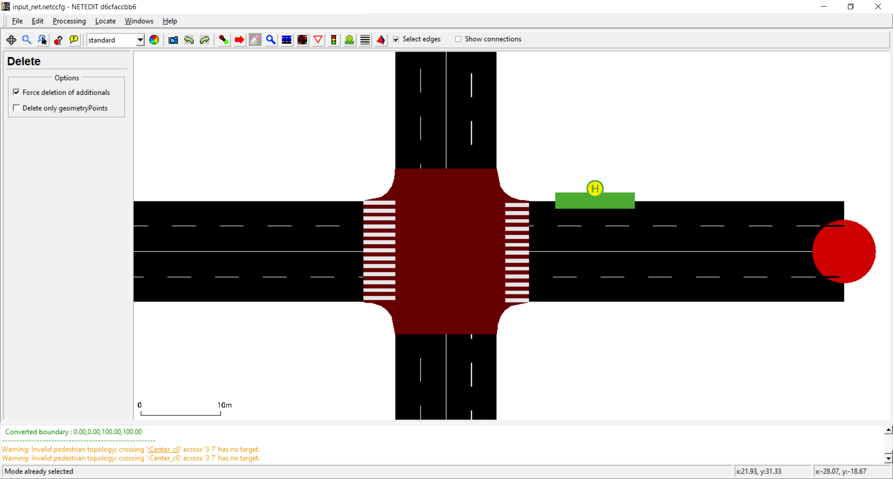   
General view of the delete frame

Additionally, the delete frame has a list of options to avoid undesirable deletes:

- Force deletion of additionals: Used to avoid undesirable deletion of additionals.

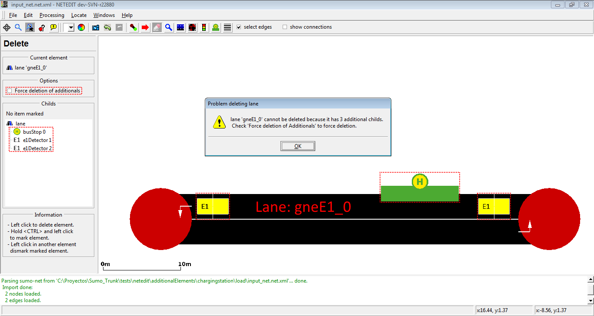   
If the user tries to remove an element with additional childs and 'Force deletion of additionals' is disabled, netedit shows a warning dialog and the element isn't deleted.

- Delete only geometry points: Used to remove only geometry points

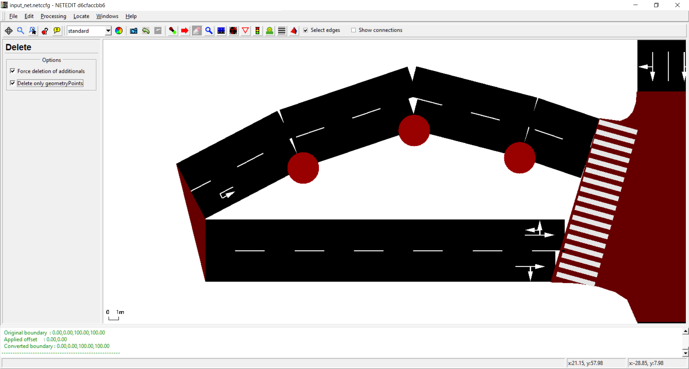   
Only Geometry points can be deleted

# Select

This mode selects objects according to various criteria. Selected objects can be moved or deleted together. It is also possible to set attributes for all selected objects (i.e. junctions or edges) at the same time by clicking one of the selected objects afters switching to **inspect mode**.
This mode also allows to save and load selections to a file and to compute [joins and differences](#modification_mode) of saved selections.

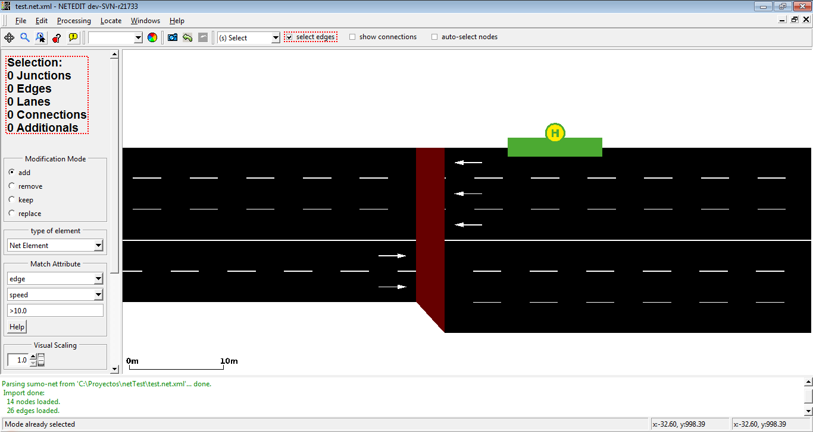   
The left frame shows information about the current selected elements

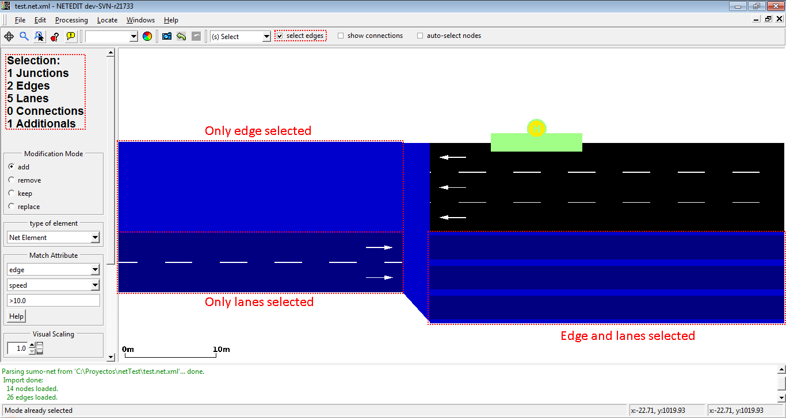   
Selected elements are painted with a different color

## Methods for selecting

- the selection status of objects is toggled by left-clicking. When the *select edges* check-box is unset, lanes, rather than edges will
  be selected/deselected.
- by rectangle-selection via shift+leftClick+drag (When the checkbox *auto-select junctions* is enabled, junctions of selected edges will be selected automatically)
- by matching object attributes [(see below)](#match_attribute)
- by loading a saved selection
- by inverting an existing selection

!!! note
    Junctions and lanes can also be selected by <ctrl\>+<left click\> regardless of editing mode

## Modification Mode

The *Modification Mode* changes how a new group selection is applied to the existing selection. A new group selection can be:

- a selection loaded from a file
- a rectangle selection
- a [match-attribute](#match_attribute)-selection

The modification modes have the following functions

- **add**: both selections are added together (in set theory this would be called *union*)
- **remove**: all elements from the new selection are removed from the old selection. (in set-theory *subtraction*)
- **keep**: only elements common to both selections are kept. (in set theory *intersection*)
- **replace**: the existing selection is replaced by the new selection

## Match Attribute

The 'Match Attribute' controls allow to specify a set of objects by matching their attributes against a given expression. When combining this set with the current selection, the *Modification Mode* is also applied.

1.  Select an object type from the first input box
2.  Select an attribute from the second input box
3.  Enter a 'match expression' in the third input box and press <return\>

### Matching rules

- The empty expression matches all objects
- For numerical attributes the match expression must consist of a comparison operator ('<', '\>', '=') and a number.
- the attribute matches if the comparison between its attribute and the given number by the given operator evaluates to 'true'
- For string attributes the match expression must consist of a comparison operator ('', '=', '\!', '^') and a string.
- *(no operator) matches if string is a substring of that object's attribute.*
  - '=' matches if string is an exact match.
  - '\!' matches if string is not a substring.
  - '^' matches if string is not an exact match.

### Special Cases

- For attributes *allow* and *disallow*, the attribute value **all** is shown in [Inspect](#inspect)-mode when all classes are allowed (or disallowed). In this case an edge (or lane) will also be selected when using any vClass as match string (and edge with attribute `disallow="all"` will also match when filtering for disallow with string **passenger**). However, for technical reasons the match
  string **=all** will not match this edge (**all** is expanded to **all private emergency passenger bus ... custom1 custom2**).

### Examples

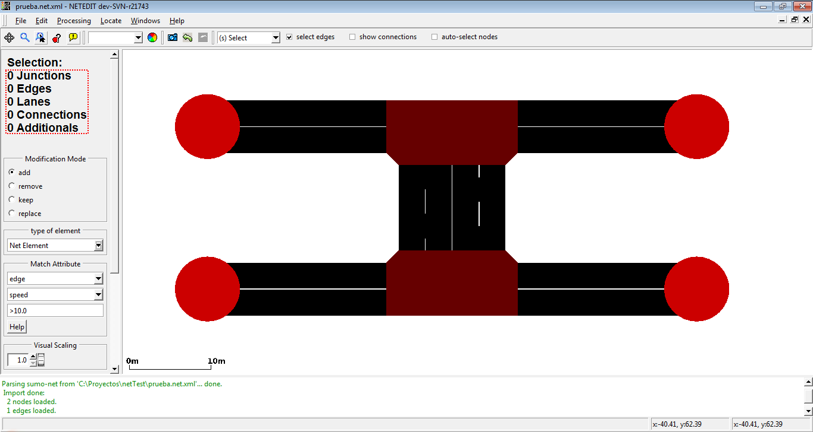We want to select the most external lane of every edge (i.e. lanes which contains _0 in their id)

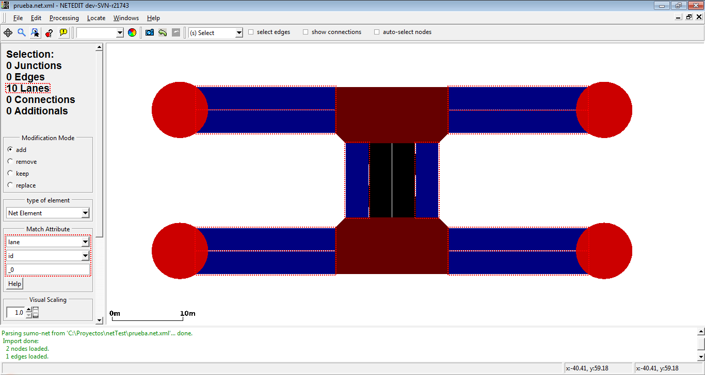We can do it selecting lane as type of element, and using the match over the attribute "id".

We want now to select the second lane of every edge (i.e. lanes which contains _1 in their id)

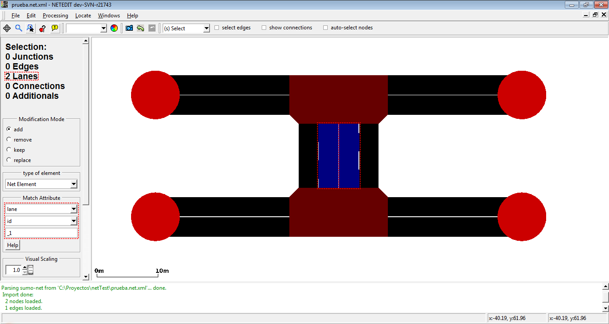Only two lanes are selected because the rest of edges only have one lane.

We can select all lanes of our net using the previous selection and the operator "add". 

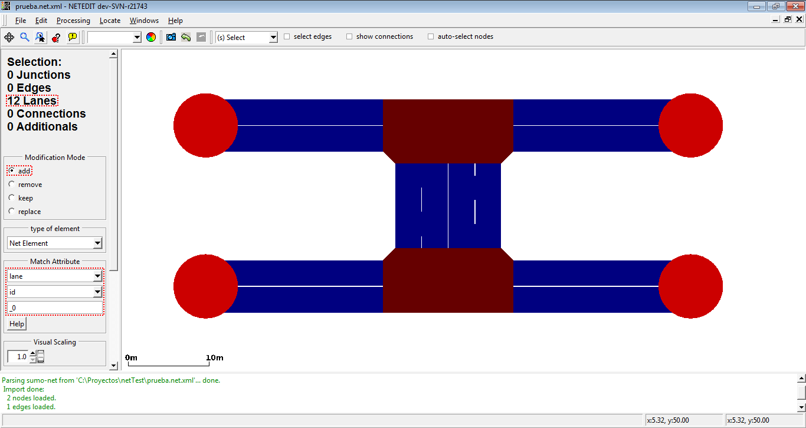All lanes of the net are selected using selection of lanes which contains _0 in their id with the "add" operator

With the previous element and the operator invert, we can select all junctions of the network. 

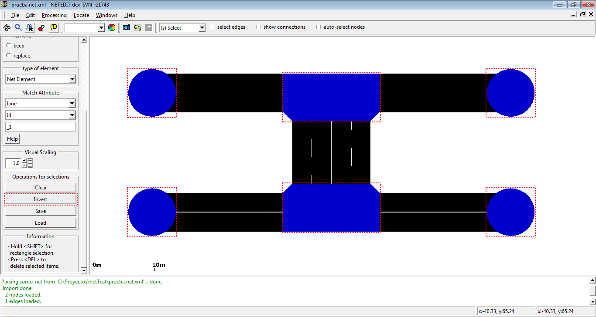Invert operation select all elements of the net and subtract the current selected elements

If we have a empty selection, we can select easy all elements of net . 

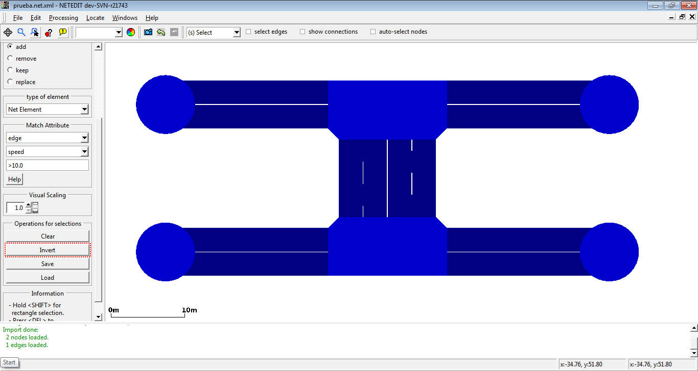With the invert button, we select all elements of net.

## Selection Operations

The following operations can be performed on the whole selection

- **Clear** : Clear the whole selection except for "locked" object types (shortcut `<ESC>`)
- **Invert** : Invert selection status for all object types except "locked". Can be used to delete everything *except* the selected elements
- **Save**: Save selection to a text file. This can be loaded in sumo-gui and also used by some [netconvert](../netconvert.md) options
- **Load**: Load selection from text file. This is combined with the current selection according to the active [Modification Mode](#modification_mode).
- **Delete**: Delete all selected objects including "locked". (shortcut `<DEL>`)   

# Move

Move junctions by dragging with the left mouse button. Dragging edges creates or moves geometry points. Dragging a junction on top of another junction joins them into a single junction. By default, the junction shape is updated while moving. However the
final shape after saving or activating full recomputation (F5) may be slightly different.

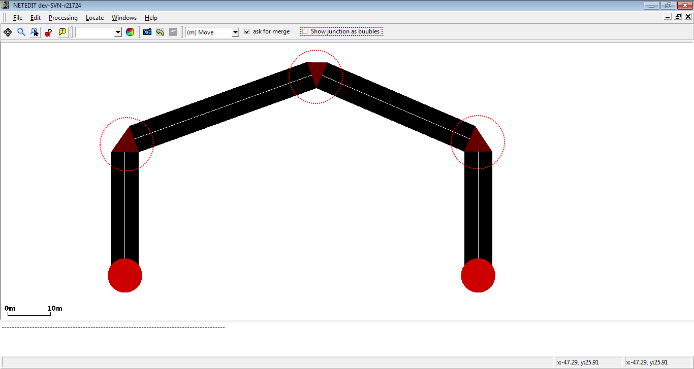By setting the option "show junctions as bubbles", circles are drawn instead of detailed junction shapes which can improve visibility.

## Changing Elevation ###
When activating the 'Move elevation' button in the button bar, junctions and existing geometry points can be modified by dragging the with the mouse (with their x,y coordinates remaining unchanged).  At the same time, the numerical elevation value will be displayed for every junction and geometry point.  It is useful to combine this with [elevation or slope coloring](../Networks/Elevation.md#visualizing_elevation_data).

## Moving Object Selections

Special movement operations are available when multiple objects are selected (via Selection mode).

### View Operations

- When selecting neighboring edges and dragging one of them, the neighboring edge will receive the same shape modifications
- When selecting an edge and its junctions and dragging any part of the selection, all parts including edge geometry will be moved in parallel
- When selecting an edge an one if its junctions:
  - When dragging the junction, only the junction will move
  - When dragging the edge, the edge will move locally and the junction will move in parallel

### Frame Operation

For a selection of edges, the Move-mode sidebar allows to move the whole geometry sideway using the "Shift selected edges geometry" element. A position value shifts geometry to the right (relative to the driving direction) and a negative value shifts geometry to the left.

For a selection edges and/or junctions the Move-mode sidebar allows to move all objects in Z-direction using the "Change Z in selection" element. The applied value can either be set as the new "absolute" Z value or it can be applied relative to the existing Z position.

## Moving Polygons and TAZs

- When clicking over an Polygon/TAZ edge or vertex, contour will be moved
- If Polygon/TAZ is inspected an option "block shape" is enabled, then entire shape will be moved
  
