# Demand specific modes

## Route mode

New route over the current infrastructure can be created using this mode. Routes are created clicking over consecutive edges (marked with different colors) and pressing "create route" button or Enter key. Route creation can be aborted using "abort creation" button or pressing ESC key. Note that Routes can be created between edges that aren't connected thought a connection.

   
General view of Route Mode.

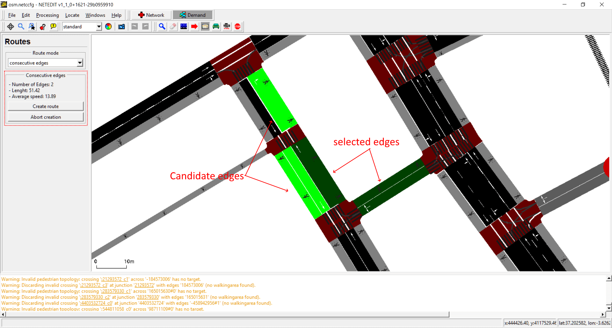   
Creating a new route. Current selected edges and candidate edges are marked with different colors.

   
Created route.

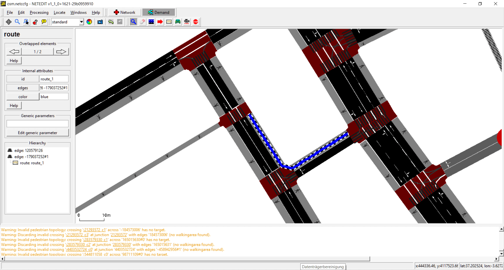   
Inspecting route.

## Vehicle mode

Vehicles, flows and trips can be created using this mode. The term "vehicle" includes three different elements: Vehicles, flows (both placed over a Route) and Trips (placed over a "from" edge). Also every vehicle need to have a "Vehicle Type", therefore both parameters has to be selected in both list of left frame.

   
General view of vehicle mode, highlighting the list of vehicles and vehicle types

   
Creating a single vehicle clicking over route

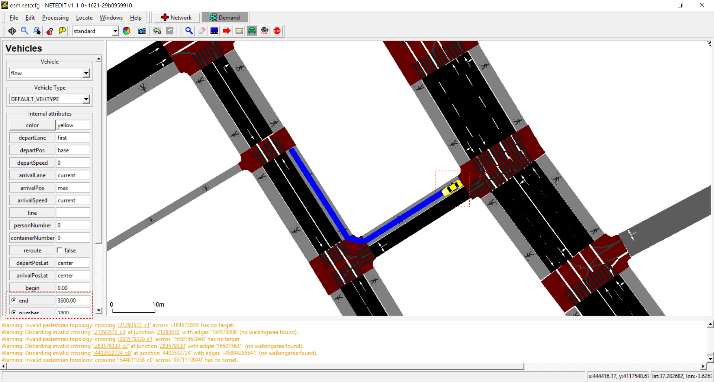   
Creating a flow. It's similar to a vehicle, but with extra parameters, and note that certain are disjoint parameters.

   
Creating a trip. In this case we need to specify a "from" and "to" edge, therefore we need to click over two edges. After clicking over edges, press "finish route creation" or Enter Key to create a trip. If more than two edges are clicked, it will be interpreted as "via" edges

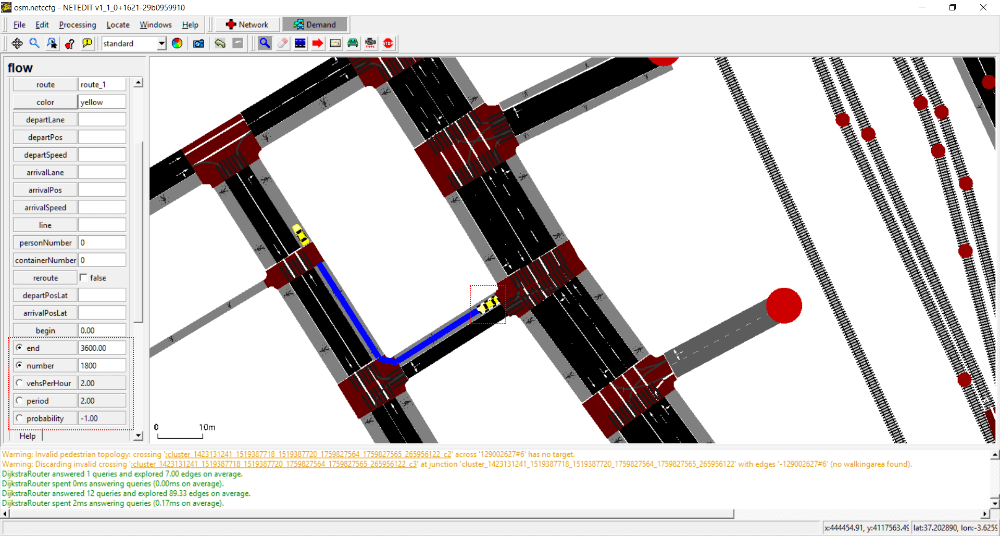   
Inspecting a flow. Note the disjoint parameters

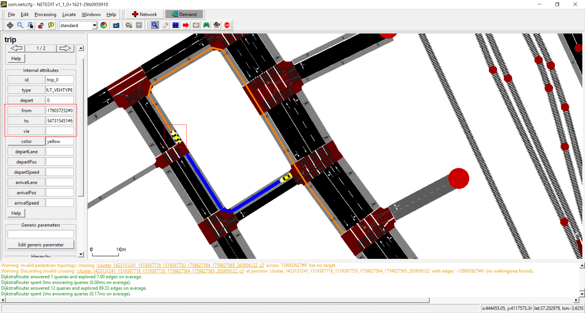   
Inspecting a trip. In this case the route is highlighted. Note that a change in the infrastructure can be change the route trip.

## Vehicle Type mode

Vehicle types can be created and edited using Vehicle Type mode. A vehicle Type isn't a visual element that can be observed in the view, but is an "abstract" element that have a big influence in other elements (for example, vehicles). Every simulation has always two default vehicle types for Vehicles and Bikes. This default vehicle type can be edited but not deleted, and only is written in XML if one of their default value is modified. Due a Vehicle Type has a big number of parameters, only the most relevant parameters can be edited in left frame. To edit advanced parameters, use the Vehicle Type Dialog opened thought "Open attribute editor" button.

   
General view of Vehicle type Mode

   
Creating a new vehicle type. Note that non-default vehicle types can be deleted using "Delete Vehicle Type"

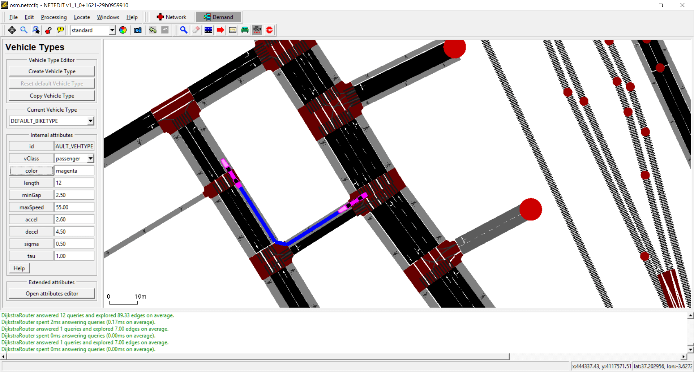   
Editing values of a default vehicle type (Length and Color). Note that this changes has influence in the existing vehicles

   
Opening Vehicle Type attribute editor. Default values are shown in gray color

   
Editing values of a vehicle type using attribute editor.

## Stops mode

Stops used by all type of vehicles (Vehicles, Flows and Trips) can be created using StopFrame. Stops is an special type of demand elements, because it always depend of either a route or a vehicle (i.e. It can be written in XML within the definition of either a route or a vehicle). Before creating a new Stop, their demand element parent has to be selected and the stop type (placed over a Lane or over a stopping Place). To create it, simply click over a lane or over a stopping place.

   
General view of Stop Mode. Route and stop type can be selected in frame. 

   
Created stop within the blue route placed over a lane.

   
Created stop within the blue route placed over a busStop. If geometry of BusStop is changed, geometry of Stop will be also changed.

   
Inspecting a Stop placed over a lane.

   
Inspecting a Stop placed over a busStop.

## Person Type mode

Vehicle types can be created and edited using Person Type mode. A person Type isn't a visual element that can be observed in the view, but is an "abstract". Every simulation has always a basic default pedestrian type. This default pedestrian type can be edited but not deleted, and only is written in XML if one of their default value is modified.

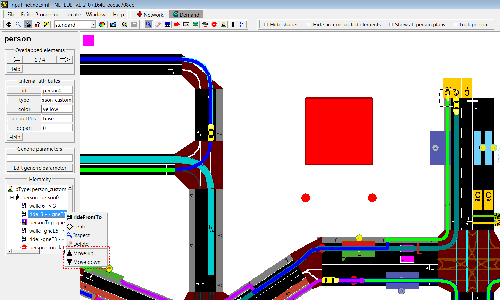   
Person Type frame

## Person mode

Persons and personFlows are elements that always requires an auxiliary element called "person plan" to exist. There are four basic types (Trips, Rides, Walks and Stops), and within each several subtypes (Using edges, lanes, routes ...). Therefore, to create a person,their first "Person plan" has to be created at the same time. The person plan frame has two parts: One dedicated to the creation of the person, and another to the creation of the first person plan.

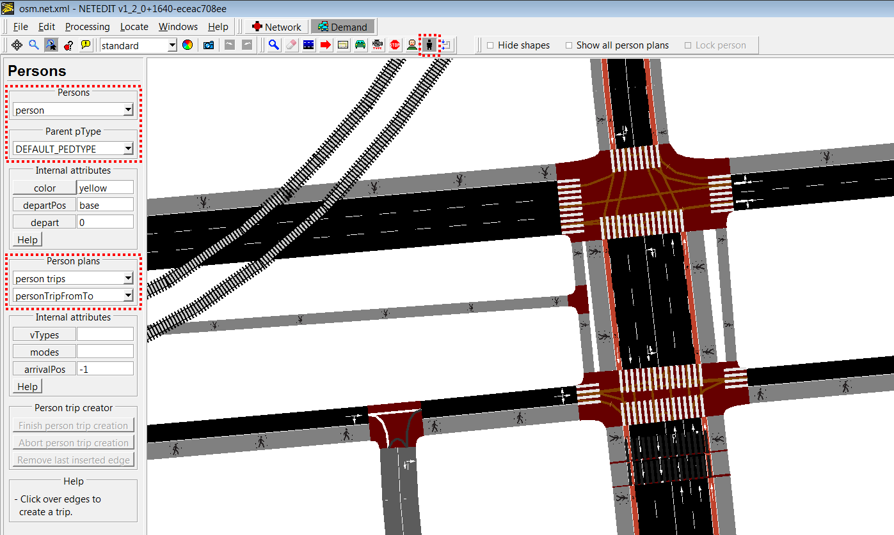   
Person Plan frame.

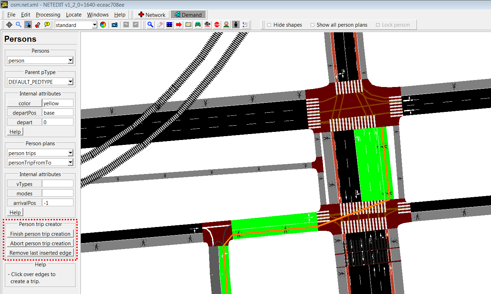   
Creating person trip clicking over edges

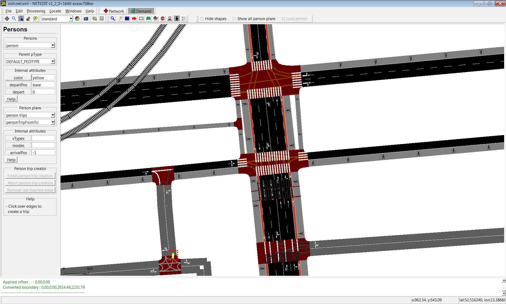   
Created persons.

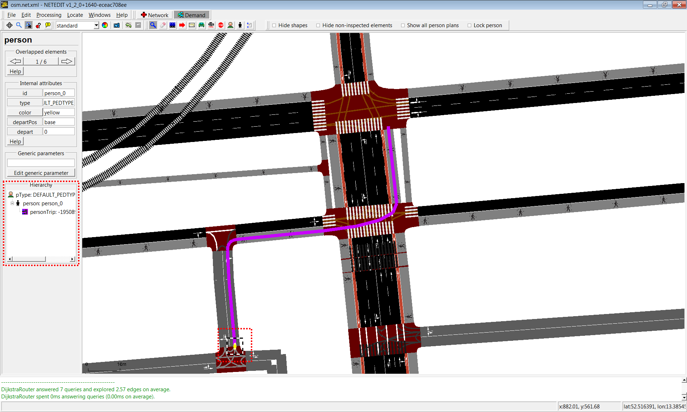   
Clicking over a person highlights their person plan

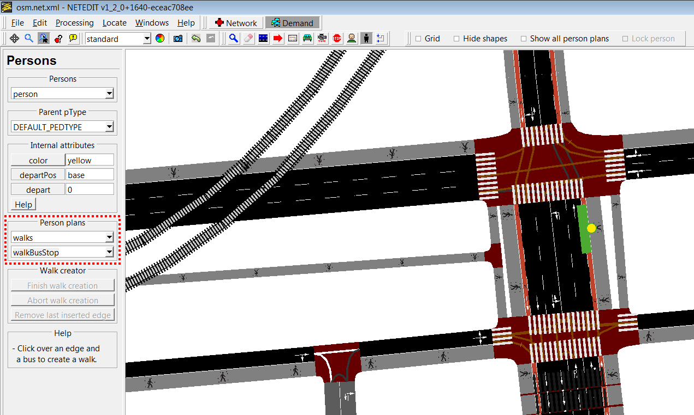   
Person plans have different subtypes (in this case, a walk that ends in a busStop)

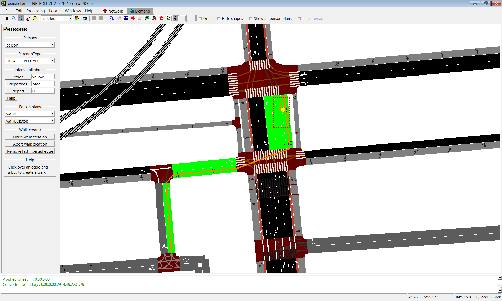   
Creating a walk that ends in a busStop

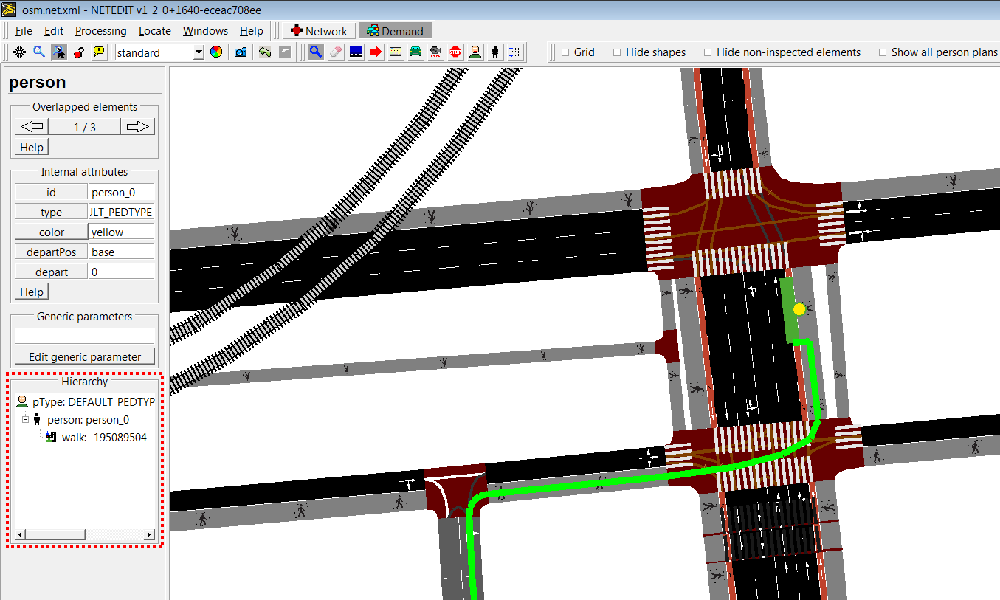   
Created walk

Person plans can be sorted clicking over person plan in hierarchy. 

   
Sorting person plans.

## Person plan mode

Person plans can be extended using the PersonPlan frame. Once the Person plan frame is opened, a person or a personFlow has to be chosen. Then the last edge of the plan will be marked, and the new created person plans will start from there.

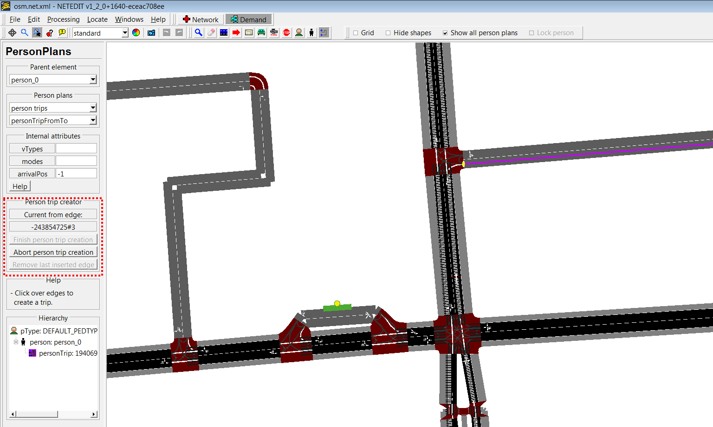   
Person_0 has only a trip, and the last edge of person's trip is marked (green)

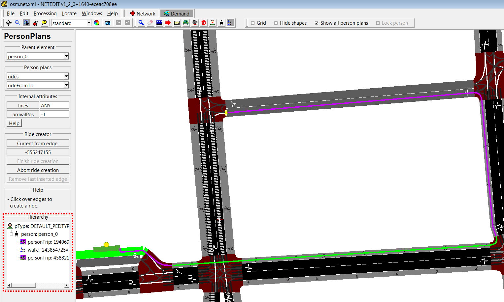   
Multiple person plans can be added continuously
