# Network specific modes

## Create Edges

This mode creates edges (lanes) and implicitly junctions. The edge attributes will be taken from the current [Edge template](editModesCommon.md#edge_template). If no template is set, default options such as **default.lanenumber** will be used.

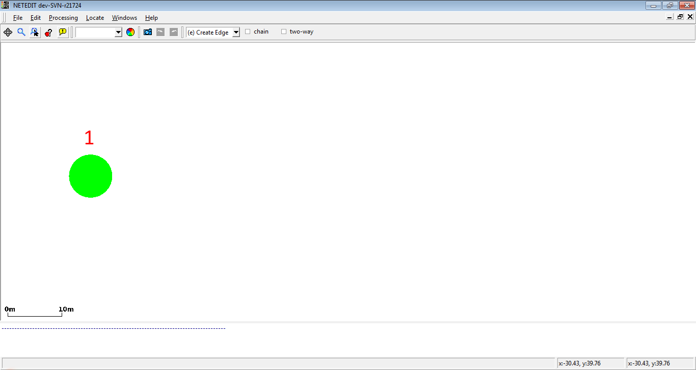   
In "Create Edge" mode, click over a empty area of the view to create the junction 

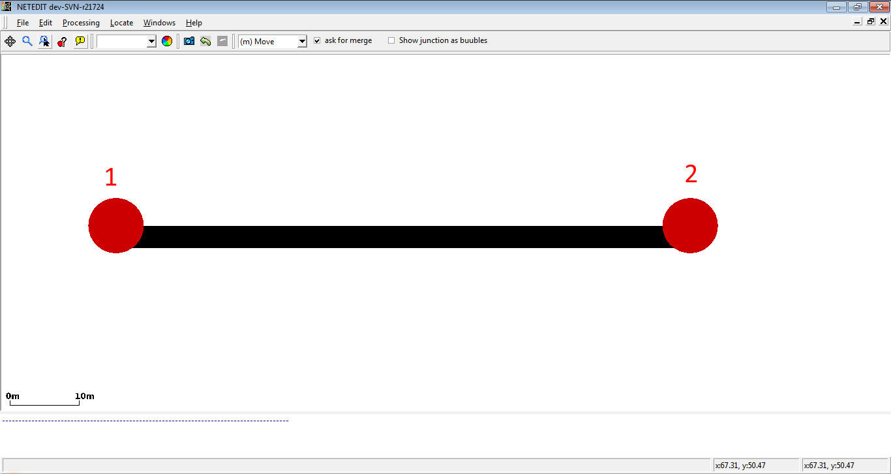   
Then click in another empty area to create another junction. An edge with one lane between both junctions will be created.

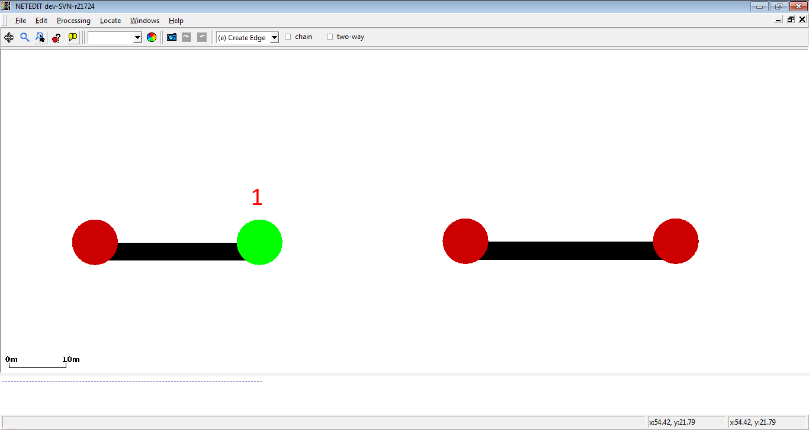   
To connect two already created edges, click over the first junction. 

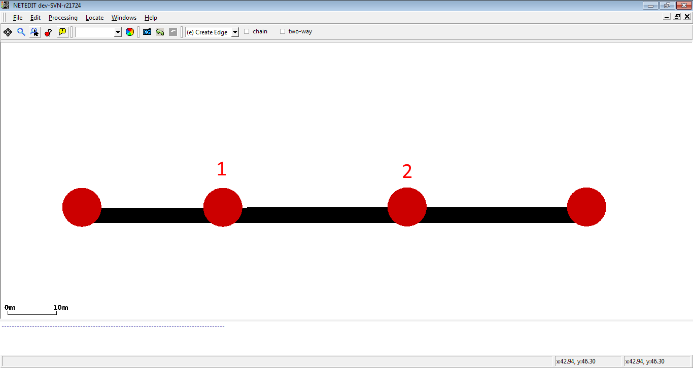   
Click over the second junction to create an edge between both.

### Creating a chain of edges

   
A list of connected junctions can be quickly created by enabling the option *chain*.

### Creating two-way roads

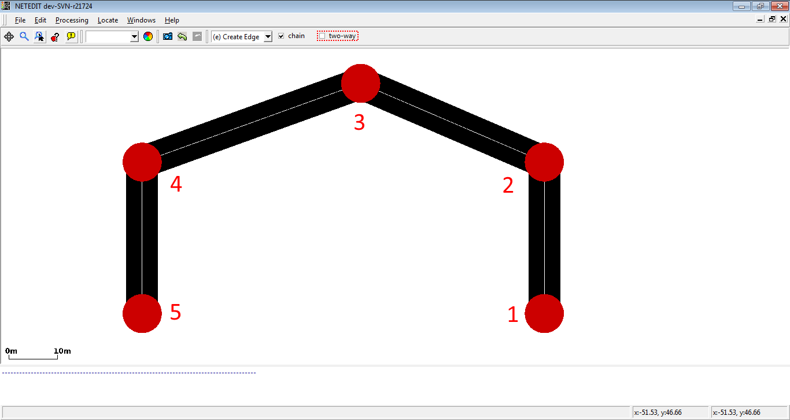   
When setting the option *two-way*, the reverse direction for an edge will be created automatically (otherwise further clicks are needed to create the reverse direction manually).

## Edit connections

Connections establish the possible directions that can be taken by a vehicle when it arrives at a junction.

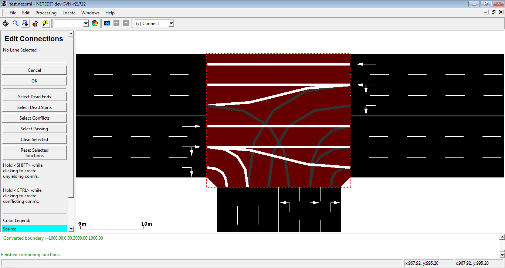   
Connections in a Junction with six edges and eighteen lanes. Connection shapes depend of the Junction shapes. If a Junction shape is too small, the Junction takes a bubble as shape and the connections take a line as shape

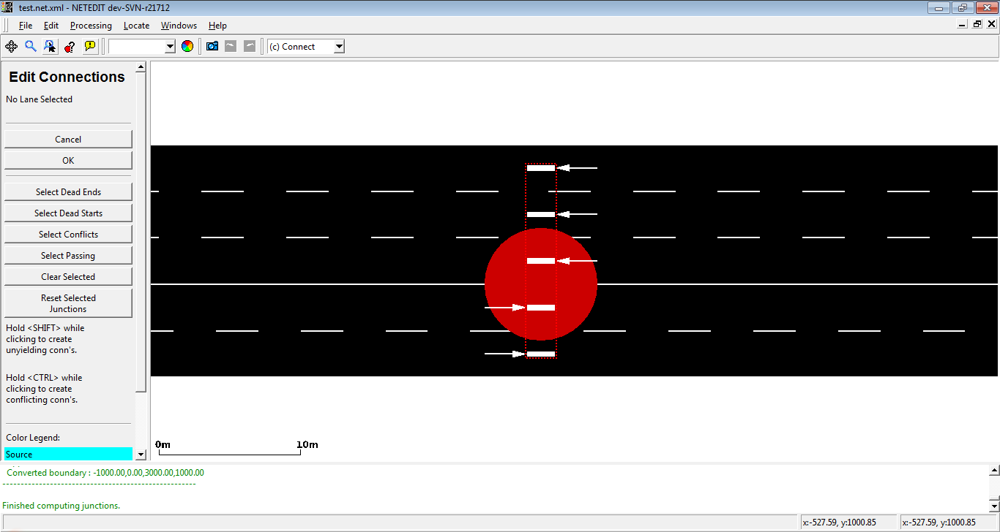   
Connections in a Junction with a bubble as shape. 

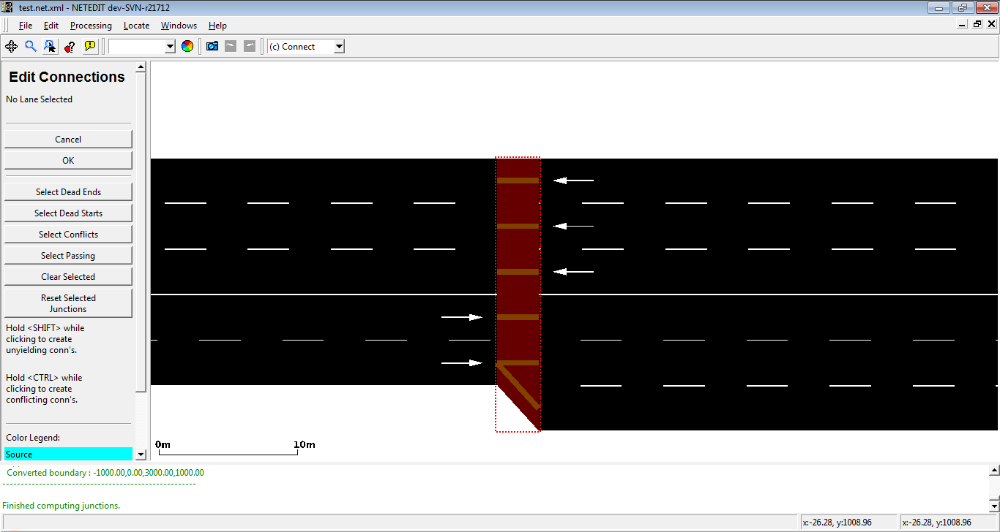   
Connections in a Junction without a bubble as shape.

### Inspecting connections

As the rest of elements of netedit, connections can be inspected and modified using inspected mode. Note that the option *show connections* must be enabled. All parameters can be modified excepting *From*, *To*, *fromLane* and *toLane*. The connection coloring is done as [in sumo-gui](../sumo-gui.md#right_of_way) with the exception of traffic-light connections which are brown in inspect-mode.

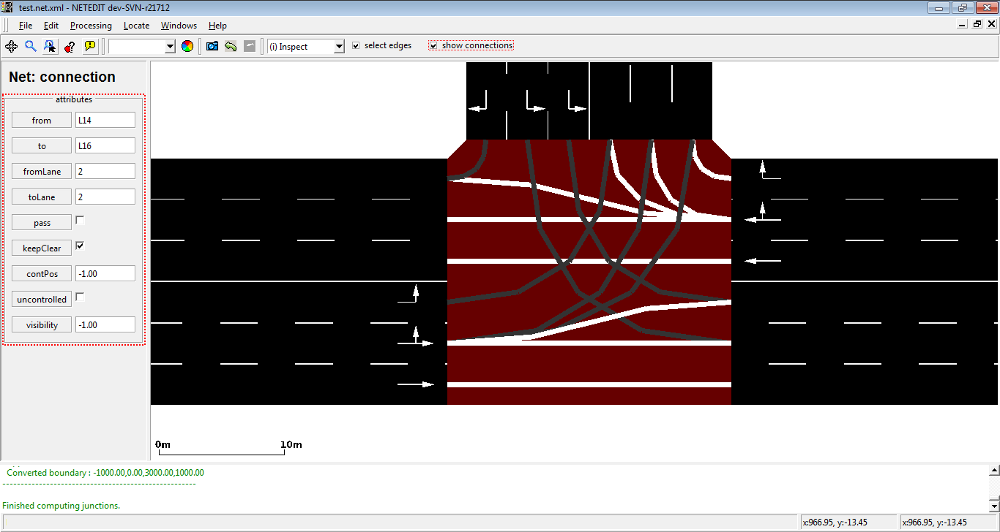   
Inspecting a connection. Note that check box "Show connections" is enabled. 

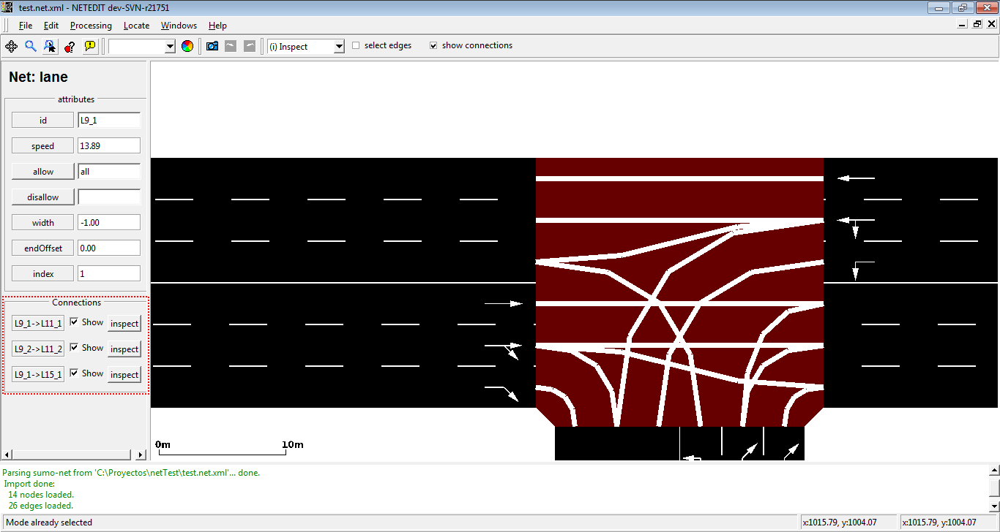   
Connections can be inspected through inspection of their **from** lane or it's corresponding edge.

### Changing connections

When a new junction is created, or their edges are modified, a set of new connections is automatically created. But netedit allows also to customize the connections of a lane using the connection mode. When a source lane is selected in connection mode all outgoing lanes at the junction are colored according the the categories below:

| Legend                                                  | Meaning                                    | Result of left-click                                 |
| ------------------------------------------------------- | ------------------------------------------ | ---------------------------------------------------- |
| <span style="background:#00FFFF">Source</span>          | The source lane for editing connections                                                         | Nothing                                                                                                                 |
| <span style="background:#00FF00">Target</span>          | The lane is already connected from the source lane.                                             | Remove connection                                                                                                       |
| <span style="background:#008800">Possible Target</span> | The lane is not yet connected.                                                                  | Add connection (with shift-click, set `pass="true"`)                                                                                 |
| <span style="background:#FF00FF">Target (pass)</span>   | The lane already connected and this connection is forcibly set to have priority (attribute `pass="true"`)    | Remove connection                                                                                                       |
| <span style="background:#FFFF00">Conflict</span>        | The lane is not yet connected. Adding a connection would be unusual for some reason (see below) | Print reason for conflict in status bar. (with ctrl-click add connection, with ctr+shift+click create connection with `pass="true"`) |

To deselect the source edge or cancel the declared connections press **<ESC\>** or click the *Cancel*-Button. To confirm the change press **<ENTER\>** or click the *OK*-Button.

#### Conflict reasons

- [double connection](../Networks/PlainXML.md#multiple_connections_from_the_same_edge_to_the_same_target_lane). Usually each lane only has one predecessor from the same edge. A counter-example would be a [zipper
  node](../Networks/PlainXML.md#node_types). May also be useful to model bus bays.
- Incompatible permissions: The source and target lanes have no [allowed vehicle class](../Simulation/VehiclePermissions.md) in common
- Connection from sidewalk: Lane-to-lane connections for pedestrians are usually not defined by the user. Instead, the connectivity is modeled with [pedestrian crossings](../Simulation/Pedestrians.md#generating_a_network_with_crossings_and_walkingareas).

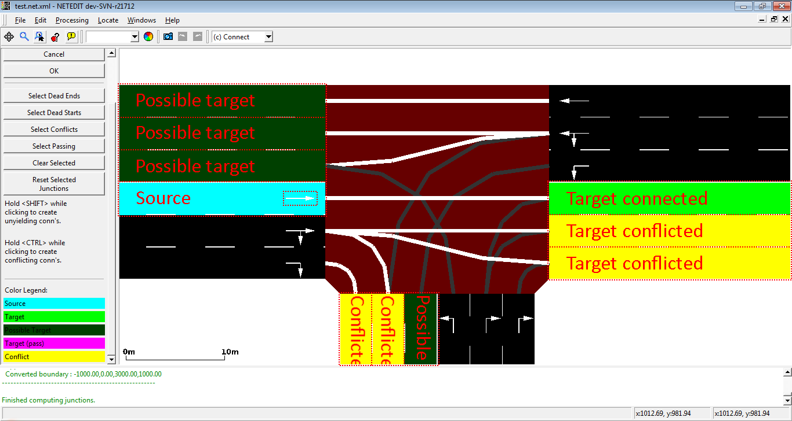   
Colors of the possible objective lanes change. In this example, the objective lanes are divided into **Target Connected**, **Possible Target** and **Target Conflicted**.

   
Creating two more connections.

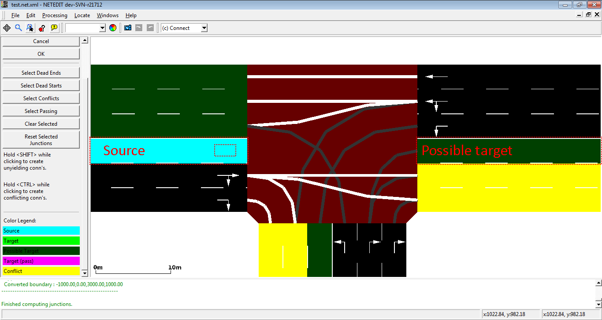   
Removing all connections.

## Prohibitions

This mode shows right of way-rules for any selected connection using a color code. To select another connection, cancel the current one with <ESC\>.

## Traffic Lights
Set junctions to be controlled or uncontrolled by a traffic light. Edit all aspects of static or actuated signal plans. Visualizes a signal
phase by coloring the controlled lane-to-lane connections according to the signal state.  When entering this mode, each traffic light controlled junction is indicated with a traffic light icon.

- Click on an uncontrolled junction to add a traffic light
- Click on a controlled junction to make it uncontrolled, add a program (copy) or change a program.

Editing signal states can be accomplished in either of the following ways:

- right-clicking on any controlled lane and picking a new state (color).
- right-clicking on any of the incoming lanes to change all controlled connections from that edge
- If the lane is currently selected, all connections from selected lanes incoming to the traffic light will be changed as well
- If the edge is currently selected, all connections from selected edges incoming to the traffic light will be changed as well
- If the check-box *apply change to all phases* is activated, all phases of the current plan will be affected

You can also change the state by editing the phase table directly.

### Joined Traffic Lights
To edit the program of a joined traffic light, any of its junctions can be clicked in traffic light mode. This will cause connections from all controlled junctions to be highlighted. To create a joined traffic light you need to use inspect mode:

- make all junctions controlled by a traffic light
- set their 'tl' attribute (traffic light id) to the same value

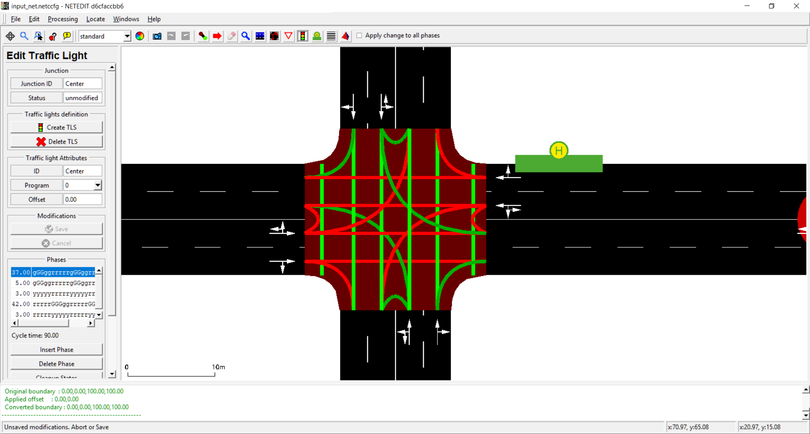   
General view of the TLS frame

## Additionals

Add additional elements to the net. Additionals can be placed over a lane or in an empty place of the map. See [Additional elements](elementsAdditional.md) for more information. They are saved to a separate file ({{AdditionalFile}}) and are loaded separately when running the simulation

## Crossings

Add [pedestrian crossings](../Networks/PlainXML.md#pedestrian_crossings) for use with [pedestrian simulation](../Simulation/Pedestrians.md). Crossings are define relative a junction and edges at this junction.
Their width can be customized and they can either be configured as prioritized (zebra stripes) or unprioritized (vehicles have right of way). Crossings are added using the following steps:

1.  activate crossing mode (R)
2.  select a junction
3.  select edges that shall be crossed
4.  click *Create Crossing*

!!! note
    For crossings to be visible in **netedit**, the *Compute Junctions (F5)* functionality must be triggered at once.

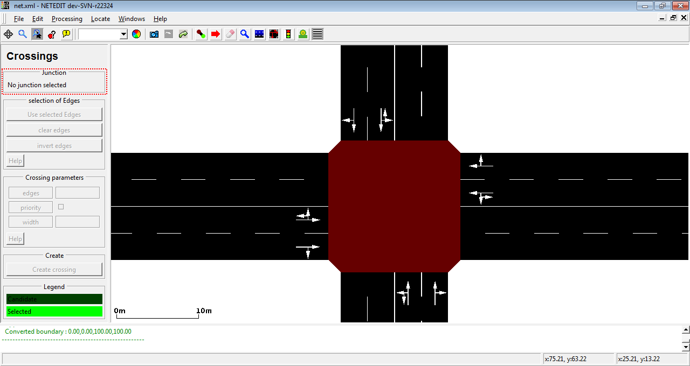   
In crossing mode, first a junction must be selected. 

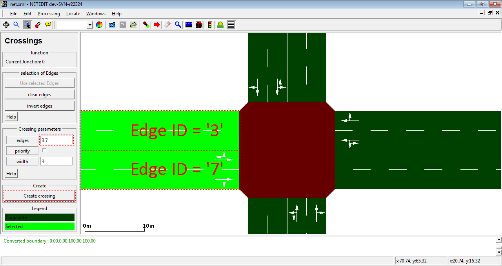   
Click over junction's edges to select the edges of crossing.

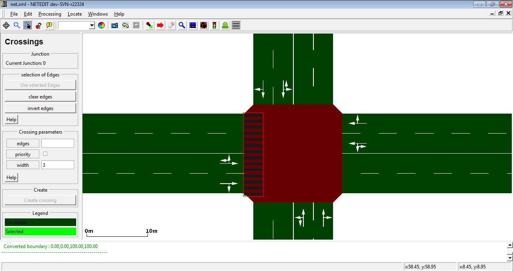   
After click over "Create crossing" and recomputing (F5) the new crossing is visible.

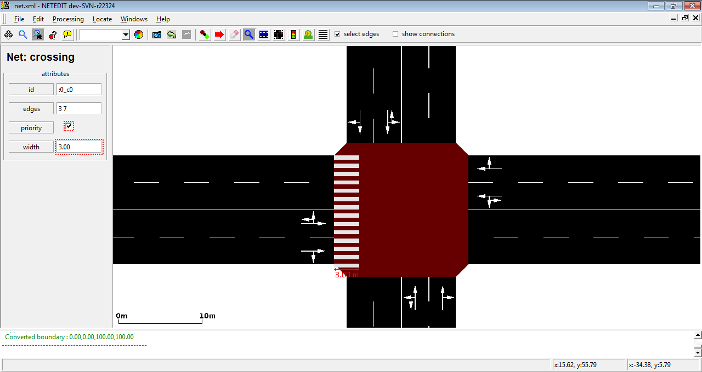   
Crossing can be inspected as other elements.

Internally, crossing works as edges, and therefore they appear in the *net.xml* as edges with different functions (crossing or walkingarea)

```xml
... previous element of net.xml ...
    <edge id=":0_c0" function="'''crossing'''" crossingEdges="3 7">
        <lane id=":0_c0_0" index="0" allow="pedestrian" speed="1.00" length="13.10" width="3.00"
        shape="43.45,56.55 43.45,43.45"/>
    </edge>
... ...
    <edge id=":0_w1" function="walkingarea">
        <lane id=":0_w1_0" index="0" allow="pedestrian" speed="1.00" length="13.10" width="3.00"
        shape="44.95,43.45 41.95,43.45 41.95,56.55 44.95,56.55"/>
    </edge>
... further elements of net.xml...
```

## TAZ (Traffic Analysis Zones)

This mode allows creating and editing [TAZ](../Demand/Importing_O/D_Matrices.md#describing_the_taz). (Shortcut Z). TAZs are composed of a closed polygon and a list of edges associated with certain weights for the inputs (Sources) and outputs (Sinks) (Similar to a [Flow Network](https://en.wikipedia.org/wiki/Flow_network)).

The creation of TAZs require two steps:

### 1. Creation of the polygon (similar to a polygon shape) ###

Press *Start drawing* button (or alternatively press ENTER key) and click over the view with the mouse left button to add vertices. Press Shift + mouse left button to remove the last created vertex. To finish creating polygon, press *Stop drawing* button (or alternatively press ENTER key again). To abort the creation of the polygon press *Abort drawing* button (or alternatively press ESC key)

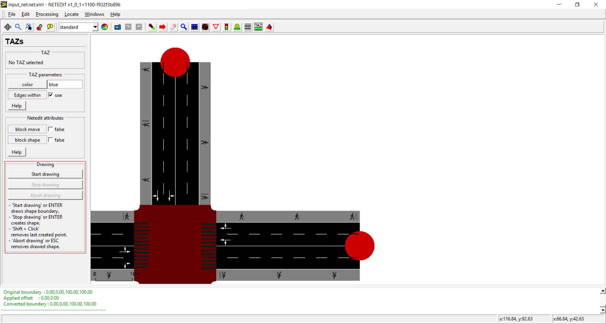   
Basic view of TAZ creation controls

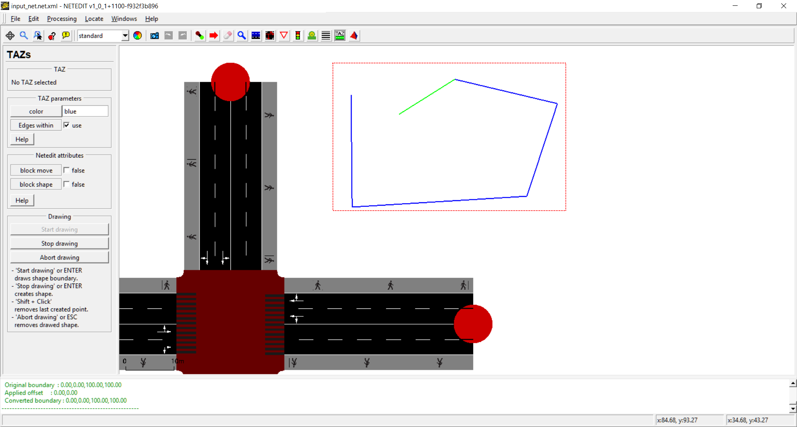   
Creating a TAZ

### 2. Definition of Edges and its inputs (sources) and outputs (sinks) ###

!!! note
    If the checkbox 'Edges within' was checked during TAZ creation, all edges within the shape are automatically added as sources and sinks.

A single click over a TAZ open the editing fields for
TAZEdges in side menu. If the checkbox *Membership* is enabled (Toggle) box, a click over an edge will add it to the list of edges linked to the TAZ, (Or will be removed from the list if it was previously selected). Edge will will be added to the list with the input/output values given in the *New source*/*New sink* text fields. (note: A TAZ Edge always has a Source and a Sink).

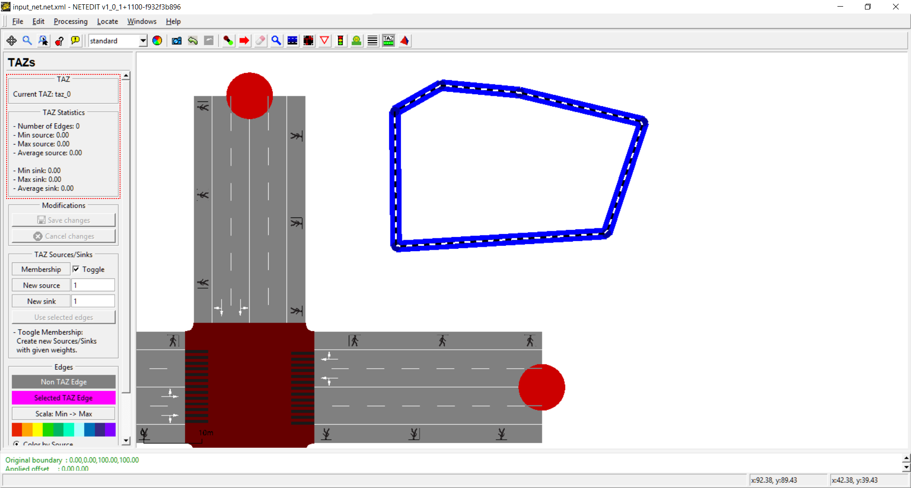   
Controls after clicking over a TAZ

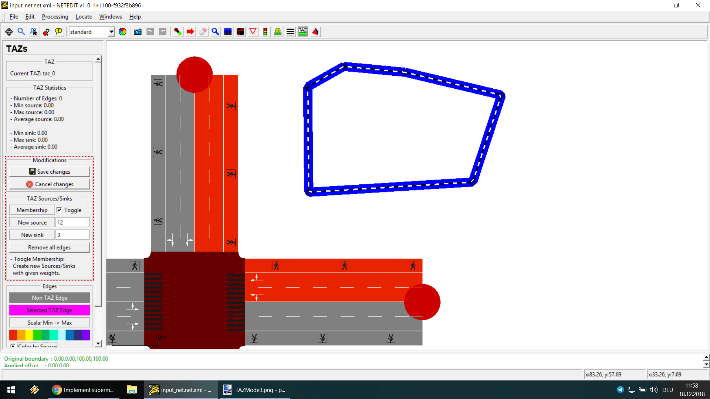   
Creating two TAZEdges

**Selecting and editing TAZ Edges:** If checkbox *membership* is changed to "keep", then TAZ Edges can be selected individually and their values changed. A multiple selection using a rectangle is possible with shift + right. Statistics of selected TAZEdges can be observed in "Selection Statistics"

   
TAZ Edge selected (Pink) 

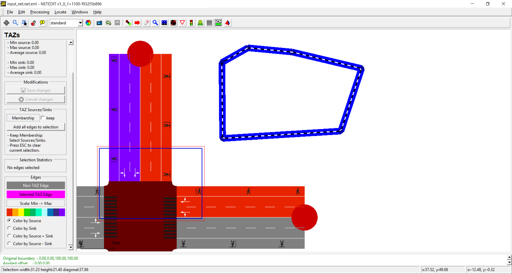   
Selecting using rectangle

**Saving and discarding changes:** All changes in TAZEdges has to be saved using button "Save Changes", or in the same way can be also discarded using "cancel changes" button.

## Shapes

This mode allows the creation of [Polygons](../Simulation/Shapes.md#polygon_definitions) and [POIs (Points of Interest)](../Simulation/Shapes.md#poi_point_of_interest_definitions) through Polygon mode (hotkey ‘P’). These objects are used for visualization and can also be accessed via TraCI. In the polygon frame you can select the type of shape to edit (Polygons or Point Of Interest), and the corresponding parameters for each one.

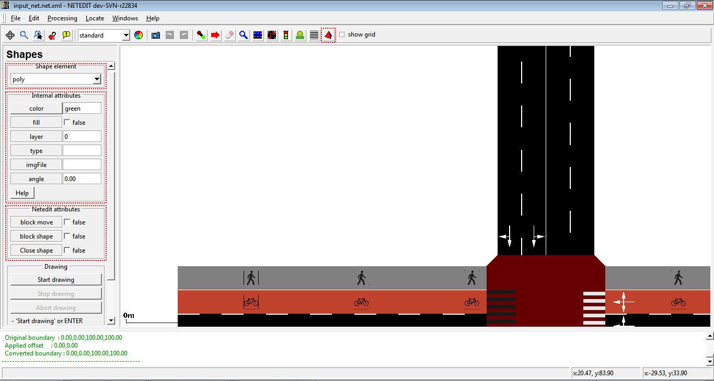   
General view of the shape frame.

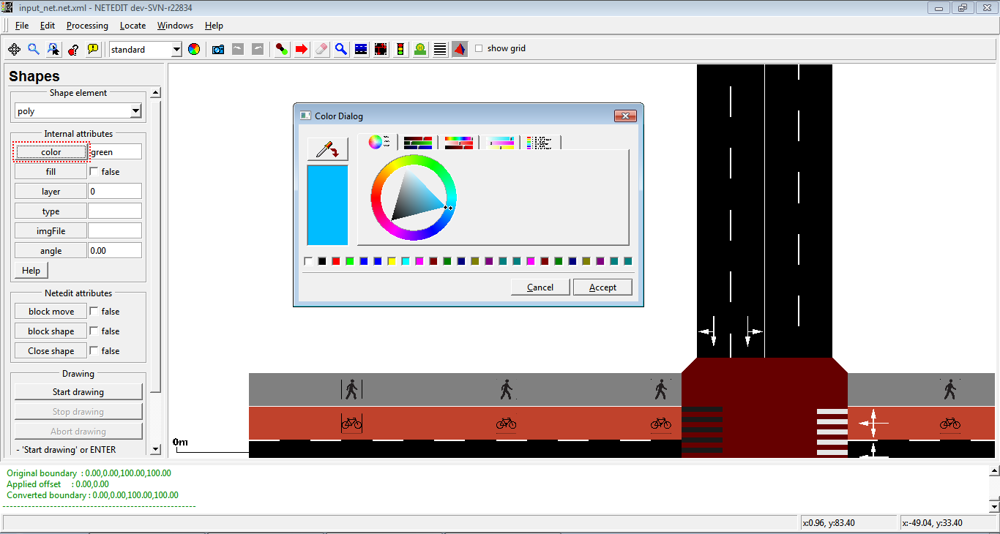   
Color can be edited clicking over button "color".

One polygon is composed of mainly an exterior line called “shape”. In order to create a shape, you have to click on the button “start drawing” (or enter key), and click on the View above each of the points that will form the shape. To end the edition, you have to click on “stop drawing”. A right click on View will remove the last point created and the button “abort drawing” (or ESC key) will cancel the process of the creation of the shape. If you want to create a closed shape, you have to activate the option “closed shape” before starting to draw. The shape of the polygon can be opened or closed with the contextual menu or through the
Inspector mode.

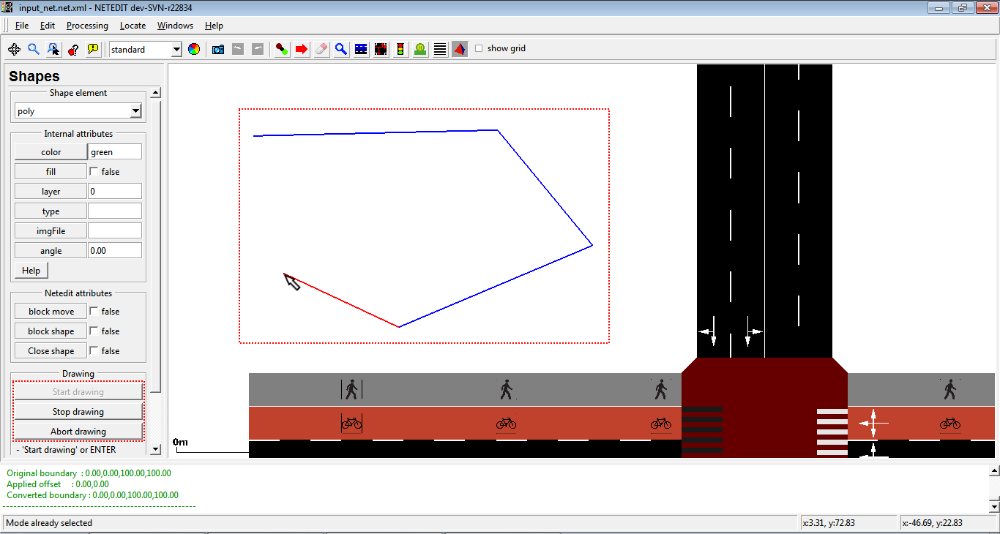   
Creation of polygon.

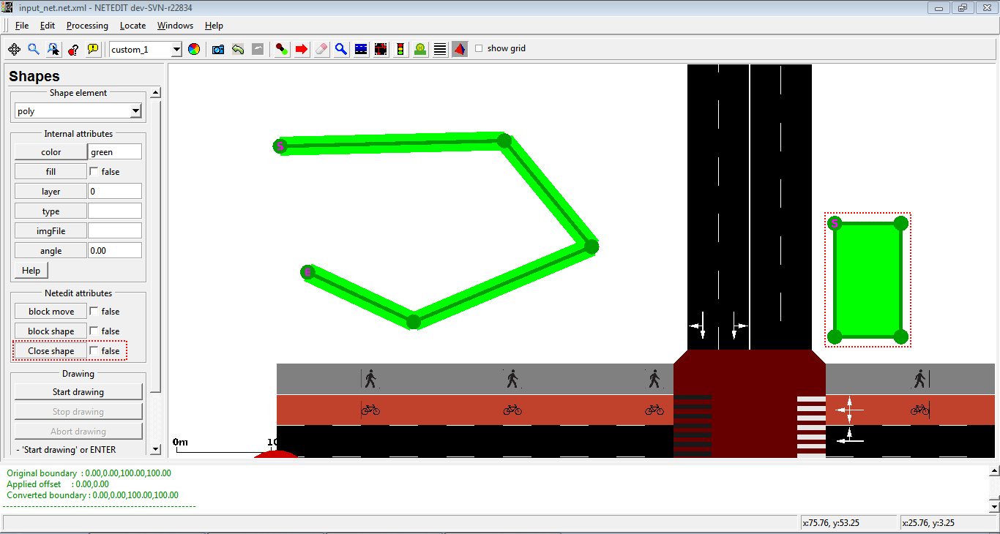   
Polygon with shape closed.

The points of a shape can be edited in the Move mode by clicking on the outline to create a new point or above an already existing one in order to modify its position. If a point moves to the same position of an adjacent point, they fuse together, and if the final point moves to the position of the initial point, the polygon gets closed. If the polygon has the option “block shape” activated, it won’t be editable, but only moved as a set.

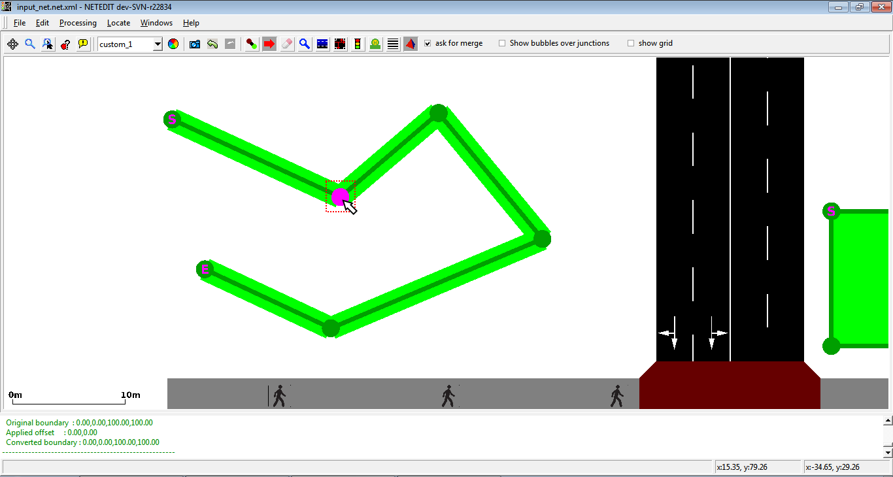   
Moving Polygon's shape point.

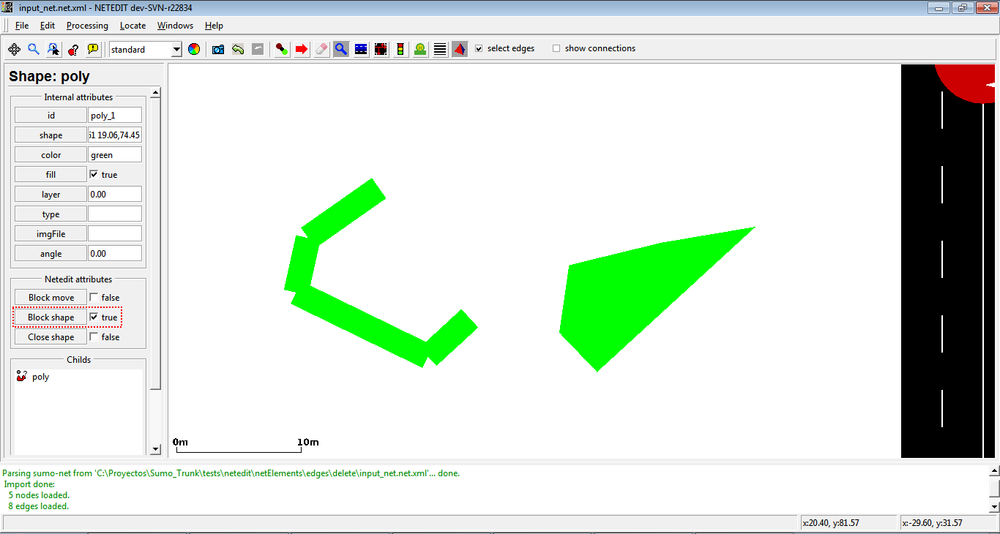   
Polygons with shape blocked.

Besides, the contextual menu offers several options, like the aforementioned open or close shape, simplify the shape, erase a vertex of the shape and establish a vertex of the shape as the initial one.

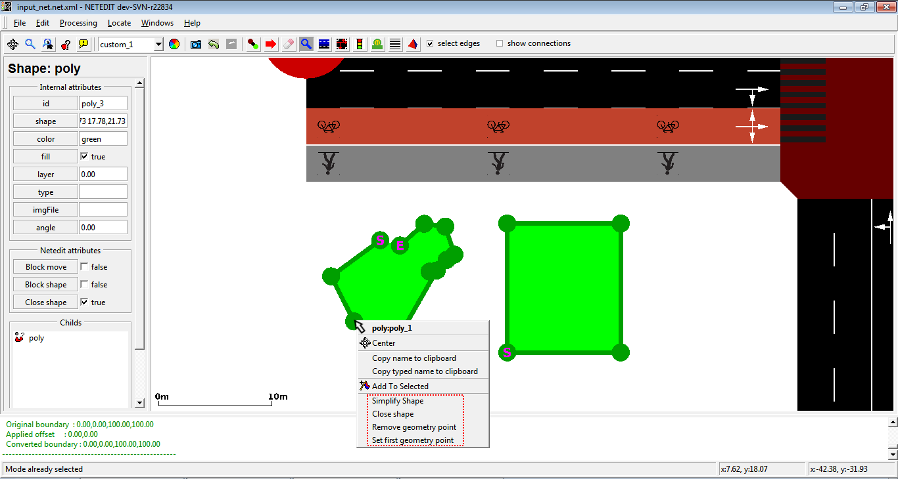   
Contextual menu of polygon. Left click over to show more options.

The Points Of Interest (POIs) are the locations in the map used to mark several elements relevant to the simulation, which don’t interact with the rest of elements (monuments, special buildings, etc.). As default, they are represented as a colored point, but can also be depicted using an image.

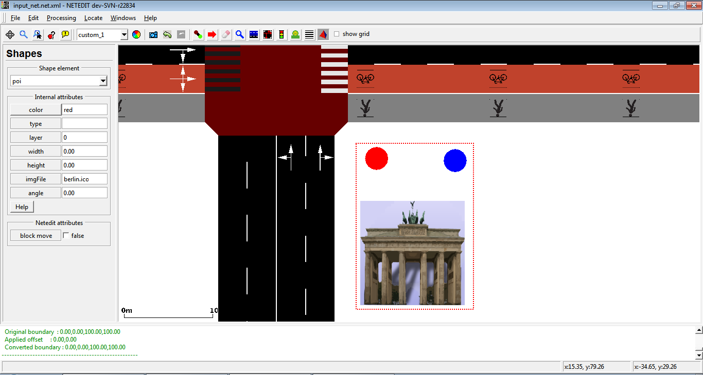   
Example of POIs with and without imgFile
