# netedit elements

This elements comprise the road network and can be created and modified
with **netedit**.

## Network Elements

### Junctions

[Junctions](../Networks/PlainXML.md#node_descriptions),
(also referred to as *Nodes*), represent intersections. A SUMO junction
is equivalent to a Vertex in graph theory.

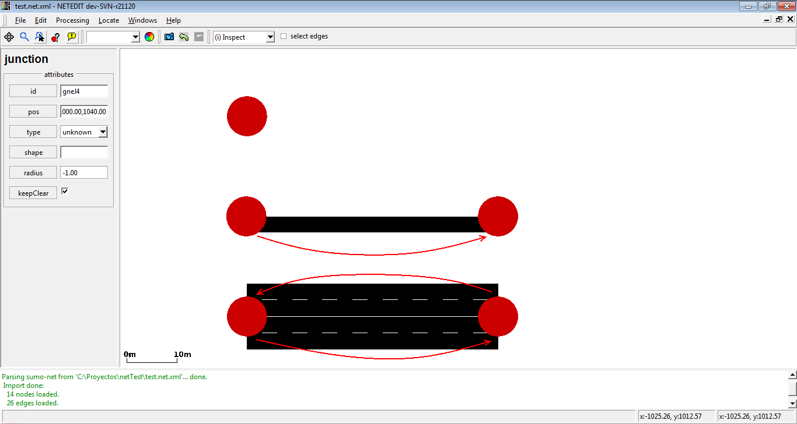   
Example of different junctions

### Edges

In the SUMO-context,
[edges](../Networks/PlainXML.md#edge_descriptions)
represent roads or streets. Note that edges are unidirectional. It's
equivalent to a edge in a graph theory.

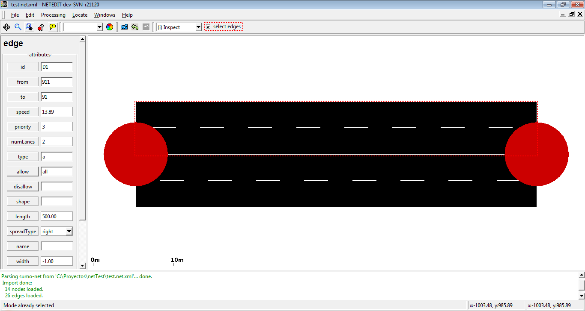   
Example of edge. Note that the box "select edge" is **checked**

### Lanes

Each SUMO edge is composed of a set of
[lanes](../Networks/PlainXML.md#lane-specific_definitions)
(At least one).

   
Example of lane. Note that the box "select edge" is **unchecked**

### Connections

[Connections](../Networks/PlainXML.md#connection_descriptions)
describe how incoming and outgoing edges of junctions are connected (for
example to prohibit left-turns at some junctions).

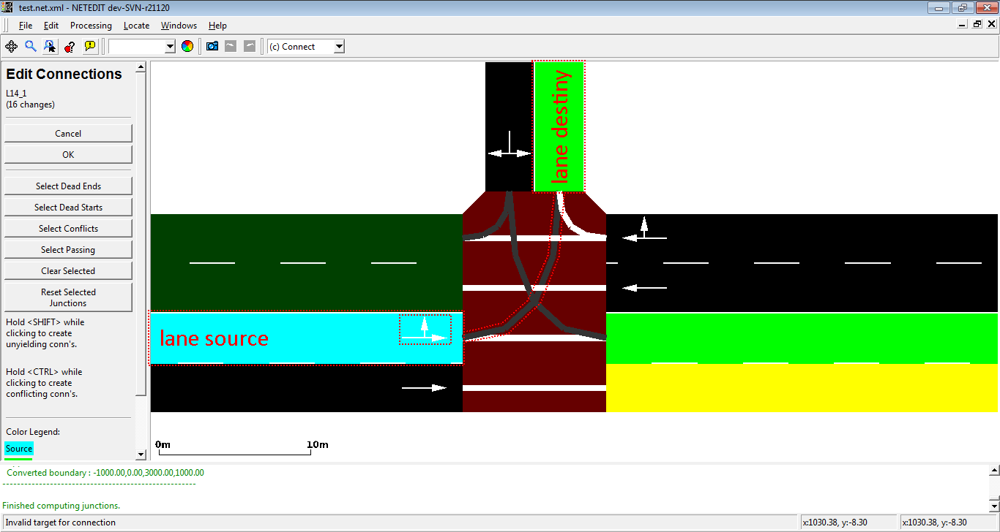   
Example of connection between a source lane and a target lane

### Traffic Lights

A [traffic light
program](../Networks/PlainXML.md#traffic_light_program_definition)
defines the phases of a traffic light.

   
Example of Traffic light

## Additional elements

*Additionals* are elements which do not belong to the network, but may
be used to influence the simulation or generate specific outputs.
Additionals are defined in an {{AdditionalFile}} and can be loaded in
**netedit**. Additionals are created in the
*Additionals* editing mode (shortcut key: a). Once this mode is
selected, the first step is to choose what kind of additional should be
created in the comboBox "additional element". Once selected and if
required, the parameters of the additional can be changed. Finally, with
a click over a Lane/junction/edge (If the additional should be set over
an element of the network), or over an empty area (if the item is
independent of the network) the additional will be created.

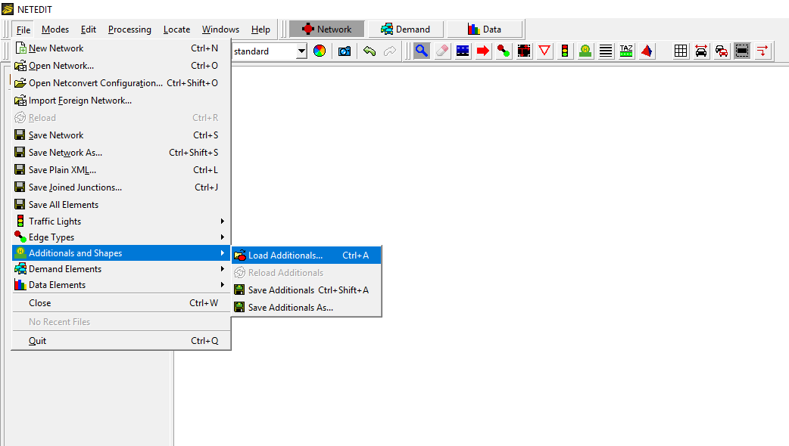   
Menu for loading additionals

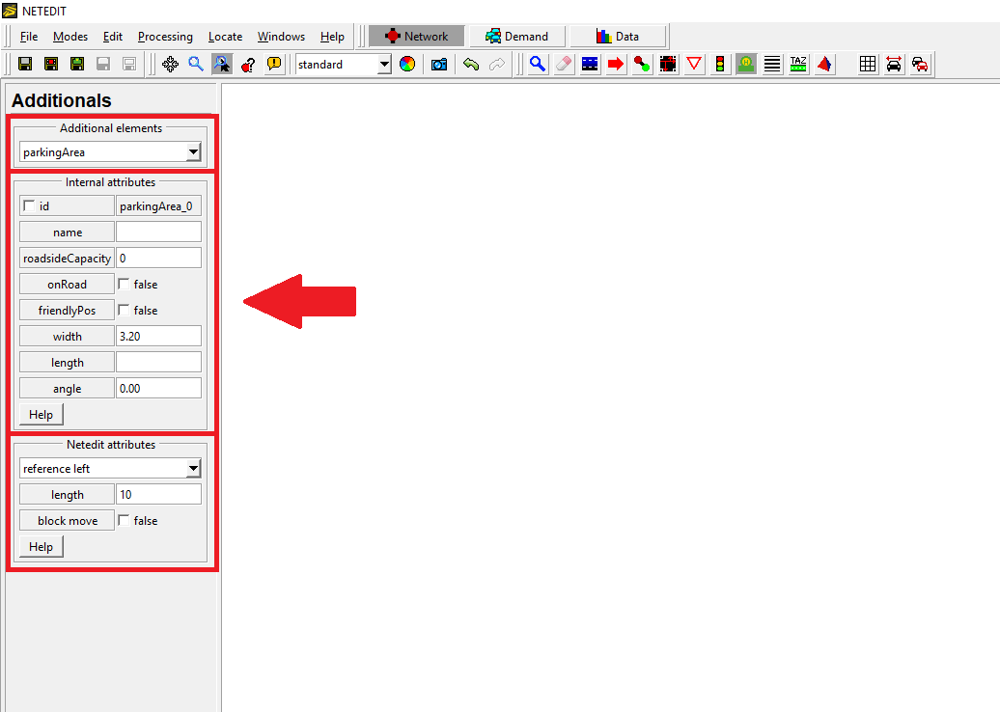   
Frame to insert additionals

### Move and references

Additionals can be moved, but the freedom of movement depends of their
relation with the network. Additionals that must be located over a lane
can only move along the lane, and additionals that are located on a map
can be moved in any direction. The movement also depends if the item is
locked or not (symbolized by a lock icon on the item). The movement can
be blocked during the creation of the element. The corresponding
parameter can be changed within the *inspector* mode. Certain
additionals have a length contingent to the length of the lane. To
create a bus stop by choosing a reference point, which marks the initial
position of this additional element, three types of references for the
length can be selected. E.g. for a bus stop with the length 20 in the
point 50 of the lane it will be the following:

- Reference left will create a new bus stop with startPos = 30 and
  endPos = 50.
- Reference right will create a new bus stop with startPos = 50 and
  endPos = 70.
- Reference center will create a new bus stop with startPos = 40 and
  endPos = 60.

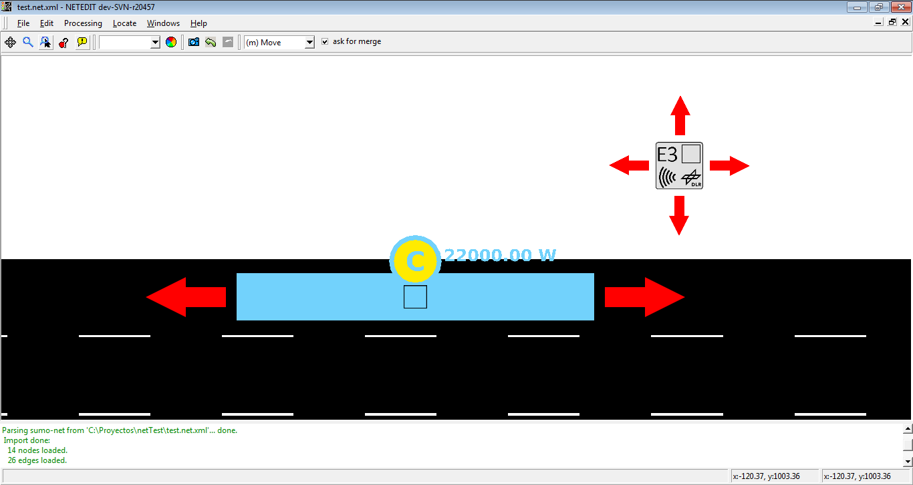   
Movement of different additionals

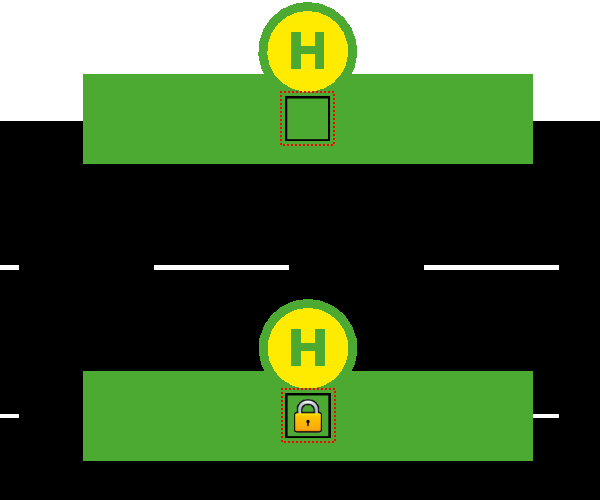   
Additional locked and unlocked

Some additional types cannot be moved, therefore show a different icon:

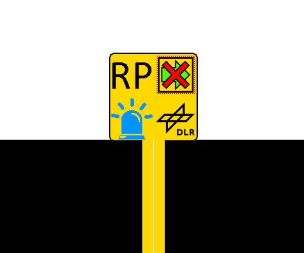   
Example of additional that cannot be moved

### Parameters

There are two types of parameters for each additional:
User-defined-parameters and **netedit**-parameters.
The first mentioned parameters can be of type *int*, *float*, *bool*
*string*, or *list* and each has a default value. In the case of type
*list* the user can add or remove values using the *add* or *remove*
*row* buttons. In the case of the characteristic parameters of
**netedit**, this is the option to block the movement
of an element, and in the case of the elements have a length, the user
is allowed to change the length and reference.

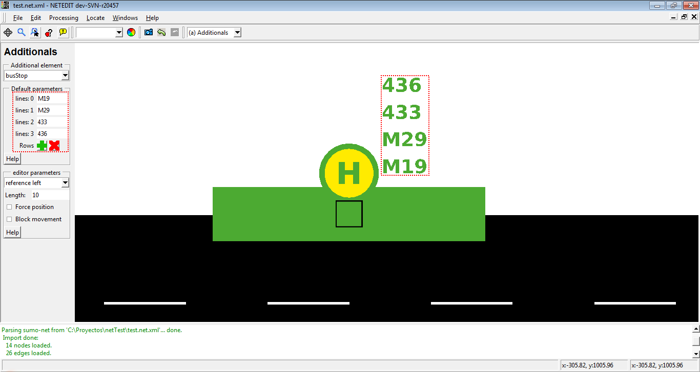   
Adding a list of bus stop lines

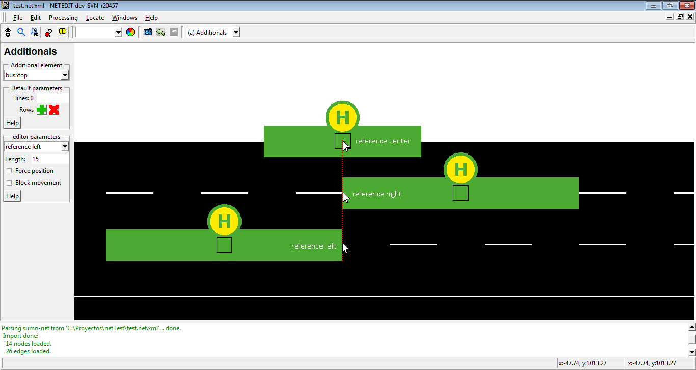   
Adding additional with different references

### Additional sets

Additional sets are additionals that comprise or contain another
additionals (called childs) (For example, *detectorE3* contains a list
of *detEntry* and *detExit*). Additional sets are inserted in the same
way as an Additional, but the insertion of an additional child is
different. Before the insertion of an additional child in the map, the
ID of the *additionalSet* parent must be selected in the list of IDs
placed on the left frame. In this list the IDs of the additional sets
only appear when they can be parents of the additional child (Referring
to the given example: if the user wants to insert a *detEntry*, than
only IDs of *detectorE3* will appear in the list on the left frame).
Additional sets and their childs are graphically connected by a yellow
line.

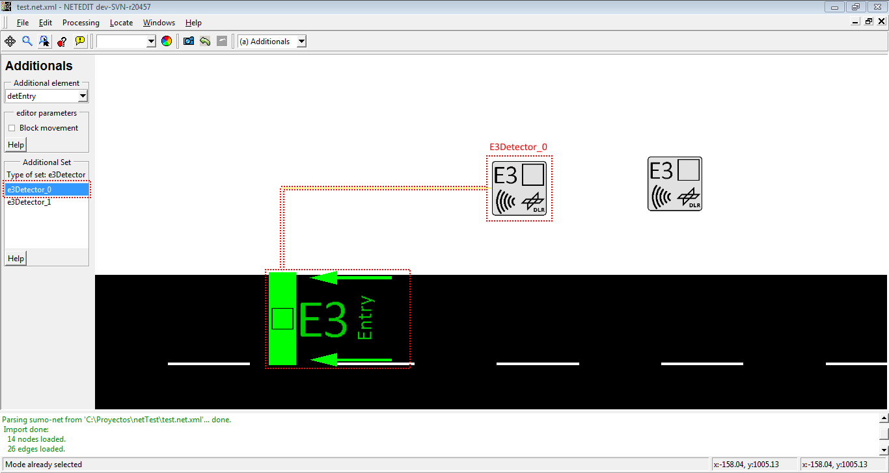   
Insertion of an additional Set

### Help dialogs

With the help buttons placed in the left frame, users can obtain
information about additional and editor parameters (Full name, type and
description).

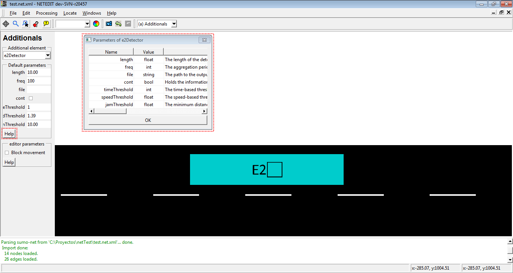   
Help window for parameters

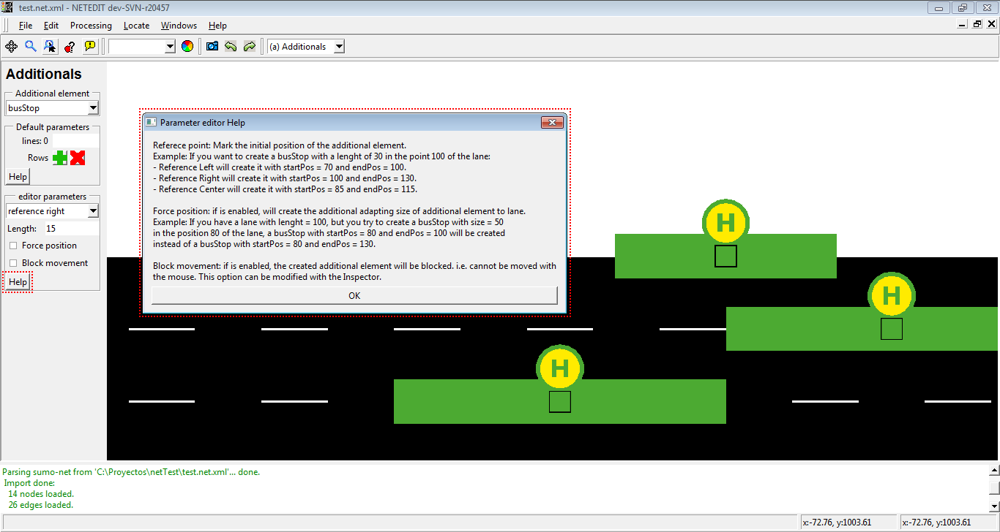   
Help window for editor parameter

### Additional types

This section describes the different types of additional objects which
are supported

#### Stopping Places

Stopping places are sections of lanes, in which vehicles can stop during
a certain time defined by the user.

##### Bus stop

[Bus stops](../Simulation/Public_Transport.md#bus_stops) are positions of a
lane in which vehicles ("busses") stop for a pre-given time. Every Bus
stop has an unique ID assigned automatically by
**netedit**, a length and a list of bus lines defined
by the user.

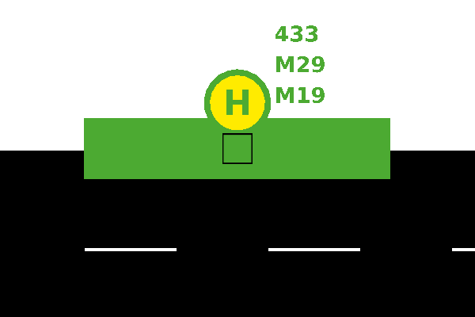   
Bus stop

##### Container stops

[Container stops](../Specification/Logistics.md#container_stops) are similar to
BusStops, but they are oriented towards [logistics
simulation](../Specification/Logistics.md).

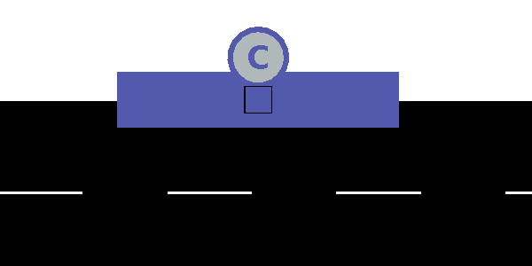   
Container stop

##### Charging station

[Charging stations](../Models/Electric.md#charging_stations) define
a surface over a lane in which the vehicles equipped with a battery are
charged. Charging stations own an unique-ID generated by
**netedit**, a length, a charging power defined in W,
a charging efficiency, a switch for enable or disable charge in transit,
and a charge delay.

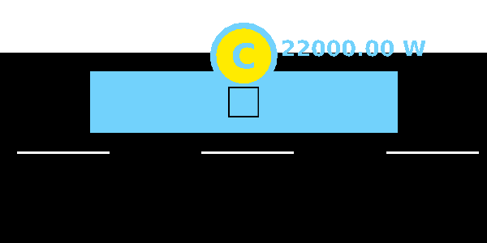   
Charging station

##### Parking Areas

!!! caution
    Incomplete.

##### Parking Spaces

!!! caution
    Incomplete.

#### Detectors

Detectors are additionals which save information about vehicles that
passed over a certain position on the lane.

##### Induction Loops Detectors (E1)

A [E1
detector](../Simulation/Output/Induction_Loops_Detectors_(E1).md)
owns a ID parameter generated by **netedit**, a
position at a certain lane, a *freq* attribute which describes the
period over which collected values shall be aggregated, a list of
*VTypes* that will be detected, and a *file* attribute which tells the
simulation to which file the detector shall write his results to.

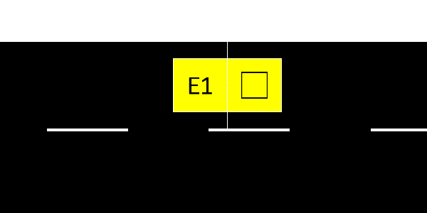   
Detector E1

##### Lane Area Detectors (E2)

Most of the [E2
detectors](../Simulation/Output/Lanearea_Detectors_(E2).md)'
attributes have the same meaning as for [E1 induction
loops](../Simulation/Output/Induction_Loops_Detectors_(E1).md),
including automatic ID and position at a certain lane. As a real
detector has a certain length, "length" must be supplied as a further
parameter. When placed in netedit, the detector will be extended by the given length in the upstream direction.

When selecting 'e2MultiLaneDetector', two or more sequential lanes must selected on which to place the detector.

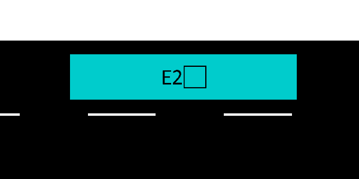   
Detector E2

##### Multi-Entry Multi-Exit Detectors (E3)

A [Detector
E3](../Simulation/Output/Multi-Entry-Exit_Detectors_(E3).md)
is an AdditionalSet with the same attributes as [Induction Loop Detector
E1](../Simulation/Output/Induction_Loops_Detectors_(E1).md). The
difference is that detectors E3 have as childs the Entry/Exit detectors.

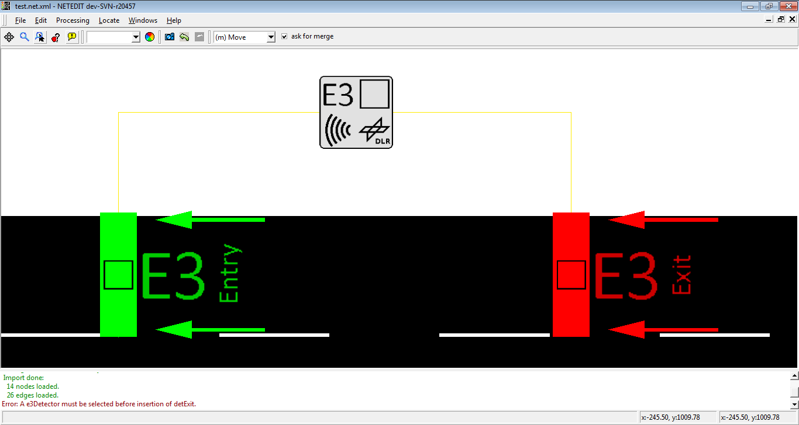   
Detector E3

##### DetEntry/DetExit

Childs of an AdditionalSet [Multi-Entry Multi-Exit Detectors
E3](../Simulation/Output/Multi-Entry-Exit_Detectors_(E3).md).
These additionals have only the attributes ID of a lane in which it is
placed and positioned over a lane.

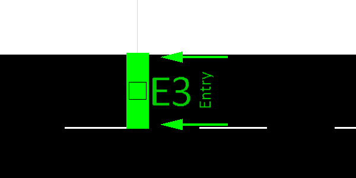   
Detector entry 

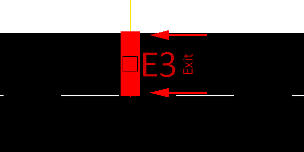   
Detector exit

##### Instant Induction Loops Detectors (E1Instant)

A [E1
detector](../Simulation/Output/Induction_Loops_Detectors_(E1).md)
owns a ID parameter generated by **netedit**, a
position at a certain lane, a *freq* attribute which describes the
period over which collected values shall be aggregated, a list of
*VTypes* that will be detected and a *file* attribute which tells the
simulation to which file the detector shall write his results to.

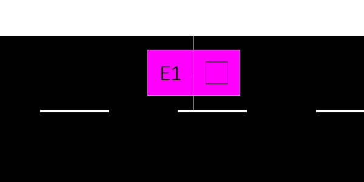   
Detector E1 Instant

#### Route Probe

[RouteProbe detectors](../Simulation/Output/RouteProbe.md) are
meant to determine the route distribution for all vehicles that passed
an edge in a given interval. Their real-world equivalent would be a
police stop with questionnaire or a look into the database of navigation
providers such as TomTom.

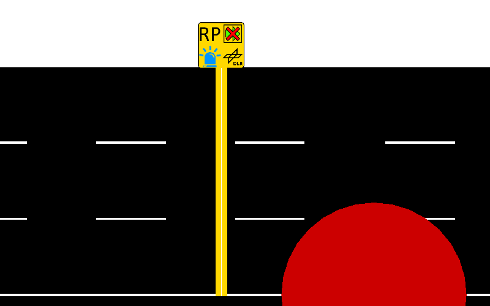   
Route Probe

#### Calibrator

A [calibrator](../Simulation/Calibrator.md) generates a flow of
vehicles during a certain time, and allows dynamic adaption of traffic
flows and speeds. A calibrator can be used to modify a simulation
scenario based on induction loop measurements. It will remove vehicles
in excess of the specified flow and will insert new vehicles if the
normal traffic demand of the simulation does not reach the specified
number of vehsPerHour. Furthermore, the defined edge speed will be
adjusted to the specified speed similar of the operation of a variable
speed sign. Calibrators will also remove vehicles if the traffic on
their lane is jammed beyond the specified flow and speed. This ensures
that invalid jams do not grow upstream past a calibrator. A double click
over the calibrator icon opens the values editor.

   
Calibrator 

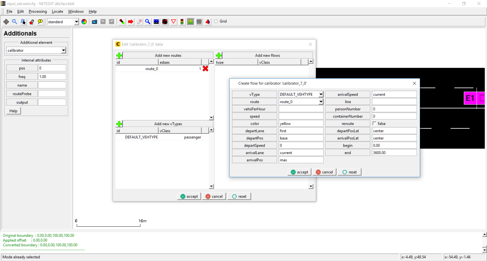   
Editing calibrator's values

#### Rerouter

A [rerouter](../Simulation/Rerouter.md) changes the route of a
vehicle as soon as the vehicle moves onto a specified edge.

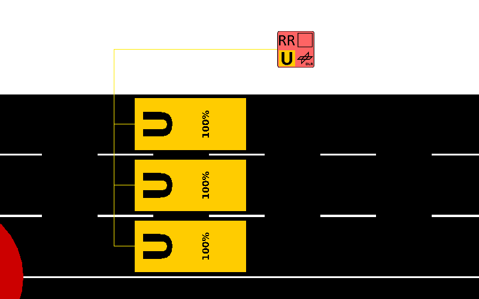   
Rerouter is placed off the net.

A double click over the rerouter icon opens the values editor.
Rerouter's values are divided in intervals, and every interval contains
a list of [closing
streets](../Simulation/Rerouter.md#closing_a_street), [closing
lanes](../Simulation/Rerouter.md#closing_a_lane), [assignations of
new
destinations](../Simulation/Rerouter.md#assigning_a_new_destination)
and [assignations of new
routes](../Simulation/Rerouter.md#assigning_a_new_route):

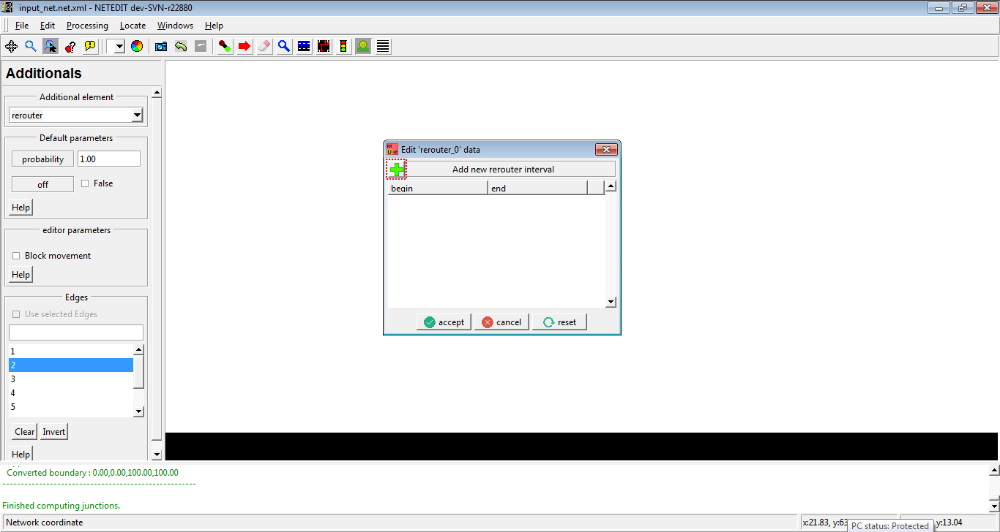   
Double click open rerouter dialog. One
click over '+' button open a dialog for adding a new interval.

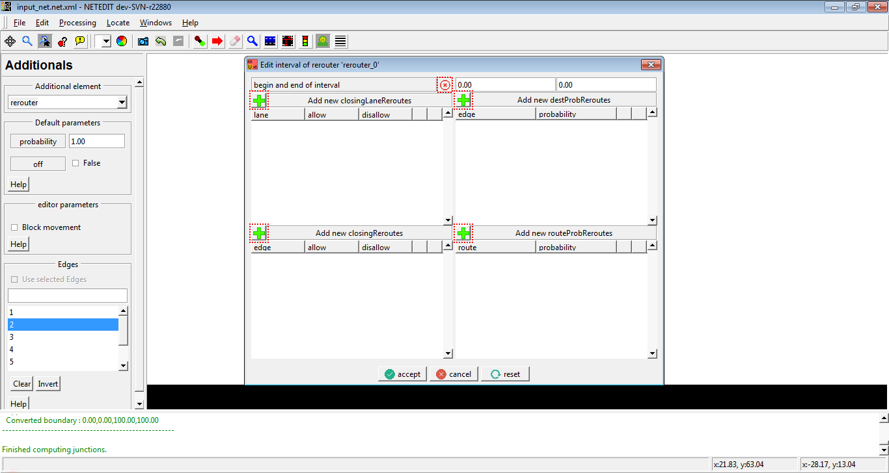   
In interval dialog can be specified the
four types of actions, as well as the begin and end of interval.

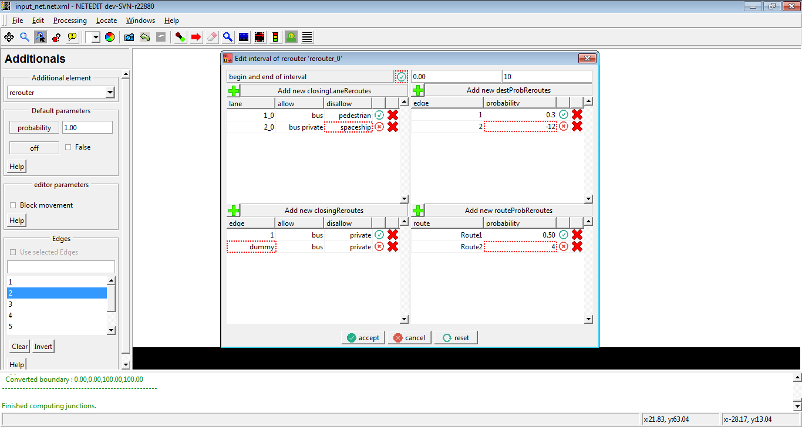   
If values of actions are invalid, a warning
icon appears in every row. This can be applicable in begin and end of
interval.

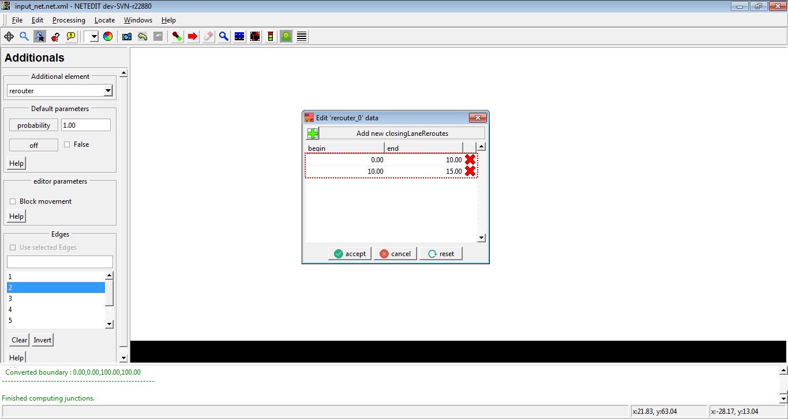   
A click over begin or end of
interval opens the Rerouter interval dialog. In the same way, a click
over "x" button removes the interval.

#### Vaporizer

[Vaporizers](../Simulation/Vaporizer.md) remove all vehicles as
soon as they move onto a specified edge.

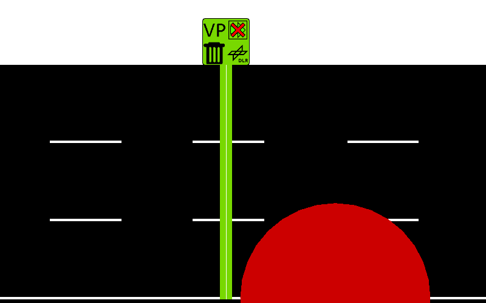   
Vaporizer placed over edge. Its placed always at the beginning of an edge.

!!! caution
    Vaporizers are deprecated

#### Variable Speed Signs

A [Variable Speed Signal](../Simulation/Variable_Speed_Signs.md)
modifies the speed of a set of lanes during a certain time defined by
user. A double click over the Variable Speed Signal icon opens the
values editor.

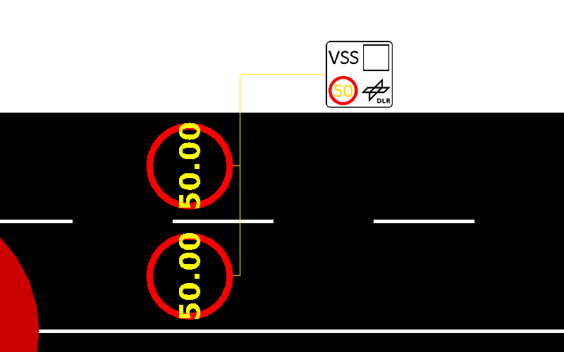   
Variable Speed Sign

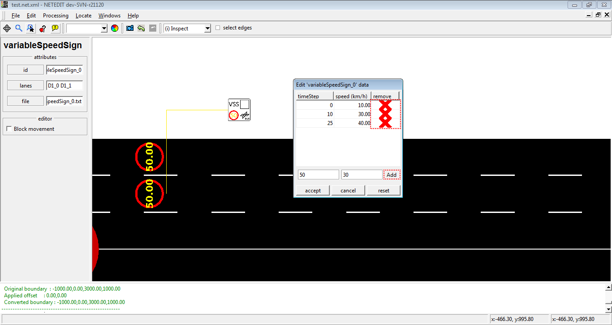   
Variable Speed Signal Sign

## Route elements

!!! missing
    Route elements aren't implemented yet
