# Demand elements

*Demand elements* are the elements that [netedit](index.md) uses to define vehicular demand for SUMO. All of this elements can be created, inspected and selected in supermode *Demand* (F3).

## Route

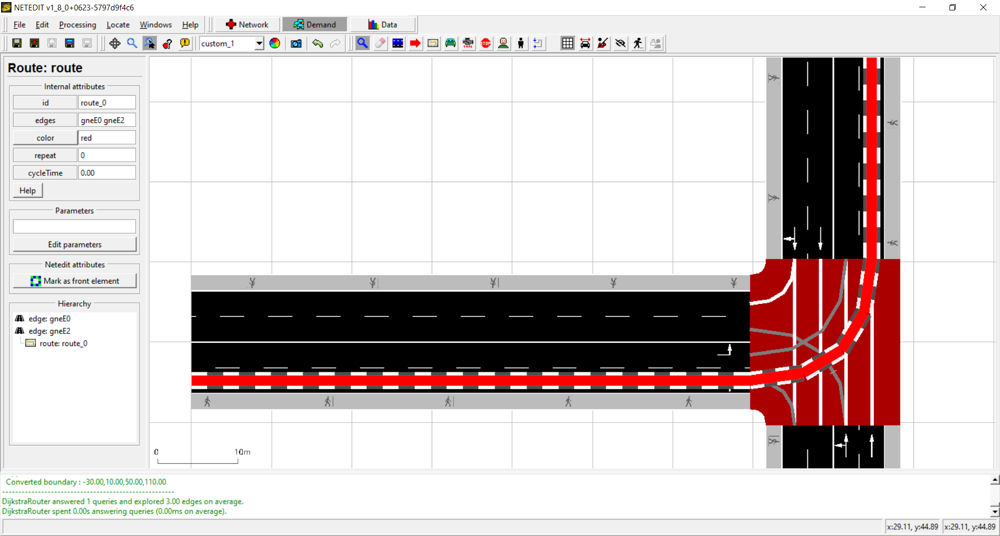

## Vehicles

Vehicles are the representation in NETEDIT of any mobile element that runs through a street (edge or lane) following a certain path.

### Trip

A trip is defined clicking over a start and a end edge. NETEDIT automatically calculate the shorted minimum path between clicked edges. If user defines a list of "via" edges, then the path is calculated using also the via edges. The path is drawn while trip is inspected.

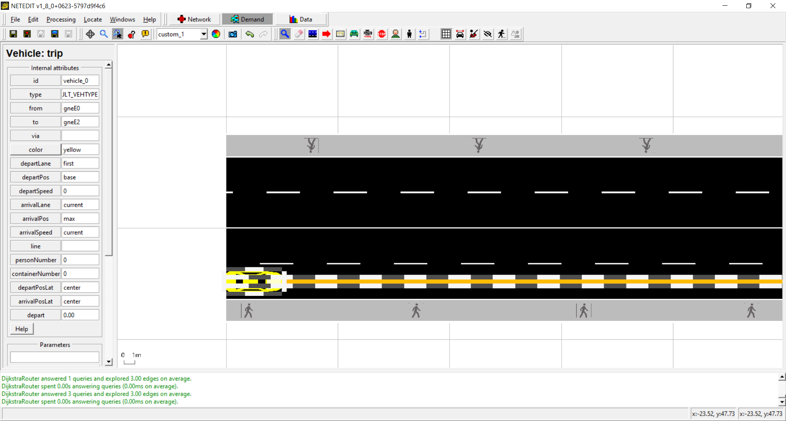

### Vehicle over route

A vehicle defined over a route follow the path defined by the give route. To create it, just click over the route.

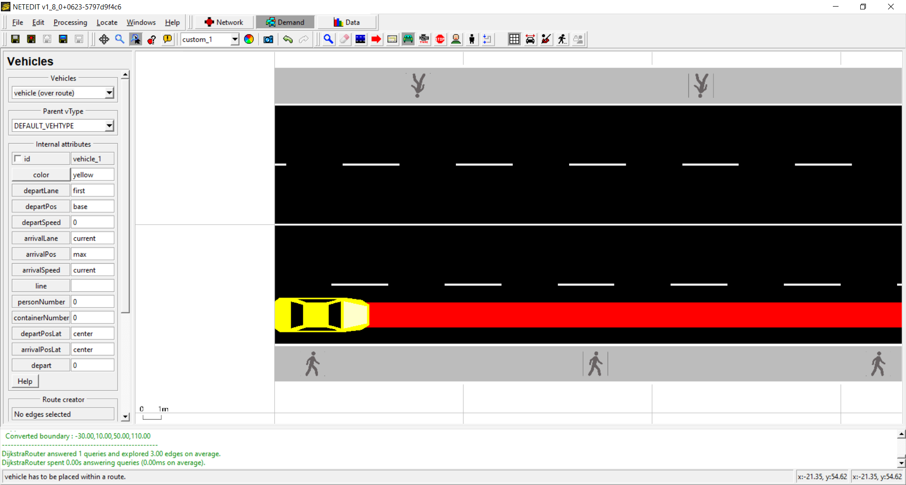

### Vehicle with embedded route

A vehicle with embedded route is defined clicking over a list of edges in the network. NETEDIT automatically calculate the shorted minimum path between clicked edges.

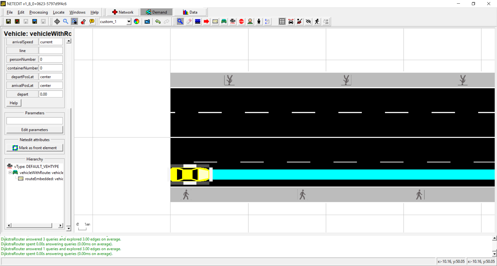

### Flow

A flow is defined clicking over a start and a end edge. NETEDIT automatically calculate the shorted minimum path between clicked edges. If user defines a list of "via" edges, then the path is calculated using also the via edges. The path is drawn while flow is inspected.

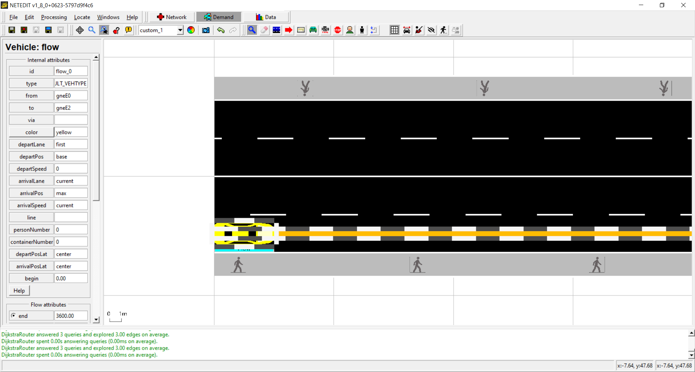

### Flow over route

A flow defined over a route follow the path defined by the give route.  To create it, just click over the route.

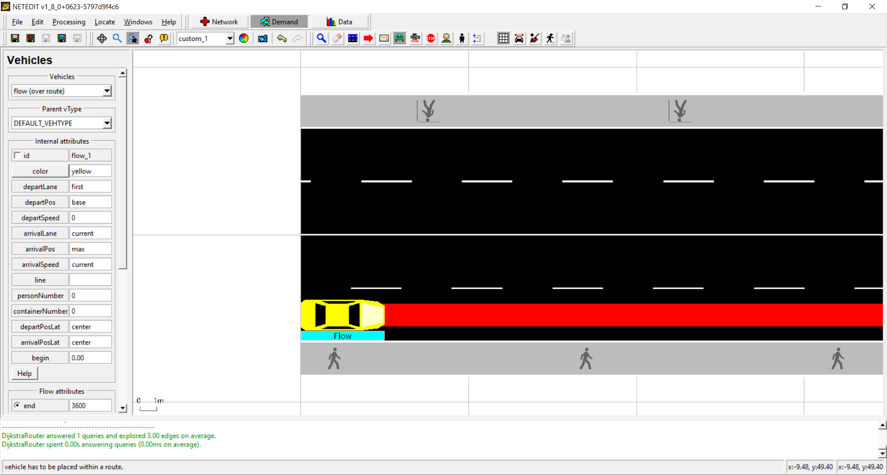

### Flow over embedded route

A flow with embedded route is defined clicking over a list of edges in the network. NETEDIT automatically calculate the shorted minimum path between clicked edges.

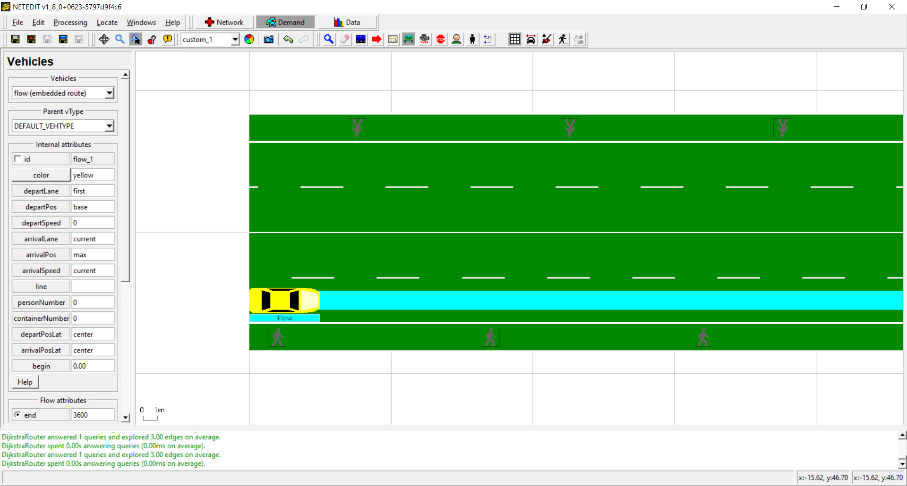

## Vehicle Types

A vehicle is defined using the Vehicle Type element as parent. There is two way to edit vehicles. The first one is the frame, in which can be created and edited their basic attributes, and the second one is the "Attribute editor", in which all attributes can be edited.

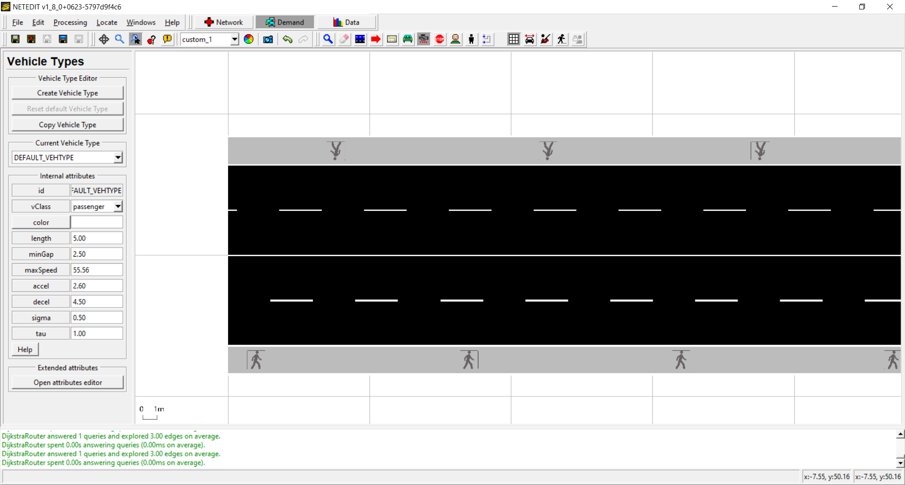

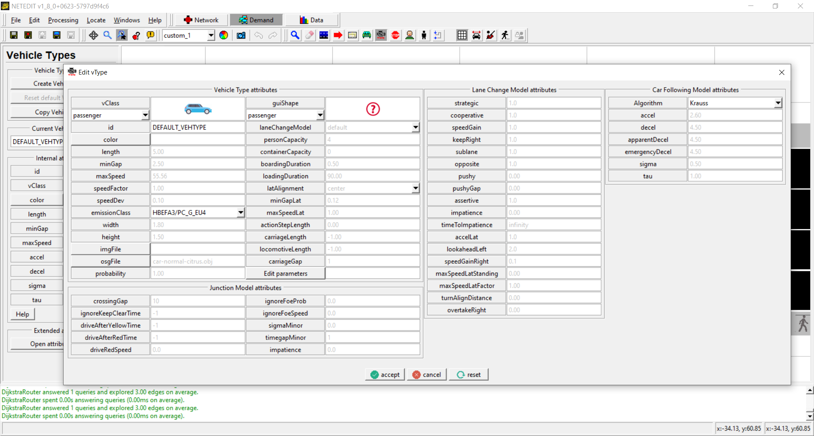

## Stops

A stop pauses the vehicle in a given position of the lane's stop. A Stop can be defined either over a Lane or over a Stopping Place (BusStop, ContainerStop, ChargingStation or Parking Area), and is always defined within a parent element (Either a Route or a vehicle)

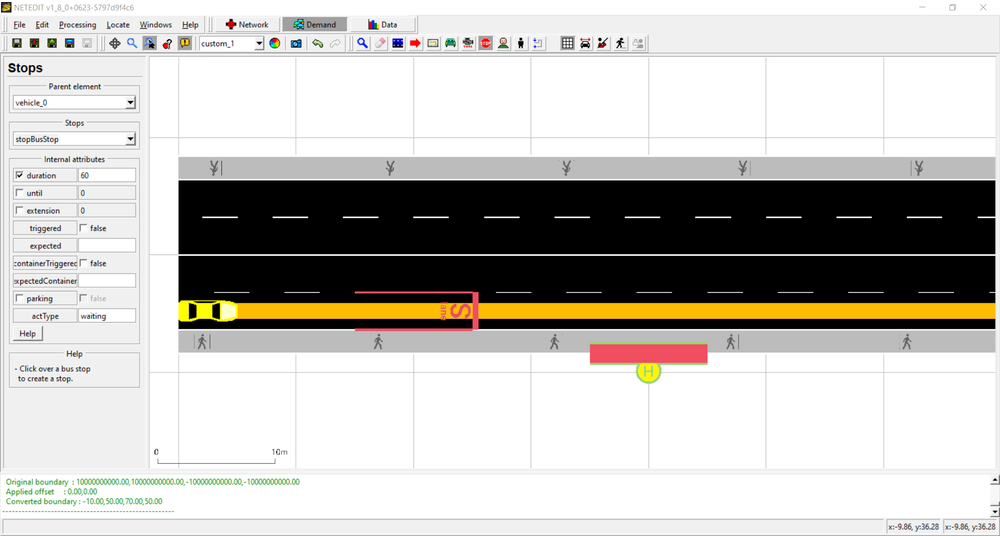

## Persons

Persons represent pedestrians in NETEDIT networks. All persons need a person plan, and this person plan can be either a Walk, a person trip, a ride or a stop. A  person plan can start or end from an edge or a busStop.

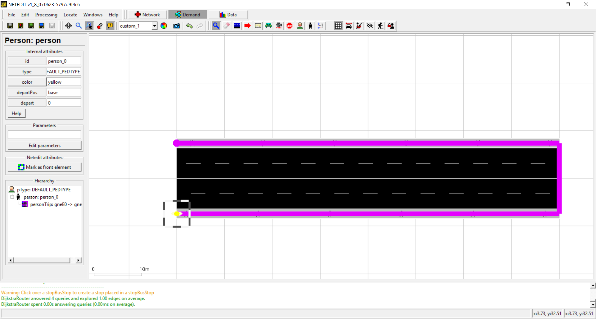

