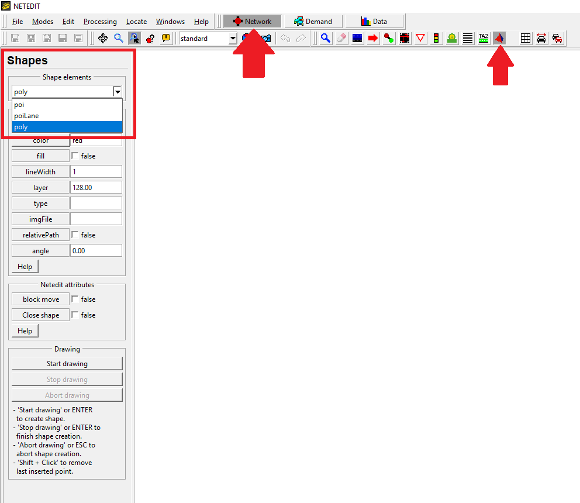
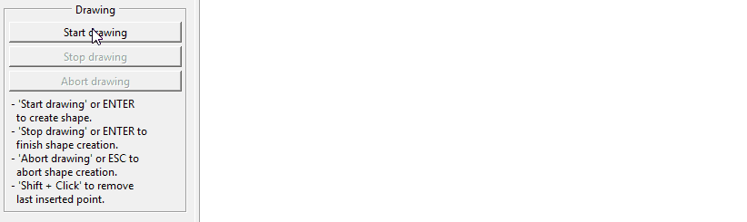

# Shape elements

There are three different types of shape elements: Polygons, POI's (Points-of-interest) and POI Lanes. Shapes can be inserted while in *Network supermode* (F2) and selecting *POI-Poly mode*  (P). Previously created shapes may also be imported, selecting `File` -> `Additionals and Shapes` -> `Load Additionals...` (or via the <kbd>Ctrl</kbd> + <kbd>A</kbd> Shortcut).

## Polygon

To create a polygon, select `poly` in the *Shape elements* drop-down list. Before drawing the polygon, you may change some of its attributes such as the **id**, **color**, select whether you want a **filled** polygon or just the contour, among many other options. Note that some attributes can be modified later, in *Inspect mode* .

To start drawing the polygon, click on `Start drawing` or press <kbd>ENTER</kbd>. To finish the shape creation, either click on `Stop drawing` or press <kbd>ENTER</kbd>.

<kbd>SHIFT</kbd> + <kbd>click</kbd> (anywhere) removes the last inserted point, and selecting `Abort drawing` or simply pressing <kbd>ESC</kbd> aborts the shape creation.

## POI

## POI Lane
