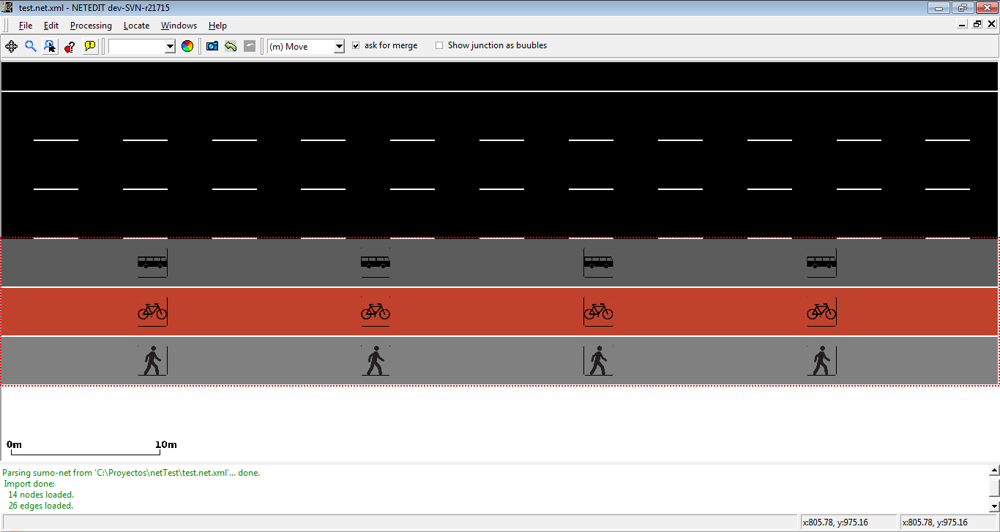
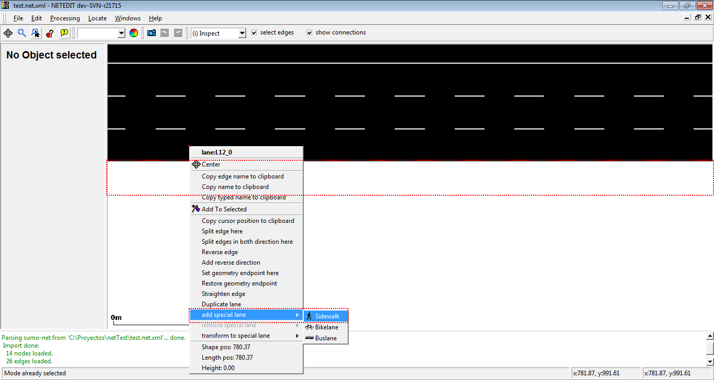
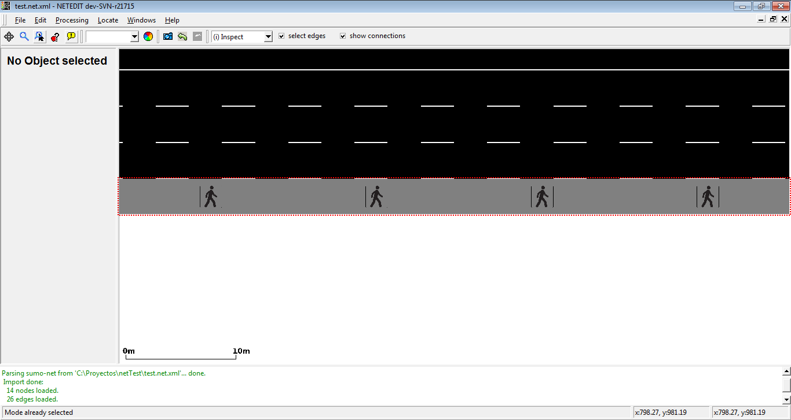
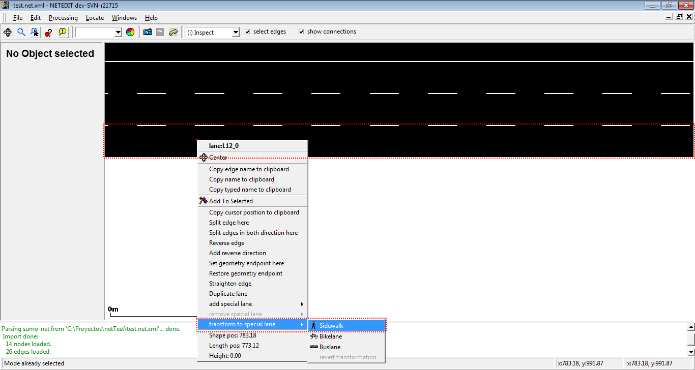
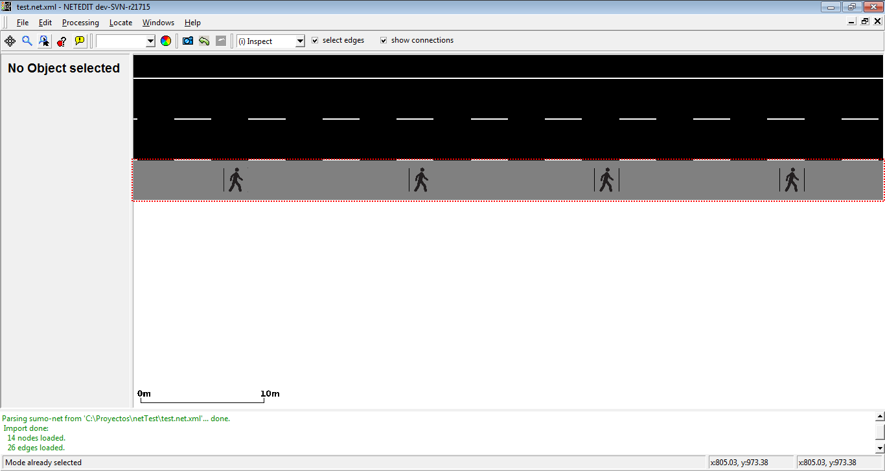
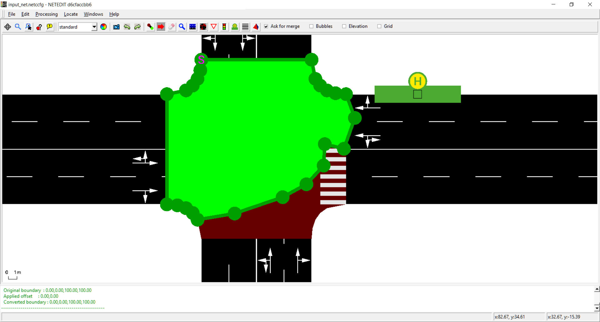
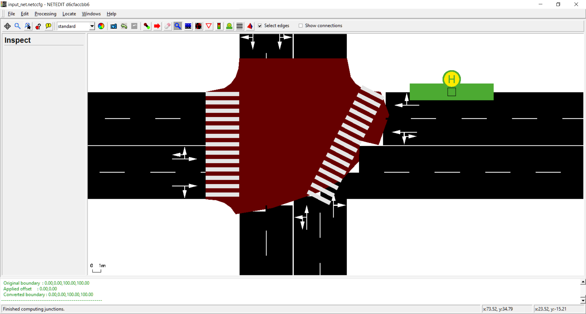
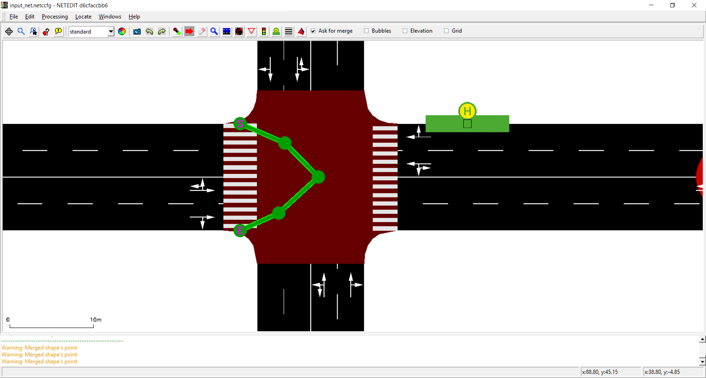
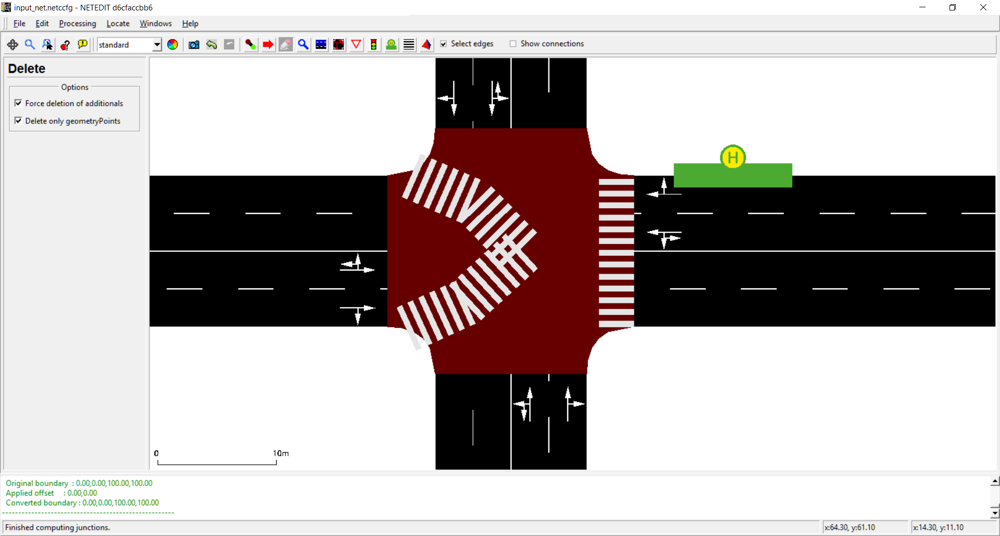

# Popup-Menu Functions

!!! missing
    Not all menu options have been documented yet

## Edge and Lane

### Split edge here

Split an edge into two different edges connected with a junction.

!!! note
    Can also be accomplished by ALT+SHIFT+LCLICK in [create edge mode](editModesNetwork.md#create_edges)

   
Edge is splitted in the mouse cursor position

   
New edges are connected by a new junction

### Split edge in both directions here

Is similar to *Split edge here*, but generate splitted edges in both directions.

!!! note
    Can also be accomplished by SHIFT+LCLICK in [create edge mode](editModesNetwork.md#create_edges)

### Reverse edge

Reverse the direction of an edge. If the ID of the start and end junctions of edge are respectively A and B, after this operation start and end junction will be B and A.

### Add reverse direction

If it doesn't exist, add a reverse edge between two junctions of the clicked edge that has the same (reversed) geometry as the original

   
In this case, a direction from right to left will be created

   
New edge is parallel to their reverse edge

### Add reverse disconnected direction

Similar to *Add reverse direction* but the new edge will have new junctions and will run in parallel to the original edge with an offset of twice the edge width.

### Restore geometry endpoints

Resets customized endpoints to their default (the respective junction position an either end)

### Set geometry endpoint here

Create an geometry end point. It's useful to mark the start and the end of an road

   
Geometry endpoint will be created in the mouse cursor position 

   
There isn't an visual connection between end point and their end junction

- *Restore geometry endpoint*: Restore a geometry endpoint to a normal edge
- *Straighten edge*: Allow to restore the visual shape of an edge

   
With the operation move visual shape of an edge can be modified

   
Straighten edge restore the original shape of an edge

### Reset edge length

Sets the edge length to it's computed value (based on geometry) instead of a custom length.

### Straigthen edge

Removes all geometry points of the edge, thereby making it straight

### Smooth edge

Adds interpolated geometry points between existing geometry points to create a smoothly curved shape.

!!! note
    The density of points is controlled by option **--opendrive.curve-resolution** (default 2) but this may change in a future version

### Straighten elevation of edge

Sets elevation along the geometry of the edge to a straight interpolation of the elevation between from-junction and to-junction.

### Smooth elevation of edge

Increases geometry point density (similar to [Smooth edge](#smooth_edge)) and sets elevation along the new geometry to a smooth interpolation along the prior elevation points. Keeps x,y geometry unchanged (though at increased point density).

### Duplicate lane

duplicate a lane of an edge

### Restricted lanes

Restricted lanes for particulars vehicle class (VClass) can be easily added in inspect mode. Currently netedit supports sidewalks (where only vehicles with *VClass="pedestrian"* are allowed), bike lanes (where only vehicles with *VClass="bike"* are allowed), and bus lanes (where only vehicle with *VClass="bus"* are allowed). Note that only one type of restricted lane is allowed in every edge (For example, an edge can own two restricted lane, one for buses and another for bikes, but not two or more different restricted lanes for buses.

   
Example of edge with three restricted lanes

There are two ways to add a restricted lane, either transforming a existent lane or adding a new restricted lane

   
Adding a sidewalk using "add restricted lane"

   
Sidewalk added

   
Adding a sidewalk using "transform to special lane"

   
Lane transformed to a sidewalk

A restricted lane can be transformed in a normal lane with the option *revert transformation*, or can be removed with the option *Remove restricted lane*

## Junction
- *Split Junction*: Undo a prior join (i.e. one that was computed with option **--junctions.join**)
- *Set custom shape*: Allows drawing a custom junction shape via a [Modifiable Poly](#modifiable_poly) (see below). The junction shape determines where the incoming edges end and the outgoing edges start. If the automatic generation of shapes does not give a satisfying result it often helps to draw a custom shape instead. The shape is a polygon defined by a sequence of (x,y,z) geometry points.

   
Editing junction shape

   
Junction after editing shape

## Connection

- *Set custom shape*: Allows drawing a custom connection shape via a [Modifiable Poly](#modifiable_poly) (see below). The shape is confirmed with *<Enter\>*.

## Crossing

- *Set custom shape*: Allows drawing a custom crossing shape via a [Modifiable Poly](#modifiable_poly) (see below). The shape is confirmed with *<Enter\>*.

   
Editing crossing shape

   
Crossing after editing their shape

## Modifiable Poly

- *Set custom shape*: Apply this shape to the current junction
- *Discard custom shape*: Abort editing the current junction shape
- *Simplify shape*: Replace the current shape by a rectangle
- *Remove geometry point*: Remove the closest geometry point from the shape
- The new shape is confirmed with the *<Enter\>* key and discarded with *<Esc\>*.

The green polygon outline allows adding and moving geometry points by left-clicking anywhere on the outline and dragging. Shift-clicking a geometry point deletes it.

## Additionals

- *inner/lane position*: Additionals that are placed over an edge or lane haven two different mouse position. Inner position is the
  position of the mouse with respect to the length of the additional, and lane position if the position of the mouse with respect to the length of lane

   
Position's parameter of Charging Station

- *Position in view and number of childs*: shows the number of childs that own an Additionals, and their position in view

   
Position and childs of a E3 Detector

- *show parameters*: show all parameters of additional.

   
Showing of parameters of charging Stations

## Route
- *Apply distance along route*: Sets the 'distance' attribute of all edges along the route for linear referencing. The distance attribute value of the first edge in the route is take as the start and the remaining edges are assigned a distance value that is counting upwards along the route. If the distance value should decrease along the route, the first edge must have a negative distance value.
