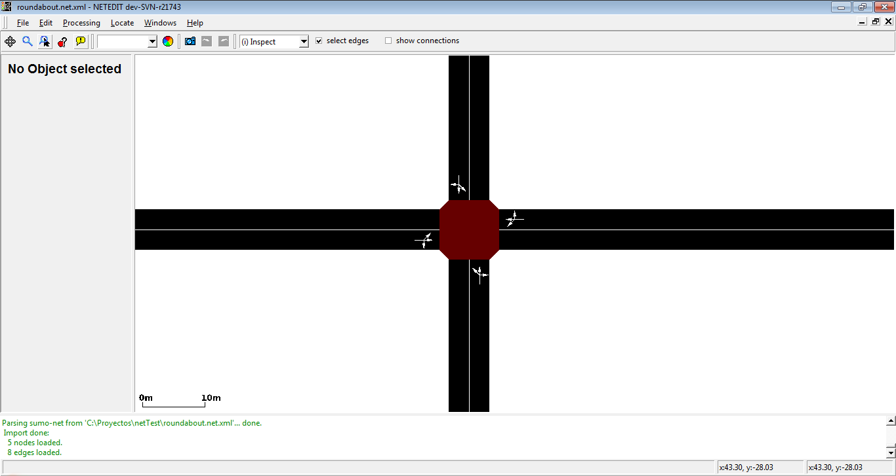
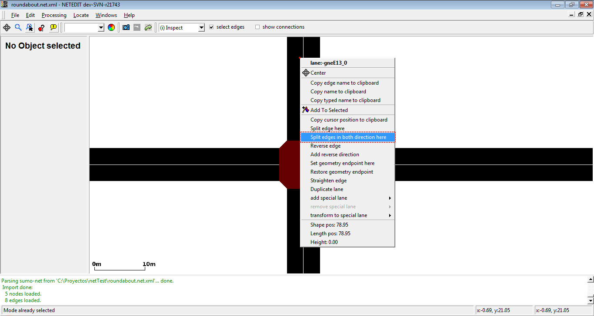
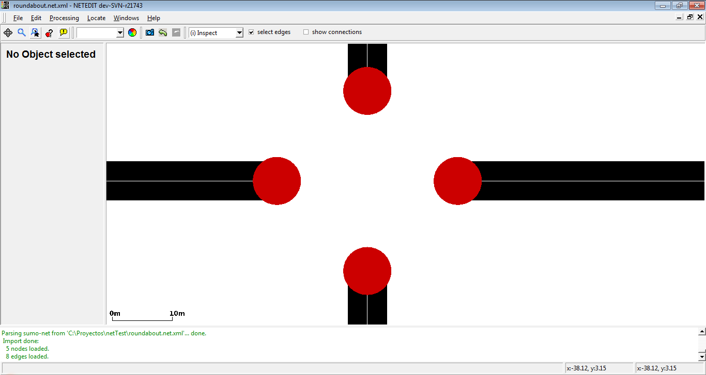
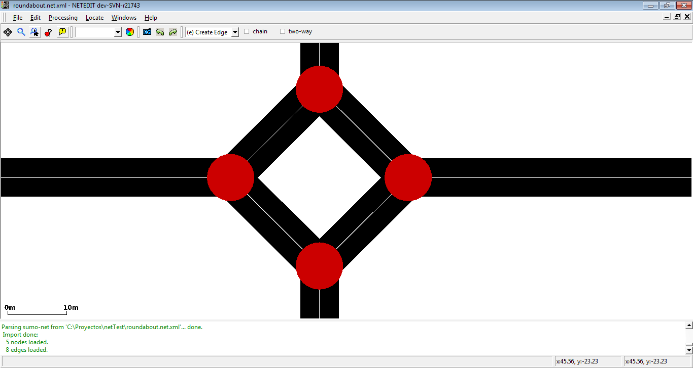
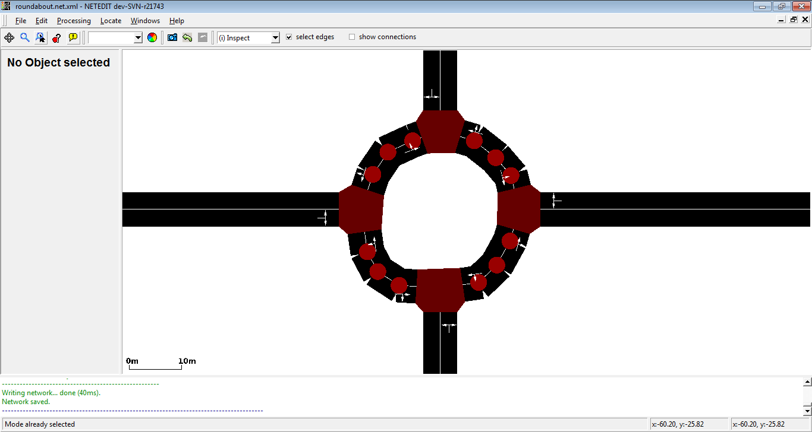
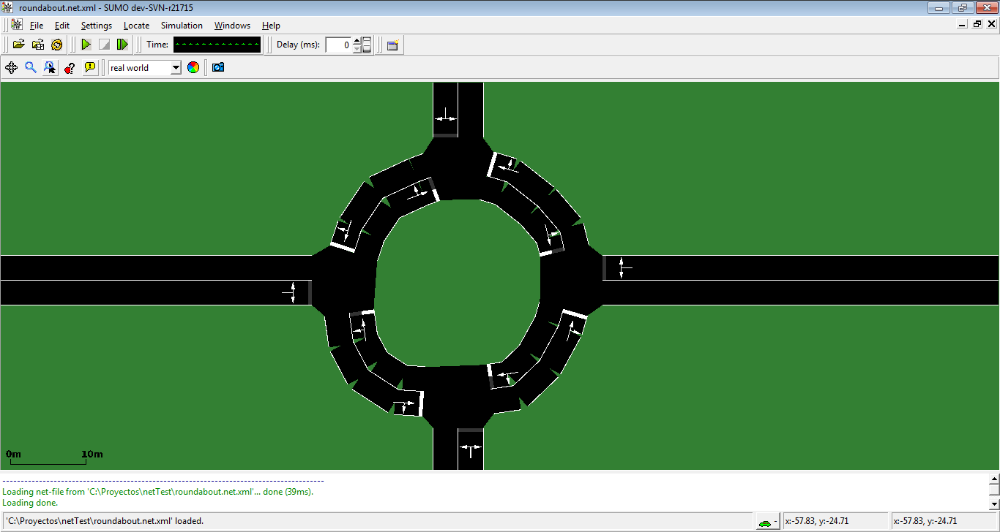
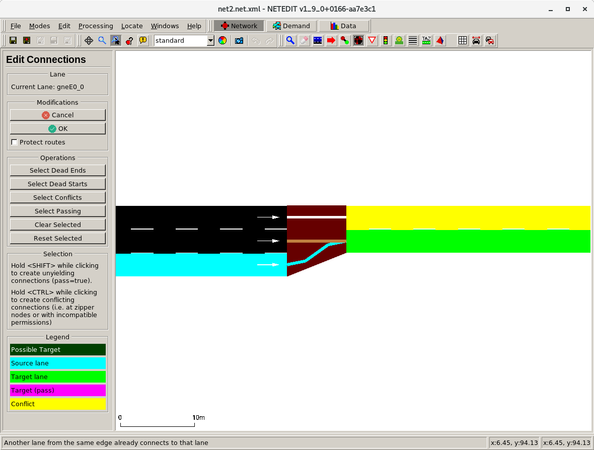

# Usage Examples

## Reducing the extent of the network

1.  switch to [selection mode](editModesCommon.md#select)
2.  enable the *auto-select junctions* checkbox in the top menu bar (enabled by default since version 1.9.0)
3.  select the portion of the network you wish to keep (i.e. by holding *<SHIFT\>* and performing a rectangle-selection)
4.  press the *Reduce* button

!!! caution
    If the checkbox *auto-select junctions* is not set, and connections are not visible during the rectangle selection, all connections will be removed during the *invert+delete* steps.

### Adapting additional objects to a reduced network

Either

- load the additional file when cutting and then save the reduced additional file or
- open the reduced network and load the original additional file. All objects outside the reduced network will be discarded with a warning.

## Making curved roads

1. switch to [selection mode](editModesCommon.md#select)
2. click on both directional edges once to select them
3. switch to [move mode](editModesCommon.md#move)
4. click and drag to add / change geometry points (affecting both edges at the same time)
5. (optionally) [smooth both edges](neteditPopupFunctions.md#smooth_edge) at the same time

## Specifying the complete geometry of an edge including endpoints

By default, the geometry of an edge starts with the position of the source junction and ends at the position of the destination junction. However, this sometimes leads to undesired junction shapes when dealing with roads that have a large green median strip or when modeling edges that meet at a sharp angle such as highway ramps. Also, when edges in opposite directions have unequal number of lanes (i.e. due to added left-turn lanes) and the road shapes do not line up. The solution is to define an edge geometry with custom endpoints. Below are three alternative methods of accomplishing this.

### Using 'Set geometry endpoint'

1.  switch to [move mode](editModesCommon.md#move)
2.  shift-click near the start or the end of the edge to create/remove a custom geometry endpoint (marked with 'S' at the start and 'E' and the end).
3.  once create these special geometry points can be moved around like normal geometry points

!!! caution
    When right-clicking the geometry point the click must be within the edge shape for this too work.

Afterwards, you will have to recompute the junction shape to see how it looks (F5). If you want to modify the edge and its reverse edge at once this works almost the same way:

1.  switch to [select mode](editModesCommon.md#select)
2.  select both edges
3.  switch to [move mode](editModesCommon.md#move)
4.  create/move geometry points for that edge
5.  create new geometry points where the endpoints of the edge should be
6.  switch to [select mode](editModesCommon.md#select)
7.  deselect both edges
8.  right-click on the new endpoints and select Set geometry endpoint here twice (once for each edge)

### Entering the Position manually

1.  switch to [inspect mode](editModesCommon.md#inspect)
2.  click on the edge that shall be modified
3.  enter new values for attributes *shapeStart* or *shapeEnd*

### Using 'Join Selected Junctions'

1.  create new junctions where the endpoints of the edge should be
  - Either split an existing edge (right-click and select *Split edge here*)
  - Or [create a new edge with new junctions in create-edge mode](editModesNetwork.md#create_edges)
2.  switch to [select mode](editModesCommon.md#select)
3.  select the original junction and the new junction near it
4.  Menu *Processing -> Join Selected Junctions* (<kbd>F7</kbd>)

This will create a single joined junction but keep the endpoints at the original junction positions.

### Restoring edge geometry to its default state

The reverse operation to *Setting a custom geometry endpoint* as explained above is *Restoring the geometry endpoint* and it may be accomplished in any of the following ways:

- delete the edge attributes `shapeStart` and `shapeEnd`
- right-click on an edge and from the *edge operations* menu select *Restore geometry endpoint* (this only restores the end near the click)
- right-click on an edge and select *Reset edge endpoints*
- In move-mode, shift-click on a custom endpoint (a geometry point marked with `S` or `E`)

## Setting connection attributes

1.  after opening the network press F5 to compute connection objects
2.  in inspect-mode enable the *Show Connections* checkbox in the menu bar
3.  click on a connection to inspect it and edit its attributes

## Converting an intersection into a roundabout

1. set junction attribute 'radius' to the desired roundabout radius
2. right-click on junction and select 'Convert to roundabout'

## Converting a roundabout into a simple intersection

1. select all junctions that are part of the roundabout
2. join selected junctions (<kbd>F7</kbd>)
3. select all edges that connected to the joined intersection
4. right-click selection and select 'edge operations'->'restore geometry endpoints'

## Converting an intersection into a roundabout (old manual method)

1.  For each of the 'legs' of the intersection do a right click and select 'split edges in both directions' at some distance from the
    intersection (this will be the radius of the roundabout)
2.  Delete the central intersection
3.  Connect the new intersections with one-way roads going in a circle
4.  Tweak the geometry of the roundabout by creating additional geometry points in [move mode](editModesCommon.md#move) to make it more rounded.
    You can also use the function 'smooth edge' from the edge context menu.
5.  Check for correct right of way (the inside edge should have priority over the entering edges). This should work by default but may fail if the shape of the roundabout is not 'round' enough. Either correct the geometry or assign a higher priority value to the roundabout roads (compared to the adjoining roads)

Assuming you have a regular intersection

- **Visual example**

We have a intersection (Junction) with four edges.
Split edges in both direction in every edge to create new junctions.

Intersection with the new junctions.
Remove central Junction.

Connect new junctions circularly.
Move shape of new edges to obtain a circular shape.

Roundabout in Simulator.

## Correcting [road access permissions](../Simulation/VehiclePermissions.md)

In this example we wish to modify a multi-modal road network (i.e. imported from [OpenStreetMap](../Networks/Import/OpenStreetMap.md)) in the following way: **All dedicated bus lanes should allow bicycle access**.

1.  in *select-mode*, use the Match Attribute panel to select all **Lanes** with attribute **allow** that match the string **=bus** (the '=' forces exact matches). All dedicated bus lanes are now selected
2.  in *inspect-mode*, click on one of the selected lanes and modify the allow attribute from *bus* to *bus bicycle*

## Changing all traffic lights to *right_on_red*

1.  in *select-mode*, use the Match Attribute panel to select all **Junctions** with attribute **type** that match the string **traffic_light**
2.  in *inspect-mode*, click on one of the selected junctions and set the type attribute to *right_on_red*

## Creating joined traffic lights

1. make sure all junctions that shall be jointly controlled are of type *traffic_light*
2. (optionally) select all of the above junctions
3. use inspect mode to set the same value for the 'tl' attribute of all junctions that shall be jointly controlled (if the junctions are selected, you can set the 'tl' value for all of them at the same time, otherwise you must set the value individually)

## Adapting Visualization Settings to help editing complicated intersections

Editing complex intersection clusters with many short edges can be difficult with the default visualization settings. The following
settings may help

- Junction settings
  - lower value for *exaggerate by* (junction shapes drawn with reduced size)
  - deactivate *draw junction shapes* (alternatively to reduced size, do not draw junction shapes at all)
  - color *by selection*
- Streets
  - lower value for *exaggerate by* (draw thin edges)
  - deactivate *show right of way rules* (to avoid hiding short edges)
  - color *by selection*

When setting coloring to *by selection* it may also help to modify transparency for selected or unselected edges.

## Defining a linear referencing scheme [(kilometrage / mileage/ chainage)](../Simulation/Railways.md#kilometrage_mileage_chainage)

1. [Define a route](editModesDemand.md#route_mode) through your network along which you want to define kilometrage (in forward direction)
2. (optional) Use inspect mode to et the initial distance value of the first edge of the route (default 0)
3) Right click the route element (in demand mode) and select 'Apply distance along route'

## Creating [bidirectional railway tracks](../Simulation/Railways.md)

### Make an existing track bidirectional

Using [visualization options or attribute selection](../Simulation/Railways.md#working_with_bidirectional_tracks_in_netedit) you can check whether an existing railway track can be used in both
directions. To make a unidirectional track usable in both directions,

1.  set the edge attribute *spreadType* to the value *center* (in many cases this value is already set as it is the default value when
    importing tracks).
2.  right-click the edge and select *edge operations-\>add reverse direction for edge*

### Creating bidirectional tracks from scratch

1.  use [Create Edges](editModesNetwork.md#create_edges) to create an edge
2.  use [Inspect](editModesCommon.md#inspect) to set the edge attribute *allow* to *rail* (or a combination of one or more railway vehicle classes)
3.  set edge attribute *spreadType* to *center*
4.  set the new edge as [Edge template](editModesCommon.md#edge_template)
5.  make the edge bidirectional as explained above in [Make an existing track bidirectional](#make_an_existing_track_bidirectional)
6.  in [Create Edges](editModesNetwork.md#create_edges), set the checkbox to *Two-way* and optionally to *Chain*
7.  continue to create edges - each click will create bidirectional track

## Define rail signals that only affect one track direction

If a piece of railway track is [modelled for train operations in both directions](#creating_bidirectional_railway_tracks), any rail signal defined on this *bidi*-track will affect both direction of travel by default.
To change this, the following steps have to be taken:

1. ensure that [edges for both directions of travel are visible](../Simulation/Railways.md#working_with_bidirectional_tracks_in_netedit)
2. [set connection attribute](#setting_connection_attributes) `uncontrolled=True` for the connection that shall not be controlled

## Creating a zipper merge

1. use inspect mode to set junction type to 'zipper'.
2. use connection mode to add 2 connections which enter the zipper junction with the same target lane. The second connection must be created with <kbd>Ctrl</kbd> + <kbd>click</kbd> to override conflict protection.
3. optionally: use inspect mode and enable 'show connections' (<kbd>Alt</kbd> + <kbd>5</kbd>). Click on the zipper connections (brown) and customize 'visibilityDistance' to set the range where vehicles start zipper merging.

## Simplify TLS program state after changing connections

After deleting connections at a junction of type traffic_light, the traffic light program will remain unchanged by default.
This stability implies that the length of the phase state may be longer than needed and the list of used can contain gaps (where the unused states are).
To clean up the states:

1. enter traffic light mode (<kbd>T</kbd>)
2. click on the junction
3. press the 'Clean States' button (this shortens the state and re-assigns indices to controlled connections)
4. save the program
5. recompute the network (<kbd>F5</kbd>) to see updated tls indices (when inspecting connections or drawing 'tls link index')

## Deleting all sidewalks

1. enter select mode (S)
2. in the [Match Attribute](editModesCommon.md#match_attribute) controls select:
  - Object type: Lane
  - Attribute: allow
  - Value: "=pedestrian"
3. press the <kbd>del</kbd> key

## Duplicating rightmost lane on all edges

There are several solutions. The first one is as follows:

1. toggle selection to work on lanes by default rather than edges (press Alt+5 when in select mode)
2. select the desired lanes
3. apply duplication by right clicking and going into lane operations

The second solution is as follows:

1. select the desired edges and go to the selection mode
2. in selection panel on the left click: 'select children'
3. toggle selection modification mode to 'keep'
4. select lanes by attribute index=0 then apply selection
5. apply duplication by right clicking and going into lane operations

There is also another solution in case you want to add special lanes to your edges:

1. select edges with the help of the select mode
2. after right clicking use lane operation 'add restricted lane'

## Building a [Two-Way-Left-Turn-lane](https://en.wikipedia.org/wiki/Reversible_lane#Turn_lanes_and_flush_medians)

1. create a network with two lanes in each direction (on the road that should have a TWLT)
2. select all edges that belong to that road using *select mode*
3. switch to *move mode*, enter the value of -1.6 in the 'shift value' input field and press 'Apply shift value' (or hit <kbd>enter</kbd>)
  - explanation: This makes it so that the inside lanes in both directions are directly on top of each other
4. go to inspect mode and inspect the selection of edges
5. activate the 'isBidi' checkbox
