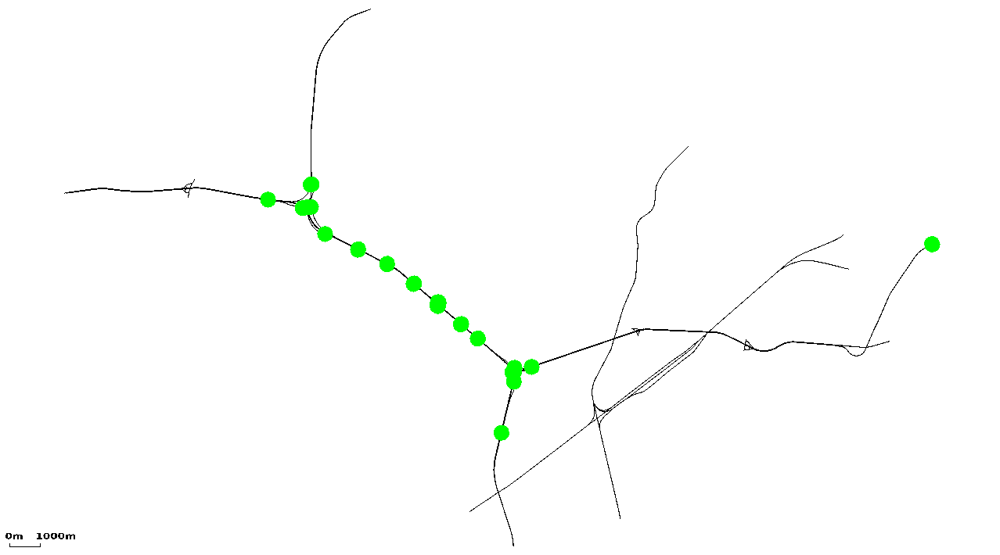
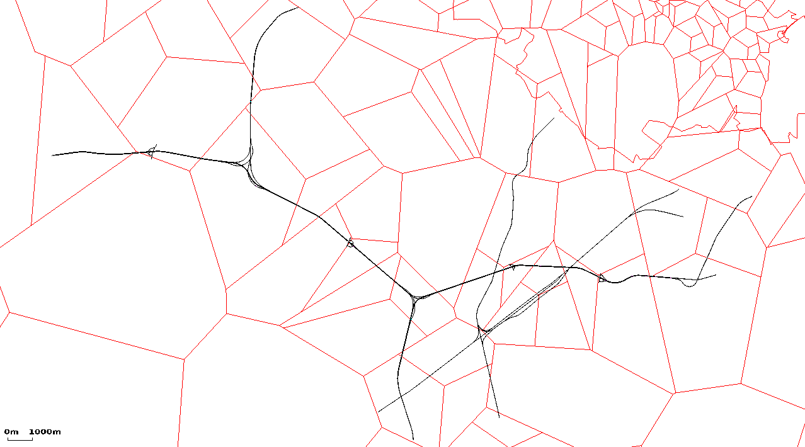
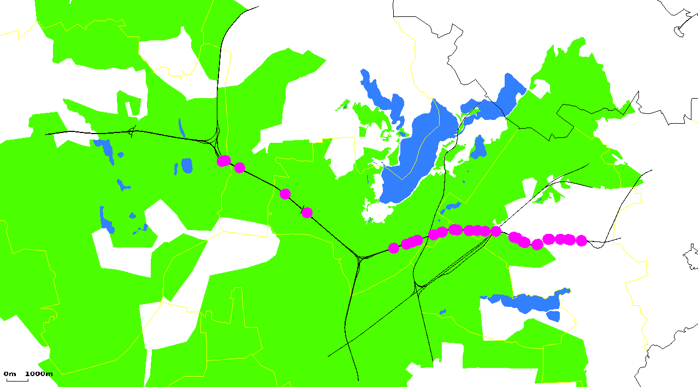

# Screenshots from Versions 0.9

## Examples for using polygons and POIs from Traffic Online

Area #1: plain road network

Area #1: with induction loop positions shown as POIs

Area #1: with the GSM network

Area #1: with environment and TOL-points shown as POIs

  - [further examples of using points of interest and polygons](Screenshots/Shapes.md)

# Screenshots from external applications

## From 'TraNS'

[TraNS
website](http://trans.epfl.ch/)

Image:trans.gif|Main TraNS v1.2 screen

## From 'eWorld'

[eWorld website](http://sourceforge.net/projects/eworld/)

Image:scr_eworld.jpg|eWorld Main Screen

## From 'SUMO Traffic Modeler'

[SUMO Traffic Modeler
website](http://sourceforge.net/projects/trafficmodeler/)

Image:trafficmodeller.gif|Plain Bologna import

# Screenshots from Versions 0.7/0.8

Image:scr_ernst-ruska.gif|Simulation of the area around our institute
in Berlin Adlershof; streets are coloured by the maximum speed allowed
Image:scr_koeln_fastlane.gif|Simulation of the City of Cologne