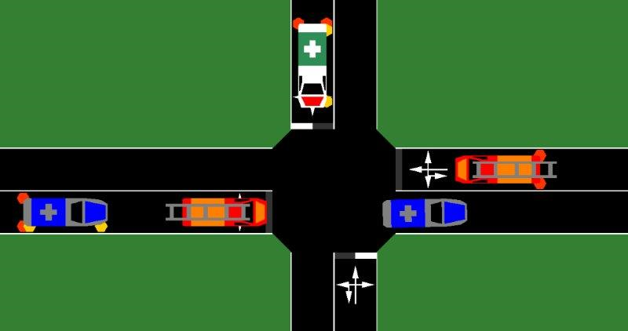

# Emergency Vehicle Simulation

The simulation of emergency vehicles and their special rights is possible with SUMO.

## Vehicle Class 'emergency'

If a vehicle is assigned a vType with vClass="emergency", the following features are activated:

- the vehicle will receive the default shape and size for a rescue vehicle.
- the vehicle may drive on lanes that allow "emergency" (but which might disallow normal passenger traffic).
- the vehicle may overtake on the right in all traffic situations.
- the vehicle may drive through the [opposite direction edge](OppositeDirectionDriving.md) even when its own edge has multiple usable lanes.
- the vehicle may overtake through the [opposite direction edge](OppositeDirectionDriving.md) even when its leader vehicle also wants to change left.
- the vehicle may overtake through the [opposite direction edge](OppositeDirectionDriving.md) even when it's approaching an intersection without priority.
- the vehicle may overtake through the [opposite direction edge](OppositeDirectionDriving.md) even when it must overtake a long column of vehicles (up to 1000m).

## Blue Light Device

A [Blue light device](../sumo.md#bluelight_device) indicates that the emergency
vehicle is driving with special rights (using a siren and blue flashing lights).
See [here](../Definition_of_Vehicles%2C_Vehicle_Types%2C_and_Routes.md#assignment_by_generic_parameters) for how to define this device for specific vehicle types or individual vehicles.
The device activates the following features:

- the vehicle will ignore red traffic lights.
- once the vehicle is jammed (waitingTime > 1s) it will perform lane changing without regard to strategic considerations (it will use any lane that allows it to advance along the road).
- if the vehicle is at an intersection but in the wrong turning lane, it will enter the intersection anyway (performing a silent teleport to the closest internal lane that allows it to continue its route).

If the simulation is running with the sublane model (**--lateral-resolution** is set to a value > 0), other traffic participants are forced to form a virtual middle lane (rescue lane) to let the emergency vehicle pass.
The following behaviors are activated for surrounding traffic ahead of the device-equipped vehicle:

- vehicles on the leftmost lane move towards the left side (latAlignment="left").
- vehicles on all other lanes move towards the right side (latAlignment="right").
- vehicles do not perform any lane changes (in particular, they do not move into the rescue lane).
- after the emergency vehicle has passed, the vehicles resume normal driving (with their previous lateral alignment).
  
Vehicles that are forming a rescue lane will have [generic parameter](GenericParameters.md) key `rescueLane` set to a space-separated list of emergency vehicle ids that are influencing them.
  
Surrounding traffic reacts while within 25m of the device-equipped vehicle. This distance is configurable by:

- the SUMO option [**--device.bluelight.reactiondist**](https://sumo.dlr.de/docs/sumo.html#bluelight_device), or
- the TraCI command [`traci.vehicle.setParameter(vehID, "device.bluelight.reactiondist", str(value))`](https://sumo.dlr.de/pydoc/traci._vehicle.html#VehicleDomain-setParameter)

## Further Features for driving with special rights
  
- Disregarding right-of-way and traffic lights: 
  - supported by using the [TraCI 'speed mode'
  command](../TraCI/Change_Vehicle_State.md#speed_mode_0xb3) to disable intersection related safety checks.
  - supported by [junction model parameters](Safety.md#junction_model).
- Exceeding the speed limit: This is supported by setting the
  vType-attribute [*speedFactor*](../Definition_of_Vehicles,_Vehicle_Types,_and_Routes.md#vehicle_types)
  (a value of 1.5 allows driving with 150% of the road speed limit).
 

# Example Configuration

```xml
<vType id="rescue" vClass="emergency" speedFactor="1.5">
   <param key="has.bluelight.device" value="true"/>
</vType>

```

# Further Parameters

The following [generic parameters](GenericParameters.md) can be used to configure a bluelight device:

- "device.bluelight.reactiondist": overrides option **--device.bluelight.reactionDist**

The following [generic parameters](GenericParameters.md) can be used to configure surrounding traffic w.r.t their reaction to a bluelight device:

- "device.bluelight.reaction-prob-near": probably for a vehicle to react (per second) and start forming a rescue lane while near (default *0.577*)
- "device.bluelight.reaction-prob-far": probably for a vehicle to react (pers second) and start forming a rescue lane while far away (default *0.189*)
- "device.bluelight.near-dist": distance threshold to distinguish between near and far (for the above probabilities)
 
# Visualization

The visualization of emergency vehicles is supported in
[sumo-gui](../sumo-gui.md). When setting the vType-attribute `guiShape="emergency"`, a
white vehicle with the international sign for first aid is drawn.
Alternatively, a police car or a fire brigade will be drawn when setting the vType-attribute `guiShape="police"` or `guiShape="firebrigade"`, respectively. Furthermore, a blue flashing light will be visible on the vehicle when setting the vType-attribute `vClass="emergency"`.



# References

Bieker, Laura (2015) Traffic safety evaluations for Emergency Vehicles.
Young Researchers Seminar, 17.-19. June 2015, Rome, Italy.

Bieker, Laura (2011) Emergency Vehicle Prioritization using
Vehicle-To-Vehicle Communication. Young Researchers Seminar, 8.-10. June
2011, Copenhagen, Denmark.
