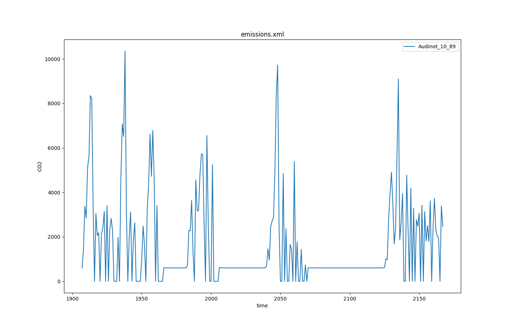

The reason for this output option is the possibility of SUMO to
calculate emission for every simulation timestep. The calculated values
for every vehicle will be recorded and can be used for a more
sophisticated view on special parts of the network. The values depend on
the selected [emission models](../../Models/Emissions.md) for the
individual vehicles.

## Instantiating within the Simulation

To force SUMO to build a file that contains the emission output, extend
your command line (or configuration) parameter by **--emission-output** {{DT_FILE}}. {{DT_FILE}} is the name of the
file the output will be written to. Any other file with this name will
be overwritten, the destination folder must exist.

By default, emission-output is enabled for all vehicles in the
simulation with output in each simulation step. Using [device assignment
options or
parameters](../../Definition_of_Vehicles,_Vehicle_Types,_and_Routes.md#devices)
(i.e. **--device.emissions.probability 0.25**) the set of vehicles which generate emission output can be reduced.
The output period can be set by using option **--device.emissions.period** {{DT_TIME}}.
To delay output (i.e. until some warm-up time has passed), the option **--device.emissions.begin** {{DT_TIME}} may be used.


## Generated Output

!!! caution
    Please note that the unit of fuel-related outputs changed with SUMO 1.14.0 from liters to milligram.
	For the old behavior use the option **--emissions.volumetric-fuel**.

The emission output is a xml-file containing the emission values for
each time step for every vehicle. The produced XML File looks like this:

```xml
<emission-export>

 <timestep time="<TIME_STEP>">

  <vehicle id="<VEHICLE_ID>" eclass="<VEHICLE_EMISSION_CLASS>" CO2="<VEHICLE_CO2>" CO="<VEHICLE_CO>"
    HC="<VEHICLE_HC>" NOx="<VEHICLE_NOX>" PMx="<VEHICLE_PMX>" fuel="<VEHICLE_FUEL>" electricity="<VEHICLE_ELECTRICITY>" noise="<VEHICLE_NOISE>" \
    route="<VEHICLE_ROUTE>" type="<VEHICLE_TYPE>" waiting="<VEHICLE_WAITING>" lane="<VEHICLE_LANE>" \
    pos="<VEHICLE_POS>" speed="<VEHICLE_SPEED>" angle="<VEHICLE_ANGLE>" x="<VEHICLE_POS_X>" y="<VEHICLE_POS_Y>"/>

   ... more vehicles ...

  </timestep>

... the next timestep ...

</emission-export>
```

The meanings of the written values are given in the following table.

| Name        | Type                 | Description                                                                                    |
| ----------- | -------------------- | ---------------------------------------------------------------------------------------------- |
| time_step  | (simulation) seconds | The time step described by the values within this timestep-element                             |
| id          | id                   | The id of the vehicle                                                                          |
| eclass      | ID                   | The emission class of the vehicle                                                              |
| CO2         | mg/s                 | The amount of CO2 emitted by the vehicle in the actual simulation step                         |
| CO          | mg/s                 | The amount of CO emitted by the vehicle in the actual simulation step                          |
| HC          | mg/s                 | The amount of HC emitted by the vehicle in the actual simulation step                          |
| NOx         | mg/s                 | The amount of NOX emitted by the vehicle in the actual simulation step                         |
| PMx         | mg/s                 | The amount of PMX emitted by the vehicle in the actual simulation step                         |
| fuel        | mg/s                 | The amount of fuel used by the vehicle in the actual simulation step                           |
| electricity | Wh/s                 | The amount of electricity used by the vehicle in the actual simulation step                    |
| noise       | dB                   | The noise emitted by the vehicle in the actual simulation step                                 |
| route       | id                   | The name of the route                                                                          |
| type        | id                   | The name of the vehicle type                                                                   |
| waiting     | seconds              | The time the vehicle is waiting                                                                |
| lane        | id                   | The name of the lane where the vehicle is moving                                               |
| pos         | meters               | The vehicle position measured from the start of the current lane                               |
| speed       | m/s                  | The speed of the vehicle                                                                       |
| angle       | degree               | The angle of the vehicle                                                                       |
| pos_x      | \---                 | The absolut X coordinate of the vehicle. The value depends on the given geographic projection. |
| pos_y      | \---                 | The absolut Y coordinate of the vehicle. The value depends on the given geographic projection. |

!!! caution
    When running with sub-second resolution, the emissions written during every simulation step are extrapolated to those that would be generated in 1 second. To avoid scaling (and thus simplify aggregation), set option **--emission-output.step-scaled**


## Further Options

- **--emission-output.geo** will toggle output coordinates to WGS84 (for
  geo-referenced networks)
- **--emission-output.attributes ATTR1,ATTR2,...** restricts written attributes to the given list (to reduce output). The following attributes are special:
  - **all**: enables all attributes
- **--emission-output.precision** will control the number of decimal digits in the output (default 2)
- **--emission-output.step-scaled** will write per-step emissions rather than per-second emissions (only relevant when also using option **--step-length**)

## Visualization example
The user-selected attributes can be plotted with use of [plotXMLAttributes.py](../../Tools/Visualization.md#plotxmlattributespy). The scenario acosta, one of the published sumo scenarios, is used as example (https://github.com/DLR-TS/sumo-scenarios/tree/main/bologna/acosta).

### Generating the output
```
sumo -c run.sumocfg --emission-output emissions.xml
```
### Example call for plotting
```
python plotXMLAttributes.py -x time -y CO2 -s -o CO2_output.png emissions.xml -i id --filter-ids Audinot_10_89 --legend
```
where -x is the attribute for the x axis; -y is the attribute for the y axis; -s is to show the plot; -o is the output file name; -i is the filtered attribute name; --filter-ids are the value(s) of the filtered attribute name; --legend is to show the value(s) of the selected attribute name.

The resultant plot is illustrated below.


