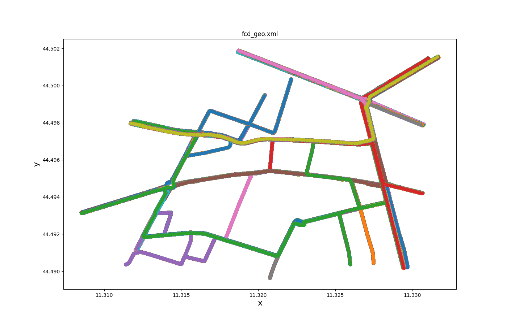
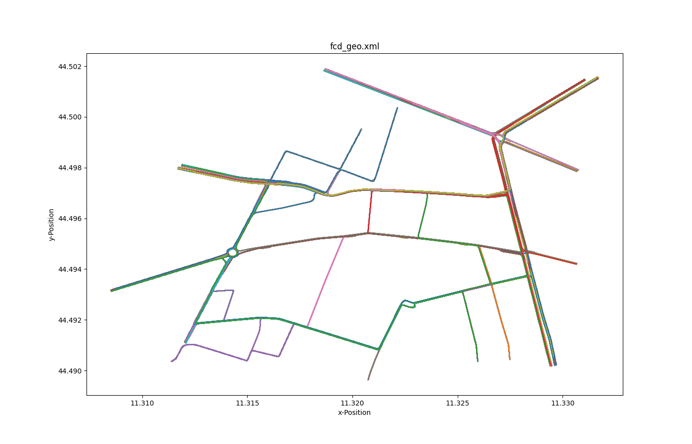
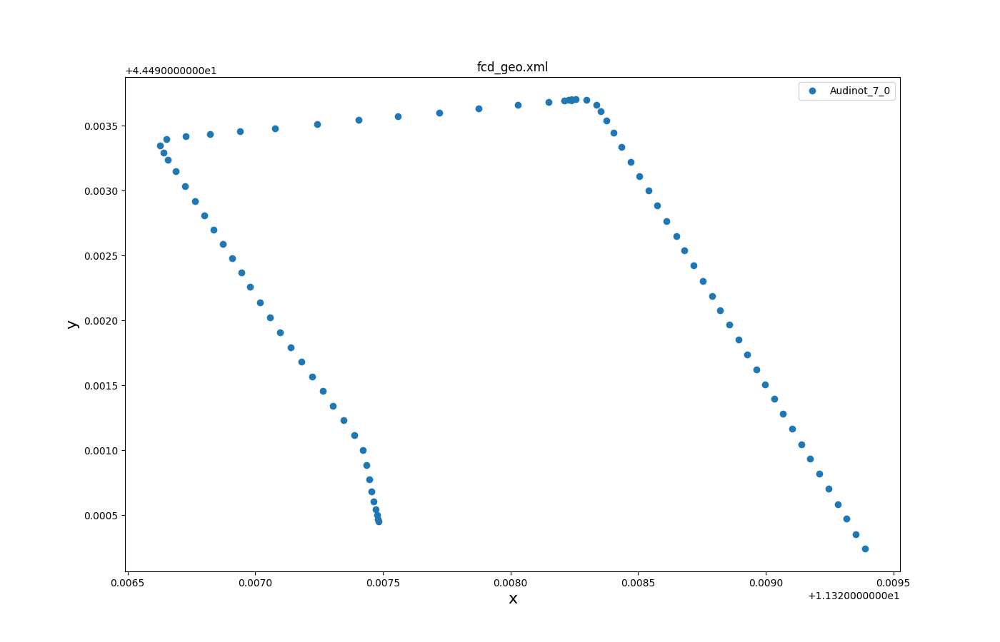
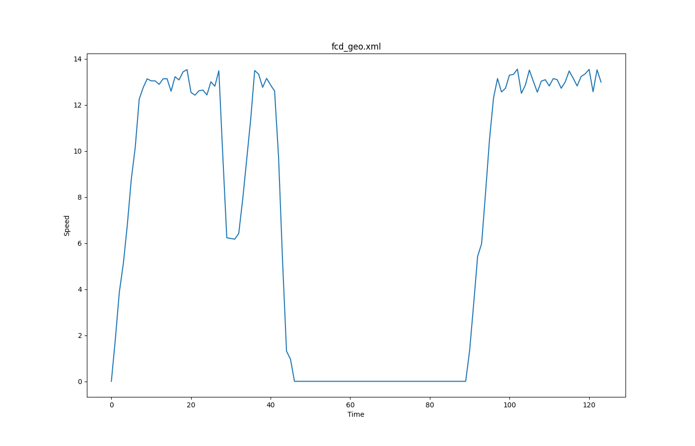
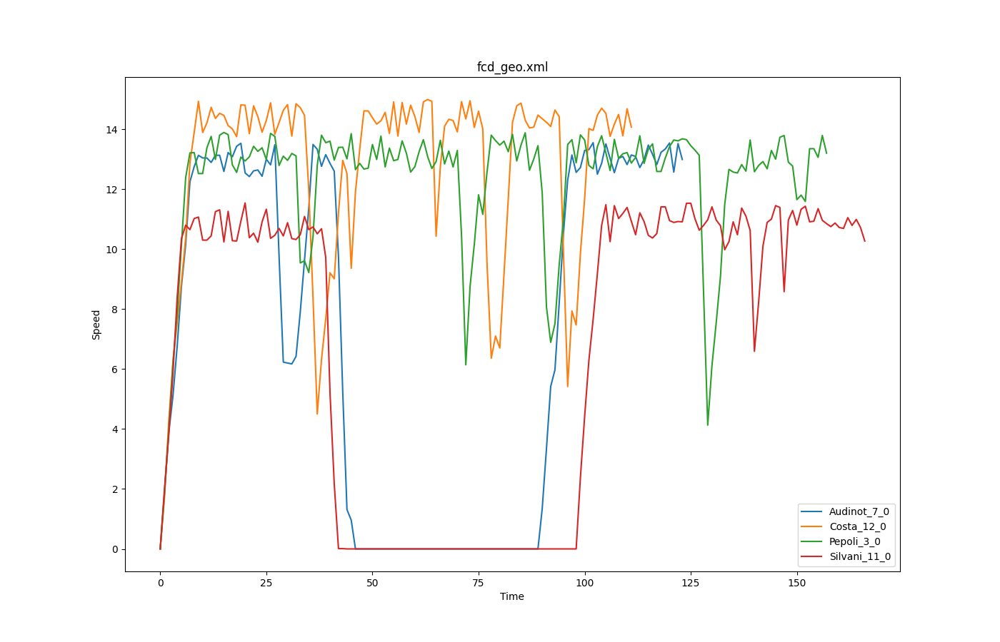

The FCD (floating car data) export contains location and speed along
with other information for every vehicle in the network at every time
step. The output behaves somewhat like a super-accurate high-frequency
GPS device for each vehicle. The outputs can be processed further using
the [TraceExporter tool](../../Tools/TraceExporter.md) for adapting
frequency, equipment rates, accuracy and data format.

## Instantiating within the Simulation

The simulation generates this output when setting the option **--fcd-output** {{DT_FILE}}. {{DT_FILE}} is the
name of the file the output will be written to. Any other file with this
name will be overwritten, the destination folder must exist.

By default, fcd-output is enabled for all vehicles and persons in the
simulation with output in each simulation step. Using [device assignment
options or
parameters](../../Definition_of_Vehicles,_Vehicle_Types,_and_Routes.md#devices)
(i.e. **--device.fcd.probability 0.25**) the set of vehicles which generate fcd output can be reduced.
The output period can be set by using option **--device.fcd.period** {{DT_TIME}}.
To delay output (i.e. until some warm-up time has passed), the option **--device.fcd.begin** {{DT_TIME}} may be used.

## Generated Output

The generated XML file looks like this:

```xml
<fcd-export>

  <timestep time="<TIME_STEP>">
      <vehicle id="<VEHICLE_ID>" x="<VEHICLE_POS_X>" y="<VEHICLE_POS_Y>" angle="<VEHICLE_ANGLE>" type="<VEHICLE_TYPE>"
      speed="<VEHICLE_SPEED>"/>

      ... more vehicles ...

  </timestep>

  ... next timestep ...

</fcd-export>
```

The values without a tick in the "On" column need to be [enabled explicitly](#further_options) and the ones without a tick at "Meso" are not available for the [mesoscopic simulation](../Meso.md).

| Name     | Type                 | On | Meso | Description                                                                                                 |
| -------- | -------------------- | -- | ---- | ----------------------------------------------------------------------------------------------------------- |
| timestep | (simulation) seconds |  x |   x  | The time step described by the values within this timestep-element                                          |
| id       | id                   |  x |   x  | The id of the vehicle                                                                                       |
| x        | m or longitude       |  x |   x  | The absolute X coordinate of the vehicle (center of front bumper). The value depends on the given geographic projection |
| y        | m or latitude        |  x |   x  | The absolute Y coordinate of the vehicle (center of front bumper). The value depends on the given geographic projection |
| z        | m                    |  x |   x  | The z value of the vehicle (center of front bumper).<br><br>**Note:** This value is only present if the network contains elevation data      |
| angle    | degree               |  x |   x  | The angle of the vehicle in navigational standard (0-360 degrees, going clockwise with 0 at the 12'o clock position)    |
| type     | id                   |  x |   x  | The name of the vehicle type                                                                                |
| speed    | m/s                  |  x |   x  | The speed of the vehicle                                                                                    |
| pos      | m                    |  x |   x  | The running position of the vehicle measured from the start of the current lane.                            |
| lane     | id                   |  x |      | The id of the current lane.                                                                                 |
| edge     | id                   |  x |   x  | The id of the current edge (only available in meso).                                                        |
| slope    | degree               |  x |   x  | The slope of the vehicle in degrees (equals the slope of the road at the current position)                  |
| signals  | bitset               |    |      | The [signal state information](../../TraCI/Vehicle_Signalling.md) (blinkers, etc)                           |
| acceleration  | m/s<sup>2</sup  |    |      | The longitudinal acceleration                                                                               |
| accelerationLat | m/s<sup>2</sup |   |      | The lateral acceleration (only with enabled sublane model)                                                  |
| distance | m                    |    |   x  | The [kilometrage / mileage position](../Railways.md#kilometrage_mileage_chainage) of the vehicle.           |
| odometer | m                    |    |   x  | The odometer value (distance driven since departure).                                                       |
| vehicle  | id                   |    |   x  | The id of the vehicle the person is currently riding (only available for persons)                           |
| posLat   | m                    |    |      | The [lateral position](../SublaneModel.md#lateral_resolution_and_vehicle_position) on the lane              |
| speedLat | m/s                  |    |      | The lateral speed (negative if the vehicle moves to the right)                                              |
| leaderID | id                   |    |      | The id of the leading vehicle                                                                               |
| leaderSpeed | m/s               |    |      | The speed of the leader                                                                                     |
| leaderGap | m                   |    |      | The gap to the leader                                                                                       |

When the option **--fcd-output.geo** is set, the written (x,y)-coordinates will be the
lon/lat geo-coordinates.

### Precision

By default fcd-output returns location values in meter with a precision
of 1cm. (changeable by setting option **--precision**). If you set option
--fcd-output.geo the values are lon,lat as decimal values with a
precision of 6 decimal places (changeable by setting option **--precision.geo**)

## Person and Container Output

Any persons or container in the simulation will cause output of he
following form:

```xml
<fcd-export>

  <timestep time="<TIME_STEP>">
      <vehicle .../>
      ...
      <person id="..." x="..." y="..." angle="..." type="..." speed="..." edge="..." slope="..."/>
      ...
      <container id="..." x="..." y="..." angle="..." type="..." speed="..." edge="..." slope="..."/>
      ...
  </timestep>

  ... next timestep ...

</fcd-export>
```

If persons or containers are transported within a vehicle, their
respective `<person>` and `<container>` elements will be written as child elements of that
vehicle.

## Filtering / Restricting Output

!!! caution
    The generated output files can become quite large. To write [gzipped](https://en.wikipedia.org/wiki/Gzip) output files, simply name the output file with an `.gz` extension.

### Restricting the set of vehicles that generate output
Output can be restricted to specific vehicle types or vehicle ids by [controlling the set of vehicles that are equipped](../../Definition_of_Vehicles,_Vehicle_Types,_and_Routes.md#devices)   with the **fcd**-device. The following example restricts output to a
  single vehicle called *ego*:
```
--device.fcd.explicit ego
```

The following example restricts fcd-output to a single flow out of the whole simulation

```
--device.fcd.probability 0 ...
```

```xml
<flow ...>
   <param key="has.fcd.device" value="true"/>
</flow>
```

### Restricting the set of persons and containers that generate output
Output can be restricted to specific person or container types or person/container ids by [controlling the set of persons that are equipped](../../Definition_of_Vehicles,_Vehicle_Types,_and_Routes.md#devices)   with the **fcd**-(person)-device. The following example restricts output to a
  single person called *ego*:
```
--person-device.fcd.explicit ego
```

The following example restricts fcd-output to a single personFlow out of the whole simulation

```
--person-device.fcd.probability 0 ...
```

```xml
<personFlow ...>
   <param key="has.fcd.device" value="true"/>
</personFlow>
```

### Restricting the locations
Output can be restricted to a specific set of edges by loading a list of edges from a file with option **--fcd-output.filter-edges.input-file** {{DT_FILE}}. The file format for
this is the same as the one when saving selections in  [netedit](../../Netedit/index.md):
```
edge:id1
edge:id2
...
```

### Restricting the locations by shape

Output can be restricted to vehicles within a specified area by setting a list of `<poly>` ids with option **--fcd-output.filter-shapes**.
The [polygon shapes](../Shapes.md) must have been loaded from an additional file.

### Restricting output by sensor range
When not all vehicles are equipped with an **fcd**-device, other vehicles and persons in a radius around the equipped vehicles can be included in the output by setting option **--device.fcd.radius** to the desired range in m.

## Further Options

- **--fcd-output.geo** will toggle output coordinates to WGS84 (for
  geo-referenced networks)
- **--fcd-output.signals** will add [signal state
  information](../../TraCI/Vehicle_Signalling.md) to the output
- **--fcd-output.distance** will add [kilometrage](../Railways.md#kilometrage_mileage_chainage) information to the output
- **--fcd-output.acceleration** will add acceleration data to the output (also lateral acceleration when using the [sublane model](../SublaneModel.md))
- **--fcd-output.max-leader-distance FLOAT** will add attributes leaderGap, leaderSpeed, leaderID whenever a vehicle has a leader within the given distance. Otherwise, leaderID will be "" and leaderGap, leaderSpeed will be -1.
- **--fcd-output.params KEY1,KEY2,...** adds [generic parameters](../GenericParameters.md) to the output (supports device and car-following model parameters as well as arbitrary user-define values)
- **--fcd-output.attributes ATTR1,ATTR2,...** restrict / extend written attributes to the given list to customize output (can be any combination of the attributes above). The value **all** enables all attributes.

## NOTES

In combination with the given geometry of the vehicles (shapes) you can
build some nice animations, e.g [NASA
WorldWind](https://worldwind.arc.nasa.gov/java/) or [Google
Earth](https://earth.google.com).

## Visualization example

### Accelerations versus distances


Generated with [plot_trajectories.py](../../Tools/Visualization.md#accelerations_versus_distances).

### All trajectories over time



Generated with [plotXMLAttributes.py](../../Tools/Visualization.md#all_trajectories_over_time_1).



Generated with [plot_trajectories.py](../../Tools/Visualization.md#all_trajectories_over_time_2).

### Selected trajectories over time



Generated with [plotXMLAttributes.py](../../Tools/Visualization.md#selected_trajectories_over_time_1).



Generated with [plot_trajectories.py](../../Tools/Visualization.md#selected_trajectories_over_time_2).


### FCD based speeds over time



Generated with [plot_trajectories.py](../../Tools/Visualization.md#fcd_based_speeds_over_time).
