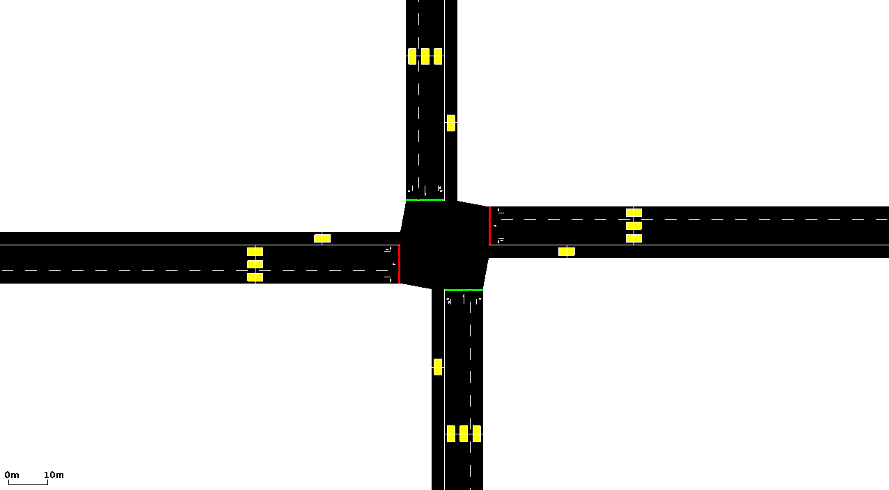
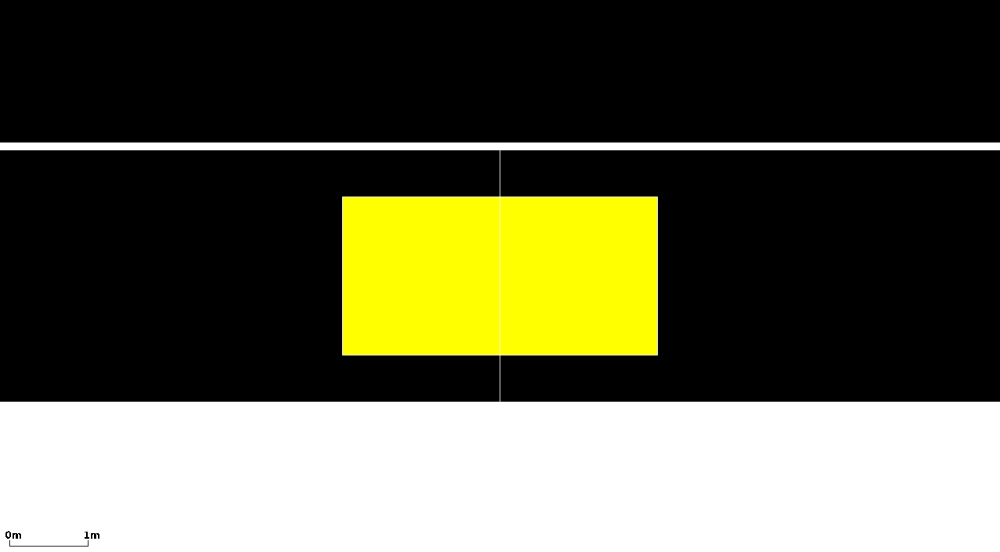

## Instantiating within the Simulation

An induction loop is defined this way within an {{AdditionalFile}} like this:

```xml
<additional>
   <inductionLoop id="<ID>" lane="<LANE_ID>" pos="<POSITION_ON_LANE>" period="<AGGREGATION_TIME>"
   file="<OUTPUT_FILE>" friendlyPos="true"/>
</additional>
```

The "`id`" is any string by which you can name
the detector. The attributes "`lane`" and
"`pos`" describe on which lane and at which
position on this lane the detector is placed. The
"`period`"-attribute describes the period over
which collected values shall be aggregated. The
"`file`" attribute tells the simulation to
which file the detector shall write his results into.

Multiple definitions may be placed in the same {{AdditionalFile}} and also reference the
same output file. Ensure that the {{AdditionalFile}} always starts and ends with a top
level of tags like so:

```xml
<additional>
  <inductionLoop id="myLoop1" lane="foo_0" pos="42" period="900" file="out.xml"/>
  <inductionLoop id="myLoop2" lane="foo_2" pos="42" period="900" file="out.xml"/>
  ....
</additional>
```

The attributes:

| Attribute Name | Value Type         | Description                                                               |
| -------------- | ------------------ | -------------------------------------------------------------------------------------- |
| **id**         | id (string)        | The id of the detector                                                                      |
| **lane**       | referenced lane id | The id of the lane the detector shall be laid on. The lane must be a part of the network used.           |
| **pos**        | float              | The position on the lane the detector shall be laid on in meters. The position must be a value between -1\*lane's length and the lane's length. In the case of a negative value, the position will be computed backward from the lane's end (the position the vehicles drive towards). |
| period (alias freq) | int (time)| The aggregation period the values the detector collects shall be summed up (*default: whole simulation time*).                         |
| **file**       | filename           | The path to the output file. See [Writing Files](../../Basics/Using_the_Command_Line_Applications.md#writing_files) for further information.                                                                                                                                         |
| friendlyPos    | bool     | If set, no error will be reported if the detector is placed behind the lane. Instead, the detector will be placed 0.1 meters from the lane's end or at position 0.1, if the position was negative and larger than the lane's length after multiplication with -1; *default: false*.    |
| vTypes         | string   | space separated list of vehicle type ids to consider, "" means all; default "".                       |
| detectPersons  | string   | [detect persons instead of vehicles (pedestrians or passengers)](../Pedestrians.md#detectors_for_pedestrians)  |
| length         | float    | length of the detection zone downstream of **pos** (default *0*)                       |

## Generated Output

A single data line within the output of a simulated induction loop looks
as following:

```xml
   <interval begin="''<BEGIN_TIME>''" end="''<END_TIME>''" id="''<DETECTOR_ID>''" \
      nVehContrib="''<MEASURED_VEHICLES>''" flow="''<FLOW>''" occupancy="''<OCCUPANCY>''" \
      speed="''<MEAN_SPEED>''" harmonicMeanSpeed="''<HARM_MEAN_SPEED>''" length="''<MEAN_LENGTH>''" nVehEntered="''<ENTERED_VEHICLES>''"/>
   ... further intervals ...
```

The values are described in the following table.

| Name              | Type                 | Description                                                        |
| ----------------- | -------------------- | -------------------------------------------------------------------------------------- |
| begin             | (simulation) seconds | The first time step the values were collected in                       |
| end               | (simulation) seconds | The last time step + DELTA_T the values were collected in               |
| id                | id                   | The id of the detector                                                  |
| nVehContrib       | \#vehicles           | The number of vehicles that have completely passed the detector within the interval               |
| flow              | \#vehicles/hour      | The number of contributing vehicles extrapolated to an hour                    |
| occupancy         | %                    | The percentage (0-100%) of the time a vehicle was at the detector. If multiple vehicles are on the detector simulataneously (due to its length or in sublane simulation), values above 100 are possible)    |
| speed             | m/s                  | The arithmetic mean of the velocities of all completely collected vehicles (-1 indicates that no vehicles were collected). This gives the time mean speed.      |
| harmonicMeanSpeed | m/s                  | The harmonic mean of the velocities of all completely collected vehicles (-1 indicates that no vehicles were collected). This gives the space mean speed.       |
| length            | m                    | The mean length of all completely collected vehicles (-1 indicates that no vehicles were collected).          |
| nVehEntered       | \#vehicles           | All vehicles that have touched the detector. Includes vehicles which have not passed the detector completely (and which do not contribute to collected values). |

The detector computes the values by determining the times the vehicle
enters and leaves the detector, first. This implicates, that a) some
values are not available as long as the vehicle is on the detector, and
b) some values can not be computed if the vehicle enters the detector by
a lane change - as the vehicle did not pass the detector completely.

"`nVehEntered`" includes all vehicles that
were on the detector (even if they left by lane change or arrival or
were still on the detector when the interval ended). The values that are
collected for the vehicles correspond to
"`nVehContrib`".

## Visualisation

<table style="border: 0 !important"><thead><tr><td style="border: none; vertical-align:middle; text-align:center;">
<figure>

<figcaption>A scenario with induction loops</figcaption>
</figure>
</td><td style="border: none; vertical-align:middle; text-align:center;">
<figure>

<figcaption>A close-up view at an induction loop</figcaption>
</figure>
</td></tr></thead></table>


## Further Notes

- [Simulated induction loops can be accessed using
  TraCI](../../TraCI/Induction_Loop_Value_Retrieval.md). If no XML output is
  needed, the attribute `file="NUL"` may be used.
- Induction loops are created automatically when defining [actuated traffic lights](../Traffic_Lights.md#type_actuated)
- You can generate detector definitions automatically. See [output
  tools](../../Tools/Output.md) for more information.
