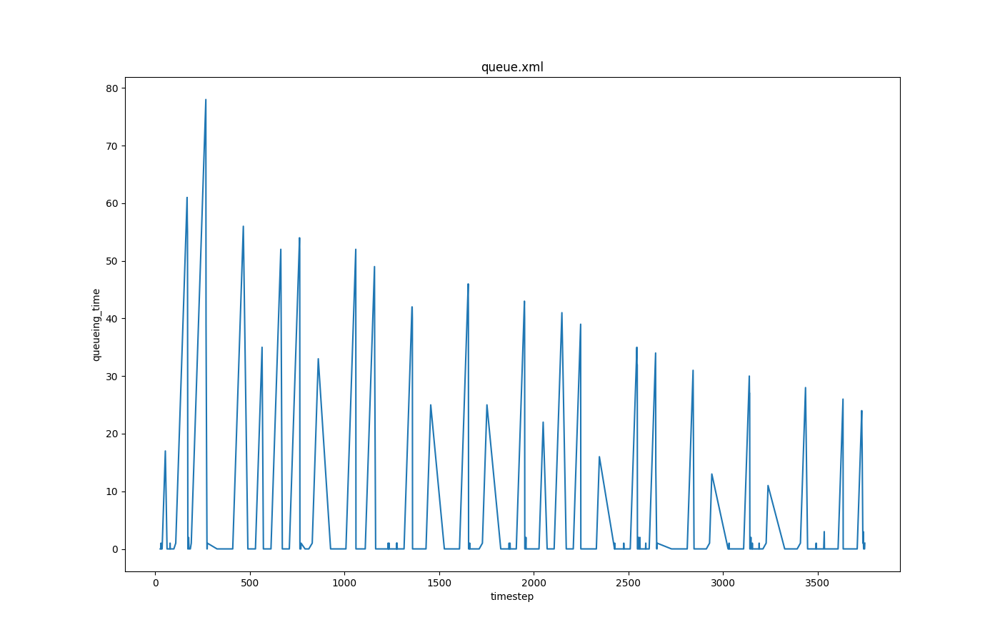

The idea behind this output option is to detect the queue in front of
the controlled/uncontrolled junction. The queue length is calculated
using the end of the last standing vehicle.

## Instantiating within the Simulation

The simulation is forced to generate this output using the option **--queue-output** {{DT_FILE}}. {{DT_FILE}} is
the name of the file the output will be written to. Any other file with
this name will be overwritten, the destination folder must exist. Using the option **--qeue-output.period** {{DT_TIME}}, the times 
the queue lengths will be written can be restricted to the given period. Then, the other time steps will be skipped.

The speed below which a vehicle is counted as queued can be configured with the option **--queue-output.speed-threshold** {{DT_FLOAT}} (default 1.39 m/s, i.e. 5 km/h).

## Generated Output

The generated XML file looks like this:

```xml
<queue-export>

  <data timestep="<TIME_STEP>">

  <lanes>

    <lane id="<LANE_ID>" queueing_time="<LANE_QUEUEING_TIME>" queueing_length="<LANE_QUEUEING_LENGTH>"
    queueing_length_experimental="<LANE_QUEUEING_LENGTH_EXPERIMENTAL>"/>

    ... next lane ...

  </lanes>
  </data>

  ... next timestep ...

</queue-export>
```

| Name                           | Type                 | Description                                                                         |
| ------------------------------ | -------------------- | ----------------------------------------------------------------------------------- |
| time_step                     | (simulation) seconds | The time step described by the values within this timestep-element                  |
| id                             | id                   | The id of the lane                                                                  |
| queueing_time                 | seconds              | The total waiting time of vehicles due to a queue                                   |
| queueing_length               | meters               | Thus the length from the junction until the final vehicle in line                   |
| queueing_length_experimental | meters               | The length of the queue, thus until the last vehicle with a speed lower than 5 km/h |

## Mesoscopic Simulation

When running with [mesoscopic simulation](../Meso.md), queues are
measured per segment queue instead of per lane. Vehicles within a
segment queue are ordered by their entry time and the queue length (in
vehicles) is the position of the last queued vehicle, counted from the
head of the queue. A vehicle counts as queued if the slope of its
(interpolated) position trajectory lies below the speed threshold.
This slope is derived from the earliest exit times chained along the
queue (the same computation used by
[**--meso-interpolate-pos**](../Meso.md)) and therefore reflects
blocked vehicles further ahead, whereas the plain vehicle speed in
mesosim only drops once a vehicle becomes the queue head. The
generated `lane` elements carry the additional attributes `segment`
(index of the segment within the edge) and `queueing_count` (queue
length in vehicles). The attribute `queueing_length` gives the
distance from the segment end to the back of the last queued vehicle
when **--meso-interpolate-pos** is active and the summed vehicle
lengths (including minGap) up to the last queued vehicle otherwise.

## Aggregated Output

When setting the option **--queue-output.aggregation** {{DT_TIME}}, per-timestep
data is replaced by per-edge queue length statistics aggregated over
the given period (typically a traffic light cycle):

```xml
<queue-export>

  <interval begin="<BEGIN>" end="<END>">
    <edge id="<EDGE_ID>" samples="<NUM_SAMPLES>"
      maxQueueLengthInVehicles="..." medianQueueLengthInVehicles="..." p95QueueLengthInVehicles="..."
      maxQueueLengthInMeters="..." medianQueueLengthInMeters="..." p95QueueLengthInMeters="..."/>

    ... next edge ...

  </interval>

  ... next interval ...

</queue-export>
```

Each lane (or meso segment queue) with at least one queued vehicle
contributes one sample per recorded time step. The `median` and `p95`
values are computed over all samples of the interval with linear
interpolation between order statistics (matching `numpy.percentile`).
Edges without any queued vehicles during the interval are omitted.

## Notes

This output option should offer some information about the queues in
front of the junctions, which can be used in cases of routing or V2X
communications.

## Visualization example

### Queuing times over time



Generated with [plotXMLAttributes.py](../../Tools/Visualization.md#queuing_times_over_time).
