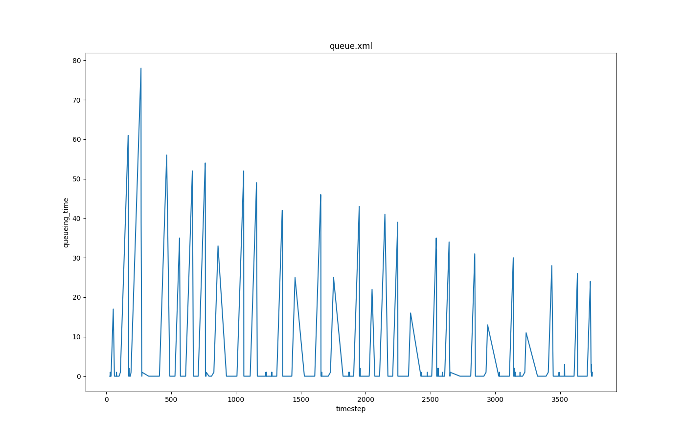

The idea behind this output option is to detect the queue in front of
the controlled/uncontrolled junction. The queue length is calculated
using the end of the last standing vehicle.

## Instantiating within the Simulation

The simulation is forced to generate this output using the option **--queue-output** {{DT_FILE}}. {{DT_FILE}} is
the name of the file the output will be written to. Any other file with
this name will be overwritten, the destination folder must exist.

## Generated Output

The generated XML file looks like this:

```xml
<queue-export>

  <data timestep="<TIME_STEP>">

  <lanes>

    <lane id="<LANE_ID>" queueing_time="<LANE_QUEUEING_TIME>" queueing_length="<LANE_QUEUEING_LENGTH>"
    queueing_length_experimental="<LANE_QUEUEING_LENGTH_EXPERIMENTAL>"/>

    ... next lane ...

  </lanes>
  </data>

  ... next timestep ...

</queue-export>
```

| Name                           | Type                 | Description                                                                         |
| ------------------------------ | -------------------- | ----------------------------------------------------------------------------------- |
| time_step                     | (simulation) seconds | The time step described by the values within this timestep-element                  |
| id                             | id                   | The id of the lane                                                                  |
| queueing_time                 | seconds              | The total waiting time of vehicles due to a queue                                   |
| queueing_length               | meters               | Thus the length from the junction until the final vehicle in line                   |
| queueing_length_experimental | meters               | The length of the queue, thus until the last vehicle with a speed lower than 5 km/h |

## Notes

This output option should offer some information about the queues in
front of the junctions, which can be used in cases of routing or V2X
communications.

## Visualization example
The user-selected attributes can be plotted with use of [plotXMLAttributes.py](../../Tools/Visualization.md#plotxmlattributespy). The scenario acosta, one of the published sumo scenarios, is used as example (https://github.com/DLR-TS/sumo-scenarios/tree/main/bologna/acosta). 

### Generating the output
```
sumo -c run.sumocfg --queue-output queue.xml
```
### Example call for plotting
```
python plotXMLAttributes.py -x timestep -y queueing_time -s -o queue.png queue.xml -i id --filter-ids 121_0
```
where -x is the attribute for the x axis; -y is the attribute for the y axis; -s is to show the plot; -o is the output file name; -i is the filtered attribute name; --filter-ids are the value(s) of the filtered attribute name.

The resultant plot is illustrated below.


