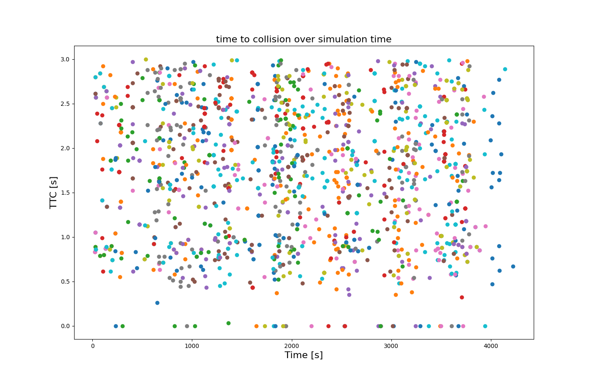

## Equipping vehicles
A vehicle can be equipped with an SSM Device which logs the conflicts of the vehicle and other traffic participants (currently only vehicles) and corresponding safety surrogate measures. To attach an SSM device to a vehicle, the [standard device-equipment procedures](../../Definition_of_Vehicles,_Vehicle_Types,_and_Routes.md#devices) can be applied using `<device name>=ssm`.

For instance, a single vehicle can be equipped (with a device parametrized by default values) as in the following minimal example

```xml
<routes>
    ...
    <vehicle id="v0" route="route0" depart="0">
        <param key="has.ssm.device" value="true"/>
    </vehicle>
    ....
</routes>
```

## Output File

The SSM device generates an output file (one for each vehicle named `ssm_<vehicleID>.xml` per default, but several vehicles may write to the same file).
To set a custom file name, define `<param key="device.ssm.file" value="FILE"/>` either for the `<vehicle>` or its `<vType>` element.
Alternatively, set option **--device.ssm.file** to let all vehicles write into the same file.

The top level elements of the generated file are

`<conflict begin="<log-begin-time>" end="<log-end-time>" ego="<equipped-vehicleID>" foe="<opponent-vehicleID>"> ... </conflict>`.

## Output Content Configuration

The detail of information given for each conflict and the criteria to qualify an encounter as a conflict (i.e., produce a corresponding `conflict` element in the output) can be customized by a number of generic parameters to the vehicle or device, resp.. A full parametrization (redundantly assigning the default values, here) could look as follows:

```xml
<routes>
    ...
    <vehicle id="v0" route="route0" depart="0">
        <param key="has.ssm.device" value="true"/>
        <param key="device.ssm.measures" value="TTC DRAC PET MDRAC"/>
        <param key="device.ssm.thresholds" value="3.0 3.0 2.0 3.4"/>
        <param key="device.ssm.range" value="50.0" />
        <param key="device.ssm.mdrac.prt" value="1.0" />
        <param key="device.ssm.extratime" value="5.0" />
        <param key="device.ssm.file" value="ssm_v0.xml" />
        <param key="device.ssm.trajectories" value="false" />
        <param key="device.ssm.geo" value="false" />
        <param key="device.ssm.write-positions" value="false" />
        <param key="device.ssm.write-lane-positions" value="false" />
        <param key="device.ssm.filter-edges.input-file" value="input_list.txt" />
        <param key="device.ssm.exclude-conflict-types" value="" />
    </vehicle>
    ....
</routes>
```

## Parameters

The possible parameters are summarized in the following table

| Parameter  |  Type  |  Default  | Remark  |
|---|---|---|---|
| measures  | list of strings  | All available SSMs  | This space or comma-separated  list of SSM-identifiers determines, which encounter-specific SSMs are calculated for the equipped vehicle's encounters and which global measures are recorded (see [below](#available_ssms))   |
| thresholds  | list of floats  | <ul><li>TTC < 3.0[s]</li><li>DRAC > 3.0[m/s^2]</li><li>MDRAC > 3.4[m/s^2]</li><li>PET < 2.0[s]</li><li>BR > 0.0[m/s^2]</li><li>SGAP < 0.2[m]</li><li>TGAP < 0.5[s]</li></ul>  | This space or comma-separated list of SSM-thresholds determines, which encounters are classified as conflicts (if their measurements exceed a threshold) and thus written to the output file as a `<conflict>`-element. This list is required to have the same length as the list of measures if given.<br><br>**Note:** Currently the global measures are recorded as a single timeline for the whole simulation span and thresholds have only effect insofar a leader is looked for in the distance corresponding to the SGAP and, respectively, TGAP values.   |
| range  | double  | 50.0 [m]  | The devices detection range in meters. Other vehicles are tracked as soon as they are closer than `<range>` to the equipped vehicle *along the road-network*. A tree search is performed to find all vehicles up to range upstream and downstream to the vehicle's current position. Further, for all downstream junctions in range, an upstream search for the given range is performed.  |
| extratime  | double  | 5.0 [s]  | The extra time that an encounter is tracked on after not being associated to a potential conflict (either after crossing the conflict area, deviating from a common route, changing lanes, or because vehicles leave the device range, etc.).  |
| file  | string  | "ssm_<equipped_vehicleID\>.xml"  | The filename for storing the conflict information of the equipped vehicle. Several vehicles may write to the same file. Conflicts of a single vehicle are written in the order of the log-begin of the encounter.   |
| trajectories  | bool  | false  | Whether the full time lines of the different measured values shall be written to the output. This includes logging the time values, encounter types, vehicle positions and velocities, values of the selected SSMs, and associated conflict point locations. If turned off (default) only the extreme values for the selected SSMs are written.  |
| geo  | bool  | false  | Whether the positions in the output file shall be given in the original coordinate reference system of the network (if available).  |
| write-positions  | bool  | false  | Whether to write the positions (coordinates) to the output.  |
| write-lane-positions  | bool  | false  | Whether to write the lanes and the positions on the lanes to the output.  |
| filter-edges.input-file | string | - | If defined, only conflicts occurred at the provided edges and junctions are measured. See [Restricting SSM Device to Edges and Junctions](#restricting_ssm_device_to_edges_and_junctions)  |
| exclude-conflict-types | list of strings | - | This space or comma-separated list of SSM device conflict type codes determines which conflicts will appear in the output file. Any conflict which has been classified during at least one time step as one of the mentioned types is excluded from the output. Special values **"foe"** (types {3,7,11,13,15}) and **"ego"** (types {2,6,10,12,14}) add predefined sets to the list. |

## Encounter types
Different types of encounters, e.g. crossing, merging, or lead/follow situations, may imply different calculation procedures for the safety measures. Therefore the SSM-device keeps track of these classifications and provides them in the output to allow the correct interpretation of the corresponding values.

The following table lists the different encounter types along with their codes, which will appear in the output file.

| Code | Name                       | Description           | [Space Gap](#space_gap_definitions) | Speed Difference | [Conflict Entry Point](#conflict_definitions) |
|------|----------------------------|-----------------------|-------------------------------------|--------------------|-----------------------------------------------|
| 0    | NOCONFLICT_AHEAD           | Foe vehicle is closer than range, but not on a lane conflicting with the ego's route ahead.                                                                                                                               ||||
| <font color="lightgray">1    | <font color="lightgray">FOLLOWING                  | <font color="lightgray">General follow/lead situation (incomplete type, used only internally).                                                                            ||||
| 2    | FOLLOWING_FOLLOWER         | Ego vehicle is following the foe vehicle.                                                                                                                                                                                 | foeBack - egoFront | egoSpeed - foeSpeed | foeBack |
| 3    | FOLLOWING_LEADER           | Foe vehicle is following the ego vehicle.                                                                                                                                                                                 | egoBack - foeFront | foeSpeed - egoSpeed | egoBack |
| 4    | ON_ADJACENT_LANES          | Foe vehicle is on a neighboring lane of the ego vehicle's lane, driving in the same direction.                                                                                                                            ||||
| <font color="lightgray">5    | <font color="lightgray">MERGING                    | <font color="lightgray">Ego and foe share an upcoming edge of their routes while the merging point for the routes is still ahead (incomplete type, only used internally). ||||
| 6    | MERGING_LEADER             | As 5. The estimated arrival at the merge point is earlier for the foe than for the ego vehicle.                                                                                                                           | foeEntryDist | foeSpeed | mergePoint|
| 7    | MERGING_FOLLOWER           | As 5. The estimated arrival at the merge point is earlier for the ego than for the foe vehicle.                                                                                                                           | egoEntryDist | egoSpeed | mergePoint|
| 8    | MERGING_ADJACENT           | As 5. The vehicles' current routes lead to adjacent lanes on the same edge.                                                                                                                                               ||||
| <font color="lightgray">9    | <font color="lightgray">CROSSING                   | <font color="lightgray">Ego's and foe's routes have crossing edges (incomplete type, only used internally)                                                                ||||
| 10   | CROSSING_LEADER            | As 6. The estimated arrival of the ego at the conflict point is earlier than for the foe vehicle.                                                                                                                         | foeEntryDist | foeSpeed | foeCrossingPoint|
| 11   | CROSSING_FOLLOWER          | As 6. The estimated arrival of the foe at the conflict point is earlier than for the ego vehicle.                                                                                                                         | egoEntryDist | egoSpeed | egoCrossingPoint|
| <font color="lightgray">12   | <font color="lightgray">EGO_ENTERED_CONFLICT_AREA  | <font color="lightgray">The encounter is a possible crossing conflict, and the ego vehicle has entered the conflict area. (Is currently not logged -> TODO)               | foeEntryDist | foeSpeed | foeCrossingPoint|
| <font color="lightgray">13   | <font color="lightgray">FOE_ENTERED_CONFLICT_AREA  | <font color="lightgray">The encounter is a possible crossing conflict, and the foe vehicle has entered the conflict area. (Is currently not logged -> TODO)               | egoEntryDist | egoSpeed | egoCrossingPoint|
| 14   | EGO_LEFT_CONFLICT_AREA     | The encounter has been a possible crossing conflict, but the ego vehicle has left the conflict area.                                                                                                                      ||||
| 15   | FOE_LEFT_CONFLICT_AREA     | The encounter has been a possible crossing conflict, but the foe vehicle has left the conflict area.                                                                                                                      ||||
| <font color="lightgray">16   | <font color="lightgray">BOTH_ENTERED_CONFLICT_AREA | <font color="lightgray">The encounter has been a possible crossing conflict, and both vehicles have entered the conflict area (auxiliary type, only used internally, is evaluated to BOTH_LEFT_CONFLICT_AREA or to COLLISION). ||||
| 17   | BOTH_LEFT_CONFLICT_AREA    | The encounter has been a possible crossing conflict, but both vehicle have left the conflict area.                                                                                                                        ||||
| 18   | FOLLOWING_PASSED           | The encounter has been a following situation, but is not active any more.                                                                                                                                                 ||||
| 19   | MERGING_PASSED             | The encounter has been a merging situation, but is not active any more.                                                                                                                                                   ||||
| 20   | ONCOMING                   | The vehicles are driving [towards each other on the same lane](../../Simulation/OppositeDirectionDriving.md).                                                                                                             | foeFront - egoFront | egoSpeed + foeSpeed | midpoint between vehicles|
| <font color="lightgray">111  | <font color="lightgray">COLLISION                  | <font color="lightgray">Collision (currently not implemented, might be differentiated further).                                                                           ||||


## Space Gap Definitions
- front: position of front bumper of the vehicle as offset from the start of its lane
- back: position of back bumper of the vehicle as offset from the start of its lane

!!! note
    When ego and foe vehicles are on subsequent lanes, the gaps are computed by adding the distances of the intermediate lanes

## Conflict Types
Basically, we distinguish between three types of encounters for two vehicles:

- **Lead/follow situation:** vehicles are passing the same sequence of lanes before and after the conflict point
- **Crossing situation:** vehicles are passing different sequences of lanes before and after the conflict point
- **Merging Situation:** vehicles are passing different lanes before the conflict point but the same lane after the conflict point

## Conflict Definitions
For each conflict there is an entry point. For merging and crossing conflicts there is also an exit point.
The points may be slightly different for both ego and foe vehicle because the point is computed in reference to the vehicle front or rear bumper whereas a collision could happen with another part of the vehicle.

- entryDist: distance between the front bumper of the vehicle and the entry point along the lane sequence
- exitDist for merging and oncoming encounters: entryDist + vehicleLength
- exitDist for crossing encounters: entryDist + followerLength + leaderWidth
- mergePoint: start of the first common lane of ego and foe vehicle
- crossingPoint: point where the lane geometry sequence (center lines) of both vehicles intersects
- egoCrossingPoint: crossing point shifted upstream along the ego lanes by half of the foe vehicle width
- foeCrossingPoint: crossing point shifted upstream along the foe lanes by half of the ego vehicle width

## Available SSMs
Currently, the following safety surrogate measures are implemented:

- [TTC](#ttc) (time to collision)
- [DRAC](#drac) (deceleration rate to avoid a crash)
- [PET](#pet) (post encroachment time)
- [MDRAC](#mdrac) (modified DRAC)

Further, the following additional safety-relevant output can be generated, which will not be linked to a specific encounter:

- [BR](#br) (brake rate)
- [SGAP](#sgap) (spacing)
- [TGAP](#tgap) (time headway)

!!! note
    For the selection in the device's output, the abbreviations have to be used.

Please note that some SSMs only apply to a specific encounter or are computed differently for different encounters.
For crossing and merging situations, we consider "expected" entry and exit times with respect to the conflict zone.
For the calculation of those times for the approaching vehicles, we take into account the current deceleration of the
vehicles, if the vehicle is not decelerating, the current speed is extrapolated as a constant (i.e., acceleration is only considered if it is negative).

For some reference to definitions of SSMs see for instance [Guido et al. (2011) "Safety performance measures: a comparison between microsimulation and observational data"] or [Mahmud et al. (2016) "Application of proximal surrogate indicators for safety evaluation: A review of recent developments and research needs"]

### TTC
The time-to-collision is defined for all follow-lead situations for which the follower is faster than the leader. It is given as

```
TTC = space_gap/speed-difference.
```

For a crossing or merging situation the TTC is only considered defined if for the case that the expected conflict area exit time of the vehicle A is larger than the expected conflict area entry time for vehicle B, where A is the vehicle with the smaller expected conflict area entry time. If this is the case the TTC is defined as

```
TTC = B’s distance to conflict area entry / B’s current speed.
```

### DRAC
For a lead/follow-situation the DRAC (deceleration to avoid a crash) where the follower vehicle's speed is larger than the leader vehicle's speed is defined as

```
DRAC = 0.5*speed_difference^2/space_gap.
```

For a crossing situation the DRAC is considered defined only if the expected conflict area exit time tA for the first vehicle (A) is larger than the *linearly extrapolated* conflict area entry time for the second vehicle (B). In that case, the DRAC is defined as follows:

```
DRAC = 2*(speedB - distConflictB/tA)/tA.
```

This value is chosen such that constant deceleration with the corresponding rate would imply that B enters the conflict area exactly at time tA, when vehicle A leaves it.

For a merging situation, both variants for the DRAC calculation must be tested and the minimal result should be applied as the appropriate value for the DRAC.

!!! note
    This has still to be implemented, currently only one variant is used.

### MDRAC
A modified indicator of the DRAC called MDRAC considering a perception-reaction-time (PRT) is defined as

```
MDRAC = 0.5*speed_difference/(TTC - PRT).

```

The `PRT` is configured with param key `device.ssm.mdrac.prt` or via option **--device.ssm.mdrac.prt** and defaults to a value of `1` second.

!!! note
	This metric is not fully implemented for all conflict types yet! (only type 0 - 8 are partly tested so far)

### PET
For merging and crossing situations, the PET (post encroachment time) is defined as the difference of the leading vehicle's conflict area exit time tA and the following vehicle's conflict area entry time tB:

```
PET = tB - tA.
```

For lead/follow situations, no PET is calculated.

!!! note
    Some deficiencies of the current implementation state:

    1) Currently the geometry of the conflict area is considered simplified, considering crossing lanes to be orthogonal.

    2) The merging area is not treated (the "conflict area" for merging conflicts is actually considered as the cross section at the beginning of the common target lane.

    3) DRAC calculation for merging conflicts is still incomplete

    4) Lateral conflicts for opposite or neighboring lane's traffic are ignored


### BR
The brake rate is recorded at each simulation step. If the vehicle accelerates, a value of 0.0 is logged.
### SGAP
The spacing is measured as the bumper to bumper distance to the ego vehicle's leader minus the vehicle's [minGap](../../Definition_of_Vehicles,_Vehicle_Types,_and_Routes.md#vehicle_types)
### TGAP
The time headway to the leading vehicle equals spacing/speed.

## Output
The output for an SSM device is written to a file specified by the parameter `device.ssm.file` in the routes definition file, see [above](#equipping_vehicles).
The extent of output can be controlled by the parameters `device.ssm.measures` (which SSMs to report) and `device.ssm.trajectories` (whether to report complete trajectories for vehicles, the tracked SSMs, and the encounter types).

The resulting file contains a root element `<SSMLog>`, which contains several `<conflict>` elements and one `<globalMeasures>` element. Each reported `<conflict>` corresponds to a tracked encounter, during which an SSM's criticality threshold was exceeded during the simulation. The `<globalMeasures>` element holds a timeline for all simulated times and the corresponding values for the selected measures, which are not associated to specific conflicts, see [Available_SSMs](#available_ssms).

An example for the contents of an output file:

```xml
<SSMLog>
     <conflict begin="6.50" end="13.90" ego="ego1" foe="foe1">
         <timeSpan values="6.50 6.60 6.70 6.80 6.90 7.00 7.10 ..."/>
         <typeSpan values="10 10 10 10 10 10 10 ..."/>
         <egoPosition values="98.35,61.20 98.35,60.20 98.35,59.25 ..."/>
         <egoLane values="NC_0 NC_0 NC_0 NC_0 NC_0 NC_0 NC_0 ..."/>
         <egoLanePosition values="59.73 61.12 62.51 63.89 65.28 66.67 68.06 ..."/>
         <egoVelocity values="0.00,-10.23 0.00,-9.78 0.00,-9.33 ..."/>
         <foePosition values="76.31,48.35 77.59,48.35 78.82,48.35 ..."/>
         <foeLane values="WC_0 WC_0 WC_0 WC_0 WC_0 WC_0 WC_0 ..."/>
         <foeLanePosition values="45.84 47.23 48.62 50.00 51.39 52.78 54.17 ..."/>
         <foeVelocity values="13.02,0.00 12.57,0.00 12.12,0.00 ..."/>
         <conflictPoint values="99.23,49.46 99.23,49.46 99.23,49.46 ..."/>
         <TTCSpan values="1.78 1.74 1.70 1.67 1.63 1.60 1.56 ..."/>
         <minTTC time="7.40" position="99.23,49.46" type="10" value="1.48" speed="13.50"/>
         <DRACSpan values="3.66 3.61 3.56 3.50 3.44 3.37 3.30 ..."/>
         <maxDRAC time="6.50" position="99.23,49.46" type="10"
value="3.66" speed="12.95"/>
         <PET time="9.42" position="99.23,49.46" type="17" value="0.72" speed="5.12"/>
     </conflict>
     <conflict begin="21.50" end="27.20" ego="ego1" foe="foe2">
         ...
     </conflict>
     ...
    <globalMeasures ego="ToC_veh">
        <timeSpan values="0.00 0.10 0.20 0.30 0.40 0.50 0.60 0.70 0.80 0.90 1.00 ..."/>
        <positions values="98.35,61.20 98.35,60.20 98.35,59.25 ..."/>
        <lane values="NC_0 NC_0 NC_0 NC_0 NC_0 NC_0 NC_0 NC_0 NC_0 NC_0 NC_0 ..."/>
        <lanePosition values="0.00 1.39 2.78 4.17 5.56 6.95 8.33 9.72 11.11 12.50 13.89 ..."/>
        <BRSpan values="0.00 0.00 0.00 0.00 0.00 0.00 0.00 0.00 0.00 0.00 0.00 ..."/>
        <maxBR time="363.20" position="1850.01,-4.95" value="5.53"/>
        <SGAPSpan values="27.50 27.50 27.49 27.45 27.38 27.29 27.17 27.02 26.85 26.65 ..."/>
        <minSGAP time="365.50" position="1863.41,-4.95" value="0.31" leader="leader"/>
        <TGAPSpan values="inf 105.77 52.86 35.19 26.33 20.99 17.41 14.85 12.91 11.39 10.16 ..."/>
        <minTGAP time="365.30" position="1863.14,-4.95" value="0.23" leader="leader"/>
    </globalMeasures>
</SSMLog>
```

Elements of type `<conflict>` hold the following information in their child elements:

| Element      | Attribute | Type              | Description                                                  | Parameter                 |
|--------------|---------|---------------------|--------------------------------------------------------------|---------------------------|
| timeSpan     | values  | list of floats      | All simulation time points within the duration of the encounter. All other entries of elements with list-type are given with respect to the corresponding time points. | --device.ssm.trajectories |
| typeSpan     | values  | list of integers (Encounter type codes)  | Timeseries of classifications for the tracked encounter.  | --device.ssm.trajectories |
| egoPosition  | values  | list of 2D-coordinates  | Timeseries of the ego vehicle's positions (coordinates).  | --device.ssm.trajectories |
| egoLane      | values  | list of strings     | Timeseries of the ego vehicle's lane IDs.                     | --device.ssm.trajectories --device.ssm.write-lane-positions |
| egoLanePosition  | values  | list of floats  | Timeseries of the ego vehicle's positions on the lane.        | --device.ssm.trajectories --device.ssm.write-lane-positions |
| egoVelocity  | values  | list of 2D-vectors  | Timeseries of the ego vehicle's velocity vectors.             | --device.ssm.trajectories |
| foePosition  | values  | list of 2D-coordinates  | Timeseries of the foe vehicle positions (coordinates).    | --device.ssm.trajectories |
| foeLane      | values  | list of strings     | Timeseries of the foe vehicle's lane IDs.                     | --device.ssm.trajectories --device.ssm.write-lane-positions |
| foeLanePosition  | values  | list of floats  | Timeseries of the foe vehicle's positions on the lane.        | --device.ssm.trajectories --device.ssm.write-lane-positions |
| foeVelocity  | values  | list of 2D-vectors  | Timeseries of the foe vehicle's velocity vectors.             | --device.ssm.trajectories |
| conflictPoint  | values  | list of 2D-coordinates  | Timeseries of the (eventually extrapolated) coordinates of the conflict point. The *conflict* point is taken as the respective *entry point to the conflict area*.   | --device.ssm.trajectories |
| TTCSpan      | values  | list of floats      | Timeseries of the calculated TTC values. May contain entries 'NA' corresponding to times, where TTC is not defined. |  --device.ssm.trajectories --device.ssm.measures "TTC" |
| DRACSpan     | values  | list of floats      | Timeseries of the calculated DRAC values. May contain entries 'NA' corresponding to times, where DRAC is not defined.  | --device.ssm.trajectories --device.ssm.measures "DRAC" |
| minTTC       | time    | float               | Time point of the minimal measured value for the TTC.         | --device.ssm.measures "TTC" |
|              | position  | 2D-coordinate     | Coordinate of the corresponding conflict point.               | --device.ssm.measures "TTC" |
|              | type    | integer (Encounter type code)  | [Type code](#encounter_types) of the corresponding encounter type. (Defines the variant of [TTC-calculation](#ttc).) | --device.ssm.measures "TTC" |
|              | value   | float >= 0          | The minimal measured TTC-value.                               | --device.ssm.measures "TTC" |
|              | speed   | float >= 0          | The speed of the reporting vehicle at the occurence of minTTC.| --device.ssm.measures "TTC" |
| maxDRAC      | time    | float               | Time point of the maximal measured value for the DRAC.        | --device.ssm.measures "DRAC" |
|              | position  | 2D-coordinate     | Coordinate of the corresponding conflict point.               | --device.ssm.measures "DRAC" |
|              | type    | integer (Encounter type code)  | [Type code](#encounter_types) of the corresponding encounter type. (Defines the variant of [DRAC-calculation](#drac).)  | --device.ssm.measures "DRAC" |
|              | value   | float >= 0          | The maximal measured DRAC-value.                              | --device.ssm.measures "DRAC" |
|              | speed   | float >= 0          | The speed of the reporting vehicle at the occurence of maxDRAC.| --device.ssm.measures "DRAC" |
| PET          | time    | float               | Time point of the minimal measured value for the PET. (Usually the PET is only measured once, therefore no PETSpan is reported.)  | --device.ssm.measures "PET" |
|              | position  | 2D-coordinate     | Coordinate of the corresponding encroachment point.           | --device.ssm.measures "PET" |
|              | type    | integer (Encounter type code)  | [Type code](#encounter_types) of the corresponding encounter type.  | --device.ssm.measures "PET" |
|              | value   | float >= 0          | The measured PET-value.                                       | --device.ssm.measures "PET" |
|              | speed   | float >= 0          | The speed of the reporting vehicle at the occurence of PET.   | --device.ssm.measures "PET" |


The `<globalMeasures>` element has the following structure:

| Element  | Attribute | Type           | Description                                                               | Parameter                          |
|----------|-----------|----------------|---------------------------------------------------------------------------|------------------------------------|
| timeSpan | values    | list of floats | Simulation time points at which the reported measures are logged.         |                                    |
| positions| values    | list of 2D-coordinates | Simulation positions at which the reported measures are logged.   | --device.ssm.write-positions       |
| lane     | values    | list of strings| Simulation lane IDs at which the reported measures are logged.            | --device.ssm.write-lane-positions  |
| lanePosition| values | list of floats | Simulation positions on the lane at which the reported measures are logged.| --device.ssm.write-lane-positions |
| BRSpan   | values    | list of floats | Values of the brake rate at the time points given in timeSpan.            | --device.ssm.measures "BR"         |
| SGAPSpan | values    | list of floats | Values of the spacing at the time points given in timeSpan.               | --device.ssm.measures "SGAP"       |
| TGAPSpan | values    | list of floats | Values of the time headway at the time points given in timeSpan.          | --device.ssm.measures "TGAP"       |
| maxBR    | time      | float          | Time at which the maximal value of the brake rate was recorded.           | --device.ssm.measures "BR"         |
|          | value     | float          | Maximal recorded value for the brake rate.                                | --device.ssm.measures "BR"         |
|          | position  | 2D-coordinate  | Position of the ego vehicle, where the maximal brake rate was recorded.   | --device.ssm.measures "BR"         |
| minSGAP  | time      | float          | Time at which the minimal spacing was recorded.                           | --device.ssm.measures "SGAP"       |
|          | value     | float          | Minimal recorded value for the spacing.                                   | --device.ssm.measures "SGAP"       |
|          | position  | 2D-coordinate  | Position of the ego vehicle, where the minimal spacing was recorded.      | --device.ssm.measures "SGAP"       |
| minTGAP  | time      | float          | Time at which the minimal time headway was recorded.                      | --device.ssm.measures "TGAP"       |
|          | value     | float          | Minimal recorded value for the time headway.                              | --device.ssm.measures "TGAP"       |
|          | position  | 2D-coordinate  | Position of the ego vehicle, where the minimal time headway was recorded. | --device.ssm.measures "TGAP"       |


### Restricting SSM Device to Edges and Junctions
The option `--device.ssm.filter-edges.input-file <input_list>` can be used to specify an input file containing edgeIDs and junctionIDs that are used to restrict the measurement of conflicts.
The edges and junctions must be defined as following:
```
edge:edgeID1
edge:edgeID2
...
junction:junctionID1
junction:junctionID2
...
```
The edges adjoining the given junctions and the given edges are used to measure the conflicts. Only conflicts occuring at these edges are measured and outputed.


## TraCI
The following values can be retrieved for equipped vehicles if they have enabled the corresponding measures:

- traci.vehicle.getParameter(vehID, "device.ssm.minTTC")
- traci.vehicle.getParameter(vehID, "device.ssm.minPET")
- traci.vehicle.getParameter(vehID, "device.ssm.maxDRAC")

The values correspond to the current min/max for all currently active encounters.

## Visualization Examples

The SSM output file can be used as input to [plotXMLAttributes.py](https://sumo.dlr.de/docs/Tools/Visualization.html#time_to_collision_over_simulation_time). Here is an example:


