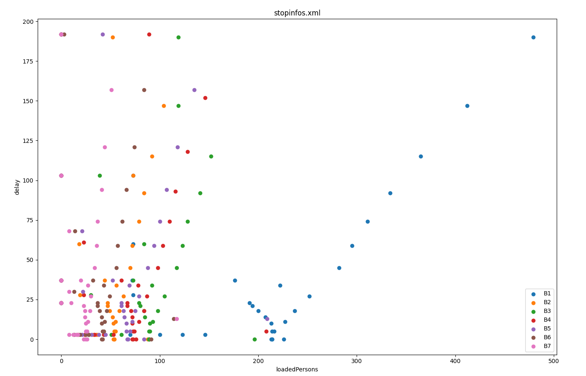

## Instantiating within the Simulation

Stop output is activated by setting the simulation option **--stop-output** {{DT_FILE}} on the
command line or in a *.sumocfg* file. This output contains the
information about each vehicle's scheduled
[`<stop>`](../../Definition_of_Vehicles,_Vehicle_Types,_and_Routes.md#stops):
time of arrival and departure, stopping place and number of persons or
container that were loaded and unloaded. The information is generated
every time a stop ends.

## Generated Output

The format is the following:

```xml
<stops>
    <stopinfo ''ATTRIBUTES''...\>
    ...
</stops>
```

The following output attributes are generated:

| Name               | Type          | Description                                                          |
| ------------------ | ------------- | -------------------------------------------------------------------- |
| id                 | (vehicle) id  | The name of the vehicle that stopped                                 |
| type               | (type) id     | The type of the vehicle that stopped                                 |
| lane               | id            | The lane on which the vehicle stopped                                |
| pos                | double        | The lane position at which the vehicle stopped                       |
| parking            | bool          | Whether the vehicle left the road (*true*) or stayed on it (*false*) |
| started            | time (s)      | The time at which the vehicle stopped                                |
| ended              | time (s)      | The time at which the vehicle resumed driving                        |
| delay              | time (s, optional | The difference between 'ended' and 'until' (only if stop had attribute 'until' set) |
| arrivalDelay       | time (s, optional)| The difference betweend 'started' and 'arrival' (only if stop had attribute 'arrival' set) |
| initialPersons     | int           | The number of persons in the vehicle when arriving at the stop       |
| loadedPersons      | int           | The number of persons that entered the vehicle at this stop          |
| unloadedPersons    | int           | The number of persons that left the vehicle at this stop             |
| initialContainers  | int           | The number of containers in the vehicle when arriving at the stop    |
| loadedContainers   | int           | The number of containers that entered the vehicle at this stop       |
| unloadedContainers | int           | The number of containers that left the vehicle at this stop          |
| busStop            | id (optional) | The id of the busStop if this stop took place at a named `<busStop/>`|
| containerStop      | id (optional) | The id of the containerStop if this stop took place at a named `<containerStop/>` |
| parkingArea        | id (optional) | The id of the parkingArea if this stop took place at a named  `<parkingArea/>`    |
| chargingStation    | id (optional) | The id of the chargingStation if this stop took place at a named `<chargingStation/>`  |
| tripId             | string (optional | The tripId parameter of the vehicle at the time of stopping if it was set|
| usedEnded          | bool (optional)  | Whether the stop was loaded with an 'ended' value. (only written if option **--use-stop-ended** is set |

## Visualization Examples

### boarding passengers vs delay for each station


Generated with [plotXMLAttributes.py](../../Tools/Visualization.md#boarding_passengers_vs_delay_for_each_station)

### Public transport schedule


Generated with [plotXMLAttributes.py](../../Tools/Visualization.md#public_transport_schedule)
