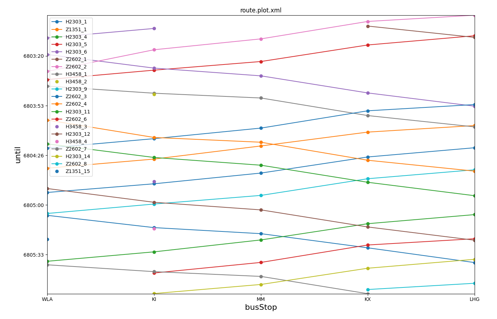

# Train Simulation

This page describes simulations of trains in SUMO. To build an
intermodal simulation scenario with trains, additional steps have to be
taken in comparison to a plain vehicular simulation.

# Building a network for train simulation

## Railways

Railways can be imported from
[OSM](../Networks/Import/OpenStreetMap.md). They can also be
explicitly specified using the existing *vClasses*.

### Parallel Tracks
If a railway has parallel tracks, these must be modelled as distinct edge
elements instead of a single edge with multiple "lanes".

### OSM

#### Types

When importing from OSM the following railway types are distinguished by
default (via [{{SUMO}}/data/typemap/osmNetconvert.typ.xml]({{Source}}data/typemap/osmNetconvert.typ.xml)):

- tram
- subway
- light_rail
- rail
- [highspeed](https://en.wikipedia.org/wiki/High-speed_rail)

#### Electrification

Whenever a railway is electrified, the vClasses *rail*, *rail_electric*
and *rail_fast* are permitted to drive there. Otherwise, only vClass
*rail* is allowed.

#### Usage

By loading the additional typemap [{{SUMO}}/data/typemap/osmNetconvertRailUsage.typ.xml]({{Source}}data/typemap/osmNetconvertRailUsage.typ.xml), additional [usage
information](https://wiki.openstreetmap.org/wiki/Key:usage#With_railways)
is exported for the edge types:

- main
- branch
- industrial
- military
- test
- tourism

This will lead to compound edge type ids such as
*railway.rail|usage.main*.

#### Track numbers

Local track numbers (mostly in train stations) are exported as edge
parameter *track_ref*. These values are shown in the edge parameter
dialog and can also be used for coloring (*color by param, streetwise*).

## Bidirectional track usage

In reality all tracks can be used in either direction if the need arises
but many rails are used in only one direction most of the time. In SUMO,
bidirectional track usage must be enabled explicitly. This simplifies
routing as rails will only be used in their preferred direction most of
the time.

Bidirectional track usage is modeled by two edges that have their
geometries exactly reversed and using the attribute `spreadType="center"`. This will result
in lane geometries that are overlaid exactly. These edges are referred
to as *superposed* (alternatively as bidirectional rail edges). In the
.net.xml file these edges are marked with `bidi="<REVERSE_EDGE_ID>"` but this is a generated
attribute and not to be set by the user.

When Rail signals are placed at both ends of a bidirectional track they
will restrict its usage to one direction at a time.

### Bidirectional rails in [sumo-gui](../sumo-gui.md)

Visualization of bidirectional tracks has a distinct [style and dedicated settings](#network).

### Working with bidirectional tracks in [netedit](../Netedit/index.md)

- To show both edges that constitute a bidirectional track, activate
  edge visualization option *spread bidirectional railways/roads* (see [visualization settings](../sumo-gui.md#edgelane_visualisation_settings)). Both edges will be
  drawn narrower and with a side-offset to make them both visible
  without overlap.
   - this is highly recommended when using connection mode to define connections among bidirectional tracks as it's otherwise hard to distinguish the affected edges
   - the pre-defined gui setting scheme 'rail' automatically activates the *spread ...* setting.
- To find (and highlight) all bidirectional tracks, use [attribute
  selection](../Netedit/editModesCommon.md#match_attribute) and search for
  attribute *bidi* with a value of *1*
- Create bidirectional tracks [as explained
  here](../Netedit/neteditUsageExamples.md#creating_bidirectional_railway_tracks)

### Routing in bidirectional networks

When train tracks can be used in both directions, there is considerable freedom for trains when search a path through the network. To reduce the number of conflicts (when two vehicles want to use the same track in opposite directions), the preferred direction for each track can be defined and factored into the routing decision.

To express this preference, the edges in the preferred direction and on the
preferred side may be assigned a higher priority value. This value will be taken
into account when setting option **--weights.priority-factor FLOAT** which applies to
[sumo](../sumo.md) and [duarouter](../duarouter.md).

At the default option value of 0. Edge priority is ignored when routing. When setting a positive value, the edges with the lowest priority receive a penalty factor to their estimated travel time of 1 + FLOAT (where FLOAT is the option argument) whereas the edges with the highest priority receive no penalty. Edges with medium priority will receive a penalty of 1 + x * FLOAT where

```
  x = (edgePriority - minPriority) / (maxPriority - minPriority)
```

The priority values can either be assigned by the user or computed heuristically by [netconvert](../netconvert.md) as explained below.

#### Priority from partially restricted directionality

If some of the tracks in the network are uni-directional these can be used to define the main direction and this property can be extrapolated based on geometry (straightness) and topology (switches) onto the rest of the network This is done by setting the option **--railway.topology.direction-priority**. The assigned priority values are:

- 4: unidirectional track
- 3: main direction of bidirectional track
- 2: undetermined main direction (straight continuation from different directions of unidirectional track)
- 1: undetermined main direction (no continuation from unidirectional track)
- 0: reverse of main direction of bidirectional track

#### Priority from partially defined values

If some of the tracks in the network have priority values defined (by convention with the values 0 and 4) these can be used to define the main direction and this property can be extrapolated based on geometry (straightness) and topology (switches) onto the rest of the network This is done by setting the option **--railway.topology.extend-priority**. The assigned priority for the other network edges also range from 1 to 3 just as above.

### Importing bidirectional tracks from OSM

When importing networks from
[OSM](../Networks/Import/OpenStreetMap.md), rails tagged with `railway:preferred_direction:both` are
automatically imported as superposed edges.

### Handling Problems in bidirectional railway networks

Commonly, rail networks import from OSM are incomplete in regard to
bidirectional track usage. One example would be terminal tracks which a
train can only leave by reversing direction. [netconvert](../netconvert.md) provides several options to deal with this problem:

- **--railway.topology.output** {{DT_FILE}}: Identify problematic tracks (i.e. for manual correction).
- **--railway.topology.repair** : Automatically fixes problems by analyzing rail network topology and adding bidirectional tracks
- **--railway.topology.repair.minimal** : Apply automated fixes but only those which are needed for the operation loaded public transport lines
- **--railway.topology.repair.connect-straight** : Allow bidirectional rail use wherever rails with opposite directions meet at a straight angle
- **--railway.topology.repair.stop-turn** : Add turn-around connections at all loaded stops (to enable direction reversal).
- **--railway.topology.all-bidi** : make all tracks usable in both directions.
- **--railway.topology.all-bidi.input-file** : Load edge ids from text file and make those tracks usable in both directions. (one edge id per line, optionally prefixed with 'edge:' as in a [selection file created with netedit](../Netedit/editModesCommon.md#selection_operations)).

## Rail Signals

The [node type](../Networks/PlainXML.md#node_descriptions)
`rail_signal` may be used to define signals which implement [Automatic Block
Signaling](https://en.wikipedia.org/wiki/Automatic_block_signaling).

By setting the [netconvert](../netconvert.md)-option **--railway.signals.discard** all signals
can be removed from a network.

When working with bidirectional tracks, rail signals will affect both directions of travel by default. This can be [changed in netedit](../Netedit/neteditUsageExamples.md#define_rail_signals_that_only_affect_one_track_direction).

When importing rail networks from OSM, the rules for [what counts as a rail signal can be customized](../Networks/Import/OpenStreetMap.md#railway_signals) to adapt to the local level of database detail.

## Rail Crossings

The [node type](../Networks/PlainXML.md#node_descriptions)
`rail_crossing` may be used to define railway crossings. At these nodes trains will
always have the right of way and road vehicles get a red light until
there is a safe gap between approaching trains.

When importing networks from
[OpenStreetMap](../Networks/Import/OpenStreetMap.md), rail
crossings will be imported automatically. For other input data sources
the crossings may have to be specified [via additional xml
files](../Tutorials/ScenarioGuide.md#modifying_an_imported_network_via_plainxml)
or set via [netedit](../Netedit/index.md) after importing.

### Rail Crossing Parameters

The following parameters may be defined in an additional file to configure timing and behavior of a rail crossing (example below).
Time values are in seconds.

- time-gap : time headway of approaching train that triggers closing the crossing (default 15)
- space-gap : space headway of approaching train that triggers closing the crossing (default -1, which disables this check)
- min-green-time : minimum green time for opening the crossing when another train is approaching (default 5)
- opening-delay : time after train has passed the crossing before the opening sequence starts (default 3)
- opening-time : time for opening the crossing (indicated by red-yellow state 'u') (default 3)
- yellow-time : time for closing the crossing (default 3)

When setting parameters, `id` indicates the id of the rail-crossing junction and `programID` is always '0'.

```xml
<additional>
    <tlLogic id="C" programID="0">
        <param key="time-gap" value="15.0"/>
        <param key="space-gap" value="-1.0"/>
        <param key="min-green-time" value="5.0"/>
        <param key="opening-delay" value="3.0"/>
        <param key="opening-time" value="3.0"/>
        <param key="yellow-time" value="5.0"/>
    </tlLogic>
</additional>
```

## Kilometrage (Mileage, Chainage)

Edges support the attribute *distance* to denote the distance at the
start of the edge relative to some point of reference for a [linear
referencing scheme](https://en.wikipedia.org/wiki/Linear_referencing).
When the distance metric decreases along the forward direction of the edge, this is indicated by using a negative sign for the distance value.

The distance value along an edge is computed as:
```
  |edgeDistance + vehiclePos|
```

Edge distance is imported from OSM and can also be be set along a route in [netedit](../Netedit/elementsDemand.md#route)

The distances value can be written in [fcd-output](Output/FCDOutput.md#further_options) using option **--fcd-output.distance**. It may then be used for plotting by [plot_trajectories.py](../Tools/Visualization.md#plot_trajectoriespy) using the code `k` (i.e. -t kt). The distances can also be visualized in sumo-gui (color edges by distance).

!!! note
    Negative distance values are not currently supported (pending introduction of another attribute)

# Modelling Trains

There is a dedicated carFollowMode for trains which can be activated by
setting `carFollowModel="Rail" trainType="<TYPE>"` in the `<vType>` definition. Allowed values for trainType are

- Freight
- ICE1
- ICE3
- RB425
- RB628
- REDosto7
- NGT400
- NGT400_16
- MireoPlusB
- MireoPlusH
- custom

These types model traction and rolling resistance for particular trains. To represent the behavior of arbitrary trains, the "custom" trainType may be used (see below).
Alternatively, any other car following model may be used and configured with appropriate acceleration / deceleration parameters.

# Custom dynamics model with tabular data

The vType attributes `speedTable`, `tractionTable` and `resistanceTable` can be used to specify a custom interpolation table for traction and resistance.
Each attribute is interpreted as a table column where the rows defines the traction and resistance for the corresponding speed.
The speeds must be given in m/s whereas the traction and resistance forces are in kN. Intermediate values are obtained by linear interpolation.

Example:
```xml
	<vType id="0" vClass="rail" carFollowModel="Rail" trainType="custom"
           speedTable="0 2.78 5.56 8.33 11.11 13.89 16.67 19.44 22.22 25 27.78 30.56 33.33"
           tractionTable="300 300 263 179 135 108 90 77 67.5 60 54 49 45"
           resistanceTable="2 4 8.5 14 22 31 41.5 54 68 83.5 111 120 140"/>
```

# Custom dynamics model with parameterized curves

The vType attributes `maxPower` and `maxTraction` can be used to specify the traction curve for a given speed (in m/s) according to the formula:

 `traction_kN = min(maxPower / speed, maxTraction`


The vType attributes `resCoef_quadratic`, `resCoef_linear` and `resCoef_constant` can be usd to specify the resistance curve for a given speed (in m/s) according to the formula:

 `resistance_kN =  resCoef_quadratic * speed * speed + resCoef_linear * speed + resCoef_constant`

Example:
```xml
   <vType id="0" vClass="rail" carFollowModel="Rail" trainType="custom" maxPower="2350" maxTraction="150"
        resCoef_quadratic="0.00028" resCoef_linear="0.00003" resCoef_constant="1.670"/>
```

The attributes

# Train Schedules

Train schedules are defined in the same way as for any other type of [public transport](Public_Transport.md#public_transport_schedules).



Generated by [plotXMLAttributes.py](../Tools/Visualization.md#public_transport_schedule).

# Train Interaction

When simulation trains on a network with railway signals, trains will
only enter a block (a section of edges between signals) if it is free of
other trains. When there are no rail signals or multiple trains have
been inserted in the same block, they will automatically keep a safe
distance according to their car following model. When using `carFollowModel="Rail"`, trains
will always keep enough distance to the leading train to come to a safe
stop even if the lead train was to stop instantly.

# Reversing Direction

Trains will reverse direction if all of the following conditions are
met:

- The head of the train is on a normal edge (not on an intersection /
  railway switch)
- The whole length of the train is located on rail-edges that allow
  bidirectional use.
- The speed of the train is below 0.1m/s.
- The train does not have any further stops on the current edge
- The succeeding edges in the train's route are the reverse-direction
  edges of those it is currently on
- There is a "turn-around" connection from the current train edge to
  the reverse direction edge

  !!! note
      When importing public transport stops with option **--ptstop-output**, all bidirectional edges with a public transport stop will have the necessary turn-around connection and thus be eligible for reversing.

# Portion working
Trains can be split and joined (divided and coupled) at stops. If a person or container travels in a train that is split or joined and wants to continue traveling in the new part, it requires a distinct `<ride>` or `<transport>` element in it's plan. No delay for boarding or loading will occur in the simulation for this.

## Splitting a train
To split a train, the following input definition can be used. The rear half of the train is defined as a new vehicle which depart value **split**. The train train that is being split must define the 'split' attribute in its stop definition referencing the id of the rear half.
```xml
   <vType id="train" vClass="rail"/>
    <vType id="splitTrain" vClass="rail" length="50"/>
    <trip id="t0" type="train" depart="0.00" from="a" to="c">
        <stop busStop="B" duration="60.00" split="t1"/>
    </trip>
    <trip id="t1" type="splitTrain" depart="split" from="b" to="e">
        <stop busStop="B" duration="60.00"/>
    </trip>
```
When defined this way, The rear part of the train will be created as a new simulation vehicle once the first part has reached the stop. After stopping, The front half of the train will continue with reduced length.
If the vehicle that is split if (with `depart="split"`) uses attribute `departPos="splitFront"` it will instead be inserted at front and the part that keeps its id will be positioned in the rear.

## Joining two trains
To join two trains, they have to stop at in close proximity (i.e. at the same `<busStop>` or `<trainStop>`) and then one of them is removed (referred to as the **joining train**) and the other made longer (referred to as the **continuing train**.

The continuing train requires a stop with attribute `triggered="join"`. By default this train will only continue its route after another train has joined with it and wait indefinitely for this condition.
However, by setting stop attribute [extension](../Definition_of_Vehicles%2C_Vehicle_Types%2C_and_Routes.md#stops_and_waypoints), waiting for the trigger condition can be aborted (as for any other condition).
The joining train requires a stop with attribute `join="VEH_ID"` where `VEH_ID` denotes the id of the continuing train.

The joining operating consists of having the joining train arrive and disappear from the simulation and the continuing train to be made longer according to the length of the joining train.
The following conditions must be met for the joining operation to take place:

- the continuing train has fulfilled its stopping duration (defined by attributes `duration` and `until`)
- the joining train has fulfilled its stopping duration (defined by attributes `duration` and `until`)
- the trains are in close proximity in either of the two ways:
  - the continuing train has its back is on the same lane as the joining train and the gap between them is less than the minGap of the joining train +1m
  - the joining train has its back on the same lane as the continuing train and the gap between the trains is less the minGap of the continuing train +1m

The following is an example definition for joining two trains:

```xml
    <vType id="train" vClass="rail"/>
    <vType id="splitTrain" vClass="rail" length="50"/>
    <trip id="t0" type="splitTrain" depart="0.00" from="a" to="c">
        <stop busStop="B" duration="60.00" triggered="join"/>
    </trip>
    <trip id="t1" type="splitTrain" depart="30" from="d" to="b">
        <stop busStop="B" duration="5.00" join="t0"/>
    </trip>
```

!!! caution
    if the joined train is in the front and covers multiple edges, then these must all match the route of the continuing train. Also the joining train should have the join-stop on the last edge of its route.

# Rail Signal Behavior

Rail signals perform the following safety functions automatically

- a) guard the track up to the next rail signal (signal block) so that only one train can enter this section at a time. This prevents rear-end collisions.
- b) guard the track so that vehicles from different branches (flanks) cannot enter the same section. This prevents flanking collisions.
- c) guard the track so that vehicles cannot enter bidirectional sections at the same time. This prevents head-on collisions.
- d) prevent deadlocks on bidirectional sections

Functionality **a)** corresponds to the "classic" safety behavior of rail signals ([PZB](https://en.wikipedia.org/wiki/Punktf%C3%B6rmige_Zugbeeinflussung)). When option **--railsignal-moving-block** is set or individual signals are configured with parameter *moving-block* (see below), feature **a)** is disabled and trains will use their configured carFollowModel (i.e. 'Rail') for distance keeping. This is similar to the [LZB](https://en.wikipedia.org/wiki/Linienzugbeeinflussung) safety system when used with extremely short virtual blocks.

To switch a single signal into moving-block-mode, the following additional file may be loaded:
```xml
<additional xmlns:xsi="https://www.w3.org/2001/XMLSchema-instance" xsi:noNamespaceSchemaLocation="https://sumo.dlr.de/xsd/additional_file.xsd">
    <tlLogic id="gneJ8" programID="0">
        <param key="moving-block" value="true"/>
    </tlLogic>
</additional>
```

Parameter *moving-block* may also be updated at runtime with `traci.trafficlight.setParameter`.

## Schedule Constraints
Additionally, rail signals can enforce train ordering to ensure that a [scheduled order at stations](Public_Transport.md#public_transport_schedules) can be kept.
To make use of this, the following elements can be loaded from an additional file:

```xml
   <railSignalConstraints id="A">
        <predecessor tripId="t0" tl="D" foes="t1" limit="2"/>
        <predecessor tripId="t0" tl="C" foes="t2"/>
        <insertionPredecessor tripId="t3" tl="E" foes="t4"/>
    </railSignalConstraints>
```


### predecessor constraint
This constrain defines that a given vehicle id (or tripId) can only pass the current signal after some other vehicle ('foe') with the given id or tripId has passed signal 'tl'. The foe vehicle must have been the last vehicle to do so or it must have been one of the last 'limit' vehicles at the time of switching green.

### insertionPredecessor constraint
This constrain defines that a given vehicle id (or tripId) can only be inserted on the block leading up to the current signal after some other vehicle ('foe') with the given id or tripId has passed signal 'tl'. The foe vehicle must have been the last vehicle to do so or it must have been one of the last 'limit' vehicles at the time of switching green.

### Constraint Attributes

| Attribute Name  | Value Type             | Description                            |
| --------------- | ---------------------- | -------------------------------------- |
| **tripId**      | id (string)            | The 'tripId' param of a vehicle or the id of a vehicle to which this constraint applies   |
| **tl**          | id (string)            | The id of a railSignal   |
| **foes**        | ids (string list)      | The ids of one or more vehicles that must have passed **tl** before the parent rail signal permits **tripID** to pass   |
| limit           | int                    | The number of intermediate vehicles that may pass **tl** after the **foes** before the constraint is evaluated for **tripId**.  default: number of given **foes**. (setting a high number has now downside besides memory use but setting a low number may cause the constraint to block **tripId** indefinitely because the ids of the passed foes were *overwritten* by later trains)     |
| active         | bool                    |  Whether this constraint is active (inactive constraints may still be retrieved via TraCI) |


### constraints generation
Constraints can be generated using the tool [generateRailSignalConstraints.py](../Tools/Railways.md#generaterailsignalconstraintspy) by using a route file with [stops that define a schedule](Public_Transport.md#public_transport_schedules).

# TraCI

Rail signals and rail crossings can be controlled with function *traci.trafficlight.setRedYellowGreenState*. They can also be switched off with *traci.trafficlight.setProgram(tlsID, "off")*. In either case, normal operations can be resumed by reactivating the default program "0": *traci.trafficlight.setProgram(tlsID, "0")*.

Trains can be controlled just like cars by using the *traci.vehicle* functions.
Furthermore the following functions are available for rail signals:

- traci.trafficlight.getBlockingVehicles(tlsID, linkIndex): Returns the list of vehicles that are blocking the subsequent block for the given tls-linkIndex from the perspective of the closest vehicle upstream of the signal
- traci.trafficlight.getRivalVehicles(tlsID, linkIndex): Returns the list of vehicles that also wish to enter the subsequent block for the given tls-linkIndex (regardless of priority) from the perspective of the closest vehicle upstream of the signal
- traci.trafficlight.getPriorityVehicles(tlsID, linkIndex): Returns the list of vehicles that also wish to enter the subsequent block for the given tls-linkIndex (only those with higher priority) from the perspective of the closest vehicle upstream of the signal

## Constraints

Constraints can be queried and modified via TraCI:

- `getConstraints(tlsID, tripId="")`: Returns the list of rail signal constraints for the given rail signal. If tripId is not "", only constraints with the given tripId are returned. Otherwise, all constraints are returned
- `getConstraintsByFoe(foeSignal, foeId="")`: Returns the list of rail signal constraints that have the given rail signal id as their foeSignal. If foeId is not "", only constraints with the given foeId are returned. Otherwise, all constraints are returned
- `addConstraint(tlsID, tripId, foeSignal, foeId, type=0, limit=0)`: add constraint with the given values (type 0 is a predecessor constraint, 1 insertion predecessor, 2 foe insertion, ...)
- `swapConstraints(tlsID, tripId, foeSignal, foeId)`:  Reverse the given constraint and return list of new constraints that were created (by swapping) to avoid deadlock.
- `removeConstraints(tlsID, tripId, foeSignal, foeId)`: remove constraints with the given values. Any combination of inputs may be set to "" to act as a wildcard filter """
- `updateConstraints(vehID, tripId="")`: remove any constraints related to the given tripId if the vehicle with the given vehID no longer passes the respective rail signals (i.e. after rerouting).
  - if tripId is the empty string, the current tripId param of the vehicle is used
  - if the tripId would have changed in the part of the route affected by rerouting, the function must be called once for each individual tripId involved.

# Visualization

## Trains

The length of railway carriages, locomotive and the gap between the
carriages can be configured using the following [generic vType
parameters](../Simulation/GenericParameters.md):

- locomotiveLength
- carriageLength
- carriageGap
- carriageImages

These parameters control the appearance of trains in [sumo-gui](../sumo-gui.md) when drawing vehicles with the style 'simple shapes'.
By default, the front of the train will be indicated by a darker carriage color and a front windscreen. This can be disabled by setting `locomotiveLength="0"`.
The parameter `carriageImages` accepts a comma-separated list of image file names to enable distinct images when using vehicle style 'raster images'.

## Network

By default, railway tracks are shown in [sumo-gui](../sumo-gui.md) in a distinct style:

- tracks and crossties are rendered instead of filled shapes when zoomed in (configurable with visualization setting *show rails*)
- turning arrows are not shown
- the [white bar that indicates right of way](../sumo-gui.md#right_of_way) is not drawn
- junction shapes are not shown and the internal edges that make up a railway switch are always visible (can be changed setting junction coloring to any scheme other than *uniform*)
- traffic light (rail signal) indicators are drawn with an offset to the right to indicate the direction in which the signal is applied
- for each pair of edges that make up a bidirectional track, only of is drawn to avoid artifacts. To make both edges visible (i.e. for selecting or otherwise interacting with that edge), the visualization setting *spread bidirectional railways/roads* in the *Streets* tab can be activated
- the pre-defined gui setting scheme *"Rail"* can be used to activate the following settings that are helpful for diagnosing a railway simulation
  - *spread bidirectional railways/roads*
  - coloring junctions *by type* (making rail signals more visible)
  - constant junction size (making rail signals bigger when zoomed out)
  - show lane direction (direction is otherwise hard to judge for uni-directional tracks)
  - vehicles are shown as *simple shapes* to ensure articulated train shapes follow curves

## Abstract Networks

Road networks are most often modelled according to their actual layout in [cartesian space](../Geo-Coordinates.md). Such networks have all distances and angles in the same proportions as those of geographical map.

In the railway domain it is often useful to work with schematic (also called abstract) networks instead of (or in addition to) geographical networks.
Such abstract networks can make it easier so see all tracks and switches on a single screen without zooming and panning. SUMO supports working with abstract maps in the following ways:

- all roads and tracks can have a custom "length" value that differs from their visual length. This allows to separate the visualization of the network from its simulation behavior (w.r.t. distance traveled).
- sumo-gui supports loading an abstract map of a network along with a geographical map by using options **-n geo.net.xml -N abstract.net.xml**. The two networks must have the exact same topology and may only differ in their geometry.
  - The user may switch between the visualization of either geometry via the hotkey <kbd>Ctrl</kbd> + <kbd>K</kbd> or by setting Street visualization setting *secondary shape*.
  - All outputs that include geometry information (i.e. [fcd-output](Output/FCDOutput.md)) will be according to the network loaded with option **-n**
 - the tool [abstractRail.py](../Tools/Net.md#abstractrailpy) can be used to convert geographic rail networks in abstract rail networks


# Miscellaneous
- Error checking for [railway schedules](Public_Transport.md#single_vehicles_and_trips) can be done with the tool [checkStopOrder.py](../Tools/Routes.md#checkstoporderpy)

# Limitations

- Individual rail cars / coupling / uncoupling cannot currently be
  modeled
