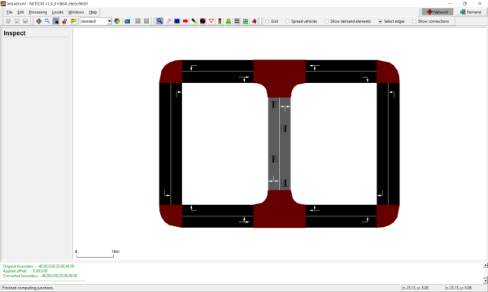

# netdiff.py

This script compares two *.net.xml* files. The call

```
python tools/net/netdiff.py A.net.xml B.net.xml diff
```

will produce 4 [plain-XML network](../Networks/PlainXML.md) files:

- diff.nod.xml
- diff.edg.xml
- diff.con.xml
- diff.tll.xml

These files contain groups of xml elements (i.e. nodes) that have been
deleted, created, or modified and can be used to investigate differences
between the two networks ***A*** and ***B***. Furthermore, these files can be used to
maintain change-sets for making repeatable modifications:

```
netconvert --sumo-net-file A.net.xml -n diff.nod.xml -e diff.edg.xml -x diff.con.xml -i diff.tll.xml -o B.net.xml
```

The above call can be used to recreate network ***B*** based on ***A*** and the
recorded change-set. Note, that for any modified elements (i.e. modified
speed limit for an edge), the file ***diff.edg.xml*** only contains to
modified attributes.

A typical use case for ```netdiff.py``` is this:

1.  [Import a network from
    OSM](../Networks/Import/OpenStreetMap.md) (call this
    ***A.net.xml***)
2.  Make some modifications with [netedit](../Netedit/index.md) (save
    this under the new name ***B.net.xml***)
3.  Use ```netdiff.py``` to create the *diff*-files
4.  At a later date, re-import the OSM network (with a newer OSM file, a
    new version of [netconvert](../netconvert.md) or different
    options)
5.  Re-apply the *diff*-files to avoid repeating manual corrections with
    [netedit](../Netedit/index.md)





## patching on import

If the patch file is to be applied during the initial network import
(e.g. from OSM), the netdiff option **-i** must be set. Due to the way
connections are guessed during network import, all connections for an
edge must be included in the patch file if any of them were changed. This
is accomplished by setting **-i** (**--patch-on-import**).

## patching a network different from the original

Sometimes it may be useful to apply the difference between networks *A* and *B* to another network *C* than differs slightly from *A*.
In this case it may be useful to only consider some of the changes (i.e. only created elements).

If only the newly created elements in *B* (relative to *A*) shall be considered, open each of the difference files (ie. diff.edg.xml, diff.nod.xml, diff.con.xml, diff.tll.xml) and keep only the elements below the heading

```
<!-- Created Elements -->"
```

This way the patch should be applicable to network *C* regardless of how it differs from the original *A*.

Sometimes, errors may occur due to inconsistent connections or traffic lights. In this case, it may be useful to only update *C* with 'diff.nod.xml and 'diff.edg.xml' and let netconvert guess
the respective connections and traffic lights.

In the end all regions where the area of *C* and *B* borders each other should be checked manually for consistency.

# createRoundaboutConnections.py

This script generates additional connections for roundabouts from a
given network. The following connections are added:

- vehicles can stay inside of the roundabout on every lane.
- vehicles can leave a roundabout even if they are driving on an inner
  lane if there are enough outgoing lanes.
  
Usage:

```
python tools/net/createRoundaboutConnections.py <net-file>
```

This creates the output file ```roundabout-connection.con.xml```, where the input network is ***<net-file\>***.


# netcheck.py

This tool checks the network (first parameter) for weak connectivity
(whether there is a route from every node to every other node,
regardless of edge direction) and prints the connected components if
not.

Additionally, you may run this script to discover which edges are
reachable from a particular edge.

```
python tools/net/netcheck.py <net-file> --source <edge_id> --selection-output selection.txt
```

This will create a file called ```selection.txt``` which can be loaded in
[sumo-gui](../sumo-gui.md) to visualize the portion of the network
reachable from ***<edge_id\>***. To visualize the selection, you must load the
file via **Edit-\>Edit chosen**. Then, you need to enable
edge coloring by selection status in the view settings dialog
**Street-\>Color by: selection**. The reachable portion of the network
will be colored differently from the unreachable portion which is
usually sufficient to figure out network modeling errors.

The options can be shortened to **-s <edge_id\>** for source edges and **-o <filename\>** for selection
output.

Using option **--destination <edge_id\>**, or **-d <edge_id\>**, lists edges which can reach the given edge. By
adding the option **--vclass <vClass\>**, or **-l <vClass\>**, the check becomes
[vClass](../Definition_of_Vehicles,_Vehicle_Types,_and_Routes.md#abstract_vehicle_class)-aware.

The option **--component-output <filename\>**, or **-c <filename\>**, writes all the identified components and their
constituent edges to the specified file. The option **--results-output <filename\>**, or **-r <filename\>**, writes the
whole network summary of largest component percentage coverage and
component edge count distribution to the specified file.

The **--component-output** and **--results-output** options are not compatible with the **--destination** or **--source options**.

Use the option **--help** for the latest version information.

# xmledges_applyOffset.py and xmlnodes_applyOffset.py

Both tools apply the given offset to the geometrical information of
edges or nodes given in the input file. The results are written into
<XMLEDGES\>.mod.xml or <XMLNODES\>.mod.xml, respectively.

```
python tools/net/xmledges_applyOffset.py <XMLEDGES-FILE> <X-OFFSET> <Y-OFFSET>
python tools/net/xmlnodes_applyOffset.py <XMLNODES-FILE> <X-OFFSET> <Y-OFFSET>
```

- <XMLEDGES-FILE\>/<XMLNODES-FILE\>: The edges/nodes file whose content shall be
  shifted
- <X-OFFSET\>: The x-offset to apply
- <Y-OFFSET\>: The y-offset to apply

# xmlconnections_mapEdges.py

Reads edge id replacements from "edgemap.txt"; the format of this file
is:

```
<OLD_EDGE_ID>-><NEW_EDGE_ID>
```

Reads the given connections file <CONNECTIONS-FILE\> and replaces old edge
names by the new ones. The result is written to <CONNECTIONS-FILE\>.mod.xml

```
python tools/net/xmlconnections_mapEdges.py <CONNECTIONS-FILE>
```

- <OLD_EDGE_ID\>: Id of an edge as used within <CONNECTIONS-FILE\>
- <NEW_EDGE_ID\>: Id of the edge to use instead
- <CONNECTIONS-FILE\>: The connections file to change

# net2kml.py

converts '.net.xml' road geometries to [KML](https://en.wikipedia.org/wiki/Keyhole_Markup_Language) format.

```
python tools/net/net2kml.py -n <net-file> -o output.kml
```

By default, normal edge geometries will be exported. This can be changed with options

- **--lanes**: write lane geometries
- **--internal**: write junction-internal edges or lanes

# net2geojson.py

converts '.net.xml' road geometries to [GeoJSON](https://en.wikipedia.org/wiki/GeoJSON) format.

```
python tools/net/net2geojson.py -n <net-file> -o output.geojson
```

By default, normal edge geometries will be exported. This can be changed with options

- **--lanes**: write lane geometries
- **--internal**: write junction-internal edges or lanes


# split_at_stops.py

Generates an .edg.xml patch file with `split` definitions to ensure that each public transport stop of the given type (default `<trainStop>`) is on a separate edge from every other stop. The tool also generates an updated `.net.xml` and stop file. Furthermore, it can adapt a route-file so it matches the updated network.

Example call:
```
python tools/net/split_at_stops.py <stopfile> -n <net-file> -r <route-file> -o <output-net-file> --stop-output <output-stop-file> --route-output <output-route-file> --stop-type busStop
```

!!! note
    A similar functionality is achieved by [stationDistricts.py --split-output FILE](District.md#stationdistrictspy) which splits edges at the midpoint between stops.

# abstractRail.py

Converts a geodetical rail network into an abstract (schematic) rail network.
If the network is segmented (with [stationDistricts.py](District.md#stationdistrictspy)), the resulting network will be
a hybrid of multiple schematic pieces being oriented in a roughly geodetical manner

Example call:
```
python tools/net/abstractRail.py -n input_net.net.xml --stop-file input_additional.add.xml --region-file stations.taz.xml --output-prefix abstract
```

It is also possible to to automatically segment the network:
```
python tools/net/abstractRail.py -n input_net.net.xml --stop-file input_additional.add.xml --split --output-prefix abstract
```

## Further options

- **--filter-regions**: Only convert the given list of regions and delete everything else
- **--keep-all**: When filtering regions, keep all other regions at their old geometry. This may be used to build region-specific patch files than can the combined to patch larger parts of the network**
- **--horizontal**: The abstract network is aligned on the horizontal
- **--track-offset**: Define the offset between parallel tracks in m (default 20)
- **--skip-building**: Only create patch files but do not assemble the new network
- **--skip**: creates a region file (taz) from the stop-file, optionally splits network edges to ensure that each edge belongs to a single station

!!! caution
    If the network is large and not segmented or if the individual station segments are large, the conversion process can take a long time. The option **--skip-large INT** can be used to selective skip large regions (measured by the number of optimization constraints, reported via **--verbose** output).

!!! caution
    If option **--skip** is used the original network may be split (under an new name) and the generated abstract network will have the same edges as the split net. The input stop-file will also be adapted for the split net (under a new name) but any traffic demand (route files) have to be adapted for the split network.
