[sumo](../sumo.md) offers a wide range of
[outputs](../Simulation/Output/index.md), but one may find it hard to
parse and visualize them. Below, you may find some tools that allow to
visualize a simulation run's results for being included in a scientific
paper. Additional tools read plain .csv-files and were added to the
suite as they offer a similar interface.

All these tools are just wrappers around the wonderful
[matplotlib](http://matplotlib.org/) library. If you are familiar with
Python, you must have a look.

The tools share a set of [common options](#common_options) to
fine-tune the appearance of the generated figures. These options' names
where chosen similar to the [matplotlib](http://matplotlib.org/) calls.

The tools are implemented in Python and need
[matplotlib](http://matplotlib.org/) to be installed. The tools can be
found in {{SUMO}}/tools/visualization.

# Current Tools

Below, you will find the descriptions of tools that should work with the
current outputs [sumo](../sumo.md)/[sumo-gui](../sumo-gui.md)
generate. To run them, you'll need:

- to install Python
- to install [matplotlib](http://matplotlib.org/)
- to set {{SUMO}}

All scripts are executed from the command line and you have to give the
command line options as listed in the descriptions below. Please note
that [\#common options](#common_options) may be applied to
all the scripts listed in the following sub-sections albeit few options
may not work for certain scripts.

## plotXMLAttributes.py

Create multiple 2D-plots of 2 arbitrary attributes from on or more xml files aggregated by an third attribute (i.e. detector-id).

Example uses:

```
python  tools/visualization/plotXMLAttributes.py -x x -y y -s fcd.xml
python  tools/visualization/plotXMLAttributes.py -x x -y y -s fcd.xml fcd2.xml
```

The above example draws the paths of all vehicles through the network based on fcd-output. (It is a special case that can also be accomplished with  [plot_trajectoriespy](#plot_trajectoriespy))

When option **--show** is set, a interactive plot is opened that allows identifying data points vehicles by clicking on the plot (dataID is printed on the console).

Option **--filter-ids ID1,ID2,...** allows restricting the plot to the given data element ids. You can use a wildcard to filter out ids that follow some pattern; for instance **--filter-ids bus_*** will filter out all ids that begin with the four characters "bus_".

Further examples are shown below. Some of them are generated with the scenario acosta, one of the published sumo scenarios (https://github.com/DLR-TS/sumo-scenarios/tree/main/bologna/acosta).

### Plot Styles

The script supports the following distinct styles of plots:

- **lineplot**: default
- **scatterplot:** with option **--scatterplot**
- **box plot:** by setting one of **--xattr @BOX** or **--yattr @BOX**
- **bar plot:** by setting either **--barplot** or **--hbarplot**

### Special Attributes

The following attribute values have a special meaning. Instead of using an attribute from the input file they derive a value based on the *other* attribute. (i.e. the special attribute is set for **--xattr** then the *other* value is given by the **--yattr**).

- `@INDEX`: the index of the *other* value within the input file is used.
- `@RANK`: the index of the *other* value within the sorted (descending) list of values is used
- `@COUNT`: the number of occurences of the *other* value is used. Together with option **--barplot** or **-hbarplot** this gives a histogram. Binning size can be set via options **--xbin** and **--ybin**.
- `@BOX`: one or more [box plots](https://en.wikipedia.org/wiki/Box_plot) of the *other* value are drawn. The **--idattr** is used for grouping and there will be one box plot per id
- `@NONE`: can be used with option **--idattr** to explicitly avoid grouping

### Multi-line plots

- By default, every distinct ID (as defined by **--idattr**) will generated a new line for all the data points associated with that ID.
- If multiple files are given, the abbreviated filename will become part of the data point ID and thereby create distinct lines or scatterpoints for data from each file
- If a comma-separated list of values is passed to option **--idattr**, then values for each of the attributes will be combined with `|` to form the data point ID
- If a comma-separated list of values given to **--xattr** or **--yattr** (or both), and the data does not supply an ID (or option **--idattr @NONE** is set) then each combination of individual xattr and yattr will create a new line

If a combined plot is needed that cannot be created with any of the above methods (i.e. because the data comes from different kinds of data files such as summary-output and edgeData) then an alternative is to use option **--csv-output** and plotting the resulting data with another tool (i.e. [gnuplot](https://en.wikipedia.org/wiki/Gnuplot)).

In csv-output each group of data points belonging to the same ID will form it's own block separated by two blank lines from the next block.
To replicate a plot where each ID/block has its distinct color, the following approach can be used in gnuplot:

```
stats 'data.csv'
plot for [idx=0:STATS_blocks] 'data.csv' i idx with lines
```

### Inductionloop Speed over Time

Input is [inductionloop-output](../Simulation/Output/Induction_Loops_Detectors_(E1).md) with 30s aggregation from 2 detectors (`<e1Detector id="e1Detector_-109_0_0" lane="-109_0" pos="54.06" period="30.00" file="data.xml"/>`

Call: `python tools/visualization/plotXMLAttributes.py data.xml -x begin -y speed -s`

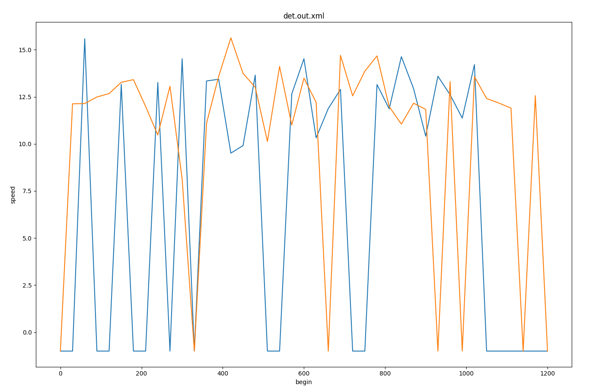

### Lane Area Detectors over nVehEntered

Input is [laneareadetectors-output](../Simulation/Output/Lanearea_Detectors_(E2).md) with 30s aggregation from 6 detectors

Call: `python tools/visualization/plotXMLAttributes.py -x begin -y maxOccupancy -o plot-maxOccupancy.png --legend e2_output.xml --filter-ids e2_0,e2_5,e2_10,e2_15,e2_20,e2_25`

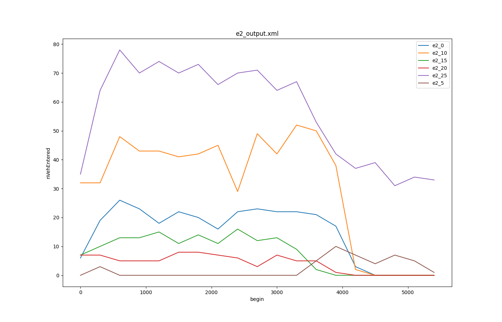

### Multi-Entry-Exit Detectors Mean Speed over Time

Input is [multi-entry-exit-detector-output](../Simulation/Output/Multi-Entry-Exit_Detectors_(E3).md) with 30s aggregation and a cutoff at begin and end

Call: `python tools/visualization/plotXMLAttributes.py -x begin -y meanSpeed detector.xml --legend --xlim 100,5000`


### boarding passengers vs delay for each station

Input is [stop-output](../Simulation/Output/StopOutput.md)

Call: `python tools/visualization/plotXMLAttributes.py stopinfos.xml -i busStop -x loadedPersons -y delay -s --scatterplot --legend`
                                                                                                  
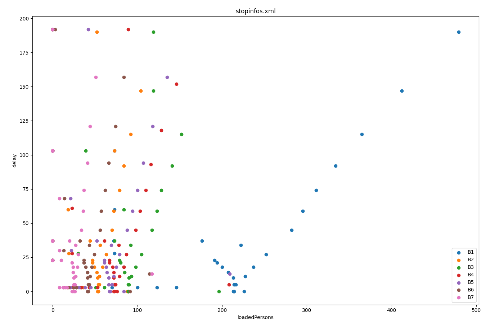

### Fundamental Diagram from edgeData

Input is [edgeData-output](../Simulation/Output/Lane-_or_Edge-based_Traffic_Measures.md) with 1-minute aggregation (`<edgeData id="example" file="data.xml" period="60"/>`)

Call: `python tools/visualization/plotXMLAttributes.py data.xml -i id -x density -y left -s  --scatterplot --yfactor 60 --ylabel vehs/hour`

Each color gives encodes a different edge-id. Option **--factor 60** is used to convert from vehicles per 60s (edgeData-period 60) to vehicles per hour.

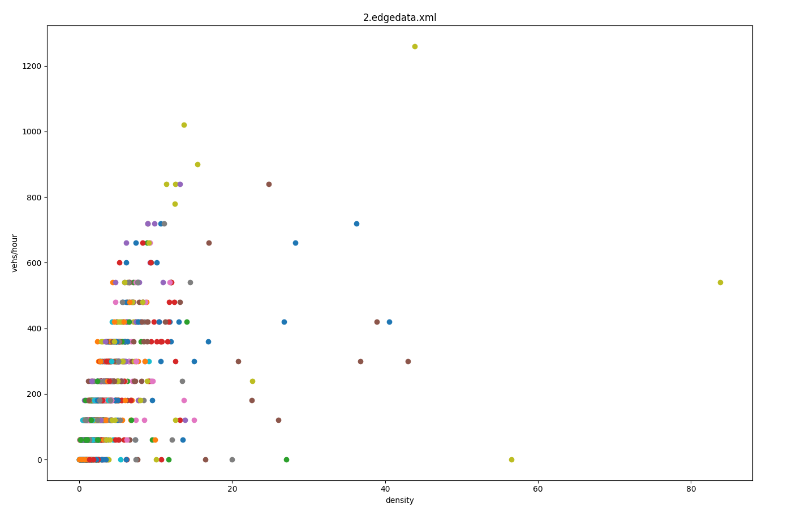

### Multiple timelines from summary-output
Input is [summary](../Simulation/Output/Summary.md).
This plot demonstrates using a list of attributes to generate multiple data points from the same xml input element.
In the absence of an id-attribute, the respective attribute name is used to "identify" and group the data points.

Call: `python tools/visualization/plotXMLAttributes.py summary.xml -x time -y running,halting -o plot-running.png --legend`

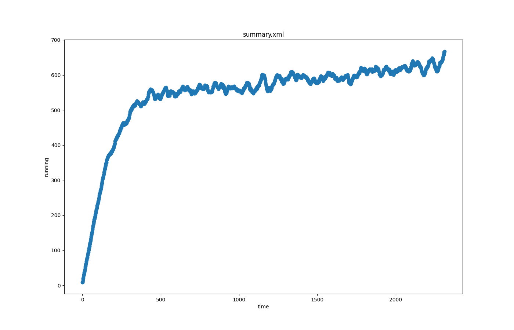

!!! caution
    In version 1.15.0 and lower, the id-attribute must be provided so you need
    to provide a dummy value (i.e. with `-i collisions`) and only a single value is
    permitted for the x and y attribute.

### Depart delay over time from TripInfo data
The plot is created out of [TripInfo](../Simulation/Output/TripInfo.md) output data:

Call `python tools/visualization/plotXMLAttributes.py -i id -x depart -y departDelay --scatterplot --xlabel "depart time [s]" --ylabel "depart delay [s]" --ylim 0,40 --xticks 0,1200,200,10 --yticks 0,40,5,10 --xgrid --ygrid --title "depart delay over depart time" --titlesize 16  tripInfo.xml`

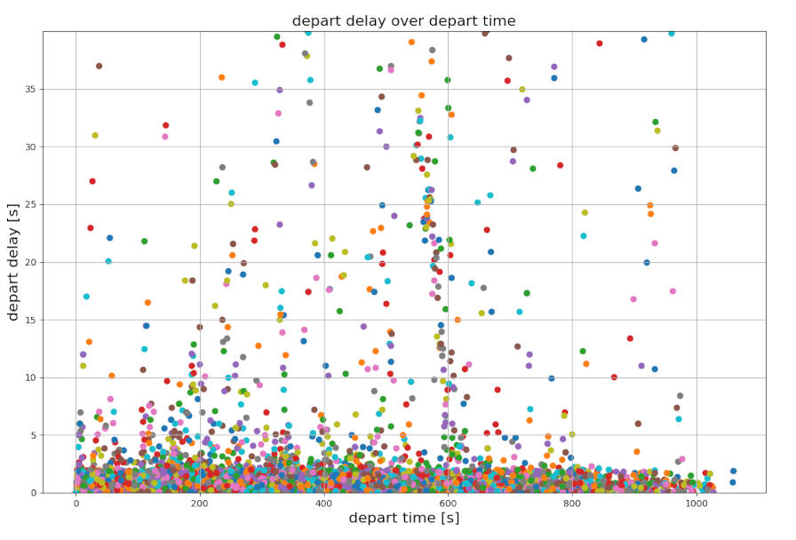

### Time to collision over simulation time

The plot is created from the output file of a SUMO simulation for which a global [SSM device](https://sumo.dlr.de/docs/Simulation/Output/SSM_Device.html) has been added. For this example, starting from the [Bologna "acosta" scenario](https://github.com/DLR-TS/sumo-scenarios/tree/main/bologna/acosta), the SUMO configuration file had been modified in order to compute time to collision:
```xml
<configuration xmlns:xsi="http://www.w3.org/2001/XMLSchema-instance" xsi:noNamespaceSchemaLocation="http://sumo.dlr.de/xsd/sumoConfiguration.xsd">
	
	<device.ssm.deterministic value="true"/>
	<device.ssm.file value="ssm.xml"/>
    <device.ssm.measures value="TTC"/>

</configuration>
```
After the simulation has finished to run, a XML file `ssm.xml` has been produced. Using this file we can extract and plot the TTC values by using the command line:
```
python.exe .\plotXMLAttributes.py ssm.xml -x time --xlabel "Time [s]" -y value --ylabel "TTC [s]" -i ego --filter-ids bus_* --title "time to collision over simulation time" --scatterplot
```


### Queuing times over time
Input is [queue-output](../Simulation/Output/QueueOutput.md).

Call to generate the plot:
```
python tools/visualization/plotXMLAttributes.py -x timestep -y queueing_time -s -o queue.png queue.xml -i id --filter-ids 121_0
```
where -x is the attribute for the x axis; -y is the attribute for the y axis; -s is to show the plot; -o is the output file name; -i is the filtered attribute name (lane id in this case); --filter-ids are the value(s) of the filtered attribute name (id = 121_0 in this case).

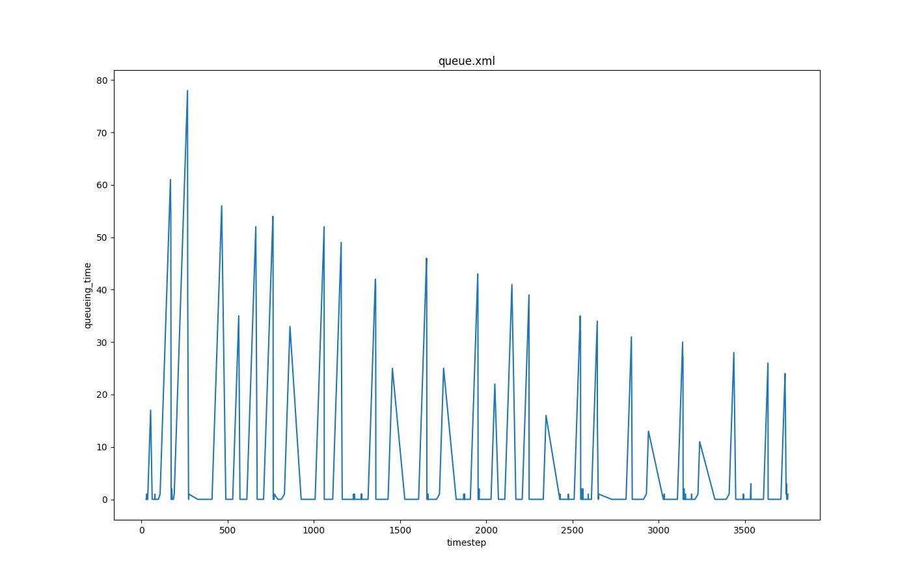

### Departure times versus arrival times
Input is [vehroutes-output](../Simulation/Output/VehRoutes.md).

Call to generate the plot:
```
python tools/visualization/plotXMLAttributes.py -x depart -y arrival -s -o vehroute.png vehroute.xml --scatterplot
```
where -x is the attribute for the x axis; -y is the attribute for the y axis; -s is to show the plot; -o is the output file name; --scatterplot is to make a scatter plot instead of a line plot.

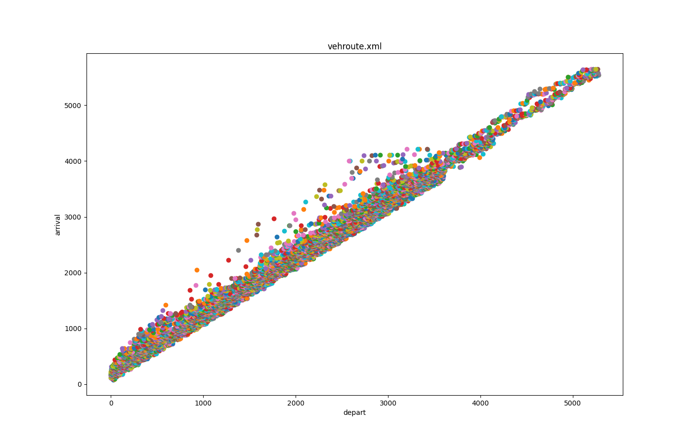

### Leader gaps versus speeds
Input is [langechange-output](../Simulation/Output/Lanechange.md).

Call to generate the plot:
```
python tools/visualization/plotXMLAttributes.py -x speed -y leaderGap -s -o lc.png langchange.xml -i reason --filter-ids speedGain
```
where -x is the attribute for the x axis; -y is the attribute for the y axis; -s is to show the plot; -o is the output file name; -i is the filtered attribute name (reason for lane changing in this case); --filter-ids are the values of the filtered attribute name (reason = speedGain in this case).

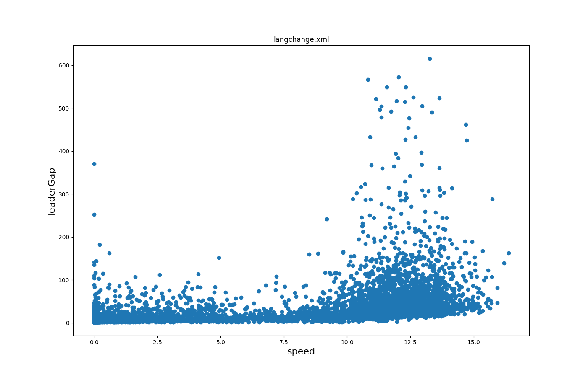

### All trajectories over time 1
Input is [fcd_output](../Simulation/Output/FCDOutput.md).

Call to generate the plot:
```
python tools/visualization/plotXMLAttributes.py -x x -y y -s -o allXY_output.png fcd.xml --scatterplot
```
where -x is the attribute for the x axis; -y is the attribute for the y axis; -s is to show the plot; -o is the output file name; --scatterplot is to make a scatter plot instead of a line plot..

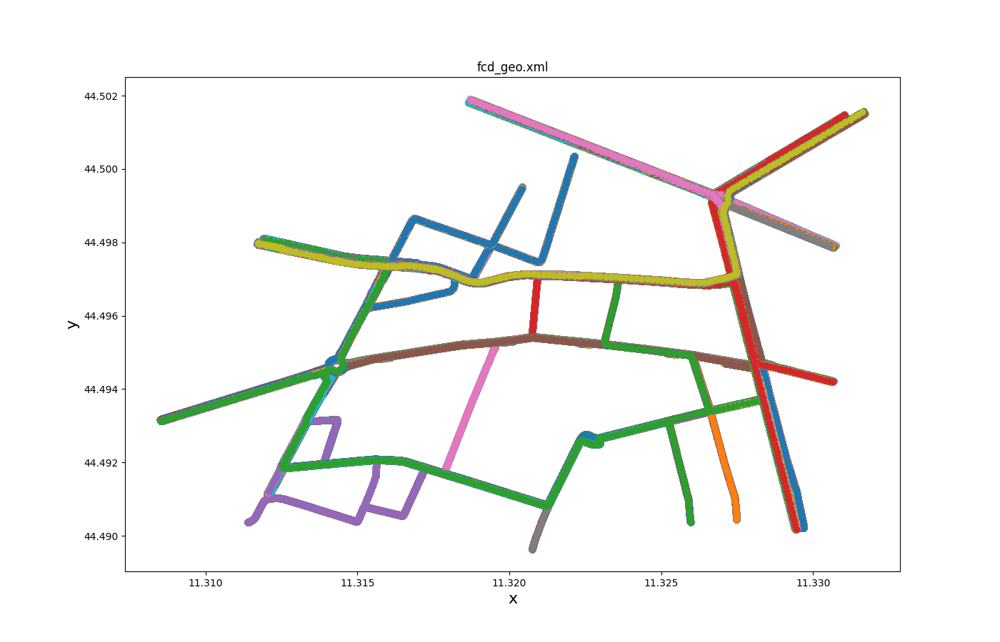

### Selected trajectories over time 1
Input is [fcd_output](../Simulation/Output/FCDOutput.md).

Call to generate the plot:
```
python tools/visualization/plotXMLAttributes.py -x x -y y -s -o vehLocations_output.png fcd.xml -i id --filter-ids Audinot_7_0 --scatterplot --legend
```
where -x is the attribute for the x axis; -y is the attribute for the y axis; -s is to show the plot; -o is the output file name; -i is the filtered attribute name (vehicle id in this case); --filter-ids are the values of the filtered attribute name (vehicle id = Audinot_7_0 in this case); --scatterplot is to make a scatter plot instead of a line plot; --legend is to show the legend.

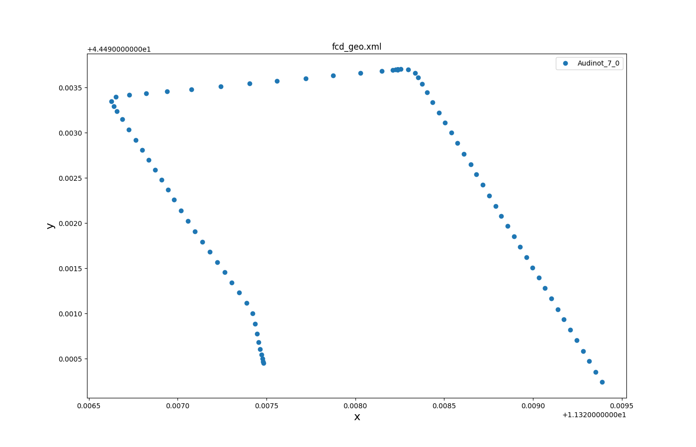

### Public transport schedule

In this type of plot time is on the y-axis running from top to bottom. Input is route file of a [public transport schedule](../Simulation/Public_Transport.md#public_transport_schedules) where each vehicle is modelled individually.
A similar plot could also be generated from [stop-output](../Simulation/Output/StopOutput.md) by using attribute `started` or `ended` (or `started,ended`) instead of `until`.


Call to generate the plot:
```
python tools/visualization/plotXMLAttributes.py route.rou.xml -x busStop -y until --ytime1 --legend --xticks-file stoplist.txt --invert-yaxis --marker o
```


The file stoplist.txt is used to define the ordering of the stops (corresponding to their ordering along a transport line) and is shown below.
In order to group busStops that belong to different tracks of the same train station, they were named with a common suffix in their id and the stoplist.txt file uses wildcards (`*`) to match them.

```
*WLA
*KI
*MM
*KX
*LHG
```

!!! note
    When plotting stops from a route file that also defines `<vType>` elements, then the option **--idelem** must be used to declare where the id attribute must be loaded from (i.e. **--idelem trip**).

### Turn-counts over time

This plot uses an attribute list for the value id (`-i from,to`) to reflect the fact that a turning relation is uniquely identified by the combination of two attributes. It also demonstrates flexible filtering to show all traffic that passes over edge `-40` or edge `36`.

Call to generate the plot:
```
python tools/visualization/plotXMLAttributes.py turnCounts.xml -i from,to -x begin -y count --xtime0 --legend  --filter-ids="-40|*,36|*"
```

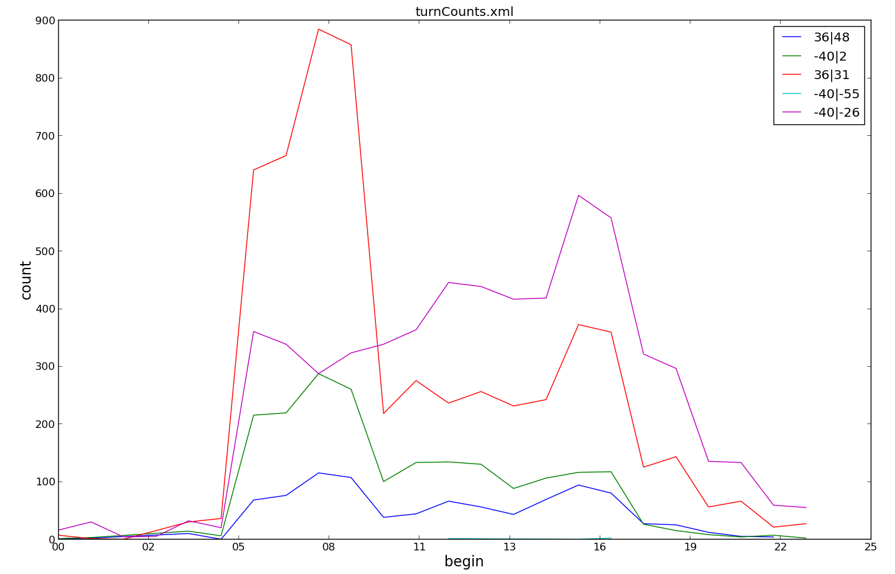


### Boxplot: waiting time by departLane

This plot demonstrates box-plotting for a single attribute (waitingTime). Optionally split by category (departLane). The call uses [tripinfo-output](../Simulation/Output/TripInfo.md) from two different simulation runs as it's input.

Call to generate the plot:
```
python tools/visualization/plotXMLAttributes.py tripinfos.xml tripinfos2.xml  -x waitingTime -y @BOX -i departLane --show
```

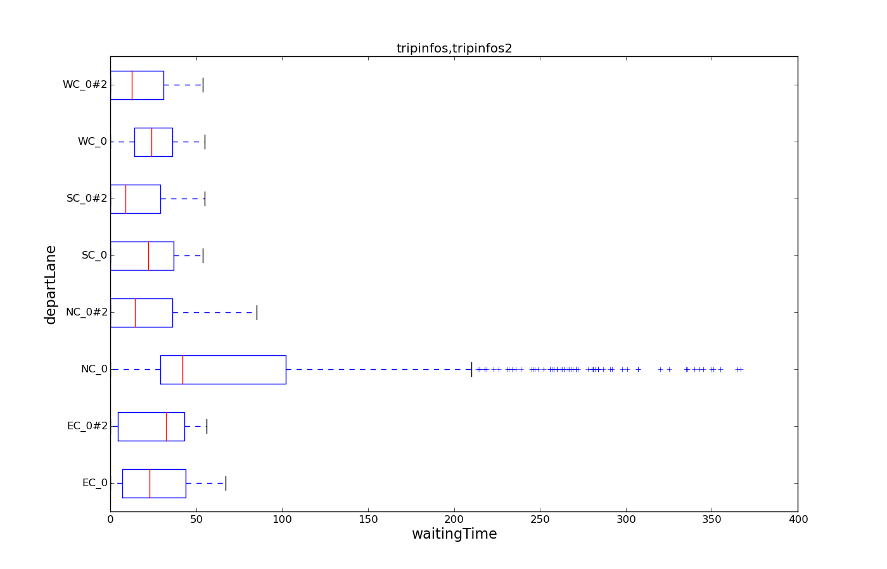

!!! note
    By swapping x-attribute and y-attribute the orientation of the boxplot can be changed from horizontal to vertical

### Histogram of timeLoss

This plot demonstrates the use of **--barplot** binning and `@COUNT` to create a histogram of timeLoss values from two simulation runs.
It also shows how to clamp data to the upper range of 300.

Call to generate the plot:
```
plotXMLAttributes.py tripinfos.xml tripinfos2.xml -x timeLoss -y @COUNT -i @NONE -s --legend  --barplot --xbin 20 --xclamp :300
```
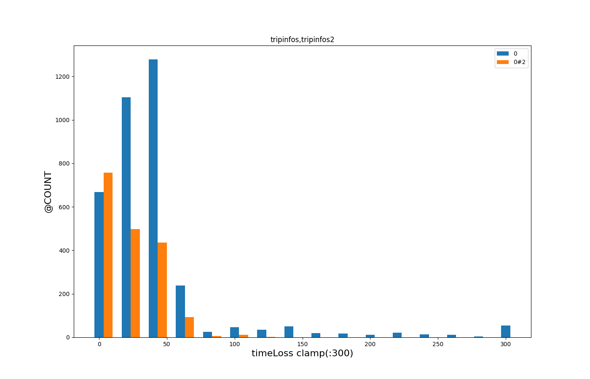

!!! caution
    It is importent to set **-i @NONE** to ensure that the timeLoss values are aggregated by file rather than by vehicle id.

## plot_trajectories.py

Create plot of all trajectories in a given **--fcd-output** file. This tool in particular is located in {{SUMO}}/tools.

Example use:

```
python tools/plot_trajectories.py fcd.xml -t td -o plot.png -s
```

The option **-t (--trajectory-type)** supports different attributes that can be plotted against each other. The argument is a two-letter code with each letter encoding an attribute that is derived from the fcd input.

!!! note
    plot_trajectories.py is similar to [plotXMLAttributes.py](#plotxmlattributespy) but specialized for [fcd-output](../Simulation/Output/FCDOutput.md). It supports derived attributes that are not present in the loaded data (driven distance) and also allows for more filtering (**--filter-route**, **--filter-edges**).

### Available Attributes

- **t**: Time in s
- **d**: Distance driven (starts with 0 at the first fcd datapoint for each vehicle). Distance is computed based on speed using Euler-integration. Set option **--ballistic** for [ballistic integration](../Simulation/Basic_Definition.md#defining_the_integration_method).
- **a**: Acceleration
- **s**: Speed (m/s)
- **i**: Vehicle angle (navigational degrees)
- **x**: X-Position in m
- **y**: Y-Position in m
- **k**: [Kilometrage](../Simulation/Railways.md#kilometrage_mileage_chainage) (requires **--fcd-output.distance**)
- **g**: gap to leader (requires **--fcd-output.max-leader-distance**)

### Examples Trajectory Types

- **td**: time vs distance
- **ts**: time vs speed
- **ta**: time vs acceleration
- **ds**: distance vs speed
- **da**: distance vs acceleration
- **xy**: Spatial plot of driving path
- **kt**: kilometrage vs time (combine with option **--invert-yaxis** to get a classic railway diagram).

### Accelerations versus distances
Input is [fcd-output](../Simulation/Output/FCDOutput.md).

Call to generate the plot:
```
python tools/plot_trajectories.py -t da -o Plot_trajectories.png fcd.xml
```
where -t is the aforementioned trajectory type; -o is the output file name.

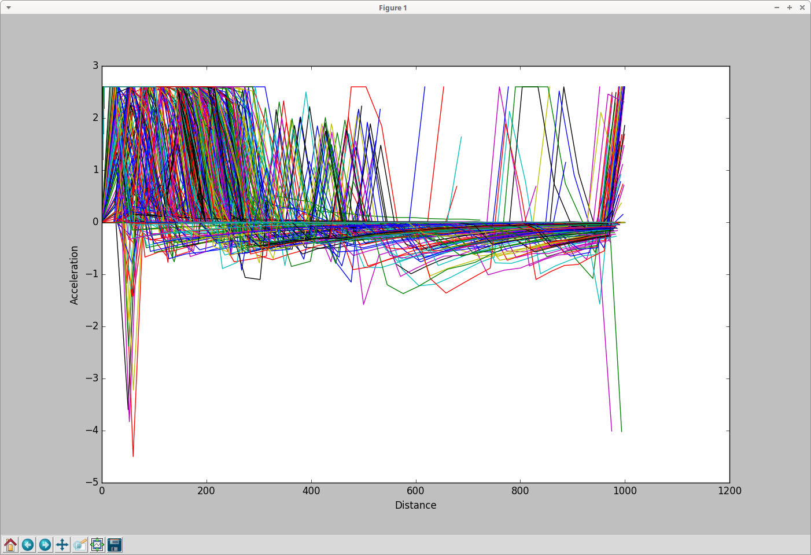

### All trajectories over time 2
Input is [fcd-output](../Simulation/Output/FCDOutput.md).

Call to generate the plot:
```
python tools/plot_trajectories.py -t xy -o allLocations_output.png fcd.xml
```
where -t is the aforementioned trajectory type; -o is the output file name.

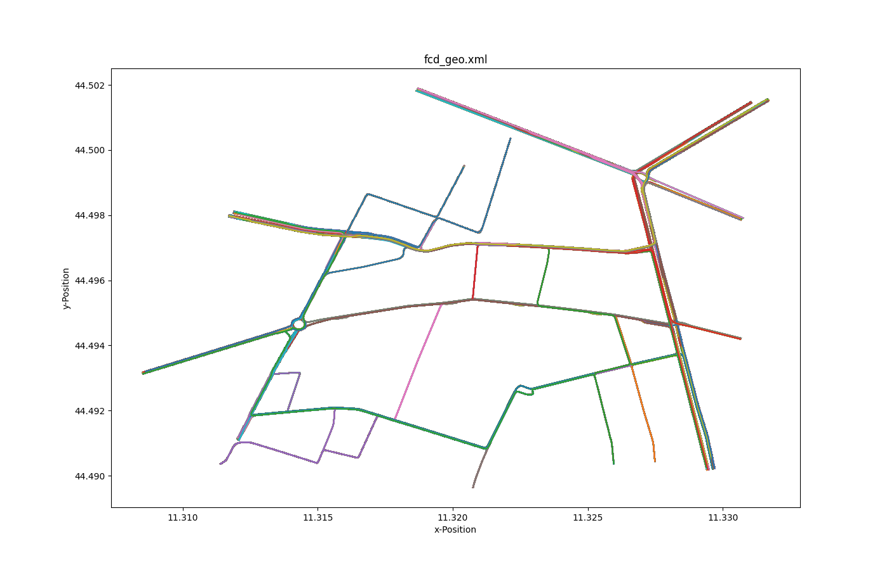

### Selected trajectories over time 2
Input is [fcd-output](../Simulation/Output/FCDOutput.md).

Call to generate the plot:
```
python tools/plot_trajectories.py -t xy -o selectXY_output.png fcd.xml --filter-ids Audinot_7_0
```
where -t is the aforementioned trajectory type; -o is the output file name;--filter-ids are the value(s) of the filtered attributes (id = Audinot_7_0 in this case).

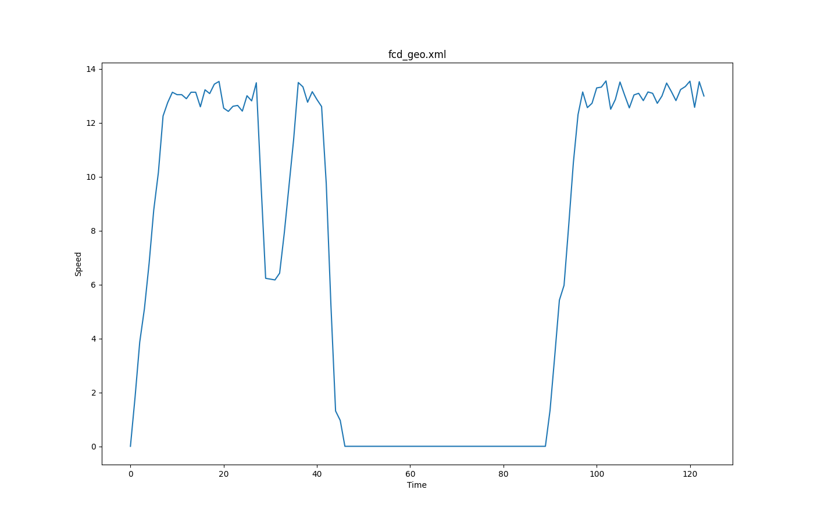

### FCD based speeds over time
Input is [fcd-output](../Simulation/Output/FCDOutput.md).

Call to generate the plot:
```
python tools/plot_trajectories.py -t ts -o timeSpeed_output.png fcd.xml --filter-ids Audinot_7_0,Costa_12_0,Pepoli_3_0,Silvani_11_0,XXI_APRILE_7_0 --legend
```
where -t is the aforementioned trajectory type; -o is the output file name; --filter-ids are the value(s) of the filtered attributes (id in [Audinot_7_0, Costa_12_0, Pepoli_3_0, Silvani_11_0, XXI_APRILE_7_0] in this case); --legend is to show the legend

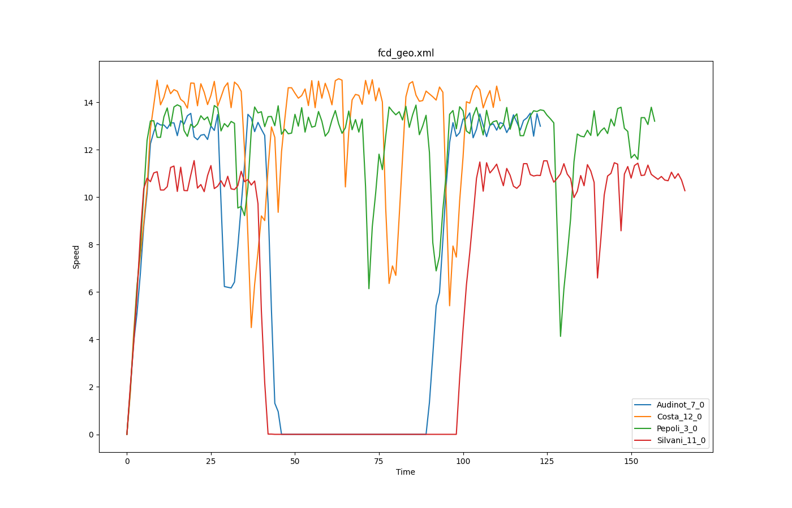

### Interactive Plot

When option **-s** is set, a interactive plot is opened that allows
identifying vehicles by clicking on the respective line (vehicle ids is
printed in the console).

### Filtering

Option **--filter-route EDGE1,EDGE2,...** allows restricting the plot to all trajectories that contain the
given set of edges.

Option **--filter-ids ID1,ID2,...** allows restricting the plot to the given vehicle ids


## plot_net_dump.py

plot_net_dump.py shows a network, where the network edges' colors and
width are set in dependence to defined edge attributes. The edge weights
are read from "edgedumps" - [edgelane
traffic](../Simulation/Output/Lane-_or_Edge-based_Traffic_Measures.md),
[edgelane
emissions](../Simulation/Output/Lane-_or_Edge-based_Emissions_Measures.md),
or [edgelane
noise](../Simulation/Output/Lane-_or_Edge-based_Noise_Measures.md).

<table>
<tbody>
<tr class="odd">
<td><figure>
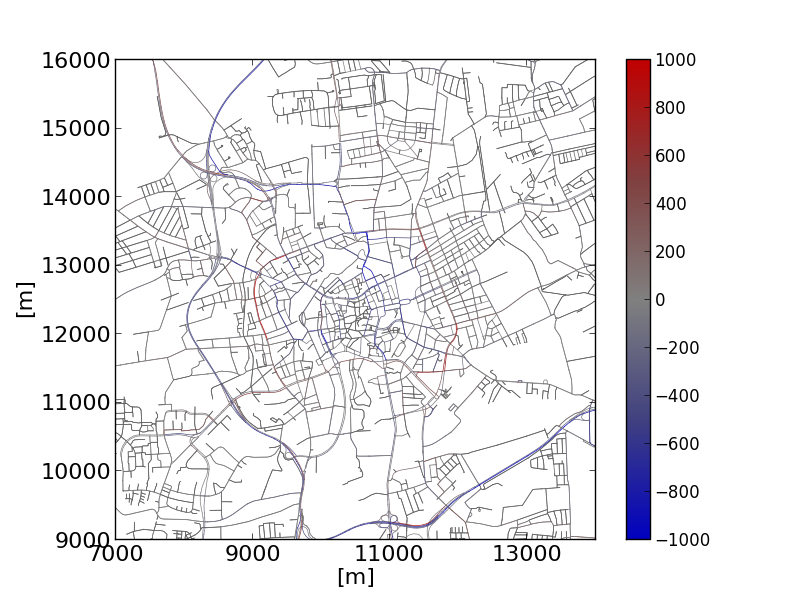</figure></td>
<td><p><code>python plot_net_dump.py -v -n bs.net.xml \</code><br />
<code> --xticks 7000,14001,2000,16 --yticks 9000,16001,1000,16 \</code><br />
<code> --measures entered,entered --xlabel [m] --ylabel [m] \</code><br />
<code> --default-width 1 -i base-jr.xml,base-jr.xml \</code><br />
<code> --xlim 7000,14000 --ylim 9000,16000 -\</code><br />
<code> --default-width .5 --default-color #606060 \</code><br />
<code> --min-color-value -1000 --max-color-value 1000 \</code><br />
<code> --max-width-value 1000 --min-width-value -1000  \</code><br />
<code> --max-width 3 --min-width .5 \</code><br />
<code> --colormap "#0:#0000c0,.25:#404080,.5:#808080,.75:#804040,1:#c00000"</code></p>
<p>It shows the shift in traffic in the city of Brunswick, Tuesday-Thursday week type after establishing an environmental zone.</p></td>
</tr>
<tr class="even">
<td><figure>
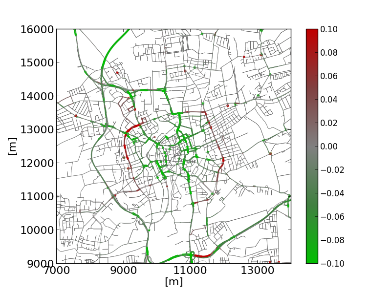</figure></td>
<td><p><code>python plot_net_dump.py -v -n bs.net.xml \</code><br />
<code> --xticks 7000,14001,2000,16 --yticks 9000,16001,1000,16 \</code><br />
<code> --measures NOx_normed,NOx_normed --xlabel [m] --ylabel [m] \</code><br />
<code> --default-width 1 -i HBEFA_base-jr.xml,HBEFA_base-jr.xml \</code><br />
<code> --xlim 7000,14000 --ylim 9000,16000 \</code><br />
<code> --default-width .5 --default-color #606060 \</code><br />
<code> --min-color-value -.1 --max-color-value .1 \</code><br />
<code> --max-width-value .1  --max-width 3 --min-width .5 \</code><br />
<code> --colormap "#0:#00c000,.25:#408040,.5:#808080,.75:#804040,1:#c00000"</code></p>
<p>Showing the according changes in NOx emissions.</p></td>
</tr>
</tbody>
</table>

- both, **--dump-inputs** {{DT_FILE}},{{DT_FILE}} as well as **--measures** {{DT_STR}},{{DT_STR}} expect two entries being divided by a ','. The
  first is used for the edges' color, the second for their widths. But
  you may simply skip one entry. Then, the default values are used.
- dump-files cover usually more than one interval. To generate an extra output file for each interval, use the string '%s' as part of the output filename (this part will be replaced with the corresponding begin time).

!!! caution
    If two input files are given they must cover the same time intervals or no data will be plotted.

**Options**

Here the most important options are listed. Use **--help** to see all options.

| Option                                               | Description                                         |
|------------------------------------------------------|-----------------------------------------------------|
| **-n** {{DT_FILE}}<br>**--net** {{DT_FILE}}                            | Defines the network to read                         |
| **-i** {{DT_FILE}},{{DT_FILE}}<br>**--dump-inputs** {{DT_FILE}},{{DT_FILE}}      | Defines the dump-output files to use as input       |
| **-m** {{DT_STR}},{{DT_STR}}<br>**--measures** {{DT_STR}},{{DT_STR}} | Define which measure to plot;default: speed,entered |
| **-w** {{DT_FLOAT}}<br>**--default-width** {{DT_FLOAT}}                | Defines the default edge width; default: .1         |
| **-c** {{DT_Color}}<br> **--default-color** {{DT_Color}}                | Defines the default edge color       |
| **--min-width** {{DT_FLOAT}}                                  | Defines the minimum edge width; default: .5         |
| **--max-width** {{DT_FLOAT}}                                  | Defines the maximumedge width; default: 3           |
| **--log-colors**                                         | If set, colors are log-scaled                       |
| **--log-widths**                                         | If set, widths are log-scaled                       |
| **--min-color-value** {{DT_FLOAT}}                            | If set, defines the minimum edge color value        |
| **--max-color-value** {{DT_FLOAT}}                            | If set, defines the maximum edge color value        |
| **--min-width-value** {{DT_FLOAT}}                            | If set, defines the minimum edge width value        |
| **--max-width-value** {{DT_FLOAT}}                            | If set, defines the maximum edge width value        |
| **-v**<br>**--verbose**                                     | If set, the progress is printed on the screen       |
| **--internal**                                     | If set, internal edges (of junctions) are included to the genrated shapes.       |

## plot_net_selection.py

plot_net_selection.py reads a road network and a selection file as
written by [sumo-gui](../sumo-gui.md). It plots the road network,
choosing a different color and width for the edges which are within the
selection (all edge with at least one lane in the selection).

<table>
<tbody>
<tr class="odd">
<td><figure>
</figure></td>
<td><p><code>python plot_net_selection.py -n bs.net.xml \</code><br />
<code> --xlim 7000,14000 --ylim 9000,16000 \</code><br />
<code> -i selection_environmental_zone.txt \</code><br />
<code> --xlabel [m] --ylabel [m] \</code><br />
<code> --xticks 7000,14001,2000,16 --yticks 9000,16001,1000,16 \</code><br />
<code> --selected-width 1 --edge-width .5 -o selected_ez.png \</code><br />
<code> --edge-color #606060 --selected-color #800000 </code></p>
<p>The example shows the selection of an "environmental zone".</p></td>
</tr>
</tbody>
</table>

**Options**

| Option                          | Description                                            |
|---------------------------------|--------------------------------------------------------|
| **-n** {{DT_FILE}}<br>**--net** {{DT_FILE}}       | Defines the network to read                            |
| **-i** {{DT_FILE}}<br>**--selection** {{DT_FILE}} | Defines selection file to read                         |
| **--selected-width** {{DT_FLOAT}}        | Defines the width for selected edges;default: 1        |
| **--selected-color** {{DT_Color}}        | Defines the color for selected edges; default: r (red) |
| **--edge-width** {{DT_FLOAT}}            | Defines the default edge width; default: .2            |
| **--edge-color** {{DT_Color}}            | Defines the default edge color; default: \#606060       |
| **-v**<br>**--verbose**                 | If set, the progress is printed on the screen          |

## plot_net_speeds.py

plot_net_speeds.py reads a road network and plots it using the allowed
speeds to color the edges. It is rather an example for using measures
read from the network file.

<table>
<tbody>
<tr class="odd">
<td><figure>
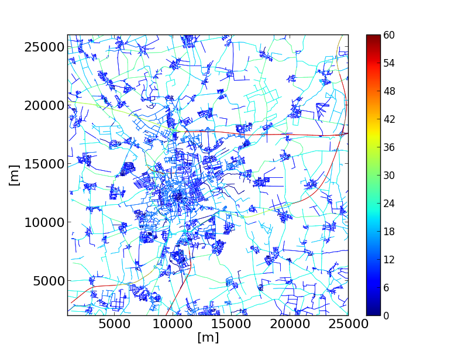</figure></td>
<td><p><code>python plot_speeds.py -n bs.net.xml --xlim 1000,25000 \</code><br />
<code> --ylim 2000,26000 --edge-width .5 -o speeds2.png \</code><br />
<code> --minV 0 --maxV 60 --xticks 16 --yticks 16 \</code><br />
<code> --xlabel [m] --ylabel [m] --xlabelsize 16 --ylabelsize 16 \</code><br />
<code> --colormap jet</code></p>
<p>The example colors the streets in Brunswick, Germany by their maximum allowed speed.</p></td>
</tr>
</tbody>
</table>

**Options**

| Option                    | Description                                      |
|---------------------------|--------------------------------------------------|
| **-n** {{DT_FILE}}<br>**--net** {{DT_FILE}} | Defines the network to read                      |
| **--edge-width** {{DT_FLOAT}}      | Defines the default edge width; default: .2      |
| **--edge-color** {{DT_Color}}      | Defines the default edge color; default: \#606060 |
| **--minV** {{DT_FLOAT}}            | Define the minimum value boundary                |
| **--maxV** {{DT_FLOAT}}            | Define the maximum value boundary                |
| **-v**<br>**--verbose**           | If set, the script says what it's doing          |

## plot_net_trafficLights.py

plot_net_trafficLights.py reads a road network and plots it and
additionally adds dots/markers at the position of traffic lights that
are part of the net.

<table>
<tbody>
<tr class="odd">
<td><figure>
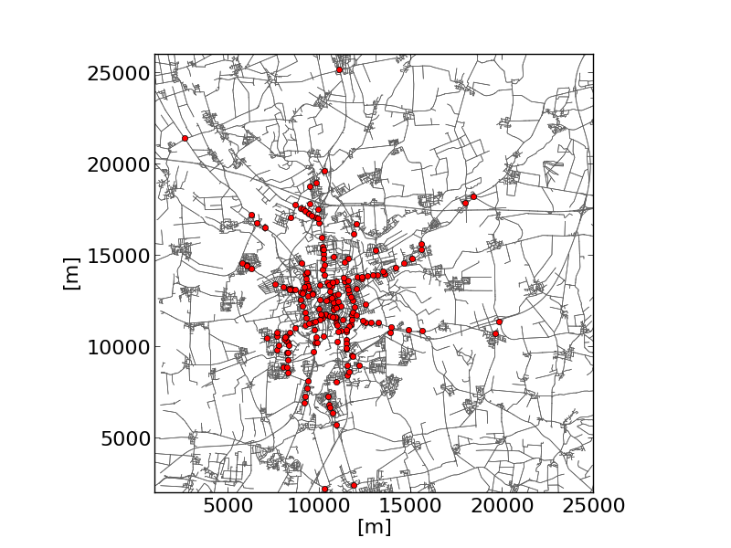</figure></td>
<td><p><code>python plot_trafficLights.py -n bs.net.xml \</code><br />
<code> --xlim 1000,25000 --ylim 2000,26000 --edge-width .5 \</code><br />
<code> --xticks 16 --yticks 16 --xlabel [m] --ylabel [m] \ </code><br />
<code> --xlabelsize 16 --ylabelsize 16 --width 5 \</code><br />
<code> --edge-color #606060</code></p>
<p>The example shows the traffic lights in Brunswick.</p></td>
</tr>
</tbody>
</table>

**Options**

| Option                    | Description                                      |
|---------------------------|--------------------------------------------------|
| **-n** {{DT_FILE}}<br>**--net** {{DT_FILE}} | Defines the network to read                      |
| **--edge-width** {{DT_FLOAT}}      | Defines the default edge width; default: .2      |
| **--edge-color** {{DT_Color}}      | Defines the default edge color; default: \#606060 |
| **--minV** {{DT_FLOAT}}            | Define the minimum value boundary                |
| **--maxV** {{DT_FLOAT}}            | Define the maximum value boundary                |
| **-v**<br>**--verbose**           | If set, the script says what it's doing          |

## plot_summary.py

plot_summary.py reads one or multiple
[summary-files](../Simulation/Output/Summary.md) and plots a
selected measure (attribute of the read
[summary-files](../Simulation/Output/Summary.md)). The measure is
visualised as a time line along the simulation time.

<table>
<tbody>
<tr class="odd">
<td><figure>
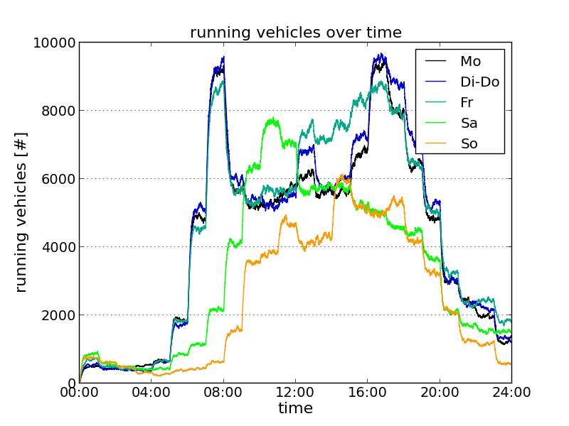</figure></td>
<td><p><code>python plot_summary.py </code><br />
<code> -i mo.xml,dido.xml,fr.xml,sa.xml,so.xml \</code><br />
<code> -l Mo,Di-Do,Fr,Sa,So --xlim 0,86400 --ylim 0,10000 </code><br />
<code> -o sumodocs/summary_running.png --yticks 0,10001,2000,14 \</code><br />
<code> --xticks 0,86401,14400,14 --xtime1 --ygrid \</code><br />
<code> --ylabel "running vehicles [#]" --xlabel "time" \</code><br />
<code> --title "running vehicles over time" --adjust .14,.1 </code></p>
<p>The example shows the numbers of vehicles running in a large-scale scenario of the city of Brunswick over the day for the standard week day classes. "mo.xml", "dido.xml", "fr.xml", "sa.xml", and "so.xml" are <a href="../Simulation/Output/Summary.html" title="wikilink">summary-files</a> resulting from simulations of the weekday-types Monday, Tuesday-Thursday, Friday, Saturday, and Sunday, respectively.</p></td>
</tr>
</tbody>
</table>

**Options**

| Option                                                   | Description                                                         |
|----------------------------------------------------------|---------------------------------------------------------------------|
| **-i** {{DT_FILE}}\[,{{DT_FILE}}\]\*<br>**--summary-inputs** {{DT_FILE}}[,{{DT_FILE}}]* | Defines the [summary-file](../Simulation/Output/Summary.md)(s) to read            |
| **-m** {{DT_STR}}<br>**--measure** {{DT_STR}}                        | Defines the measure to read from the summary file; default: *running* |
| **-v**<br>**--verbose**                                          | If set, the progress is printed on the screen                       |
| **--dpi** {{DT_FLOAT}}                                           | Define dpi resolution for figures; default: *None*                       |

## plot_tripinfo_distributions.py

plot_tripinfo_distributions.py reads one or multiple
[tripinfo-files](../Simulation/Output/TripInfo.md) and plots a
selected measure (attribute of the read
[tripinfo-files](../Simulation/Output/TripInfo.md)). The measure is
visualised as vertical bars that represent the numbers of occurrences of
the measure (vehicles) that fall into a bin.

<table>
<tbody>
<tr class="odd">
<td><figure>
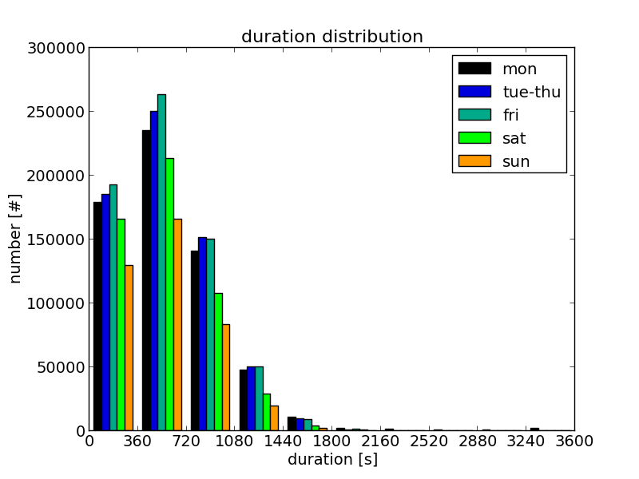
</figure></td>
<td><p><code>python plot_tripinfo_distributions.py \</code><br />
<code> -i mo.xml,dido.xml,fr.xml,sa.xml,so.xml \</code><br />
<code> -o tripinfo_distribution_duration.png -v -m duration \</code><br />
<code> --minV 0 --maxV 3600 --bins 10 --xticks 0,3601,360,14 \</code><br />
<code> --xlabel "duration [s]" --ylabel "number [#]" \</code><br />
<code> --title "duration distribution" \</code><br />
<code> --yticks 14 --xlabelsize 14 --ylabelsize 14 --titlesize 16 \</code><br />
<code> -l mon,tue-thu,fri,sat,sun --adjust .14,.1 --xlim 0,3600</code></p>
<p>The example shows the travel time distribution for the vehicles of different week day classes (Braunschweig scenario). "mo.xml", "dido.xml", "fr.xml", "sa.xml", and "so.xml" are <a href="../Simulation/Output/TripInfo.html" title="wikilink">tripinfo-files</a> resulting from simulations of the weekday-types Monday, Tuesday-Thursday, Friday, Saturday, and Sunday, respectively.</p></td>
</tr>
<tr class="even">
<td><figure>
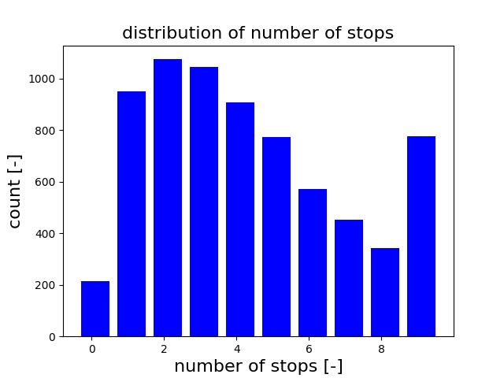
</figure></td>
<td><p><code>python plot_tripinfo_distributions.py -i tripinfo.xml -o stopCountDist.png \</code><br/>
<code> --measure waitingCount --bins 10 --maxV 10 \</code><br/>
<code> --xlabel "number of stops [-]" --ylabel "count [-]" \</code><br/>
<code> --title "distribution of number of stops" --colors blue -b --no-legend</code></p>
<p>The example shows the distribution of stops the vehicles had to make during their trip. Vehicles with more than 9 stops are added to the last bin of the histogram.
</p></td>
</tr>
</tbody>
</table>

**Options**

| Option                                                     | Description                                                                                  |
|------------------------------------------------------------|----------------------------------------------------------------------------------------------|
| **-i** {{DT_FILE}}[,{{DT_FILE}}]\*<br>**--tripinfos-inputs** {{DT_FILE}}[,{{DT_FILE}}]* | Defines the [summary-file](../Simulation/Output/Summary.md)(s) to read         |
| **-m** {{DT_STR}}<br>**--measure** {{DT_STR}}                          | Defines the measure to read from the summary file                                            |
| **-v**<br>**--verbose**                                            | If set, the progress is printed on the screen                                                |
| **--bins** {{DT_INT}}                                               | The number of bins to devide the values into                                                 |
| **--norm** {{DT_FLOAT}}                                             | Defines a number by which read values are divided; default: 1.0                              |
| **--minV** {{DT_FLOAT}}                                             | The minimum value; if set, read values that are lower than this value are set to this value  |
| **--maxV** {{DT_FLOAT}}                                             | The maximum value; if set, read values that are higher than this value are set to this value |

## plot_csv_timeline.py

plot_csv_timeline.py reads a .csv file and plots columns selected
using the **--columns** {{DT_INT}}\[,{{DT_INT}}\]\* option. The values are visualised as lines.

<table>
<tbody>
<tr class="odd">
<td><figure>
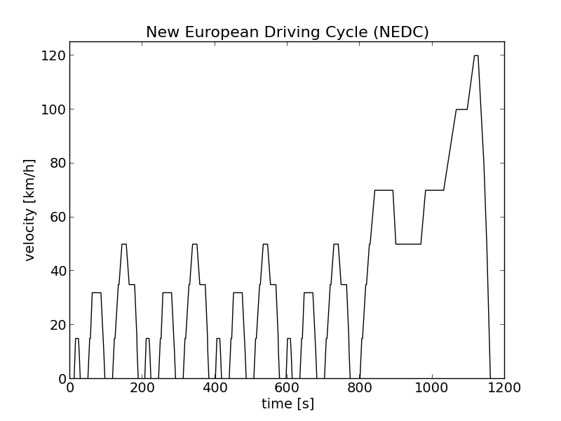</figure></td>
<td><p><code>plot_csv_timeline.py \</code><br />
<code> -i nefz.csv -c 1 --no-legend --xlabel "time [s]" \</code><br />
<code> --ylabel "velocity [km/h]" --xlabelsize 14 --ylabelsize 14 \</code><br />
<code> --xticks 14 --yticks 14 --colors k --ylim 0,125 \</code><br />
<code> --output nefz.png \</code><br />
<code> --title "New European Driving Cycle (NEDC)" --titlesize 16</code></p>
<p>The example shows the <a href="../Tools/Emissions.html#driving_cycles" title="wikilink">New European Driving Cycle (NEDC)</a>.</p></td>
</tr>
</tbody>
</table>

**Options**

| Option                                        | Description                                   |
|-----------------------------------------------|-----------------------------------------------|
| **-i** {{DT_FILE}}<br>**--input** {{DT_FILE}}                   | Defines the input file to use                 |
| **-c** {{DT_INT}}\[,{{DT_INT}}\]\*<br>**--columns** {{DT_INT}}\[,{{DT_INT}}\]\* | Defines which columns shall be plotted        |
| **-v**<br>**--verbose**                               | If set, the progress is printed on the screen |

## plot_csv_pie.py

plot_csv_pie.py reads a .csv file that is assumed to contain a name in
the first and an according value in the second column. The read
name/value-pairs are visualised as a pie chart.

<table>
<tbody>
<tr class="odd">
<td><figure>
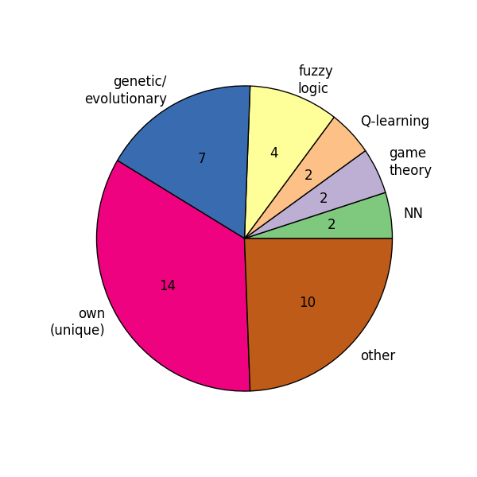
</figure></td>
<td><p><code>plot_csv_pie.py \</code><br />
<code> -i paradigm.csv -b --colormap Accent --no-legend -s 6,6 </code></p><br><br><b>Note:</b> Please note that you should set the width and the height to the same value using the <b>--size</b> &lt;FLOAT&gt;,&lt;FLOAT&gt; option, see <a href="#common_options">#common options</a>. Otherwise you'll get an oval.</td>
</tr>
</tbody>
</table>

**Options**

| Option                      | Description                                           |
|-----------------------------|-------------------------------------------------------|
| **-i** {{DT_FILE}}<br>**--input** {{DT_FILE}} | Defines the input file to read                        |
| **-p**<br>**--percentage**          | Interprets read measures as percentages               |
| **-r**<br>**--revert**              | Reverts the order of read values before plotting them |
| **--no-labels**                 | Does not plot the labels                              |
| **--shadow**                    | Puts a shadow below the circle                        |
| **--startangle** {{DT_FLOAT}}        | Sets the start angle                                  |
| **-v**<br>**--verbose**             | If set, the progress is printed on the screen         |

## plot_csv_bars.py

plot_csv_bars.py reads a .csv file that is assumed to contain a name
in the first and an according value in the second column. The read
name/value-pairs are visualised as a bar chart.

<table>
<tbody>
<tr class="odd">
<td><figure>

</figure></td>
<td><p><code>plot_csv_bars.py \</code><br />
<code> -i nox_effects.txt --colormap RdYlGn --no-legend --width .4 \</code><br />
<code> -s 8,4 --revert --xlim 0,50 --xticks 0,51,10,16 --yticks 16 \</code><br />
<code> --adjust .28,.1,.95,.9 --show-values </code></p></td>
</tr>
</tbody>
</table>

**Options**

| Option                        | Description                                                             |
|-------------------------------|-------------------------------------------------------------------------|
| **-i** {{DT_FILE}}<br>**--input** {{DT_FILE}}   | Defines the csv file to use as input                                    |
| **-x** {{DT_INT}}<br>**--column** {{DT_INT}}    | Defines which column of the read .csv-file shall be plotted; default: 1 |
| **-r**<br>**--revert**                | Reverts the order of read values before plotting them                   |
| **-w** {{DT_FLOAT}}<br>**--width** {{DT_FLOAT}} | Defines the width of the bars; default: .8                              |
| **--space** {{DT_FLOAT}}               | Defines the space between the bars; default: .2                         |
| **--norm** {{DT_FLOAT}}                | Defines a number by which read values are divided; default: 1.0         |
| **--show-values**                 | Shows the values                                                        |
| **--values-offset** {{DT_FLOAT}}       | Position offset for values                                              |
| **--vertical**                    | Draws vertical bars (default are horizontal bars)                       |
| **--no-labels**                   | Does not plot the labels                                                |
| **-v**<br>**--verbose**               | If set, the progress is printed on the screen                           |

## common options

The following options are common to all previously listed tools. They
can be divided into two groups:

- options for formatting the figure (including adding captions etc.)
- options for determining what to do with the generated figure

The options are listed and discussed in the following sub-sections,
respectively.

### Formatting Options

| Option                                                               | Description                                                 |
|----------------------------------------------------------------------|-------------------------------------------------------------|
| **--colors** {{DT_Color}}                                                    | Uses the given colors; the number of given colors must be the same as the number of measures to plot                                                                                                                                                                                   |
| **--colormap** {{DT_STR}}                                                  | Uses the named colormap                                                                                                                                                                                                                                                                |
| **--labels** `<LABELS>`<br>**-l** `<LABELS>`                                     | Uses the given labels; the number of given labels must be the same as the number of measures to plot                                                                                                                                                                                   |
| **--xlim** `<XMIN>`,`<XMAX>`                                                 | Describes the limits of the figure along the x-axis                                                                                                                                                                                                                                    |
| **--ylim** `<YMIN>`,`<YMAX>`                                                 | Describes the limits of the figure along the y-axis                                                                                                                                                                                                                                    |
| **--xticks** `<XMIN>`,`<XMAX>`,`<XSTEP>`,`<XSIZE>`<br>**--yticks** `<XSIZE>`           | If only one number is given, it is interpreted as the size of the tick labels on the x-axis; if four numbers are given, they are interpreted as the lowest ticks position, the highest ticks position, the step between ticks, and the tick's size, respectively, all along the x-axis |
| **--yticks** `<XMIN>`,`<XMAX>`,`<XSTEP>`,`<XSIZE>` <br>**--yticks** `<XSIZE>`           | If only one number is given, it is interpreted as the size of the tick labels on the y-axis; if four numbers are given, they are interpreted as the lowest ticks position, the highest ticks position, the step between ticks, and the tick's size, respectively, all along the y-axis |
| **--xtime0**                                                             | If set, the tick labels along the x-axis are formatted as time entries (hh)                                                                                                                                                                                                         |
| **--ytime0**                                                             | If set, the tick labels along the y-axis are formatted as time entries (hh)                                                                                                                                                                                                         |
| **--xtime1**                                                             | If set, the tick labels along the x-axis are formatted as time entries (hh:mm)                                                                                                                                                                                                         |
| **--ytime1**                                                             | If set, the tick labels along the y-axis are formatted as time entries (hh:mm)                                                                                                                                                                                                         |
| **--xtime2**                                                             | If set, the tick labels along the x-axis are formatted as time entries (hh:mm:ss)                                                                                                                                                                                                      |
| **--ytime2**                                                             | If set, the tick labels along the y-axis are formatted as time entries (hh:mm:ss)                                                                                                                                                                                                      |
| **--xgrid**                                                              | If set, a grid along the ticks on the x-axis is drawn                                                                                                                                                                                                                                  |
| **--ygrid**                                                              | If set, a grid along the ticks on the y-axis is drawn                                                                                                                                                                                                                                  |
| **--xticksorientation** {{DT_FLOAT}}                                          | The orientation of the x-ticks (in °); default: matplotlib default                                                                                                                                                                                                                     |
| **--yticksorientation** {{DT_FLOAT}}                                          | The orientation of the y-ticks (in °); default: matplotlib default                                                                                                                                                                                                                     |
| **--xlabel** {{DT_STR}}                                                    | Defines the label to set for the x-axis                                                                                                                                                                                                                                                |
| **--ylabel** {{DT_STR}}                                                    | Defines the label to set for the y-axis                                                                                                                                                                                                                                                |
| **--xlabelsize** {{DT_FLOAT}}                                                 | Defines the size of the label of the x-axis                                                                                                                                                                                                                                            |
| **--ylabelsize** {{DT_FLOAT}}                                                 | Defines the size of the label of the y-axis                                                                                                                                                                                                                                            |
| **--marker** {{DT_STR}}                                                  | Matplotlib marker style for drawing points; default: 'o' for dots in scatter plot, otherwise not used                                                                                                                                                                                         |
| **--linestyle** {{DT_STR}}                                                  | Matplotlib line style for drawing lines; default: '-' for continuous lines                                                                                                                                                                                                              |
| **--title** {{DT_STR}}                                                     | Defines the title of the figure                                                                                                                                                                                                                                                        |
| **--titlesize** {{DT_FLOAT}}                                                  | Defines the size of the title                                                                                                                                                                                                                                                          |
| **--adjust** {{DT_FLOAT}},{{DT_FLOAT}}<br>**--adjust** {{DT_FLOAT}},{{DT_FLOAT}},{{DT_FLOAT}},{{DT_FLOAT}} | Adjust the plot; If two floats are given, they are interpreted as left and bottom values, if four numbers are given, they are interpreted as left, bottom, right, top                                                                                                                  |
| **--size** {{DT_FLOAT}},{{DT_FLOAT}}                                               | Defines the size of figure                                                                                                                                                                                                                                                             |
| **--no-legend**                                                          | If set, no legend is drawn                                                                                                                                                                                                                                                             |
| **--legend-position** {{DT_STR}}                                           | Defines the position of the legend; default: matplolib default                                                                                                                                                                                                                         |
| **--alpha** {{DT_FLOAT}}                                           | Defines the opacity of the plot background in the range 0=fully transparent to 1=opaque; default: 1                                                                                                                                                                                           |

### Interaction Options

If one of the scripts is simply started with no options that are listed
below, the figure will be shown. To write the figure additionally into a
file, the filename to generate must be given using the **--output** {{DT_FILE}} (or **-o** {{DT_FILE}} for short).

If the script is run in a batch file, it is often not convenient to show
the figure (once known it is as it should be). In such cases, the option
**--blind** (**-b**) can be used that suppresses showing the figure.

| Option                       | Description                                            |
|------------------------------|--------------------------------------------------------|
| **-o** {{DT_FILE}}<br>**--output** {{DT_FILE}} | Defines the name under which the figure shall be saved |
| **-b**<br>**--blind**                | If set, the figure will not be shown                   |

# Further Visualization Methods

## Coloring and scaling edges in [sumo-gui](../sumo-gui.md) according to arbitrary data

[sumo-gui](../sumo-gui.md) can load [edgeData files](../sumo-gui.md#visualizing_edge-related_data) and user the contained values of any attribute for coloring edges (roads) as well as for modifying the visual width of the edges. This serves a similar use case as #plot_net_dumppy but allows all dynamic zooming and panning features of of sumo-gui.

When stepping through the simulation, different time intervals contained in
the weight file can be shown. It can be useful to adapt the simulation step length to the data period for easier stepping:

```
sumo-gui -n NET --edgedata-files FILE --step-length 3600 --end 24:0:0
```

## Intersection Flow Diagram

To visualize the flow on an intersection with line widths according to the amount of traffic, the tool [route2poly.py](../Tools/Routes.md#route2polypy) can be used.

1. Use [netedit](../Netedit/index.md) to select all edges at one or more intersection for which the flow shall be visualized and save the selection to a file (e.g. *sel.txt*)
2. generate polygons with widths according to the number of vehicles passing the selected edges. When setting **--scale-width to 0.01**, 100 vehicles using the same edge sequence will correspond to a polygon width of 1m. The option **--spread** is used to prevent overlapping of the generated polygons and should be adapted according the the polygon width.

        route2poly.py NET routes.rou.xml -o flows.poly.xml --filter-output.file sel.txt --scale-width 0.01 --internal --spread 1 --hue cycle

3. visualize the flows in [sumo-gui](../sumo-gui.md)

        sumo-gui -n NET -a flows.poly.xml

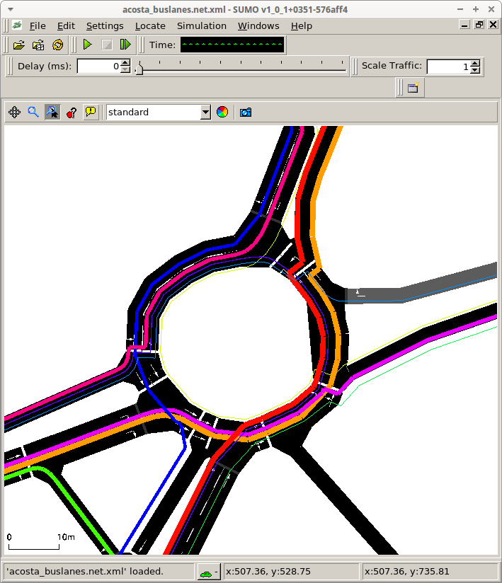

## Visulizing FCD-Data as moving POIs

The tool `fcdReplay.py` can be used to replay an [fcd-output file](../Simulation/Output/FCDOutput.md) in [sumo-gui](../sumo-gui.md).

Example uses:

```
python  tools/fcdReplay.py -k example.sumocfg -f fcd.xml
```

To make use of fcd data with lon/lat values (generated with sumo option **--fcd-output.geo**), the option **--geo** must be set.

# Outdated

The tools are meant to be named as following: <API\>__<DESCRIPTION\>.py, where:

- *<API\>*: mpl for matplotlib
- : the SUMO-output that is processed (mainly)
- *<DESCRIPTION\>*: what the tool does

## mpl_dump_twoAgainst.py

Reads two dump files (mandatory options **--dump1** {{DT_FILE}} and **--dump2** {{DT_FILE}}, or, for short **-1** {{DT_FILE}} and **-2** {{DT_FILE}}). Extracts the value described by **--value** (default: *speed*). Plots the values of dump2 over the according (same interval time and edge) values from dump1.

Either shows the plot (when **--show** is set) or saves it into a file (when **--output** {{DT_FILE}} is set).

You can additionally plot the normed sums of the value using (**--join**). In the other case, you can try to use **--time-coloring** to assign different colors to the read intervals.

You can format the axes by using **--xticks** **<XMIN,XMAX,XSTEP,FONTSIZE\>** and **--yticks** **<YMIN,YMAX,YSTEP,FONTSIZE\>** and set theit limits using **--xlim** **<XMIN,XMAX\>** and **--ylim** **<YMIN,YMAX\>**. The output size of the image may be set using **--size** **<WIDTH,HEIGHT\>**. 

## mpl_tripinfos_twoAgainst.py

Reads two tripinfos files (mandatory options **--tripinfos1** {{DT_FILE}} and **--tripinfos2** {{DT_FILE}}, or, for short **-1** {{DT_FILE}} and **-2** {{DT_FILE}}). Extracts the value described by **--value** (default: *duration*). Plots the values of tripinfos2 over the according (same vehicle) values from tripinfos1.

Either shows the plot (when **--show** is set) or saves it into a file (when **--output** {{DT_FILE}} is set).

You can format the axes by using **--xticks** **<XMIN,XMAX,XSTEP,FONTSIZE\>** and **--yticks** **<YMIN,YMAX,YSTEP,FONTSIZE\>** and set theit limits using **--xlim** **<XMIN,XMAX\>** and **--ylim** **<YMIN,YMAX\>**. The output size of the image may be set using **--size** **<WIDTH,HEIGHT\>**. 

## mpl_dump_timeline.py

Reads a value (given as **--value** **<VALUE\>**, default speed) for edges defined via **--edges** **<EDGEID\>\[,<EDGEID\>\]\*** from the dumps defined via **--dumps** **<DUMP\>\[,<DUMP\>\]\***. Plots them as time lines, using the colors defined via **--colors** **<MPL_COLOR\>\[,<MPLCOLOR\>\]\***. Please note that the number of colors must be equal to number of edges * number of dumps.

Either shows the plot (when **--show** is set) or saves it into a file (when **--output** **<FILENAME\>** is set).

You can format the axes by using **--xticks** **<XMIN,XMAX,XSTEP,FONTSIZE\>** and **--yticks** **<YMIN,YMAX,YSTEP,FONTSIZE\>** and set theit limits using **--xlim** **<XMIN,XMAX\>** and **--ylim** **<YMIN,YMAX\>**. The output size of the image may be set using **--size** **<WIDTH,HEIGHT\>**. 

## mpl_dump_onNet.py

Reads a network (defined using **--net-file** **<NET\>** or **-n** **<NET\>**) and an edge-dump file (**--dump** **<DUMPFILE\>** or **-d** **<DUMP_FILE\>**). **Plots the network using the geometries read from <NET\>. Both the width and the colors used for each edge are determined using --value <WIDTHVALUE\>,<COLORVALUE\> where both <WIDTHVALUE\> and <COLORVALUE\> are attributes within the dump-file that exist for each edge.**

You can change the used color map by setting **--color-map** **<DEFINITION\>**. <DEFINITION\> is made of a sorted list of values (between 0 and 1) and assigned colors. This means that the default 0:#ff0000,.5:#ffff00,1:\#00ff00 let streets with low value for <COLORVALUE\> appear red, for those in the middle yellow and for those with a high value green. For values between the given values, the color is determined using linear interpolation. Please note that only lowercase hexadecimal characters may be used.

Either shows the plot (when **--show** is set) or saves it into a file (when **--output** **<FILENAME\>** is set).

**--join** sums up the values found for each edge and divides the result by the number of these values. If join is not set and **--output** is given, one should choose an output name which looks as following: <NAME\>**'%05d.png. The %05d will be replaced by the current time step written.**

If you have generated a set of images by not "joining" (aggregating) the data, you can convert the obtained pictures into an animated gif using ImageMagick and the following command:

```
convert -delay 20 *.png -loop 0 animation.gif
```

(loop 0 means that the animation repeats from begin after the end)

You can format the axes by using **--xticks** **<XMIN,XMAX,XSTEP,FONTSIZE\>** and **--yticks** **<YMIN,YMAX,YSTEP,FONTSIZE\>** and set theit limits using **--xlim** **<XMIN,XMAX\>** and **--ylim** **<YMIN,YMAX\>**. The output size of the image may be set using **--size** **<WIDTH,HEIGHT\>**.
