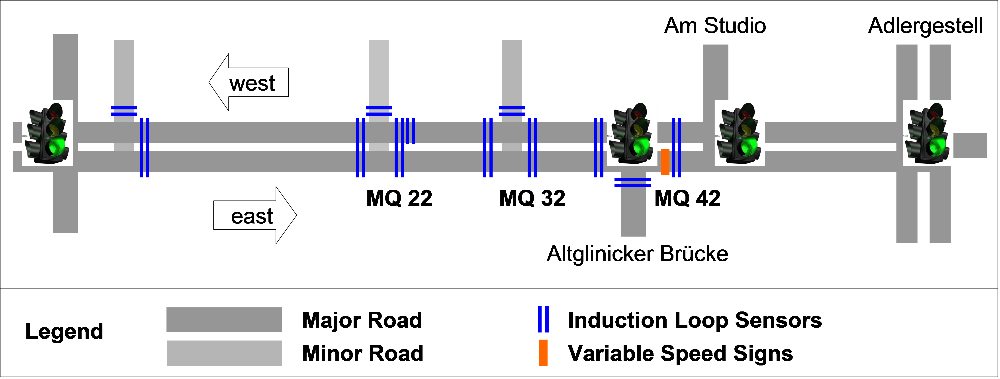
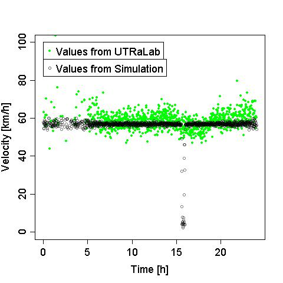
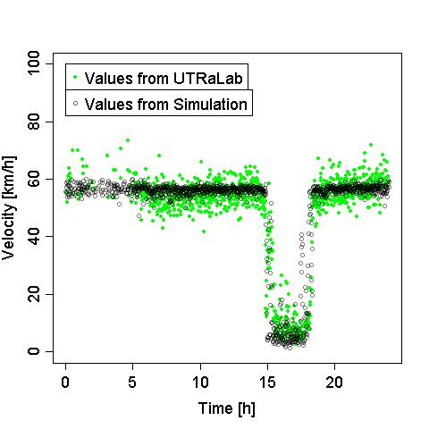
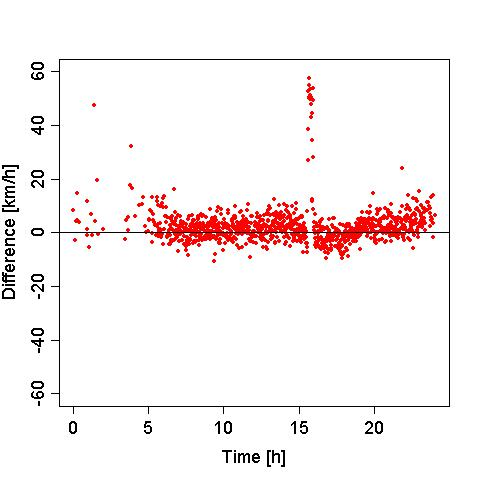
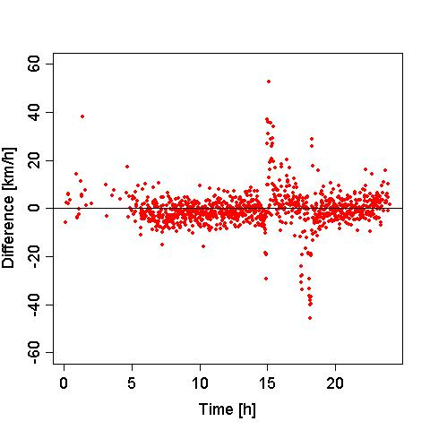

## Validation of a small inner-urban scenario simulated within the SUMO-package

This article describes how a detailed traffic scenario was modelled
using the SUMO simulation package and demonstrates how the simulation
results match measurements made from real world traffic.

## The study area

The UTRaLab (Urban Traffic Research Laboratory) is a test track with a
length of 1.2 kilometres along a small river called “Ernst-Ruska-Ufer”
in Berlin \[1\]. It is a multilane road with about 30.000 vehicles
using it each day between the federal motorway on workdays. Along with other
measurement technology, the UTRaLab is equipped with 45 double induction
loops, that supply vehicle data classified into 5+1 vehicle types
according to TLS\[2\]. An Overview about the test track and the position
of the induction loops is given in Fig. 1.

## Modelling within the SUMO-Package

Preparing a traffic simulation includes modelling the road network as
well as modelling the traffic demand within the traffic network.  

### Traffic Net Modelling  
  
The simulation net includes the section between
“Wegedornstraße” and “Adlergestell”. It represents the exact number of
lanes, turn lanes and links to all side roads. Within the considered
section, there are two traffic lights, one at the junction “Altglienicker
Brücke” and one at the junction “Am Studio”. Both are modelled with
fixed time schedules according to the time of day. The main
challenge in modelling was a spill-back into the study area caused
outside at the junction Adlergestell. As there was no sensor data
available to model the bottleneck itself, Variable Speed Signs (VSS)
\[3\] were placed in the model at the outbound of the junction
“Altglienicker Brücke” towards Adlergestell. The VSS supplies all
vehicles crossing with a new maximum speed, derived from the single
value data from the detectors.  
  
### Traffic Demand Modelling  
  
While looking for a work day, outside of the holiday seasons, where considerable congestion occurred, Tuesday the 11 of January 2011 was chosen. The traffic data from this day
was aggregated to intervals of one minute. This minor simplification
enabled the use of the module dfrouter \[4\]. After defining the
location of the detectors the routes were calculated for all vehicles
within the simulation automatically by the module. The vehicle
distribution \[5\], including different vehicle classes characterized by
different vehicle parameters, was added into the resulting routes and emitters-file manually. Regarding the loops at the minor streets, some inconsistency within the typing occurred. Therefore a distribution including only one vehicle type for passenger cars was defined for all
vehicles starting or ending on minor roads. For all vehicles passing the
study area only along main roads, a vehicle distribution including 6
different vehicle types were defined as the induction loops detect 5+1
different vehicle classes. The split into the different vehicle types was deduced from the measured data. From the vehicle parameters, only the vehicle length could be measured directly. For all other ones, assumptions were made in order to receive a good match of the congestion in the
simulation to the real queue length. Framework conditions like
plausibility and difference between the vehicle classes were considered, such as passenger cars having a higher acceleration and deceleration
than trucks.

## Results

In order to obtain the same measurements from simulation than from
reality “Induction loops” \[6\] were instantiated at the same positions
within the simulation net as in reality. To assess if the congestion within the simulation had the same extent and duration as in reality, the data for eastbound traffic at MQ 22 and MQ 32 was analyzed. Figure 2
shows the speed at the observation points, aggregated to intervals of
one minute.

Fig. 2: Speeds measured at observation points MQ 22 and MQ 32

Fig. 3: Difference between measured and simulated speeds at observation
points MQ 22 and MQ 32

The measurements at MQ 32 show a high analogy for the duration of the
congestion. One can see a slightly earlier start and a later end of the
congestion in the simulation only at the diagram for the differences in
speed. As can be seen from the diagrams of MQ 22 there was a decrease in
speed of about 5km/h between 3 and 7 pm at the UTRaLab. So it may be
supposed that the congestion ends close before the measuring section. In
contrast to this, a short spill-back can be recognized at MQ 22 in the
simulation data. Nevertheless, in view of the distance of about 600m
between observation point and stop line the congestion length within the
simulation matches well to reality. Due to the stochastic of traffic
flow and taken into account that no simulation is able to model all
effects of reality, the diagrams demonstrate a high similarity of
congestion length and duration.

## Summary and Outlook

It was demonstrated that Variable Speed Signs allow to model congestion
effects caused outside the simulated net. The resulting duration and
length of the vehicle-queue in the simulation matches to measurements at
the UTRaLab. Currently, further verification of the simulation
reliability is done by more detailed analyses of the simulation results.
Therefore the datasets received for each vehicle from the test track
sensors and from the simulation are compared.

## References

- \[1\]
  <http://www.dlr.de/fs/en/desktopdefault.aspx/tabid-1237/5441_read-11863/>
  last visited 07 February 2012
- \[2\] Bundesanstalt für Straßenverkehrswesen (2002): Technische
  Lieferbedingungen für Streckenstationen. Bundesministerium für
  Verkehr, Bau-, und Wohnungswesen. Wirtschaftsverlag NW
- \[3\]
  <https://sumo.dlr.de/docs/Simulation/Variable_Speed_Signs.html>,
  last visited 21 February 2012
- \[4\]
  <https://sumo.dlr.de/docs/dfrouter.html>,
  last visited 21 February 2012
- \[5\]
  <https://sumo.dlr.de/docs/Definition_of_Vehicles,_Vehicle_Types,_and_Routes.html>,
  last visited 21 February 2012
- \[6\]
  <https://sumo.dlr.de/docs/Simulation/Output/Induction_Loops_Detectors_(E1).html>,
  last visited 21 February 2012
