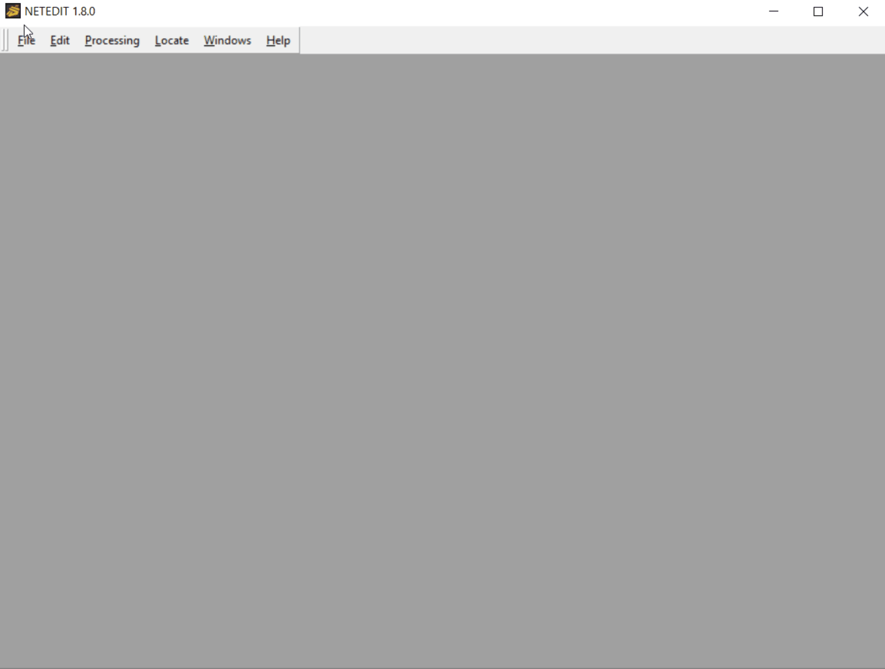
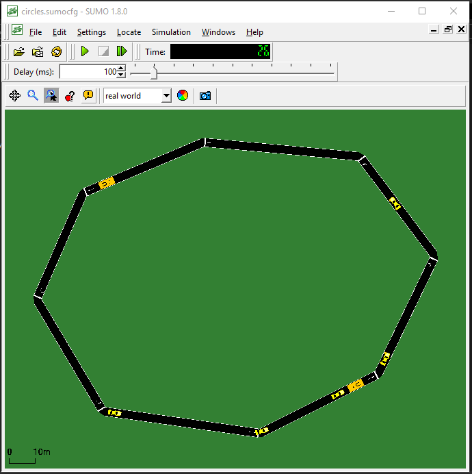
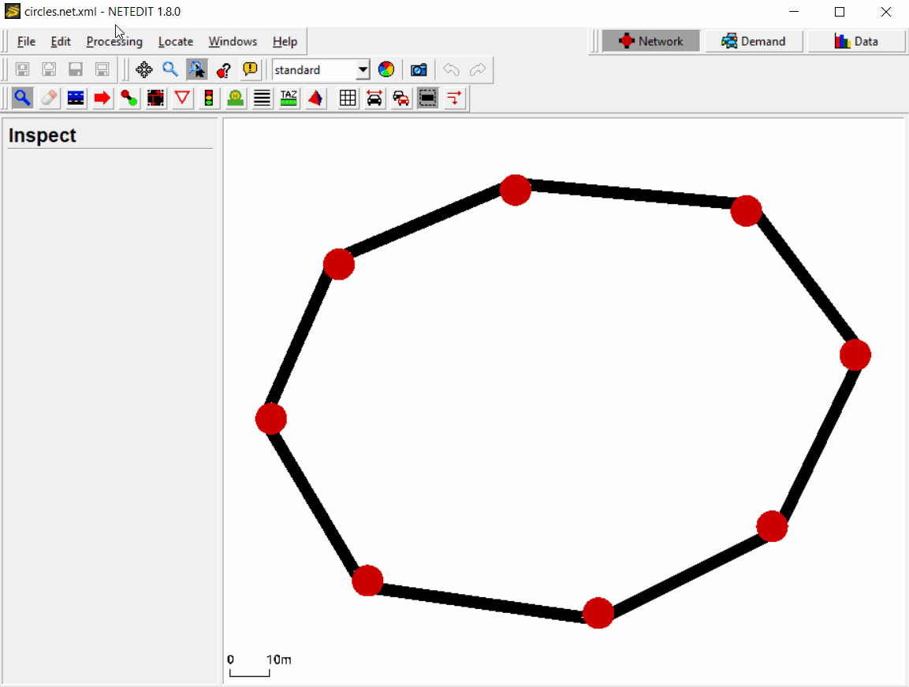
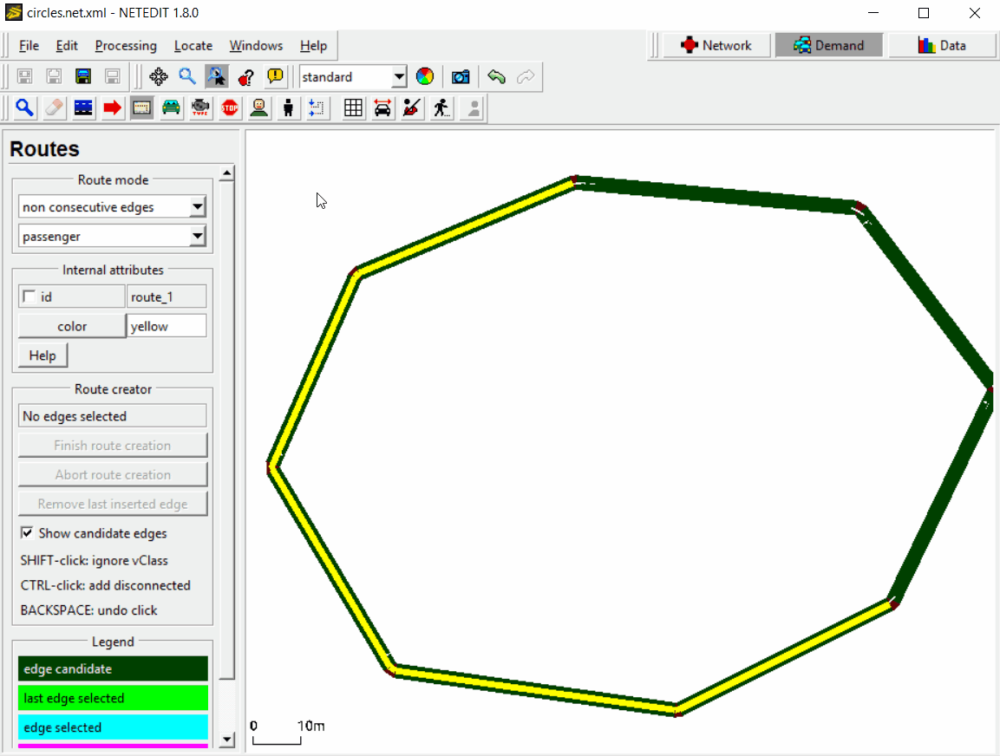
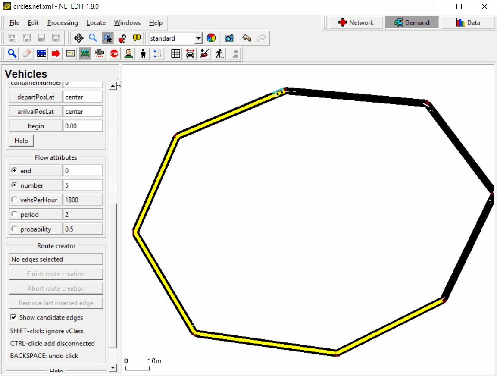
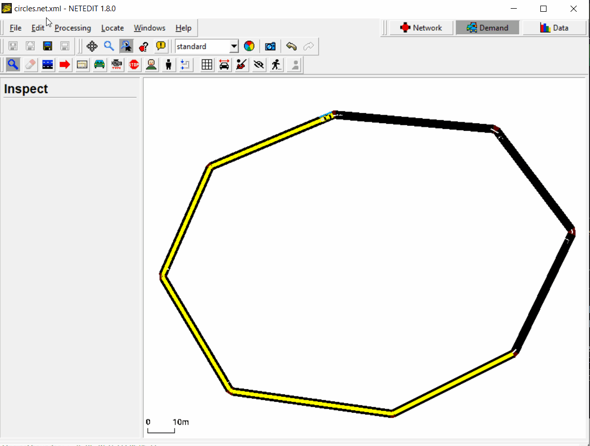
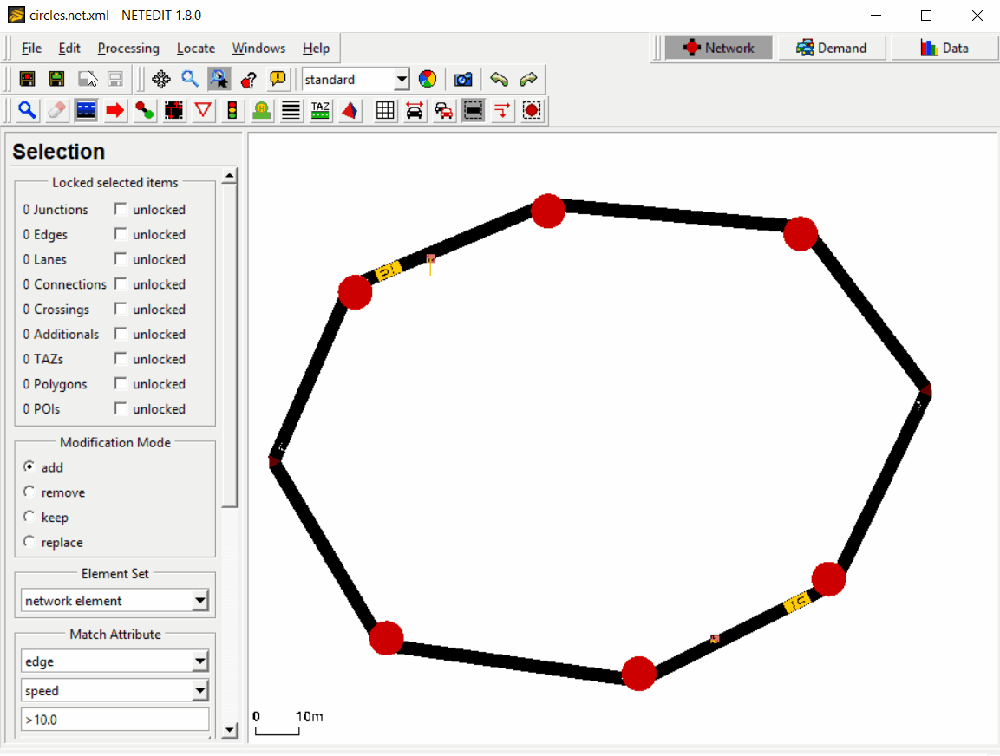
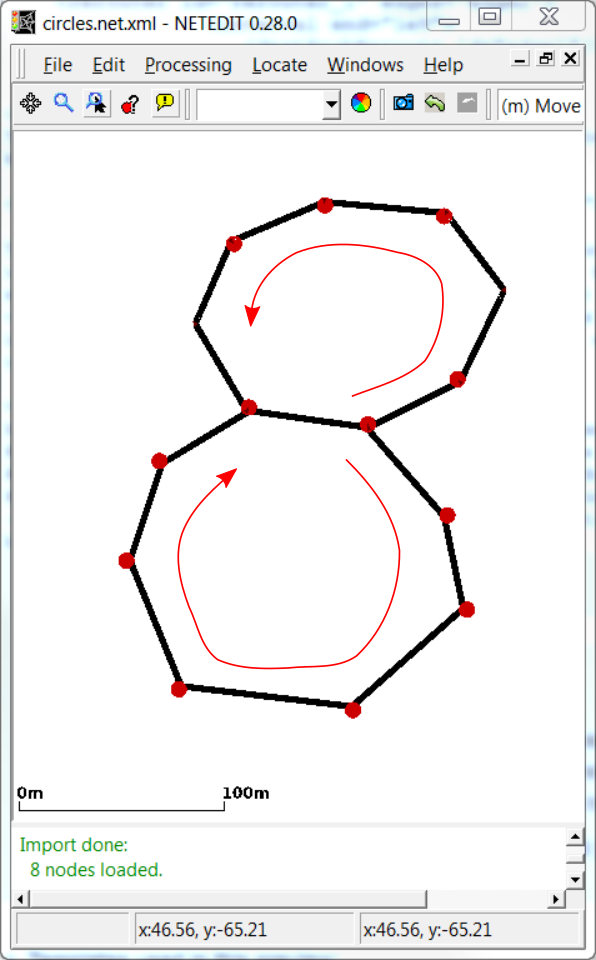

In this tutorial we will build a simple circular net with netedit and
use [rerouters](../Simulation/Rerouter.md) to make vehicles drive in circles. 
All definition files can be found in the {{SUMO}}/docs/tutorial/circles 
directory.

This tutorial can be done using only netedit or you can generate the 
demand data by writing the XML-files yourself. Both methods are explained 
below.

# Steps to follow using XML-Files

## Build a network

Building a network with XML-Files is not recommended, so we will use
netedit for this step. First open [netedit](../Netedit/index.md) and create
edges to form a closed loop. To do that press `Ctrl-N` to create a new network 
and then press `e` to enter the edge editing mode. Now create a closed loop of
edges (you might consider to check 'chain' just right from the edit-mode
selection, see figure).



The result should look more or less like shown in the figure. The
important thing is the circular shape. Now save the network somewhere
(`Ctrl-Shift-S`) in an empty directory (we will refer to that place by
`baseDir`). Use `circles.net.xml` as the name for the created net-file.

## Create vehicles and run SUMO

In `baseDir` create two empty text-files and call them
`circles.rou.xml` and `circles.sumocfg`. These files will define our
vehicles and the run configuration.

First, we edit `circles.rou.xml` and define a vehicle flow of five
standard passenger cars. The file contents should look like this:

```xml
<routes>
   <vType id="car" type="passenger" length="5" accel="3.5" decel="2.2" sigma="1.0"/>
   <flow id="carflow" type="car" beg="0" end="0" number="5"/>
</routes>
```

For further explanation of how to define flows and vTypes see the
respective Wiki-pages: [Flow
Definitions](../Demand/Shortest_or_Optimal_Path_Routing.md#flow_definitions)
and [Vehicle
Types](../Definition_of_Vehicles,_Vehicle_Types,_and_Routes.md#vehicle_types).

To use the route-file and the generated net-file with SUMO, we edit the
configuration-file `circles.sumocfg` to tell SUMO where it should look for vehicle
and net definitions:

```xml
<configuration>
    <input>
       <net-file value="circles.net.xml"/>
       <route-files value="circles.rou.xml"/>
    </input>
</configuration>
```

Now let us try to start sumo with the config that we have just created.
To do so either double-click on the configuration-file `circles.sumocfg`
(under Windows, if your installation was done with default settings) or
change to the `baseDir` in a terminal and start sumo (with graphical
user interface) there by typing `sumo -c circles.sumocfg`. (If this does
not start sumo, you might have to add the SUMO/bin directory to your
PATH or set the environment variable `SUMO_HOME` 
([how to](../Basics/Basic_Computer_Skills.md#sumo_home)).


First attempt to run the simulation

Does it work? No.

Let us have a look at the Message Window at the bottom of the GUI (see figure 
above) to endeavor what went wrong (by the way: the Message Window is often a 
very useful resource for information for setting up a simulation take a look
at it first, if you run into problems).

It says: `Error: The route for flow 'carflow' has no edges.` This means
that SUMO does not know from where to where the vehicles of the flow we
declared in `circles.rou.xml` should move. To fix this, we need to add
attributes `to` and `from`, and provide corresponding edge-ids to the
flow.

The edge-ids can be inspected and modified in netedit: open your
network-file `circles.net.xml` and press `i` to enter the inspect-mode.
Left-click on an arbitrary edge and rename it to `edge1` (see figure below). 
Left-click on a different edge and rename it to `edge2`. Then save your network
(`Ctrl-S`).


Renaming an edge in netedit

Now we add the from-edge and the to-edge to the flow in
`circles.rou.xml`:

```xml
 ...
    <flow id="carflow" type="car" beg="0" end="0" number="5" from="edge1" to="edge2"/>
 ...
```

Let's try to run SUMO again. The window should now show the network you
have created before in netedit (see figure below) and you can start the 
simulation by clicking on the play button 
() or the step button 
(). If you use 
, be sure to adjust the 
value for the animation delay time between consecutive simulation steps (the 
field labeled "Delay (ms):", see figure). Otherwise SUMO will run the simulation 
as fast as possible and you will probably see nothing happening at all. (Note 
that the figure uses the style "real world" from the
representation-dropdown-menu in the toolbar.)


Running five cars on the circular net

The cars will drive from the beginning of edge1 to the end of edge2 and
then leave the net (side remark: you can control the positions of
departure and arrival by additional arguments to the flow, see [Flow
Definitions](../Demand/Shortest_or_Optimal_Path_Routing.md#flow_definitions)).
The simulation ends when all vehicles have left the net.

## Circular rerouting

Now let us make the vehicles drive in circles around the track again and
again. To this end we will create a rerouter.

Since in SUMO the additional elements are not considered as elements of
the net, we have to specify them in a separate file (the
"additionals-file"). Create and open a file `circles.add.xml` in `baseDir` and add the following xml-code (see [Rerouter/Assigning a new
Destination](../Simulation/Rerouter.md#assigning_a_new_destination)
for details):

```xml
<additionals>
    <rerouter id="rerouter_0" edges="edge1">
        <interval end="1e9">
           <destProbReroute id="edge2"/>
        </interval>
    </rerouter>
    <rerouter id="rerouter_1" edges="edge2">
        <interval end="1e9">
           <destProbReroute id="edge1"/>
        </interval>
    </rerouter>
</additionals>
```

Then we have to tell SUMO to include the rerouters into the simulation
by adding a line to the config `circles.sumocfg`. Within the `<input>` tag
add a child:

```xml
<additional-files value="circles.add.xml"/>
```

This will add two (destination-)rerouters to our network making the
vehicles go around the circle until the given end time (i.e., until one
hundred million seconds have passed). Effectively, each rerouter will
update the destination for each vehicle entering its edge (specified by
its `edge`-attribute) and set it to the edge given in the `id`-attribute
of the `destProbReroute`-element. So as soon as a vehicle enters `edge1`
(its current destination), its destination will be updated to `edge2`
and vice-versa, when entering `edge2` it will be rerouted towards
`edge1`, thus following a circular route.



Circular rerouting


# Steps to follow using netedit

## Build a network

The steps to build the network in netedit were already explained 
[above](Driving_in_Circles.md#build_a_network). Please come back when you have 
the network created to continue with the tutorial.

## Create vehicles and run SUMO

First we have to change the mode to "demand" by pressing `F3` and then press 
`r` for switch to "create route" mode. We can either choose to create a route by 
clicking over "consecutive edges" or "non consecutive edges", which will find 
the shortest path between the non consecutive edges given. For this test, we 
will choose the last option. We can change the route "id" by clicking on the 
id box. In this case, we will leave the default "id" `route_0`.

First we have to click on the first edge of our route (let's take one of the 
upper edges) and then click on the last edge of the route (let's choose one 
of the lower edges). An orange path connecting both edges has been created. To 
create the route we have to press the "create route" button or the `Enter` key. 
Route creation can be aborted using the "abort creation" button or pressing the 
`ESC` key.



Create a route with netedit.

Now we have to create a flow of vehicles that will drive along this route. For 
this, we press `v` to go to the vehicles mode and then select over the vehicles 
list "flow (over route)". We leave the default values for "id" (`flow_0`) and 
"begin" (`0`). If we scroll through the list we will find more flow attributes. In 
this case, we want to simulate 5 vehicles after each other, so we set `0` as 
"end" and `5` as "number". To create the flow we just have to click over the 
route we have created and a vehicle will appear at the beginning of the route. 

As a last step, we have to save all demand elements created (route and flow) by 
pressing `Ctrl-Shift-D` and enter the file name, in this case `circles.rou.xml`.



Create a flow with netedit.

After saving the route, we can run the simulation with sumo-gui by pressing 
`Ctrl-T`. Change the delay (e.g. to 100) to be able to see the vehicles driving 
and click the play button 
(). As we can see, the 
five vehicles drive from the first edge to the last one given and then 
disappear. In the next step we will see how to make them drive in circles with 
a rerouter.



Open sumo-gui.

## Circular rerouting

Let's go back to netedit to add a rerouter. First we change to the network mode 
(`F2`) and then press `a` to enter the additional edit-mode. From the 
"Additional element" drop-down menu on the left select `rerouter`. We need to 
add two rerouters:

- The first rerouter will be placed on the **last edge** of our route and have 
a `destProbReroute`-element to the **first edge** of our route. So when the 
vehicles arrive to the last edge, they won't disappear, but will continue 
driving to the first edge and completing the circle.

- The second rerouter will be located on the **first edge** of our route and 
have a `destProbReroute`-element to the **last edge**. So when vehicles arrive 
at the first edge, they will be redirected to the last edge of the route where 
the first rerouter ist located and so the vehicles will be driving in circles 
again and again.

To add the first rerouter we have to check the "id" of the last edge of our 
route by clicking over the edge with the right button. In this example the edge 
id is `edge2`. Select the id over the list and click again, this time with the 
left button, over the edge. The rerouter has been created. Now we have to add 
a `destProbReroute`-element. Select the rerouter and click over it with the 
right-button. Select "Open rerouter Dialog" over the list.

We click over the add button 
() to add a new Interval. We 
will leave the default interval (0 to 3600 seconds), but you can change it if 
you want. Now we add a new `destProbReroute` by clicking over the add button on 
the upper-right window. The first rerouter has to send the vehicles to the 
`edge1`, so we have to change the default edge by double-clicking over it. Now 
we just have to click accept twice and our rerouter is added.



Create the first rerouter.

Now don´t forget to add the second rerouter. For this we will follow the same 
steps but remember to replace the edges.

Once we have created both rerouters, we save them in an additional file by 
pressing `Ctrl-Shift-A` and enter the file name, in this case `circles.add.xml`. 
Now we can run the simulation again by pressing `Ctrl-T` to open sumo-gui and 
click the play button (). 
Now the vehicles are driving in circles until the end time given (3600 seconds).



Run simulation.

# Exercises

Here are some simple ideas to extend this toy example:



A net with two loops

1.  add more lanes in netedit and another vehicle flow with faster cars
    to observe SUMO's overtaking behavior.
2.  add a scooter flow and use the [Sublane
    Model](../Simulation/SublaneModel.md) to observe SUMO's sublane
    model.
3.  add another loop (see figure) and trigger the next loop for each
    vehicle by a probabilistic choice of the destination
    ([Rerouter/Assigning a new
    Destination](../Simulation/Rerouter.md#assigning_a_new_destination)),
    observe merging at the location where both loops are connected.
4.  Insert more vehicles, lower the simulation [time-step
    length](../Simulation/Basic_Definition.md#defining_the_time_step_length_and_integration_method)
    and try to observe stop-and-go waves, experiment with different
    [car-following models](../Car-Following-Models.md), [color the
    vehicles](../sumo-gui.md#vehicle_visualisation_settings) by
    speed.

If you create solutions for the exercises post them on this page\!

Back to [Tutorials](index.md)
