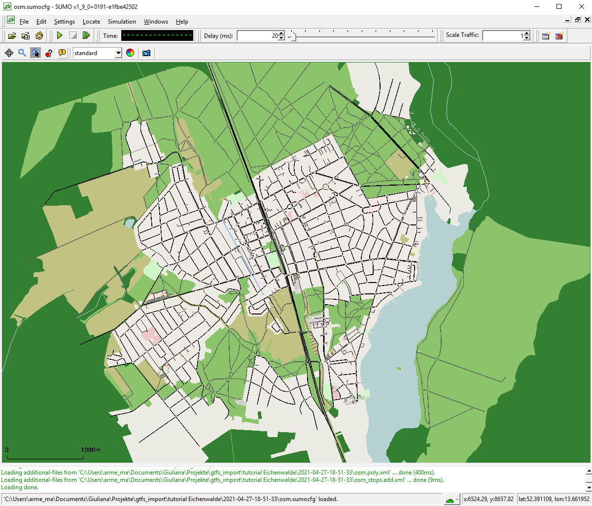
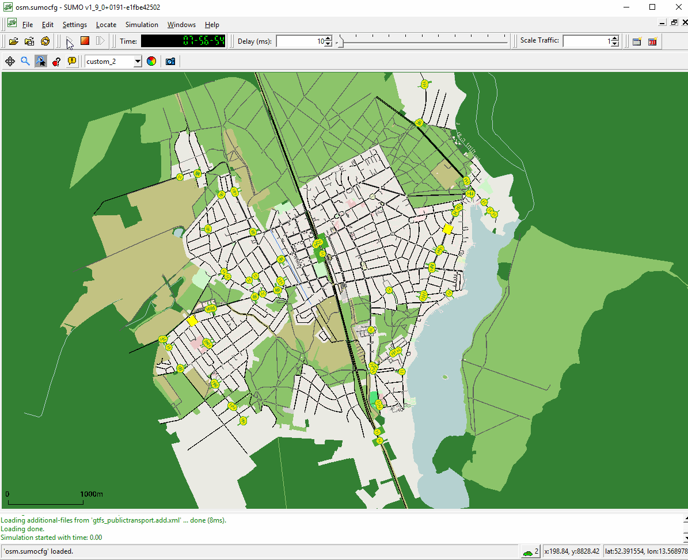

# Introduction

This tutorial shows you how to refine your existing public transit (PT) simulation
scenario with data in the [General Transit Specification Format](https://developers.google.com/transit/gtfs) (GTFS)
which is available for many regions. It is advisable to do the
[Public Transport Tutorial](PT_from_OpenStreetMap.md) first.

The creation of PT simulation consists of three steps:

1. Initial network requirements
2. Finding a data source for GTFS
3. Mapping GTFS data to the network

# Initial network requirements

!!! note
    Using the [osmWebWizard tool](OSMWebWizard.md), may be the easiest way to get a network but the process works with every (geo referenced) SUMO network.

The process works best with a network which comes from OpenStreetMap and also
has public transport lines data (see [ptLines output](../Networks/Further_Outputs.md#public_transport_lines)).
The network should contain edges for all traffic types (modes) you want
to model and the relevant edge types. The script currently supports
the following mapping:

- `tram` -> all edges allowing SUMO's vehicle class tram
- `subway` -> OSM type railway.subway
- `light_rail` -> OSM type railway.light_rail
- `train` -> OSM type railway.rail
- `bus` -> all edges allowing SUMO's vehicle class bus
- `ship` -> OSM type ship

If the network does not contain edge types, only bus and tram mappings are possible which will use the edges
allowing the relevant vehicle classes.

For this tutorial we imported the network of Eichwalde with the osmWebWizard tool:



# Finding a data source for GTFS

There are [several sources](https://transitfeeds.com/) for GTFS data usually on the website of your local
transit agency. [Some examples from Germany](https://gist.github.com/highsource/67d0846029a43ea28dfd90540bacb1ee):

- [Aggregated data for a lot of German regions](https://gtfs.de/en/)
- [Berlin and Brandenburg (VBB)](https://www.vbb.de/vbb-services/api-open-data/datensaetze/)
- [Lower Saxony and Bremen](https://www.vbn.de/service/entwicklerinfos/)
- [Hamburg](https://suche.transparenz.hamburg.de/?q=gtfs&sort=score+desc%2Ctitle_sort+asc&esq_not_all_versions=true)

This tutorial uses the [June 2019 dataset by VBB](https://sumo.dlr.de/daily/GTFS_VBB_Juni-Dezember-2019.zip).
You can either download the data or give the URL of the file directly to the script.

# Mapping GTFS data to the network

If you have all the data available you need to decide on the date you want to model. The script cannot find a representative date
by itself, you need to find one yourself. It is usually advisable to check the calendar for school (and other) holidays in advance.

For this tutorial we choose 04.09.2019 (a Wednesday).

Additionally, you can choose which public transport modes should be imported
(bus, tram, train, subway and/or ferry). By default, all modes will be imported. For
this tutorial we will only import buses.

Depending on the input files available, you can choose between different ways
of generating the routes. If you have the line and stop information extracted from OpenStreetMap
(using the appropriate netconvert options as described in [ptLines output](../Networks/Further_Outputs.md#public_transport_lines))
the script can merge this information with the GTFS data.

In general there are three types of data
we can extract from GTFS: schedules (in minute precision for every vehicle), stop locations (geo coordinates),
and routes (geo coordinates of the traveled streets), where the latter is optional. The GTFS file should be in
zip format and contain at least `routes.txt`, `stops.txt`, `stop_times.txt`, `trips.txt`, `calendar.txt` and `calendar_dates.txt`.
If your GTFS data has a (non-empty) `shapes.txt` file it also has route information.
For the rest of the tutorial, we will assume that you always want to import at least the schedules from GTFS.

From OSM you can (sometimes) get abstract schedules ("line runs every 10 minutes on weekdays") and also stop locations and routes.
While it may be desirable to choose for every of the three data types individually whether it should be imported from OSM
or from GTFS, currently, only the following scenarios are possible:

- Ignore the OSM and route data completely, see [Routes from shortest path](GTFS.md#routes_from_shortest_path).
  - This approach works with every network (not only OSM) and is the default if you do not have ptline output or your GTFS does not contain a shapes.txt file
- Import [Routes from OSM](GTFS.md#routes_from_osm).
  - This will try to find for every GTFS route the corresponding OSM route by using geometrical distance (stop information from OSM is not used)

## Routes from shortest path

In this case, the route for each public transport vehicle will be defined by
finding the fastest path between stops.

If you have downloaded the network and the GTFS data (or have the URL) it is as easy as

```
python tools/import/gtfs/gtfs2pt.py -n osm.net.xml.gz --gtfs GTFS_VBB_Juni-Dezember-2019.zip --date 20190904 --modes bus
```

The script runs for about five minutes and generates several subdirectories but in the end it provides three output files:

- `pt_vtypes.xml`
- `gtfs_publictransport.add.xml` (defining the static routes and stops)
- `gtfs_publictransport.rou.xml` (defining the single public transport vehicles)

The vtypes output generates very simple vehicle type definitions for the different public transport modes in use. You are encouraged to modify this file and adapt
it to the real situation especially concerning capacity (number of seats) for the different modes. You may of course also use vehicle types from another source and skip this output.

In order to use them in a simulation you should pass them as additional files (not route files!) in the order given above.

```
sumo-gui -n osm.net.xml.gz --additional vtypes.xml,gtfs_pt_stops.add.xml,gtfs_pt_vehicles.add.xml
```

## Routes from OSM

In this case, the route for each vehicle is taken from OSM. When we imported the
net with the osmWebWizard tool, we enable the option of "import public transport",
which automatically generate the "osm_ptlines.xml" file with the public transport lines.

The call is:

```
python tools/import/gtfs/gtfs2pt.py -n osm.net.xml.gz --gtfs GTFS_VBB_Juni-Dezember-2019.zip --date 20190904 --modes bus --osm-routes osm_ptlines.xml --repair
```

The option **--repair** is not mandatory, but helpful. It takes the given ptLines
and tries to repair them using duarouter before the mapping. If some routes of the
ptLines are not valid, they won't be used for the mapping.

The script generates the following output files:

- `pt_vtypes.xml`
- `gtfs_publictransport.add.xml` (defining the stops)
- `gtfs_publictransport.rou.xml` (defining the single public transport vehicles)
- `gtfs_missing.xml` contains the elements (stops and ptLines) of the GTFS data that could not be imported
- `invalid_osm_routes.txt` contains the warnings and errors from the repair of the ptLines

To run the simulation call:

```
sumo-gui -n osm.net.xml.gz --additional vtypes.xml,gtfs_pt_stops.add.xml,gtfs_pt_vehicles.add.xml
```

## Stops from OSM

In this case, the mapping of stops from (imprecise) GTFS coordinates to candidate network edges is guided buy using public transport stop locations from OSM. 
This is useful when GTFS data has no shape information and provides two advantages:

- mapping is greatly sped up because fever candidate edges are considered
- mapping of public rail transport is greatly improved because OSM stops encode information about the typical usage direction of rail tracks (and thus stop track assignment at stations)

The call is:

```
python tools/import/gtfs/gtfs2pt.py -n osm.net.xml.gz --gtfs GTFS_VBB_Juni-Dezember-2019.zip --date 20190904 --modes bus --stops osm_stops.add.xml
```

The generated simulation inputs are the same as [above](#routes_from_osm) and thus the same call to sumo/sumo-gui can be used.

# Using the outputs in a simulation

Below an example of using the mapped stops and buses in a simulation by calling sumo-gui:


