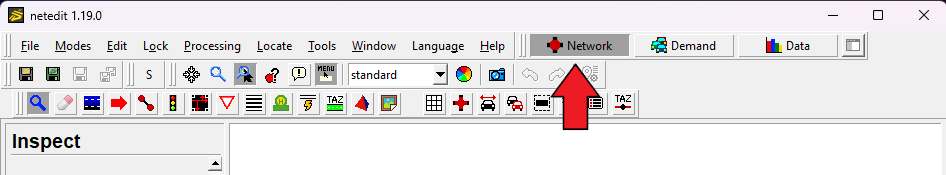
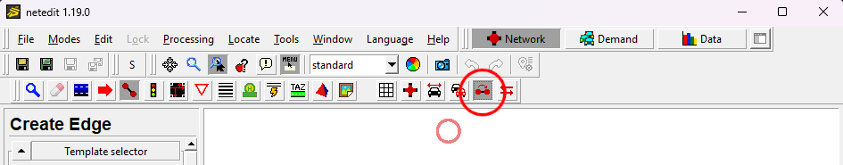
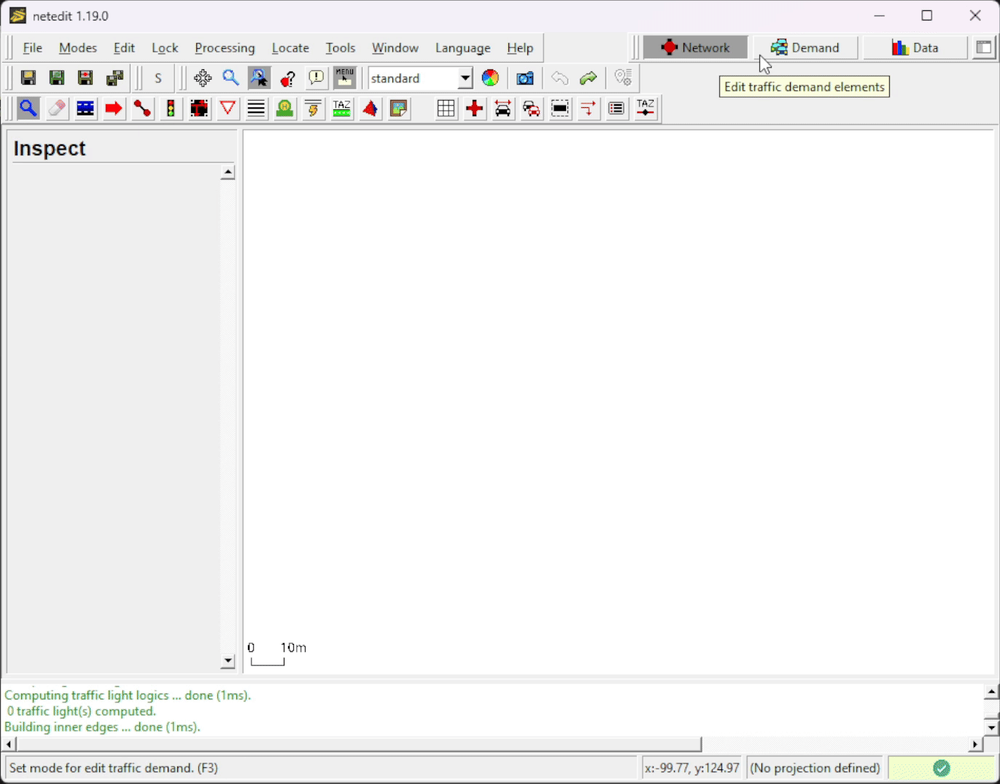
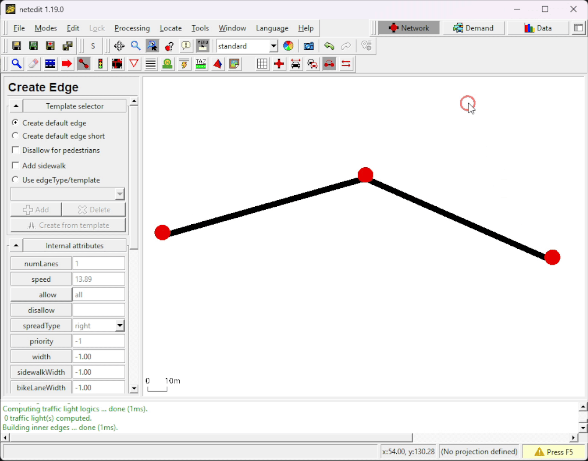
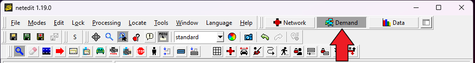
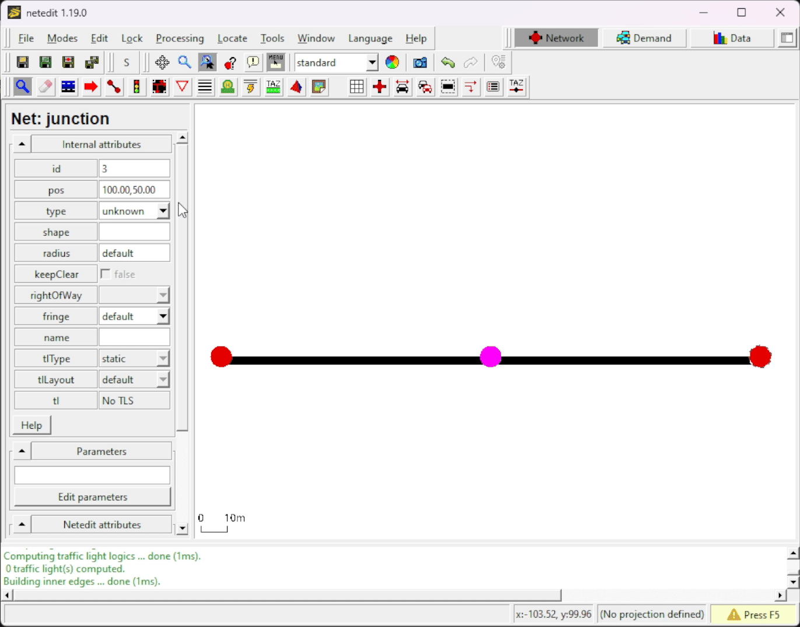
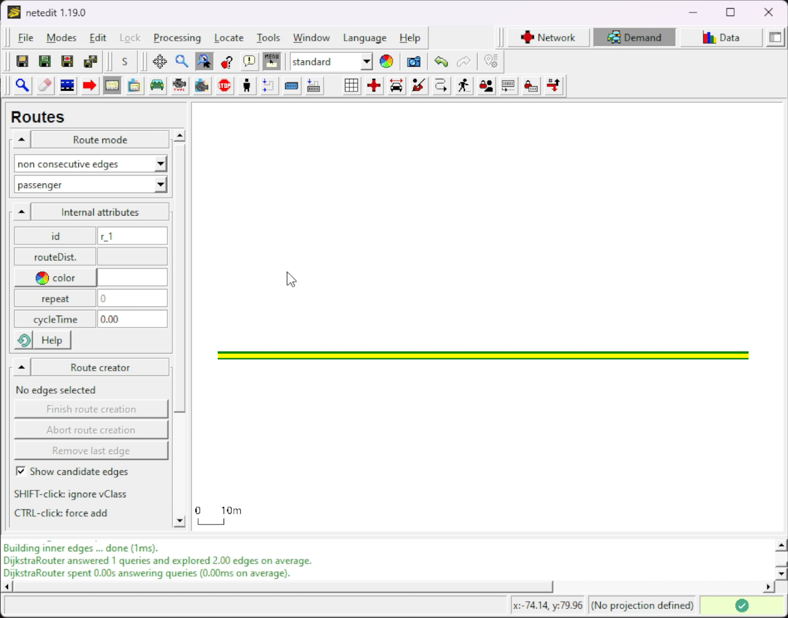
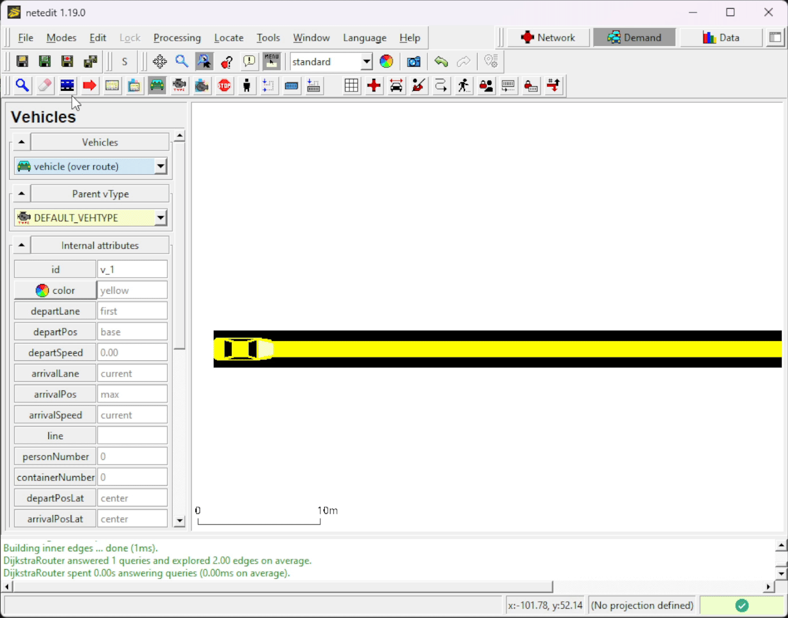

!!! caution
    Make sure to have (at least) SUMO 1.4.0 installed to be able to use all the features shown in this tutorial

## Requirements

- [sumo-gui](../sumo-gui.md) and [netedit](../Netedit/index.md) version ≥ 1.4.0

## Introduction

This tutorial is for first-time SUMO users. We are going to build the
simplest net possible and let a single car drive on it.

In order to perform a very basic simulation in SUMO, it is required to have at least the following elements (files):

- Network
- Route
- SUMO configuration file

In SUMO a street network consists of nodes
(junctions) and edges (streets connecting the junctions). In this tutorial we will use [netedit](../Netedit/index.md) to create our basic net.

Routes are defined by connecting edges and assigning vehicles that pass through them. In this tutorial we will use [netedit](../Netedit/index.md) to create this.

The SUMO Configuration file is where certain options and all files (Network, Route, etc.) are listed, so that SUMO can find and use them.

## Creating the Network in netedit

Open [netedit](../Netedit/index.md) and create a new network by selecting *File-\>New Network* or using the shortcut <kbd>Ctrl</kbd> + <kbd>N</kbd>

Make sure that **Network** is selected.

Enter **Edge Mode** by selecting *Modes-\>Edge mode*, using the shortcut <kbd>E</kbd> or by clicking on the  button.
In Edge Mode, make sure that ***Chain*** is selected (in newer versions, *Chain* is the following icon: ). This will facilitate creating multiple nodes and their connecting edges with fewer clicks.

Nodes are created by clicking on empty spaces (when in Edge Mode). Insert 3 nodes (a.k.a Junctions) by clicking on three different places at the white blank space.
After inserting the last Node, press <kbd>Esc</kbd> to unselect that last node.

!!! note "Tip"
    In netedit you can use <kbd>Ctrl</kbd> + <kbd>Z</kbd> to undo

Now we want to rename our recently inserted Junctions and Edges (which get arbitrary id's when created) and also make our simple network prettier, by aligning all nodes.
To do so, enter **Inspect Mode** by selecting *Modes-\>Inspect mode*, using the shortcut <kbd>I</kbd> or by clicking on the  button.

In Inspect mode you can select different type of elements, such as Nodes and Edges. If an element is selected, its properties will appear on the left side.
Let's rename (change their **id**) the nodes to "1", "2" and "3" (from left to right) and the edges to "1to2" and "out" (also left to right).

Replace the position (**pos**) of the nodes with the following values:

| id | pos     |
|----|---------|
| 1  | -100,50 |
| 2  | 0,50    |
| 3  | 100,50  |

Our very basic network is done! We just need to save it . Use *File -\> Save Network* (<kbd>Ctrl</kbd> + <kbd>S</kbd>) or *File -\> Save Network As* (<kbd>Ctrl</kbd> + <kbd>Shift</kbd> + <kbd>S</kbd>) and give it a proper name (such as `helloWorld.net.xml`).

Do not close netedit yet, the demand still needs to be generated.

!!! note
    In SUMO, Networks must have the following file extension -> **.net.xml** (example: *myNetwork.net.xml*)

## Demand Generation in netedit

Now, select the **Demand** supermode in netedit.

### Creating a Route

Enter **Route Mode** by selecting *Modes-\>Route mode*, using the shortcut <kbd>R</kbd> or by clicking on the  button.

Creating a route is as simple as clicking on the Edges that will compose it. When selecting an Edge, its color will change.

- FOO Last selected Edge
- FOO Selected Edge
- FOO Possible selectable edges

After selecting all the edges that will compose the desired route, click on *Finish route creation*.

### Adding a Vehicle

Finally, enter **Vehicle Mode** by selecting *Modes-\>Vehicle mode*, using the shortcut <kbd>V</kbd> or by clicking on the  button.
To insert a Vehicle, select `vehicle (over route)` and click on the beginning of the route. A car will appear.

On the left side bar you can change the vehicle's attributes such as id and even the color (just for fun, change it to blue).

Now save the Demand (route + vehicle) file .
Use *File -\> Demand elements -\> Save demand elements* (<kbd>Ctrl</kbd> + <kbd>Shift</kbd> + <kbd>D</kbd>) or *File -\> Demand elements -\> Save demand elements as* and give it a proper name (such as `helloWorld.rou.xml`).

Do not close netedit yet.

!!! note
    This demand element file **must** have the **.rou.xml** file extension!

!!! caution "Important"
    Save all simulation related files (Network, Demand and SUMO Configuration file) in the same directory.

## Visualizing in sumo-gui

We will open sumo-gui from netedit. To do so, go to *Edit -\> Open in sumo-gui* (<kbd>Ctrl</kbd> + <kbd>T</kbd>). This will open sumo-gui and load our recently created network and demand files.

As soon as sumo-gui opens, let's save the SUMO configuration file (that relates the network and demand files) .
*File -\> Save Configuration* (<kbd>Ctrl</kbd> + <kbd>Shift</kbd> + <kbd>S</kbd>). Give it a proper name (such as `helloWorld.sumocfg`).

Now you can close netedit if you wish.

!!! note
    SUMO Configuration files have the following file extension -> **.sumocfg** (example: *myScenario.sumocfg*)

Before starting the simulation, make sure that the Delay () is set to at least 80 ms, as otherwise the simulation would happen very quickly and we would not be able to see our only vehicle in our tiny network.

Click on Run  (<kbd>Ctrl</kbd> + <kbd>A</kbd>) to start the simulation.

From now on, if we want to run this scenario again we only have to open the SUMO Configuration file (*.sumocfg) in [sumo-gui](../sumo-gui.md) or [sumo](../sumo.md).

That's it! You have your first simulation scenario in SUMO :)

## Further Reading

Do you want to do this exercise again, but using a text editor instead of the netedit graphic interface? Visit [this tutorial](Hello_SUMO.md).

More [Tutorials](index.md).
