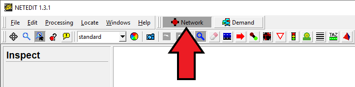
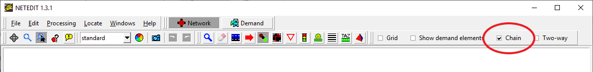
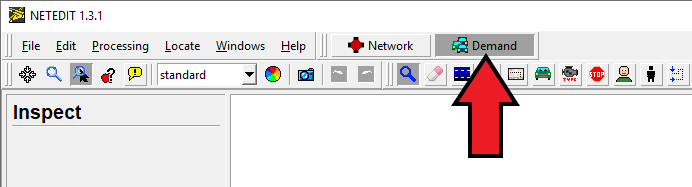

!!! note
    This tutorial assumes very basic computer skill. If you run into any questions please read the page [Basics/Basic Computer Skills](../Basics/Basic_Computer_Skills.md).

## Introduction

This tutorial is for first time [SUMO](../SUMO.md) users. We are going to build the
simplest net possible and let a single car drive on it.

In order to perform a very basic simulation in [SUMO](../SUMO.md), it is required to have at least the following elements (files):

- Network
- Route
- SUMO configuration file

In [SUMO](../SUMO.md) a street network consists of nodes
(junctions) and edges (streets connecting the junctions). In this tutorial we will use [NETEDIT](../NETEDIT.md) to create our basic net.

Routes are defined by connecting edges and assigning Vehicles that pass through them. In this tutorial we will use [NETEDIT](../NETEDIT.md) to create this.

Finally, the configuration file is where certain options and all files (Network, Route, etc.) are being listed, so that SUMO can find and use them.

## Creating the Network in NETEDIT

Open [NETEDIT](../NETEDIT.md) and create a blank new network by selecting *File-\>New Network* or using the shortcut `Ctrl + N`

Make sure that **Network** is selected.

Enter **Edge Mode** by selecting *Edit-\>Edge mode*, using the shortcut `E` or by clicking on the  button.
In Edge Mode, make sure that *Chain* is selected. This will facilitate creating multiple nodes and edges with fewer clicks.

seleccionar Edge mode (E)
insertar 3 nodos.

en inspect mode alinear (que se vean bonitos los nodos) y cambiarles el id a 1 2 3
cambiar nombre a los edges 1to2 out

File -> Save Network

## Demand Generation in NETEDIT - (creating the Route)

Make sure that **Demand** is selected.

File -> Demand elements -> Save demand elements

## Visualizing in SUMO

Edit-> Open in SUMO-GUI (Ctrl + T)

Save Configuration

## Further Reading

More [Tutorials](../Tutorials.md).