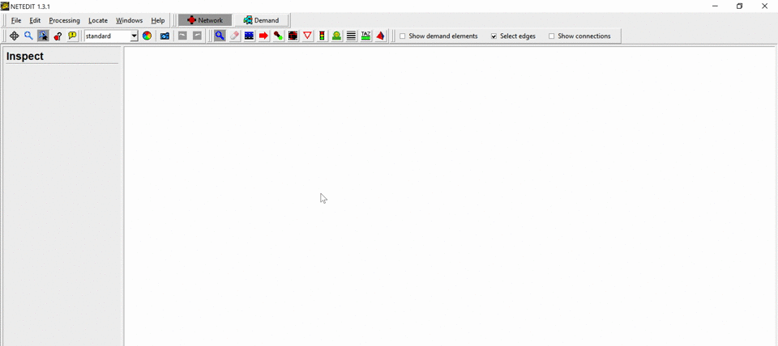
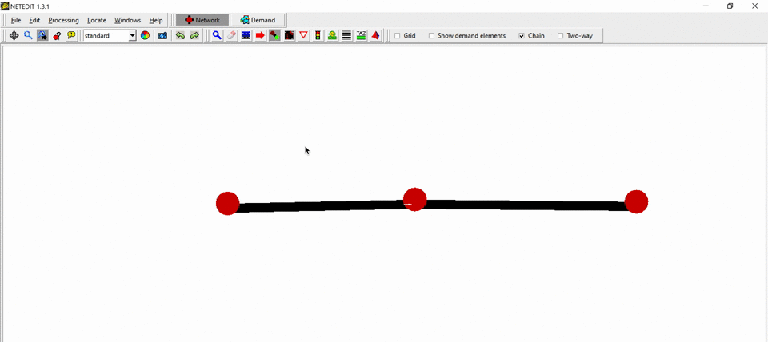

## Introduction

This tutorial is for first time [SUMO](../SUMO.md) users. We are going to build the
simplest net possible and let a single car drive on it.

In order to perform a very basic simulation in [SUMO](../SUMO.md), it is required to have at least the following elements (files):

- Network
- Route
- SUMO configuration file

In [SUMO](../SUMO.md) a street network consists of nodes
(junctions) and edges (streets connecting the junctions). In this tutorial we will use [NETEDIT](../NETEDIT.md) to create our basic net.

Routes are defined by connecting edges and assigning Vehicles that pass through them. In this tutorial we will use [NETEDIT](../NETEDIT.md) to create this.

Finally, the configuration file is where certain options and all files (Network, Route, etc.) are being listed, so that SUMO can find and use them.

## Creating the Network in NETEDIT

Open [NETEDIT](../NETEDIT.md) and create a new network by selecting *File-\>New Network* or using the shortcut `Ctrl + N`

Make sure that **Network** is selected.

Enter **Edge Mode** by selecting *Edit-\>Edge mode*, using the shortcut `E` or by clicking on the  button.
In Edge Mode, make sure that ***Chain*** is selected. This will facilitate creating multiple nodes and their connecting edges with fewer clicks.

Nodes are created by clicking on empty spaces (when in Edge Mode). Insert 3 nodes (aka Junctions) by clicking on three different places at the white blank space.
After inserting the last Node, press <ESC\> to unselect that last node.

!!! note "Tip"
    In NETEDIT you can use Ctrl + Z to undo

Now we want to rename our recently inserted Junctions and Edges (which get arbitrary id's when created) and also make our simple network prettier, by aligning all nodes.
To do so, enter **Inspect Mode** by selecting *Edit-\>Inspect mode*, using the shortcut `I` or by clicking on the  button.

In inspect mode you can select different type of elements, such as Nodes and Edges. When selecting one element, its properties will appear on the left side.
Lets rename (change their **id**) the nodes to "1", "2" and "3" (from left to right) and the edges to "1to2" and "out".

Replace the position (**pos**) of the nodes with the following values:

| id | pos     |
|----|---------|
| 1  | -100,50 |
| 2  | 0,50    |
| 3  | 100,50  |

Our very basic network is done! We just need to save it . Use *File -\> Save Network* (Ctrl + S) or *File -\> Save Network As* (Ctrl + Shift + S).

!!! note
    Network files are saved as .net.xml

## Demand Generation in NETEDIT - (creating the Route)

Make sure that **Demand** is selected.

File -> Demand elements -> Save demand elements

## Visualizing in SUMO

Edit-> Open in SUMO-GUI (Ctrl + T)

Save Configuration

## Further Reading

More [Tutorials](../Tutorials.md).