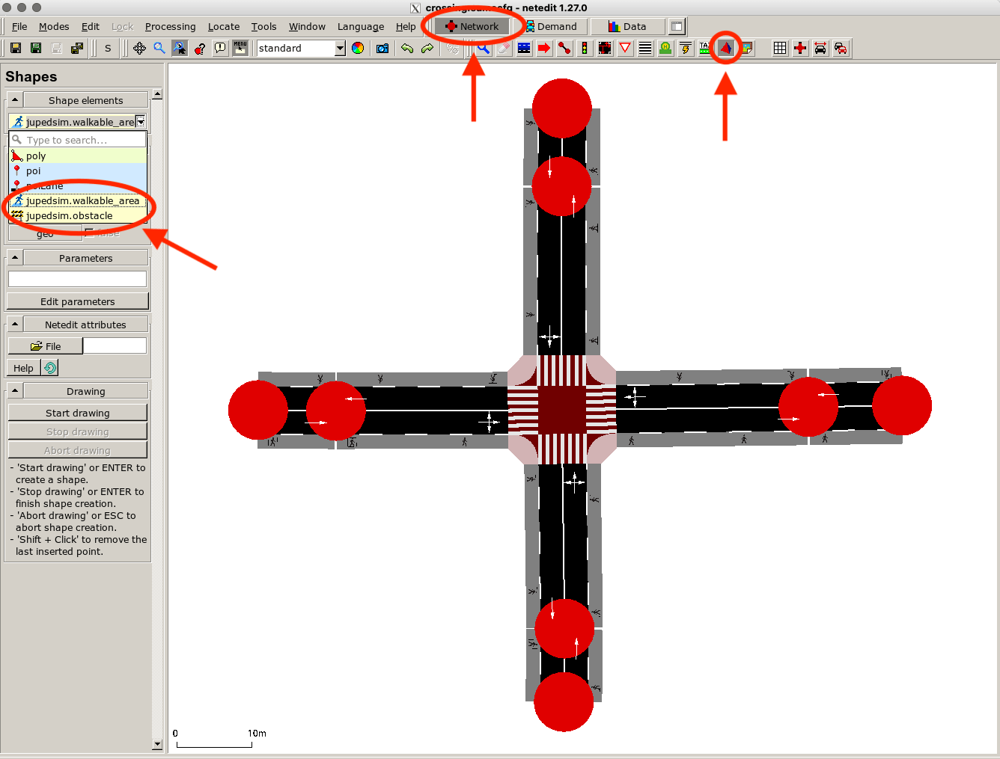
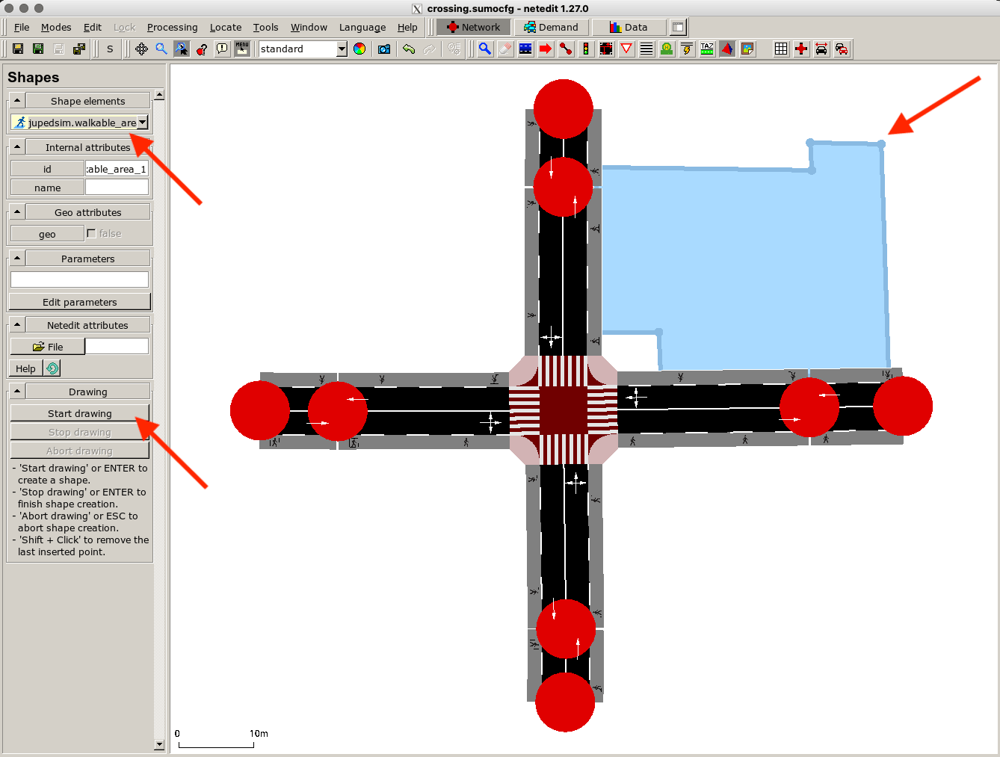
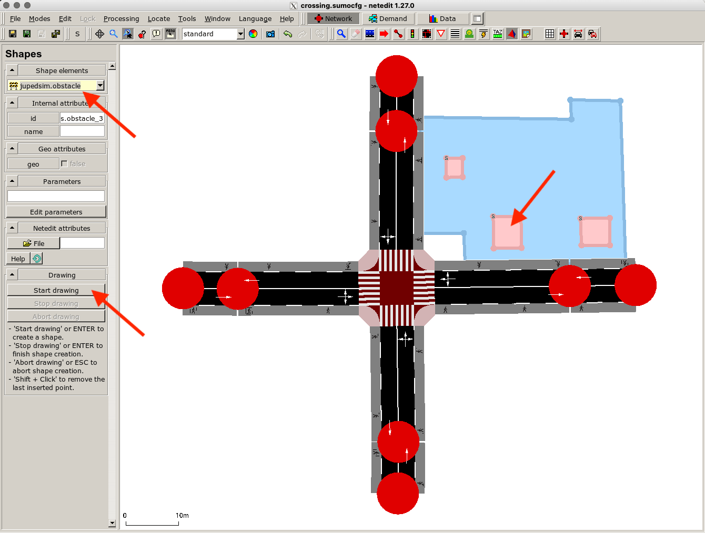
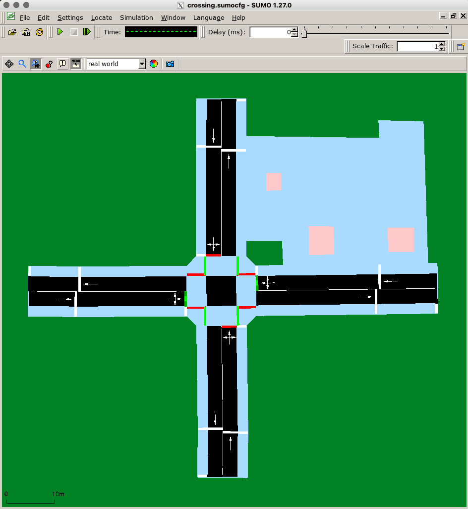
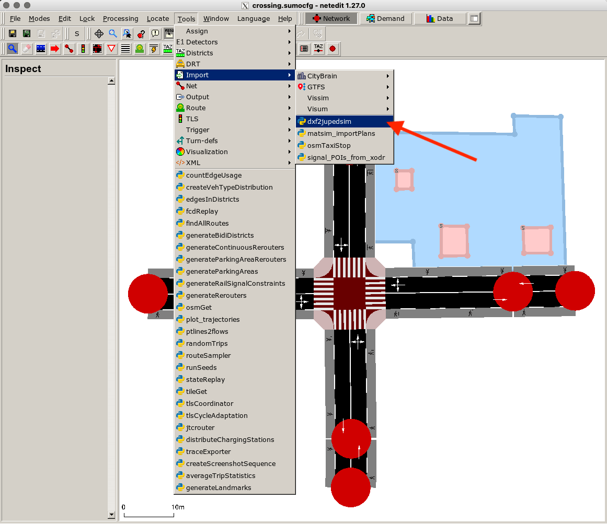
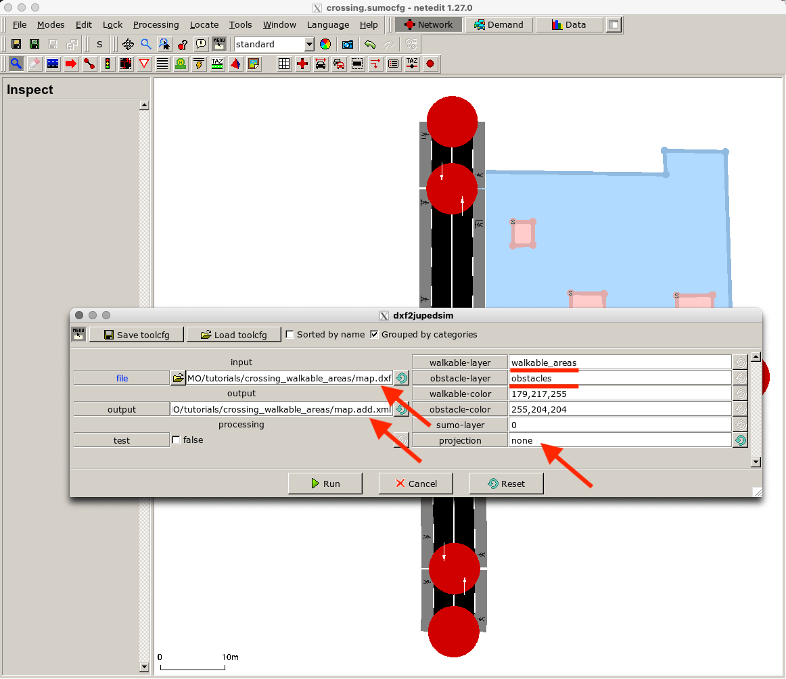
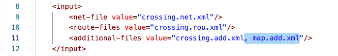
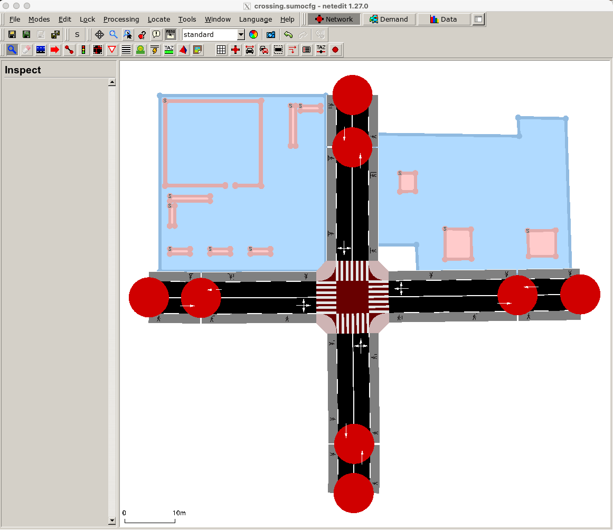
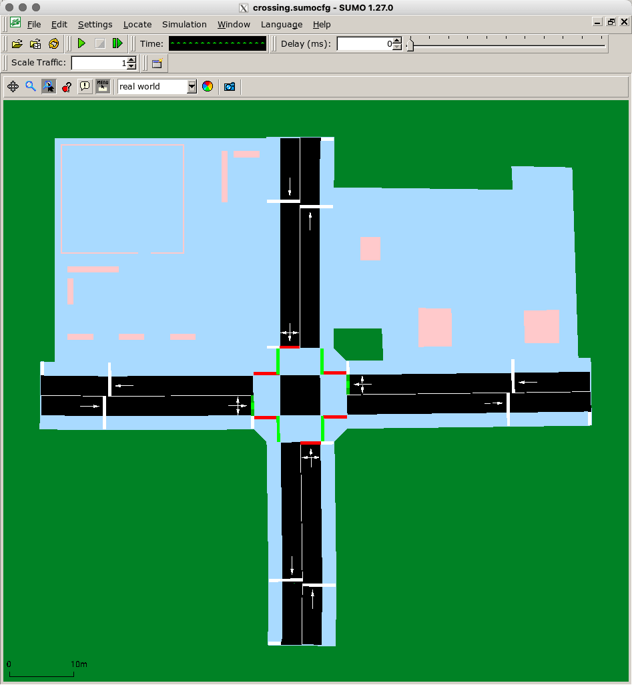

This tutorial demonstrates the different possibilities to define 2D walkable areas in *SUMO* that are accessible for *JuPedSim* agents. We use the configuration files of the crossing tutorial and add additional 2D walkable areas by drawing polygons in *netedit* and by importing a dxf file.

You can find the used dxf file and the resulting **configuration files** for this tutorial [here](https://github.com/PedestrianDynamics/SUMO-JuPedSim-Simulations/tree/main/tutorials/areas).

## Configuration Options

There are three different ways to define 2D walkable areas for *SUMO-JuPedSim*:

- Automatic generation of a walkable area based on pedestrian network elements in *SUMO*. This approach was already demonstrated in the [crossing tutorial](crossing-simulation.md). *SUMO* automatically parses sidewalks, footpaths and crossings to a 2D space, if *JuPedSim* is chosen as pedestrian model for the simulation scenario.

- Drawing of walkable area and obstacles in *netedit*

- Parsing a dxf file containing the walkable area and obstacles to an additional-file (xml) and importing it in *SUMO*.

## Drawing in *netedit*

Start *netedit* and load the sumoconfig file from the crossing tutorial. When you are in the **Network supermode** activate the *Polygon mode*. In the *Shapes menu* on the left side, you can see a list of available shape elements including *JuPedSim* elements: walkable area and obstacles.

Select *jupedsim.walkablk_area* and click on *Start drawing*. Draw the walkable area and press *Enter* to close the polygon and finish the drawing.

You can also draw obstacles the same way using the element type *jupedsim.obstacle*.

When you open *sumo-gui* you can see that the walkable areas generated from the network and the drawn one have been merged (light blue area). Obstacles are shown in light pink.

!!! note
	While overlapping areas (with *SUMO* network) are merged – make sure that obstacles to not block the *SUMO* network elements! Agents cannot reroute when moving on an *SUMO* edge.

## Import dxf File

It’s also possible to import a dxf file containing a detailed map of pedestrian facilities into *netedit*. The dxf file must consist of two layers: a layer with one polygon of the walkable area und another layer containing the polygons for the obstacles. All polygons must be simple and closed. You can download an example dxf file [here](https://github.com/PedestrianDynamics/SUMO-JuPedSim-Simulations/tree/main/tutorials/areas). To parse the dxf file to an xml file which *SUMO* can process use the script via *Tools \> Import \> dxf2jupedsim*.

Choose the input file and the name of the output file. Set projection to *none* as the given example is not a georeferenced map. If you use your own file, change the name of the layers according to your dxf file.

!!! note 
	When choosing the dxf file in file finder select the file name ending *All files(\\*)* as only xml files are listed by default.

!!! note
	Make sure to select the desired output path. Otherwise, the file is stored at the directory from which *netedit* is being executed.

Click *Run* and check the console output. If the processed is finished the additional-file should have been created in the selected folder. Now you need to add the generated file to the *SUMO* configuration.  You can do that via the *SUMO* options menu or by editing the sumoconfig file manually:

Restart *netedit* and load the new sumoconfig file. You can see a second walkable area generated from the dxf file.

!!! note
	If some obstacles are not shown, make sure that they are on a visible layer. You can edit their layer in the add.xml file.

To inspect the complete walkable area used for the simulation we open *sumo-gui*. When configuring routes for *JuPedSim* agents that use different walkable areas (both user-defined and those automatically generated from the network), there are a few rules to bear in mind which are described in the next tutorial (to be released soon).

