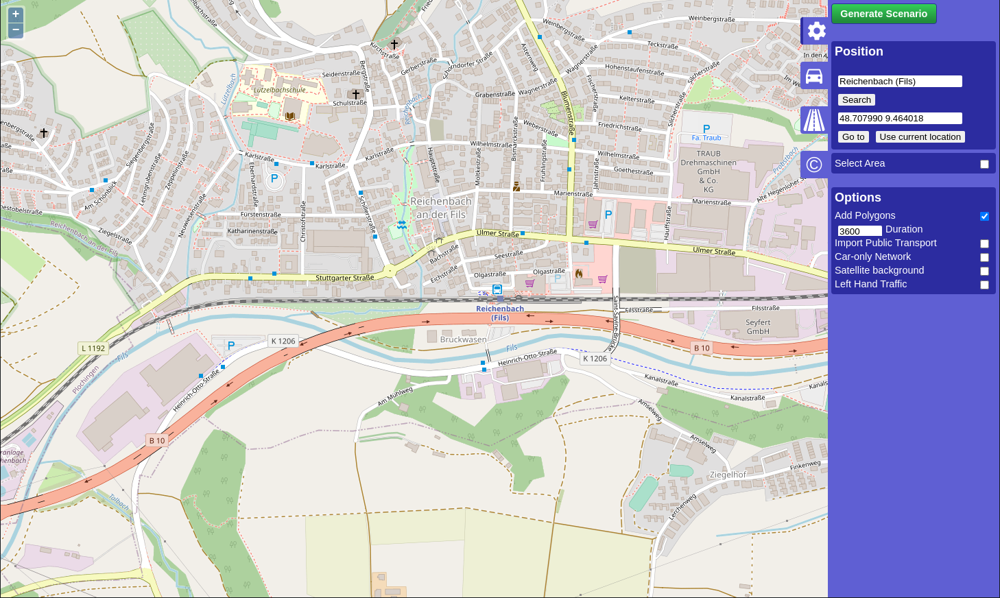
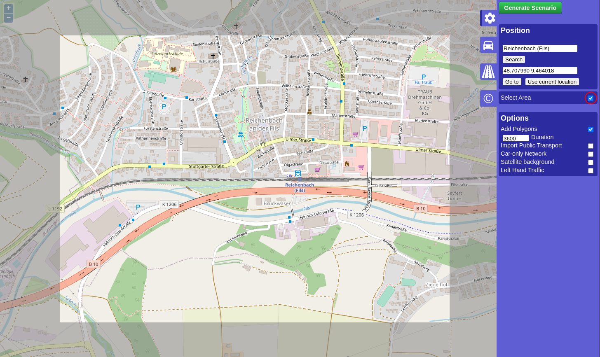
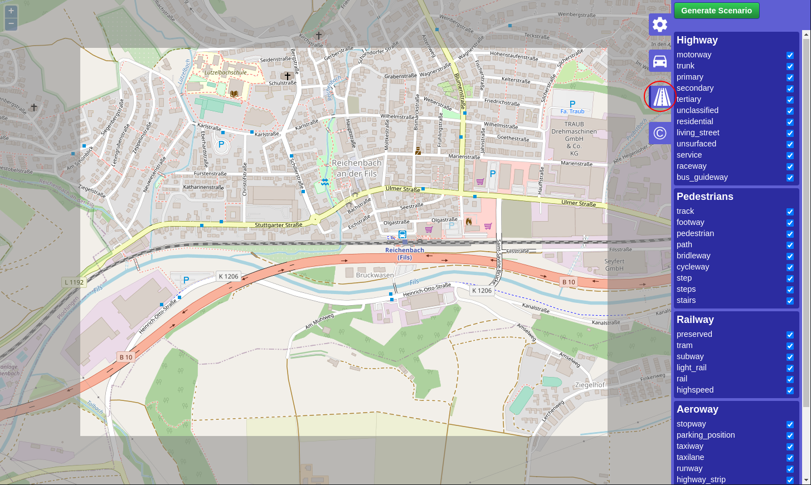

# About

The OSM Web Wizard offers one of the easiest solutions to start with
SUMO. Based on a selection of an openstreetmap map excerpt, you will be
able to configure a randomized traffic demand and run and visualize the
scenario in the [sumo-gui](../sumo-gui.md). This tutorial will
guide you step by step from the selection of the map excerpt over
defining the traffic demand through running and visualizing the scenario
in the sumo-gui.

# Requirements

- [SUMO](../Installing/index.md) installation
- [Python](http://www.python.org) (\>= 2.7) installation

# Getting started

The OSM Web Wizard is essentially a collection of python scripts located
under the directory *tools* in your sumo installation root. You start
the OSM Web wizard by invoking the following command in the *tools*
directory:

```
python osmWebWizard.py
```

Windows users may also invoke the command by clicking *All Programs -\>
SUMO -\> OSM Web Wizard*. Once the script is running, a web browser
should open showing a map excerpt of central Berlin.



You may zoom and pan to the area of your interest. Caution: if the map
excerpt covers a very large area, the simulation might become slow or
even unresponsive. We suggest choosing a similar zoom level as in the
initial view.

In the next step, you select the actual area for which you wish to
generate the simulation scenario. The area selection will be activated
by clicking the checkbox *Select Area* at the blue area selection panel
on the right side of the map.



You can change the size and location of this area by click and hold with
the mouse pointer at the boundary between the grayed and non-grayed
area. Once you are satisfied with the area selection, you can proceed to
the next step.

# Network Generation

The infrastructure import from OSM into the SUMO simulation are affected by different Wizard options

* by default the "Add Polygon" checkbox is checked and a road traffic simulation is generated but all types of roads and rails will be imported as well (cycle paths, footpaths, railways etc)
* if the checkbox "left-hand Traffic" is enabled, the network will be built with left hand traffic rules. For most geographic regions where this is required, this feature will be enabled automatically but if it does not work, this option can be used as a remedy.
* if the checkbox "Car-only Network" is enabled, then only roads that permit passenger car traffic will be included. This can be used to reduce the network size and also helps to reduce intersection complexity
* if the checkbox "Import Public Transport" is enabled, then busStops and trainStops will be exported. Also busses, trams and trains will be generated that follow the public transport routes defined in OSM (but they will follow synthetic schedules).
* if the Demand-checkbox "Bicycles" is active, then extra bicycle lanes will be added to roads where OSM contains this information
* if the Demand-checkbox "Pedestrians" is active, then sidewalks and pedestrian crossings will be generated

# Demand Generation

The demand is defined by the demand generation panel. You activate this
panel by clicking on the car pictogram.


SUMO supports various modes of transport. At the demand generation
panel, you can activate/deactivate the individual modes of transport by
clicking the corresponding checkboxes. For each mode of transport, the
OSM Web Wizard generates random demand based on a certain probability
distribution, which is influenced by two parameters:

- Every time a new vehicle is generated, the OSM Web Wizard randomly
chooses a departure and arrival edge for the vehicle. The *Through
Traffic Factor* defines how many times it is more likely for an edge
at the boundary of the simulation area being chosen, compared to an
edge entirely located inside the simulation area. A big value for
the *Through Traffic Factor* implies that many vehicles depart and
arrive at the boundary of the simulation area, which corresponds to
a scenario with a lot of through traffic.
- The *Count* parameter defines how many vehicles are generated per
hour and lane-kilometer. Assuming
  - the network contains 3 edges with a combined length of 5 km
  - that each has 2 lanes which allows the current traffic mode
  - and the count value is set to 90,
  - then 5 \* 2 \* 90 = 900 vehicles per hour will be generated.
    This translates to a
    [randomTrips](../Tools/Trip.md#randomtripspy)
    parameter of p=4 which means a new vehicle is inserted every 4
    seconds somewhere in the network.

The next step is generating and running the scenario.

# Road-Type Selection

In the Road-Type tab of the OSM Web Wizard one can define which road types
to be downloaded and rendered. 



For example, one can only choose motorways, primary, 
secondary and tertiary to simulate major traffic.
This impacts the file size of the OSM map data.

By default, all road types are checked which implies downloading and rendering
all roads.
Unchecking the "Add Polygon" checkbox in the Demand Generation section disables
downloading and rendering non-road objects like buildings, waterways, etc. resulting
in a smaller file size.


# Generating and Running the scenario

The complete scenario will be generated automatically once *Generate
Scenario* in the control panel has been clicked. The scenario generation
takes a couple of seconds or minutes (depending, among other factors, on the
size of the scenario). Once the scenario generation process has
finished, the sumo-gui starts and the simulation can be started by
pressing the *Play* button.


# Where to go from here

The OSM Web Wizard stores the entire simulation scenario sumo config and
intermediate files in a local directory with a name in the format of
*yyyy-mm-dd-hh-mm-ss*. If your SUMO installation location is writeable,
the data will be stored inside the *tools* directory. Otherwise, a new
directory *\~/SUMO/yyyy-mm-dd-hh-mm-ss* will be created to host the
data. The contents of the directory look like this:

```
   ➜  2016-10-17-14-54-30 ls
   build.bat                  osm.net.xml                osm.rail.rou.alt.xml       osm.tram.rou.alt.xml
   osm.bicycle.rou.alt.xml    osm.netccfg                osm.rail.rou.xml           osm.tram.rou.xml
   osm.bicycle.rou.xml        osm.passenger.rou.alt.xml  osm.rail.trips.xml         osm.tram.trips.xml
   osm.bicycle.trips.xml      osm.passenger.rou.xml      osm.rail_urban.rou.alt.xml osm.truck.rou.alt.xml
   osm.bus.rou.alt.xml        osm.passenger.trips.xml    osm.rail_urban.rou.xml     osm.truck.rou.xml
   osm.bus.rou.xml            osm.pedestrian.rou.alt.xml osm.rail_urban.trips.xml   osm.truck.trips.xml
   osm.bus.trips.xml          osm.pedestrian.rou.xml     osm.ship.rou.alt.xml       osm.view.xml
   osm.motorcycle.rou.alt.xml osm.pedestrian.trips.xml   osm.ship.rou.xml           osm_bbox.osm.xml
   osm.motorcycle.rou.xml     osm.poly.xml               osm.ship.trips.xml         run.bat
   osm.motorcycle.trips.xml   osm.polycfg                osm.sumocfg
```

You may now edit those files and re-run the simulation. To learn more
about the SUMO scenario files, please consult the other
[Tutorials](index.md) as well.

Please note that depending on your SUMO version some of these files may have an additional *.gz* suffix.
The SUMO tools (including sumo-gui and netedit) will still be able to process them but to view or modify
them in a text editor you will need to unzip them (for instance with gunzip or 7z).
