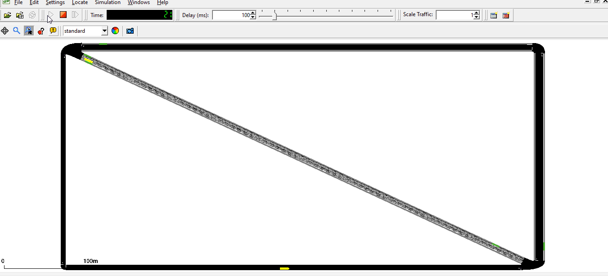
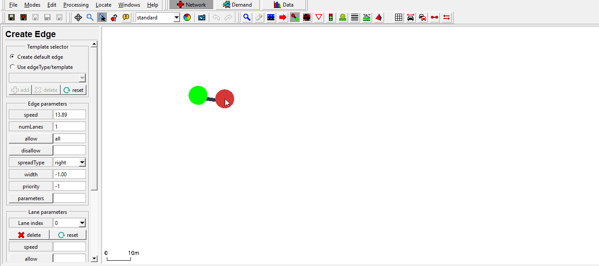
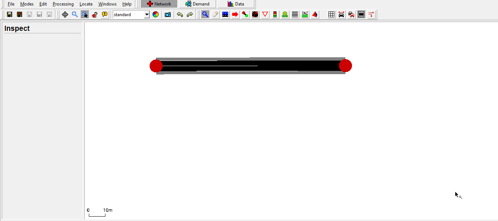
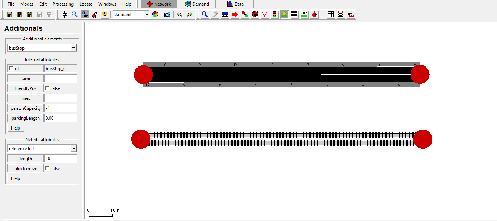

# Introduction
This tutorial is a small example of how to incorporate public transport, without
using the [osmWebWizard.py](../Tools/Import/OSM.md#osmwebwizardpy).
Main topics are:

*   Public Transport
*   Bus stops

## Useful links

- [Tutorials](index.md)

- Documentation
  - [Public Transport](../Simulation/Public_Transport.md)
  - [Public Transport Schedules](../Simulation/Public_Transport.md#public_transport_schedules)
  - [Person](../Specification/Persons.md)
  - [Vehicle](../TraCI/Vehicle_Value_Retrieval.md)

- Pydoc
  - [traci._person](https://sumo.dlr.de/pydoc/traci._person.html)
  - [traci._vehicle](https://sumo.dlr.de/pydoc/traci._vehicle.html)
  - [traci._busstop](https://sumo.dlr.de/pydoc/traci._busstop.html)

# Public Transport Tutorial
At the beginning of the simulation, buses and trams are being dispatched to cater to their designated routes.   
Simultaneously, people are created. Each person hurries to their favourite bus stop and waits for their bus or tram.   
They then are picked up and brought to their target bus stops.

Running the simulation:
```
.docs/tutorials/public_transport/data/run.sumocfg
```



## Net, routes, demand and schedules
### Net
First, the net has to be created and bus stops must be built. There are several ways to accomplish this - one can, for example, write them by hand into the xml file or use netedit for this.

#### Using netedit
Bus stops can be easily created with the bus stop tool at the top of the window.   
The following gifs will describe the basic creation of the net used in this tutorial.

*Creating an edge with reverse line and side walks.*


*Creating an edge with reverse line, which allows vehicles of your choice.*


*Adding bus stops to the edges.*

If you are not sure about how to create a net in netedit, take a look at this tutorial:

* [Quick Start](quick_start.md)
It explains the use of edges, connections, demands, routes etc., in depth.

When saving the net you should save your additionals as well.
Bus stops should be written in the `additional.add.xml` file to provide the stops for the people and vehicles.   
An example xml code for the bus stop may look like this:

```xml
    <busStop id="A_bus" lane="-E1_1" startPos="14.42" endPos="24.42"/>
    <busStop id="A_tram1" lane="-E4_0" startPos="13.43" endPos="43.43">
        <access lane="E1_0" pos="175.00"/>
    </busStop>

```

If a busStop is on an edge that does not permit pedestrians (i.e. tram track) it must be connected to the rest of the network with `<access>` elements (also in the netedit additional-mode).


## Public Transport
The created bus stops can be used as the stopping points within the route declaration.   
Those routes can later be assigned to vehicles, in this case, trams and buses.
The routes are written into the `routes.rou.xml` file.   
Below you can see examples from the code for the routes of the trams and buses.


To obtain a repeating schedule multiple approaches are feasible:

- define repeating vehicles (`<flow>`) that disappear after running the route once. This is useful if the network does not contain the full circuit of the route
- define a single vehicle with a repeating route. This is ideal for letting delays from one round of the schedule carry over to the next round

```xml
    <vType id="bus" vClass="bus"/>
    <vType id="tram" vClass="tram"/>

    <route id="busRoute" edges="-E1 -E0 -E3 -E2" color="yellow" repeat="10" cycleTime="140">
        <stop busStop="A_bus" duration="20.00" until="30.00"/>
        <stop busStop="B_bus" duration="20.00" until="90.00"/>
    </route>

    <vehicle id="bus" type="bus" depart="0.00" line="42" route="busRoute"/>

    <flow id="tram1" type="tram" begin="0.00" end="3600.00" period="300.00" line="23">
        <route edges="-E4" color="cyan"/>
        <stop busStop="A_tram1" duration="20.00" until="30.00"/>
        <stop busStop="B_tram1" duration="20.00" until="45.00"/>
    </flow>
```

### Schedules

Buses and trams usually run on strict schedules in daily life. Similar alterations are possible in SUMO and are vital while using intermodal routing.   
Such schedules are defined with the attribute `until`. The until attribute is set for the stops.
A vehicle following this schedule can't leave this stop until this time ('until') has passed and the minimum stoppping time ('duration') has also passed.


## Demand

The travel demand consists of persons that can choose their mode of transport freely 

```xml
   <personFlow id="AB" begin="0" end="3600" probability="0.1">
        <personTrip from="-E1" to="-E0" arrivalPos="-20" modes="public"/>
    </personFlow>
```

Instead of flows, all persons and vehicles can also be defined individually and person plans can be defined with explicit steps.
Use the sumo option **--vehroute** output to learn how a `<personFlow>` is expanded into multiple travel stages during the simulation.

```xml
<person id="HeadingBusstop20" depart="1.00" color="green">
     <walk from="gneE1" busStop="busStop_-gneE10_1_6"/>
     <ride busStop="busStop_-gneE10_1_5" lines="tram"/>    
</person>

<vehicle id="0" type="Tram" depart="0" color="1,1,0" line="tram">
     <route edges="gneE10 -gneE10"/>
     <stop busStop="busStop_-gneE10_1_6" duration="20"/>
</vehicle>
```


*Alteration of the busRoute.The bus stops until 170 at the uppermost bus stop.*


## sumocfg
As you have probably seen from other tutorials, you bind everything together
with a sumocfg. Within this, you set the net, route and additional files.   
Afterwards, you can start your simulation by clicking on it or starting it over on the
command line.

```xml
<configuration xmlns:xsi="http://www.w3.org/2001/XMLSchema-instance" xsi:noNamespaceSchemaLocation="http://sumo.dlr.de/xsd/sumoConfiguration.xsd">

    <input>
        <net-file value="net.net.xml"/>
        <route-files value="pt.rou.xml,persons.rou.xml"/>
        <additional-files value="stops.add.xml"/>
    </input>
    
</configuration>
```

For getting specific data about the simulation, you can use TraCI.
A good starting point would be the tutorials provided:

* [TraCI4Traffic Lights](TraCI4Traffic_Lights.md)
* [TraCIPedCrossing](TraCIPedCrossing.md)
