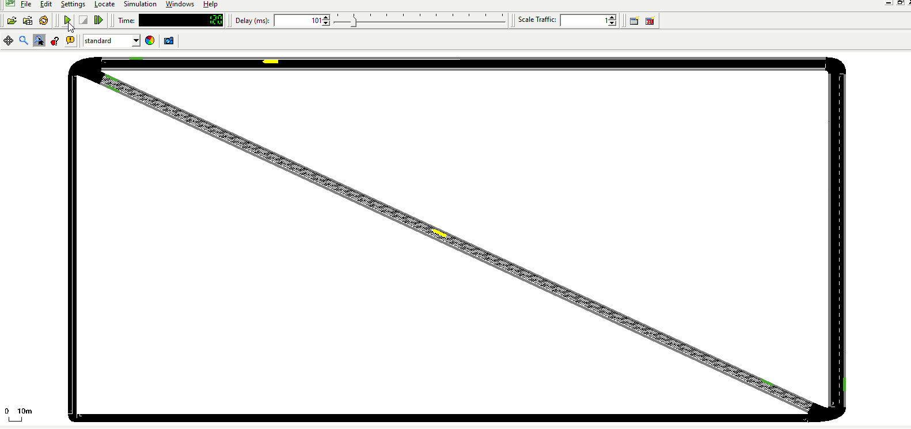

# Introduction
This tutorial is a small example of how to incorporate public transport, without
using the [osmWebWizard.py](../Tools/Import/OSM.md#osmwebwizardpy).
Main topics are:

*   Public Transport
*   Bus stops

## Useful links

- [Tutorials](index.md)

- Documentation
  - [Public Transport](../Simulation/Public_Transport.md)
  - [Public Transport Schedules](../Simulation/Public_Transport.md#public_transport_schedules)
  - [Person](../Specification/Persons.md)
  - [Vehicle](../TraCI/Vehicle_Value_Retrieval.md)

- Pydoc
  - [traci._person](https://sumo.dlr.de/pydoc/traci._person.html)
  - [traci._vehicle](https://sumo.dlr.de/pydoc/traci._vehicle.html)
  - [traci._busstop](https://sumo.dlr.de/pydoc/traci._busstop.html)

# Public Transport Tutorial
At the beginning of the simulation buses and trams are getting dispatched to cater to their designated routes.   
Simultaneously people are created. Each person hurries to their favourite bus stop and waits for their bus or tram.   
They're getting picked up and brought to the target bus stop.

Running the simulation:
```
./PublicTransportTutorial.sumocfg
```


## Net, routes, demand and schedules
### Net
First the net has to be created and the bus stops be build. There are several ways to accomplish this.   
One can for example write them by hand into the xml file or use netedit for it.

#### Using netedit
Bus stops can be easily created with the bus stop tool at the top of the window.   
Following gifs will describe the basic creation of the net used in this tutorial.

*Creating an edge with reverse line and side walks.*


*Creating an edge with reverse line, which allows vehicles of your choice.*


*Adding bus stops to the edges.*

If you are not sure about how to create a net in netedit, take a look at this tutorial:

* [Quick Start](quick_start.md)
It explains the use of edges, connections, demands, routes etc. in depth.

When saving the net you should as well save your additionals.
Bus stops should be written in the additional.add.xml file to provide the stops for the people and vehicles.   
An example how an xml code for the bus stop may look like:

```
<busStop id="busStop_-gneE0_1_7" lane="-gneE0_1" startPos="519.30" endPos="529.30"/>
```

You can go ahead and create a basic net to your liking and save it as net.net.xml,
as well as the bus stops by just saving the additionals.

### Routes
The created bus stops can be used as the stopping points within the route declaration.   
Those routes can later be assigned to vehicles, in this case the trams and buses.
The routes are written into the routes.rou.xml file.   
Below you can see examples from the code for the routes of the trams and buses.
Additionally there is a duration how long the tram/bus is stopping at given stop.

```
<route id="tramRoute" edges="gneE10 -gneE10 " >
            <stop busStop="busStop_gneE10_1_5" duration="20"/>
            <stop busStop="busStop_-gneE10_1_6" duration="20"/>
            <stop busStop="busStop_-gneE10_1_5" duration="20"/>
</route>


<route id="busRoute" edges="-gneE2 -gneE1 -gneE0 -gneE3 -gneE2" >
            <stop busStop="busStop_-gneE1_0_1" duration="20"/>
            <stop busStop="busStop_-gneE0_1_7" duration="20"/>
</route>
```

You can write your own routes for your net using netedit or writing them in the xml file.   
The busStop parameter in routes should be a existing busStop in the additional.add.xml file.

So far we created a net, some bus stops and routes.

### Demand
All demands of this tutorial are written into the routes.rou.xml file.   
The demand consists out of different person-, tram- and bus-flows. The vehicle flows are
getting the routes assigned that where created earlier.

The person flow defines the travel behaviour of the people. For this small example
the person flow walks from an existing edge in the net to a bus stop to wait for
their ride (lines="tram"/lines="bus") to bring them to their destination.

First you have to declare the type of vehicle that is used in a flow via vType.
The id from vType is then used as the type parameter within the flow.

```
<vType color="1,1,0" maxSpeed="70" minGap="3" length="12" sigma="0" decel="4.5" accel="2.6" id="Tram" personCapacity="8" vClass="tram"/>
<vType color="1,1,0" maxSpeed="70" minGap="3" length="12" sigma="0" decel="4.5" accel="2.6" id="Bus" personCapacity="8" vClass="bus"/>

<flow type="Tram" line="tram" id="flow_0" begin="1.00" route="tramRoute" end="3600.00" number="25" />
<flow type="Bus"  line="bus" id="flow_1" begin="1.00" route="busRoute" end="3600.00" number="25" />

<personFlow id="TramPerson_0" begin="0.00" end="3600.00" number="80" >
     <walk from="gneE1" busStop="busStop_-gneE10_1_6"/>
     <ride busStop="busStop_-gneE10_1_5" lines="tram"/>   
</personFlow>
```

If you don't want to write a flow, you can assign vehicles and people their routes
individually.

```
<person id="HeadingBusstop20" depart="1.00" color="green">
     <walk from="gneE1" busStop="busStop_-gneE10_1_6"/>
     <ride busStop="busStop_-gneE10_1_5" lines="tram"/>    
</person>

<vehicle id="0" type="Tram" depart="0" color="1,1,0" line="tram">
     <route edges="gneE10 -gneE10"/>
     <stop busStop="busStop_-gneE10_1_6" duration="20"/>
</vehicle>
```

### Schedules
Buses and trams usually run by strict schedules in daily life. Similar alterations are possible in Sumo and vital when using intermodal routing.   
Such schedules are defined with the attribute until. The until attribute is set for the stops.
The vehicle following this schedule can't leave this stop until this time has passed and the eventual added duration.   
This entails that if both, until and duration are used, this might cause a traffic delay, because the vehicle still waits at the bus stop when running late.

```
<route id="busRoute" edges="-gneE2 -gneE1 -gneE0 -gneE3 -gneE2" >
      <stop busStop="busStop_-gneE1_0_1" duration="20"/>
      <stop busStop="busStop_-gneE0_1_7" until="00170" duration="20"/>
</route>
```


*Alteration of the busRoute.The bus stops until 170 at the uppermost bus stop.*

Notice that when running the simulation that the next buses and trams have the same schedule, just adjusted
to their departure time. This is handled differently depending on you implementation of until.
It is possible to use the until attribute with flows, trips and routes. The time declaration can also be written in human-readable times.

It is beneficial to add the schedules to your implementation and to newly added stops to avoid errors when using intermodal routing.


## sumocfg
As you probably have seen from other tutorials you bind everything together
with a sumocfg. Within you set the net, route and additional files.   
Afterwards you can start your simulation by clicking on it or starting it over the
command line.

```
<configuration xmlns:xsi="http://www.w3.org/2001/XMLSchema-instance" xsi:noNamespaceSchemaLocation="http://sumo.dlr.de/xsd/sumoConfiguration.xsd">

    <input>
        <net-file value="net.net.xml"/>
        <route-files value="routes.rou.xml"/>
        <additional-files value="additional.add.xml"/>
    </input>

    <time>
        <begin value="0"/>
        <end value="10000"/>
    </time>
</configuration>
```

For getting specific data about the simulation, you can use TraCI.
A good starting point would be the tutorials provided:

* [TraCI4Traffic Lights](TraCI4Traffic_Lights.md)
* [TraCIPedCrossing](TraCIPedCrossing.md)
