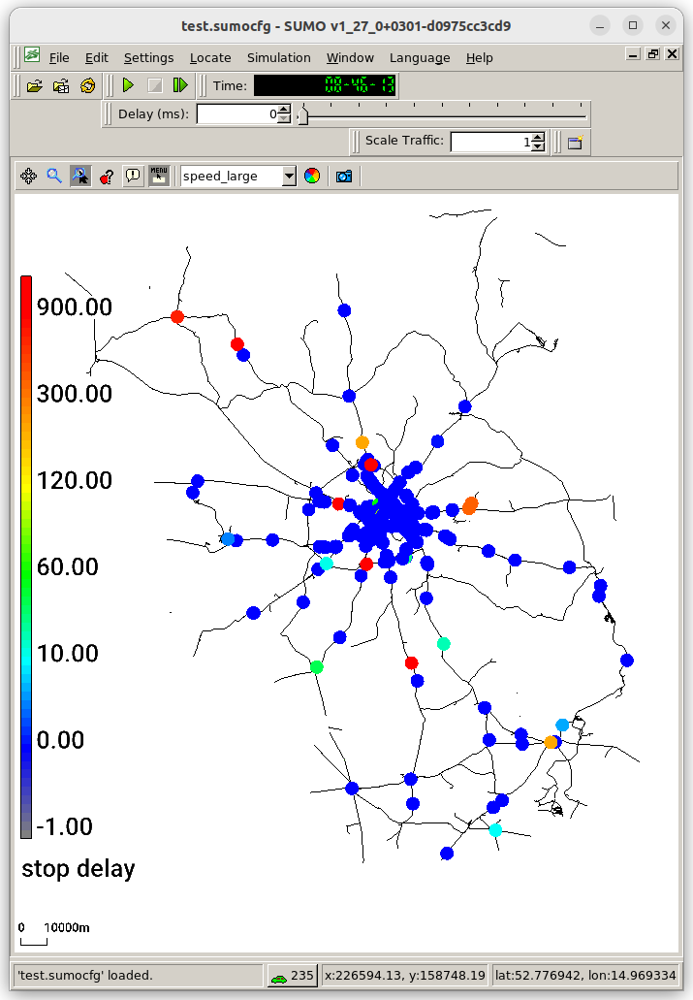

# Overview 

The following tutorial explains how to build a railways scenario for the combined German states of Berlin and
Brandenburg based on OSM and GTFS data. The resulting scenario models scheduled passenger traffic for one day of operations.

The OSM data is obtained from [geofabrik](https://download.geofabrik.de/europe/germany/brandenburg-latest.osm.pbf).
The GTFS data is obtained from the
[VBB](https://unternehmen.vbb.de/fileadmin/user_upload/VBB/Dokumente/API-Datensaetze/gtfs-mastscharf/GTFS.zip).



# Filtering OSM

For our purpose we only require the railway specific OSM data. Filtering can be accomplished with [osmconvert](https://wiki.openstreetmap.org/wiki/Osmconvert) and
[osmfilter](https://wiki.openstreetmap.org/wiki/Osmfilter).

```
osmconvert brandenburg-latest.osm.pbf -o=osm.o5m
osmfilter osm.o5m --keep-ways=railway= --keep-nodes= --keep-relations=route=train --keep-relations=route=light_rail --drop-author --drop-tags="note= old_name= source= name:etymology:wikidata= wikipedia=" > osm_rail.xml
```

# Importing and processing the rail network

The import consists of two stages: importing the OSM data with netconvert and then post-processing some edge-attributes
based on network topology to improve rail routing and stop track assignment.

```
netconvert --osm-files osm_rail.xml --ptstop-output osm.stops.xml --ptline-output osm_ptlines.xml -o net.net.xml.gz -l osm.log --keep-edges.by-vclass rail,rail_urban --no-internal-links --railway.signal.guess.by-stops --railway.topology.all-bidi --ptline-clean-up --railway.topology.ptline-priority rail,rail_urban --output.street-names
python $SUMO_HOME/tools/net/patchRailPriorities.py -n net.net.xml.gz -o net2.net.xml.gz -r osm_ptlines.xml -s osm.stops.xml -O osm.stops2.xml --add-stop-signals
```

The relevant netconvert options are explained in the following

- **--ptstop-output osm.stops.xml**: Required for guiding GTFS import
- **--ptline-output osm_ptlines.xml**: Required for post-processing the network to find passing loops
- **--no-internal-links**: speeds up simulationg and processing of large networks by removing details that are not needed for rail simulations
- **--railway.signal.guess.by-stops**: heuristicaly add signals at stations (unless they already exist). This covers gaps in OSM signal coverage
- **--railway.topology.all-bidi**: Helps to cover track-direction errors in OSM
- **--ptline-clean-up**: removes stops that were not used by public transport lines in the OSM data. Avoids bad track assignment
- **--railway.topology.ptline-priority rail,rail_urban**: Assigns edge priorities according to use by trains and urban rail. This is critical for correct track assignment
- **--output.street-names**: Assigns track numbers (line ids) in the network


# Importing GTFS

```
python $SUMO_HOME/tools/import/gtfs/gtfs2pt.py --gtfs GTFS.zip --date 20260622 -H --stops osm.stops2.xml --sort -n net2.net.xml.gz --modes train,light_rail --radius 500 --network-split-vclass --rail-priority-factor 5 --remove-detour-factor 5
```

The relevant options are explained in the following

- **--date**: The GTFS data from VBB is valid for the date of download an at least the subsequent two weeks. The argument for must be adapted accordingly
- **--stops**: This uses stops from OSM as candidate locations. This is critical for speeding up imports and mapping to the correct track
- **--radius**: The default radius of 200m is to low for mapping large railway stations
- **--rail-priority-factor 5**: This helps to match train routes to the correct side of double tracked lines (it relies on priorities assigned in the Network import stage)
- **--remove-detour-factor 5**: This reports and filters out train routes with implausible detours. Investigating these reports is recommended


# Running the Scenario

```
sumo -n net2.net.xml.gz -a gtfs_pt_stops.add.xml,vtypes.xml -r gtfs_pt_vehicles.add.xml --time-to-teleport 1800 --time-to-teleport.railsignal-deadlock 300 -t --railsignal.max-block-length 5e5 -H
```


The relevant options are explained in the following

- **--time-to-teleport 1800**: Trains may have to wait due to missing railway siginals. To avoid premature teleporting, it is useful to increase the default from 300s to 1800s.
- **--time-to-teleport.railsignal-deadlock  300**: With this option, the simulation detectors circular infrastructure depenencies that cannot resolve themselves. 
- **--railsignal.max-block-length 1e5**: This option is relevant to prevent deadlocks on long single-track sections. It avoids deadlocks at the cost of extra computational time and memory. When simulationg at the country scale, a smaller value such as 1e5 should be used
- **-H**: human readable-times are friendlier in a simulation that covers a whole day

