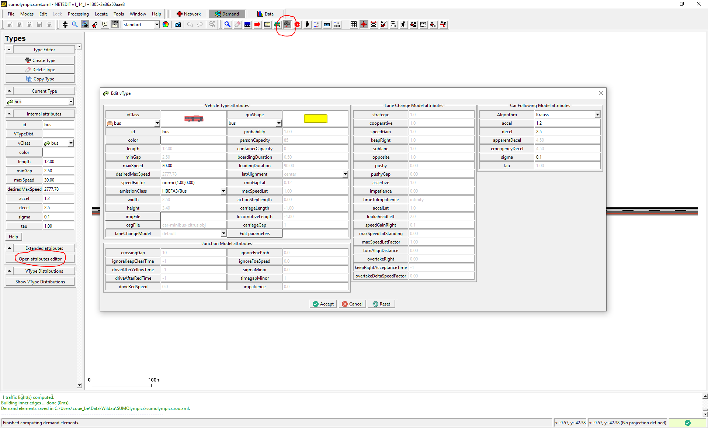
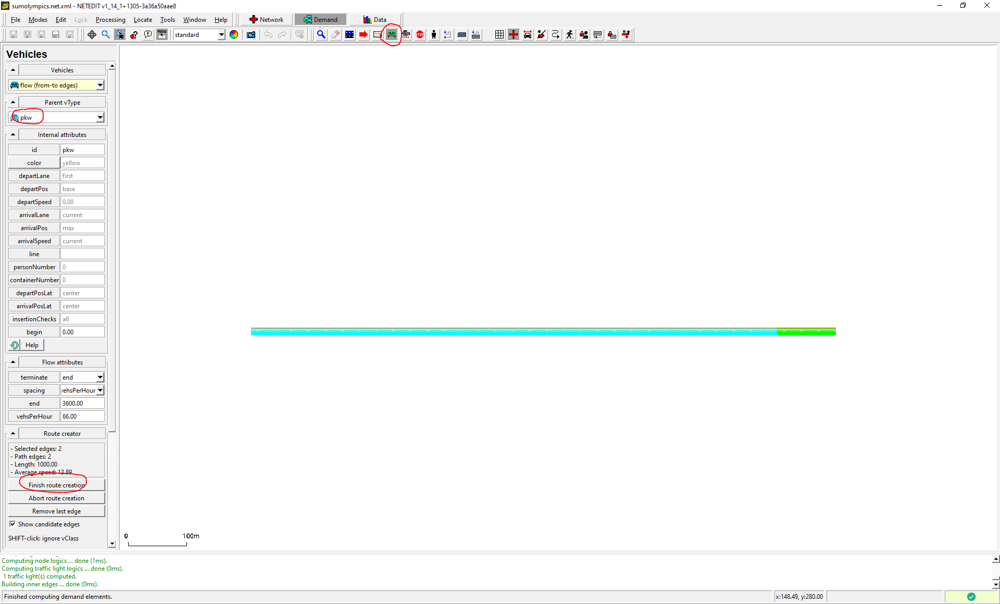

This tutorial sets up a competition (a collective 100 meter sprint) for
different traffic modes. You will learn how to create special lanes and
(very simple) traffic lights in [netedit](../Netedit/index.md), use different vehicle classes
to define vehicle types and create flows for the different
types. All files can also be found in the {{SUMO}}/docs/tutorial/sumolympics
directory.

This tutorial is a reconstruction of a [VISSIM Scenario devised
by the PTV Group](https://www.youtube.com/watch?v=IpaNLxrtHOs).

# Building the network


Open netedit and create a new network and add a single
edge by pressing `e` for entering the edge creation mode and clicking on
two different locations in the editing area. Change to the inspection mode
(press `i`) and click on the starting point of the edge (at the location
of your first click). Now enter `0,0` in the textfield labeled `pos` in
the inspector panel on the left (see figure). Do the same for the edge's
endpoint, setting its position to `1000,0`. Now save your network under
the name `sumolympics.net.xml` (press `Ctrl+Shift-S`).

Now we have a long road, which will be the stage of our competition. The
participants in the competition will be transportation modes, i.e.,
buses, trams, bicycles, passenger cars, and feet. They should travel on
different lanes side-by-side. Thus, we have to add lanes for each mode.
To do so, right-click on the edge and hover over "add restricted lane"
in the context menu. This will show you three choices for the creation
of special purpose lanes: Sidewalk, Bikelane, and Buslane. Add one lane
for each type.


To create a tram, we add a new lane by clicking on "Duplicate lane" in
the same context menu. For that lane, we have to restrict the allowed
vehicle class to trams. To do this, first uncheck the "select edges"-box
just right of the edit mode dropdown menu in the toolbar (the mode
should still be set to "(i)Inspect"). Then click on the newly created
lane and on the button "allow" in the inspector panel. This opens a
dialog with check boxes for all possible vehicle classes. Uncheck all
but "rail_urban" and click on "accept". Now edit the allowances for the
remaining lane (it is currently allowed for all vehicle classes) and
reserve it to the class "passenger" (i.e. passenger
cars). Also for the bicycle lane, we need to modify its width in order to 
allow overtaking in what follows. To do so, select the bicycle lane as above, then in the 
inspect mode, change its width to 2.1 meters in the left panel.


Now let us split the edge to create a starting point for the
competitors: Right-click anywhere on the edge and select "Split edge
here" from the context menu. Then click on the created node (in SUMO
terminology this is already a _junction_). Set its x-coordinate to 900
and its y-coordinate to 0 in the `pos`-field just as you did above when
creating the edge. Effectively, we have created a 100 meter running
track for the competitors with a 900 meter holding area for each of the
competing modes. Now check the check box "select edges" again and rename
the two edges to "beg" and "end" (in the inspector panel). Save your
network (`Ctrl-S`).

# Defining the competing vehicles (types and flows)

As a next step, we define the competing vehicle types as well as a several of these vehicles, organized as _flows_.

## Using XML

Open a new file called `sumolympics.rou.xml` and insert the following vehicle type definitions:

```xml
<routes>
    <vType id="pkw" length="5" maxSpeed="50" accel="2.6" decel="4.5" sigma="0.2" speedDev="0.2" vClass="passenger"/>
    <vType id="bus" length="15" maxSpeed="30" accel="1.2" decel="2.5" sigma="0.1" speedDev="0.1" vClass="bus"/>
    <vType id="tram" length="40" maxSpeed="13" accel="0.8" decel="0.5" sigma="0.1" speedDev="0.1" vClass="rail_urban"/>
    <vType id="bike" length="1.8" width="0.8" maxSpeed="7.5" accel="0.8" decel="1.5" sigma="0.5" speedDev="0.5" vClass="bicycle"/>
	<vType id="pedestrian" length="0.3" width="0.5" maxSpeed="2.0" accel="0.2" decel="1.5" sigma="0.2" speedDev="0.2" vClass="pedestrian"/>
</routes>
```

Take a look at the [vehicle type attributes
description](../Definition_of_Vehicles,_Vehicle_Types,_and_Routes.md#vehicle_types)
for details on these definitions, as well as [this page](../Specification/Persons.md) for persons.

For each vehicle type, we schedule and position vehicle flows by adding the following `<flow .../>` elements just below the
vType definitions (within the `<routes>` element\!):

```xml
        ...
    <flow id="pkw" type="pkw" from="beg" to="end" begin="0" end="0" number="66" departPos="last"/>
    <flow id="bus" type="bus" from="beg" to="end" begin="0" end="0" number="5" departPos="last"/>
    <flow id="tram" type="tram" from="beg" to="end" begin="0" end="0" number="2" departPos="last"/>
    <flow id="bike" type="bike" from="beg" to="end" begin="0" end="0" number="100" departPos="last"/>
	
	<personFlow id="pedestrian" type="pedestrian" begin="0" end="0" number="100" departPos="-30">
       <walk from="beg" to="end" arrivalPos="-0.1"/>
    </personFlow>
        ...
```

Notice that the pedestrian flow (represented by the `personFlow` element above) has a slightly different syntax, the reason for this is that pedestrians can walk or take a ride (use public transport for instance), and these different activities need to be communicated to [sumo](../sumo.md). For details on the meaning of the attributes of the flows, see the
section [Flow Definitions](../Demand/Shortest_or_Optimal_Path_Routing.md#flow_definitions) and [Person Flows](../Specification/Persons.md#repeated_persons_personflows).

## Using netedit

We created the vehicle types and the vehicle flows "by hand", by writing the definitions down into a XML file, however these manipulations can directly be made (and visualized) in netedit! In order to achieve this, you need to select the "Demand" mode rather than the "Network" mode that you used to create the network above. For creating a new vehicle type use the "Create type mode". You can modify the main parameters directly in the left panel, other parameters can be modified after clicking "Open attributes editor", as shown here:



Now concerning the creation of motorized flows, you need to use the "Create vehicle mode". Then at the top of the left panel, you can create an individual vehicle or a flow, with different options. There select "flow (from-to edges)". You can then use a particular vehicle type, change the `departPos` attribute and the number of vehicles you want. Then select the start and end edges directly on the network and when everything has been set, click on "Finish route creation" on the left panel to create the route and the flow. 



The cyan color is used to represent the start edge whereas the light green color is used for the chosen end edge. A small vehicle will be added at the starting position of the flow to materialize it inside the GUI. You can also check that the flow was created by using "Locate > Vehicles" of the netedit main menu. Person flows are created in a similar manner, but you need to use the dedicated "Create person mode" instead.

## A first simulation

Finally, to prepare the simulation, create a SUMO configuration file (name it
`sumolympics.sumocfg`):

```xml
<configuration>
   <input>
       <net-file value="sumolympics.net.xml"/>
       <route-files value="sumolympics.rou.xml"/>
   </input>
   <processing>
    <lateral-resolution value="1." />
   </processing>
</configuration>
```

Here we give the processing argument `lateral-resolution` with a value
corresponding to the sub-lane width in meters to achieve a more
realistic behavior of bicyclists utilizing the whole lane width to
overtake each other (see [Sublane
Model](../Simulation/SublaneModel.md) and [Bicycle
simulation](../Simulation/Bicycles.md)). Start the simulation by
double-clicking on the configuration file `sumolympics.sumocfg`
(Windows), opening SUMO GUI, or running `sumo-gui -c sumolympics.sumocfg` from a terminal.
Adjust the step delay to 100 ms and press the run button
().


# Defining a start signal by using a traffic light

There is one thing left to do for a fair and complete competition: all 
competitors should be allowed to position themselves freely in front of the
scratch line (the bicyclists are inserted in a row, though they could
achieve a much better result by grouping more densely using the whole
lane width).


First we create a traffic light on the
junction between the edges "beg" and "end" with netedit: Press `t` to
enter the traffic light editing mode. Click on the junction, then on
"Create TLS" in the left panel. Below, under the label phases, type
"rrrrr" for the first phase ("r" for red) and set its duration to 100
(secs.). This will give enough time for the bicyclists to group more
densely. For the second phase enter "GGGGG" (yes, "G" for green) and set
its duration to 1000 (i.e. until the end of the simulation run). Now run
the simulation again to see the bikes outrun the cars. See? We should
all use our bikes more often\!

If you have noticed a warning (like "Warning: Missing yellow phase in
tlLogic 'gneJ2', program '0' for tl-index 0 when switching to phase 0")
in the Message Window, don't worry. SUMO routinely checks tls-phases for
basic consistency and missing yellow phases may lead to crashes if you
have intersecting flows. However, this is a special situation and we
don't need to care about this, obviously. If you want to learn more
about traffic light control, see the TraCI-Tutorials
[TraCIPedCrossing](TraCIPedCrossing.md) and
[TraCI4Traffic_Lights](TraCI4Traffic_Lights.md) or
the main section on [traffic
lights](../Simulation/Traffic_Lights.md).


Grab some popcorn and start the simulation\!

Back to [Tutorials](index.md).
