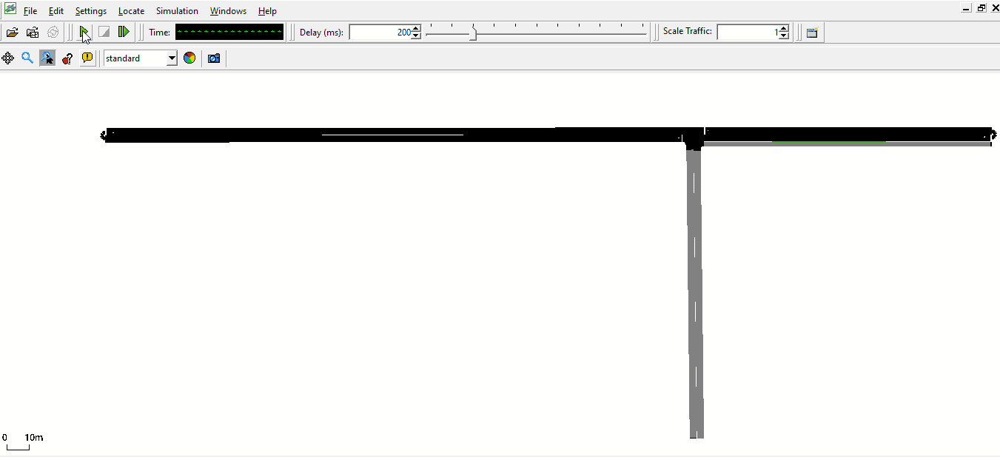
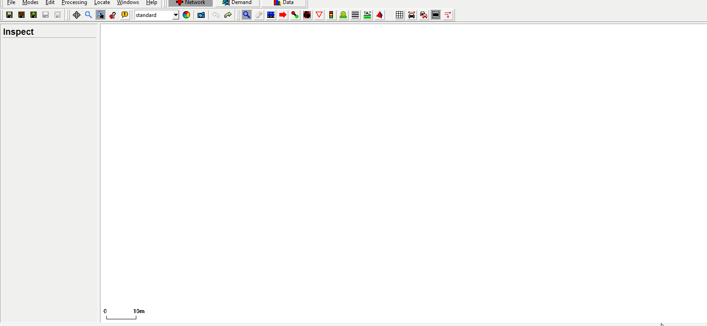
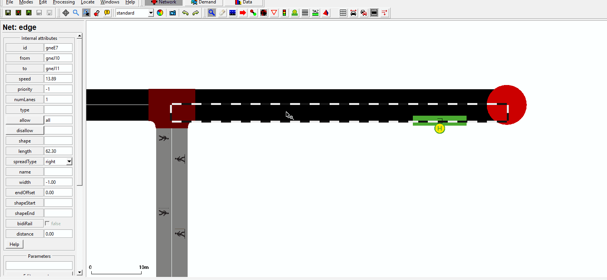
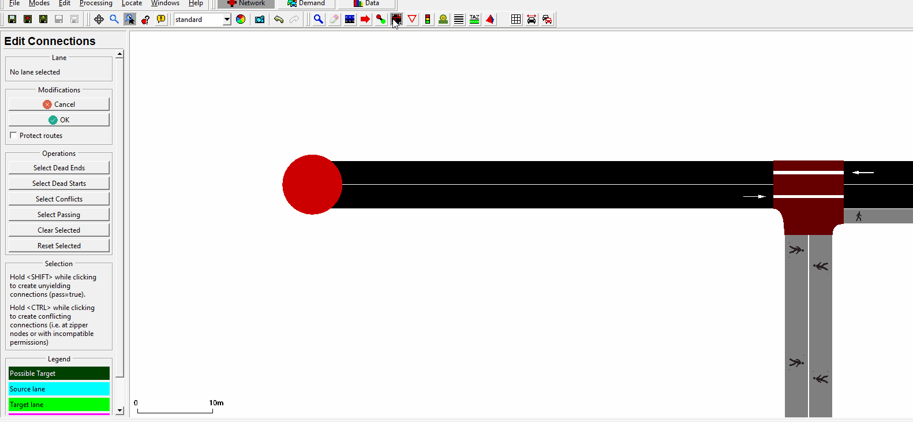
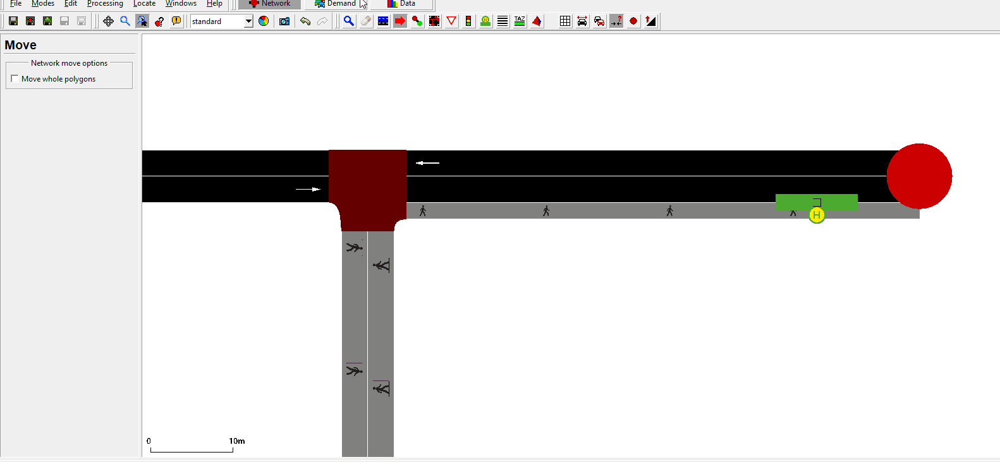

## Introduction
This tutorial is an example on how the taxi-service can be used in SUMO.   

- Main topics are
  - Vehicle-creation
  - Bus stops
  - Taxi-Reservations and pick up  

The tutorial itself is separated into two parts.   
Part 1:
Creation of a simple taxi-service, with net-creation and taxi dispatching.   
Part 2:
An addition of a small code part. Within this code the bus stops are being asked about the people waiting there.
The tutorial can be used if a bus stop is overflowing with people. An emergency shuttle is dispatched to pick them up.   


It would be very beneficial if you did take a look at the traci-beginner tutorials. This tutorial is an extension of those, showcasing a few operations with the traci taxi.


### Useful links
- [Tutorials](index.md)

- Documentation
  - [Taxi](../Simulation/Taxi.md)
  - [Person](../Specification/Persons.md)
  - [Vehicle Value Retrieval](../TraCI/Vehicle_Value_Retrieval.md)

- Pydoc
  - [traci._person](https://sumo.dlr.de/pydoc/traci._person.html)
  - [traci._vehicle](https://sumo.dlr.de/pydoc/traci._vehicle.html)
  - [traci._busstop](https://sumo.dlr.de/pydoc/traci._busstop.html)


## TaxiService
At the start of the simulation, five people are created and are heading to the nearby bus stop and waiting for a shuttle to pick them up.   
In the same area, some taxis are created after a few steps. There is no additional bus planned for this area, hence there must be emergency pick ups for the people waiting. When the count of people waiting reaches a certain point, the taxis receive the reservations and pick up each customer individually.   



## Part 1
### Demand and creation
#### Net creation
If you'd like to create the same net depicted or you want to revisit netedit you can
use the following gifs as a guide. Otherwise you can skip this section.



*Creating the basic net.*


*Adding a sidewalk.*


*Making the connections. You can go ahead and add the connections to the other connecting streets as well.*


*Creating routes. You can go ahead and add the other routes for the vehicles.*   

### Demand
#### Creating the taxi and person
Key participants within the simulation are people waiting and taxis.   
To create a vehicle of type taxi you have to add the key parameter:   
```xml
<!-- Route -->
   <route edges="-gneE2 gneE0 -gneE0 gneE2 -gneE2" color="yellow" id="route_0"/>

<!-- Taxi-Type -->
   <vType id="taxi" vClass="taxi" personCapacity="8">
       <param key="has.taxi.device" value="true"/>
   </vType>
```
There are other options to define the taxis behavior. You can decide when the taxis are going to disappear or if they should start circling the area. In this example the taxis will keep circling the area, even when there are no longer people in the simulation. This is done by choosing a dispatch-algorithm at the start of the simulation, which is discussed later in the tutorial.  


Next you can create a person, which departs at the start and heads to the designated bus stop.

The third line here is essential, declaring that the person wants to go by taxi to edge gneE2. The `lines` parameter is also essential here.  
```xml
<person id="HeadingBusstop1" depart="0.00" color="green">
    <walk from="-gneE1" busStop="busStop_gneE0_0_0"/>
    <ride from="gneE0" to="gneE2" lines="taxi"/>   
</person>
```
It is also possible to define personTrips for intermodal routing or group several people together.   
As shown in the beginner traci tutorials, you can create a `runner.py` file to manage the taxi creation in your project.
Within the example method, four taxis are created and dispatched at a given time.  
```python
# Creating 4 taxis
def createTaxi(time):
    for i in range(0, 20, 5):
        # declaring the name(unique), route(from demand.route.xml), type of vehicle(declared in demand.route.xml),
        # depart time, and line
        traci.vehicle.add(f'taxiV{i}', 'route_0', 'taxi', depart=f'{time}', line='taxi')
```
#### Dispatch and Pickup
For this example we are using "-device.taxi.dispatch-algorithm traci". Within this algorithm, one has to declare which customers should be picked up by which taxi. Meaning you have to pass the existing reservations to the designated taxi you'd like to use for the pick up. There are other algorithms like greedy, greedyClosest etc. that work differently with the reservations.   
Next, the taxi fleet (containing all taxis in the map) are saved into "fleet", while all reservations are saved into "reservations". Afterwards the first taxi in the fleet is called and given the first reservation from "reservation_ids".
```python
fleet = traci.vehicle.getTaxiFleet(0)
reservations = traci.person.getTaxiReservations(0)
reservation_ids = [r.id for r in reservations]
traci.vehicle.dispatchTaxi(fleet[0], reservation_ids[0])
```
For more output parameters take a look at the documentation and the Pydoc.
## Part 2
In the second part of the tutorial, a bus stop is overflowing with people waiting for their ride. Emergency taxis are deployed to pick up the customers.
### Reservations
For this part of the tutorial you can add another method to monitor the bus stops and start the emergency taxi function if needed.
In this example we are targeting one bus stop with too many people waiting for a transport.   
As you can see in the code below, for all the bus stops, where the personCount is equal or larger than four, the method emergencyTaxi(i) is called.
```python
# checks if busstop is "overflowing"
def busstopCheck():
    # getting all bus stops on the map
    busstops = traci.busstop.getIDList()
    # checking the personcount of waiting people
    for i in busstops:
        if traci.busstop.getPersonCount(i) >= 4:
            emergencyTaxi(i)
```


### Fleet and dispatch
The fleet consists only out of unoccupied taxis. Getting unoccupied taxis(0).
If one wants to add further reservations to a assigned taxi, filter for the occupied(2) or those in pickup-modus(1).
The id of the bus stop in question is given to the emergencyTaxi method, to specifically plan a pick up.
```python
# Dispatching taxis to cater to people waiting at a bus stop
def emergencyTaxi(busstopID):
    # getting a Id-list of people waiting at the busstop
    peopleWaiting = traci.busstop.getPersonIDs(busstopID)
    pickup = []
    # creating a list with the taxi reservations
    for i, val in enumerate(peopleWaiting):
        pickup.append(traci.person.getTaxiReservations(0)[i].id)
    # if one Taxi should pick up all customers, the list needs to clarify the drop off
    # hence the pickup is extended by the order of drop offs
    # pickup.extend(pickup)
    try:
        fleet = traci.vehicle.getTaxiFleet(0)
    except (traci.exceptions.FatalTraCIError):
        print("No unoccupied taxi-fleet!")
    # dispatching the unoccupied taxis to pick up their designated customers
    for i, val in enumerate(peopleWaiting):
        traci.vehicle.dispatchTaxi(fleet[i], pickup[i])
```
The taxi from the list with listposition i is dispatched to pick up the person from list "pickup" at position i.   

It is also possible to let one taxi pick up and drop off all the people, if the vehicle capacity is sufficient.

```python
pickup.extend(pickup)
```
Might look like this:   
```python
pickup = [a,b,c,a,b,c]
```
The passengers are dropped of in the order of the extension.

### sumocfg
Additional lines are added to the config files:
To be able to use traci.taxis, one has to add an algorithm to the config files.
Furthermore, to prevent the taxis simply vanishing after dropping of their person(s), the line declaring
randomCircling has been added. After delivering the person to the right position the taxi starts
driving around in the network after a short break.
```xml
<configuration>
            <input>
                <net-file value="net.net.xml"/>
                <route-files value="demand.rou.xml"/>
                <additional-files value="add.add.xml"/>
                <no-step-log value="True"/>
                <time-to-teleport value="0"/>
                <device.taxi.dispatch-algorithm value="traci"/>
                <device.taxi.idle-algorithm value="randomCircling"/>
            </input>
</configuration>
```
Another way to use the algorithms is to add them to the traci.start in the script:
```python
sumoBinary = sumolib.checkBinary('sumo')
traci.start([sumoBinary,
            "-c", "sumo.sumocfg",
             "--tripinfo-output", "tripinfos.xml",
             "--device.taxi.dispatch-algorithm", "traci",
             ] + sys.argv[1:])
```
