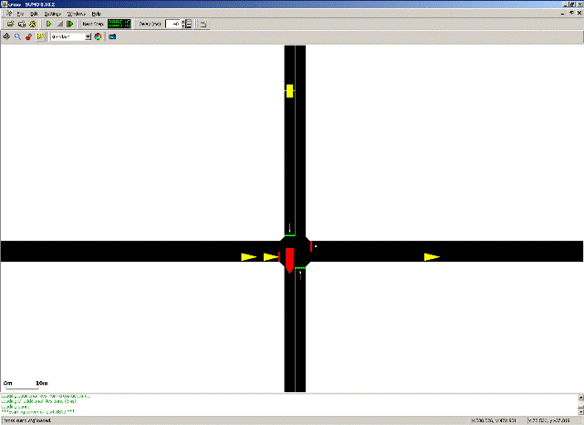

This shows how to use the [Traffic Control Interface (in short
TraCI)](../TraCI/index.md) on a simple example. TraCI gives the
possibility to control a running road traffic simulation. TraCI uses a
TCP-based client/server architecture where SUMO acts as a server and the
external script (the “controller”) is the client. In this tutorial the
“controller” is a python script which receives information about the
simulation state from the server and then sends instructions back.

It is assumed that road network building and routes definition is known
from other tutorials, as [Tutorials/Hello
SUMO](../Tutorials/Hello_SUMO.md), [Tutorials/quick
start](../Tutorials/quick_start.md) or [Tutorials/Quick Start old
style](../Tutorials/Quick_Start_old_style.md).

All files mentioned here can also be found in the
{{SUMO}}/docs/tutorial/traci_tls directory of your installation. The most
recent version can be found in the repository at [{{SUMO}}/tests/complex/tutorial/traci_tls/]({{Source}}tests/complex/tutorial/traci_tls/).

# Example description

Our example plays on a simple signalized intersection with four
approaches. We only have traffic on the horizontal axis and important
vehicles (like trams, trains, fire engines, ...) on the vertical axis
from north to south. On the approach in the north we have an induction
loop to recognize entering vehicles. As long as no vehicle enters from the
north, we give green on the horizontal axis all the time; but when a
vehicle enters the induction loop we switch the signal immediately so
the vehicle can cross the intersection without stopping.



# Running the example

To run the example you need to execute the script *runner.py* with
python

```
python runner.py
```

The route file can also be regenerated independently by running
`python generateRoutes.py` from the tutorial directory.

!!! caution
    You need to press start in the simulation gui to run the tutorial.

# Data preparation

The network definition is stored in `cross.nod.xml`, `cross.edg.xml`,
`cross.con.xml` and `cross.det.xml`. The signalized intersection uses the
ID `junction`, while the induction loop on the northern approach uses the
ID `north_detector`.

Vehicle demand is generated by `generateRoutes.py` and written to
`data/cross.rou.xml`. The script uses a fixed random seed so that the
example and its tests remain reproducible. Vehicle arrivals are sampled
with a binomial approximation of a Poisson process. For example, a
probability of `p=1./30` corresponds to one vehicle every 30 seconds on
average.

# Code

The example separates scenario generation from online traffic control.
`generateRoutes.py` creates the route file, whereas `runner.py` starts
SUMO, connects through TraCI, reads the induction loop and controls the
traffic light. The route generator is invoked by `runner.py`, so the full
example can still be started with a single command.

The controller uses the TraCI python API bundled with SUMO. A description
of the API can be found at
[TraCI/Interfacing_TraCI_from_Python](../TraCI/Interfacing_TraCI_from_Python.md).
For a detailed list of available functions see the [pydoc generated
documentation](https://sumo.dlr.de/pydoc/traci.html).

# Simulation

When `runner.py` starts, it first calls the route-generation function from
`generateRoutes.py`. It then launches [sumo-gui](../sumo-gui.md) with
`cross.sumocfg` by using `traci.start` and begins the control loop. The
start call also connects the controller to the simulation server.

During each simulation step, the controller checks `north_detector`. If a
vehicle is detected while the east-west direction has green, the program
switches the signal at `junction` toward the north-south phase. Otherwise,
it keeps the current east-west phase. The TraCI connection is closed after
no more vehicles are expected.

# TraCI

We want to run this simulation in SUMO, acting as a server, and control
the signal dependent on the actual simulation state. For this task TraCI
offers commands which are described in the corresponding article
[TraCI](../TraCI/index.md) in detail. For this example we will use only
four commands: [Simulation
Step](../TraCI/Control-related_commands.md#command_0x02_simulation_step),
[Get Induction Loop
Variable](../TraCI/Induction_Loop_Value_Retrieval.md#command_0xa0_get_induction_loop_variable),
[Change Traffic Lights
State](../TraCI/Change_Traffic_Lights_State.md) and
[Close](../TraCI/Control-related_commands.md#command_0x7f_close).

The commands are embedded in TCP messages but the direct client server
communication is opaque to the user. The four commands needed in this
tutorial are implemented in the methods `traci.simulationStep(step)`,
`traci.inductionloop.getLastStepVehicleNumber(IndLoopID)`,
`traci.trafficlight.setPhase(TLID, phase)` and `traci.close()`.

# Appendix

The methods for sending and receiving the messages, `_recvExact()` and
`_sendExact()`, respectively, are hidden in the script
`traci/__init__.py` and there is no need to call them directly. In this
section we will show the composition of a command using the example of
`traci.trafficlight.setRedYellowGreenState`.

## setPhase

This method sets the phase of a traffic light, so it gets the ID of the
traffic light and the new phase as parameter. The phase definitions can
be read from the sumo network and are described in [Simulation/Traffic
Lights\#Loading a new Program](../Simulation/Traffic_Lights.md#loading_a_new_program).
If the phase is already the current one, it is restarted from the
beginning. The command is described at [TraCI/Change Traffic Lights
State](../TraCI/Change_Traffic_Lights_State.md).
