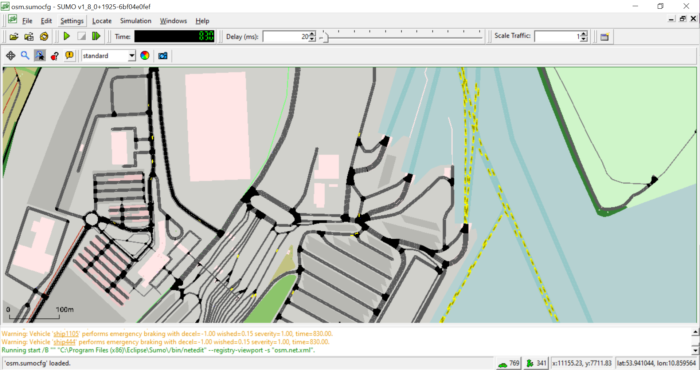

# Introduction
This tutorial shows how to create a simple port simulation:

* Start with the osmWebWizard.py
* Revision and adaptation of the road network with netedit
* Agent data and how to find them
   - Passenger / Bus
   - Container
   - Trucks, RoRo
   - Vessels
		
* Examples 

## Useful links

- [Tutorials](index.md)

- Documentation
  - [osmWebWizard.py](../Tutorials/OSMWebWizard.md)
  - [Public Transport Schedules](../Simulation/Public_Transport.md#public_transport_schedules)
  - [Person](../Specification/Persons.md)
  - [Vehicle](../TraCI/Vehicle_Value_Retrieval.md)
  - [Container](../Specification/Containers.md)
  - [Polygon](../TraCI/Polygon_Value_Retrieval.md)

# Create a simple port simulation
## osmWebWizard
Open the osmWebWizard.py 
```
python tools/osmWebWizard.py
```
```
Note [osmWebWizard.py](../Tutorials/OSMWebWizard.md)
All files that make up the scenario are created in a subfolder of the working directory with the current timestamp (i.e. <SUMO_HOME>/tools/2021-02-22-10-00-00/). If you edit the network, you can use the script build.bat to rebuild the random demand.
```

A browser window will open. On the left side you will see a map and on the right side you can find your Position and some Options. First navigate through the map to find the right port.  


In our case it is the Skandinavienkai, Port Lübeck Germany. Here we have ferries (passenger transport) and cargo vessels (container transport). 	


### Network Generation
Now have a look at the right side. You can take the whole area you see or select an area by chosing the 'select Area' option. 
We also select the "Add Polygons" and "Import Public Transport" options to get this information directly from OSM to our network. 

### Demand Generation
The demand is defined by the demand generation panel. You activate this panel by clicking on the car pictogram. Here you can choose every agent you have at your port area. If you have any special port vehicles like crane or stapler, you can not create them here, Ideas for implementation are described a little further below.
The OSM Web Wizard generates random demand, for more information see <https://sumo.dlr.de/docs/Tutorials/OSMWebWizard.html> 

For our scenario we take cars, trucks, pedestrains, trains and of course ships.


If you choose all the agents you need press the 'Generate Scenario' button.  

The complete scenario will be generated automatically. The scenario generation takes a couple of seconds or minutes (depending, among others, on the size of the scenario). Once the scenario generation process has finished, the sumo-gui starts and the simulation can be started by pressing the Play button.

Here is our scenario! But it look a little strange because the waterways are very large, so we first have to zoom in to find the port (somewhere in the south).


Here is our port: (With additional polygons to get an overview of the harbor.) 	


But as you can see, not all piers are connected to the waterways and if you look a little bit around you will find more things to fix. So let´s open netedit to correct the network.  	


## Network editing
Now we open netedit (for more information see https://sumo.dlr.de/docs/Netedit/index.html) 
Sumo-Gui -> edit -> open in Netedit (Ctrl + T) to correct these parts. 

### Netedit:	


### 1) First we shorten the waterways, so that only our selected area remains.

Use the inspect mode (I): Search the waterways that are beyond the area, separate the edge (at the edge of the area) in both directions.

Use the select mode (s):  Select the waterway rest and delete it.


Before:<br />


After:<br />


### 2) Delete everything that is superfluous
Use the select mode (S): Select the superfluous edges and delete them.<br />
Before:<br />


After:<br />


### 3) Add the missing connection between the pier and the waterways
Use the inspect mode (I): Split waterway edge in both directions<br />


Use the edge mode (E ): connect pier with the waterway edge (twoway road)
Use the inspect mode (I): select the new edge and set allow = ship <br />


### 4) change road vClasses at the port area
Here is our main port area and if you have a look at the allow you will see that they have different allowed vClasses, but we need for all the same (trucks, passenger car, container, pedestrian, delivery, taxi and bus)


Use the select mode (S): Select all roads (but not the train tracks) 
Use the inspect mode (I): Open the allow option on the left side and change the allowed modes.<br />
Before:<br />


After:<br />


### 5) Train Tracks
The train tracks that the osmWebWizard imported from OSM just have one direction. 
So use netedit or netconvert to add the bidirectional tracks.

#### Netconvert <br />
see [railway.topology.all-bidi](https://sumo.dlr.de/docs/Simulation/Railways.html#handling_problems_in_bidirectional_railway_networks)
```
netconvert with option --railway.topology.all-bidi

```

or

#### Netedit<br />
Use the select mode (S): Select all train tracks 
Use the inspect mode (I): right click one a track -> edge operations -> add reverse direction for edge
Use the connection mode (C): to control the connection between the tracks (maybe it is easier to control if all tracks have the spread type "right" instead of "center")

### 6) Create bus and container stops
Go to netedit, Use the additional mode (A) 
Choose bus stop oder container stop and a name, place then the stop at an edge. 
Save the additionals als file stops.add.xml.


Note: If an agent have to go to an egde where he do not have a permission, then you need access lanes for the busstops. 
For more information see: https://sumo.dlr.de/docs/Simulation/Public_Transport.html#access_lanes

These are all the stops for the scenario: (H= busstop, C=containerstop)


If the network is now correct, save the network and have now a look at the scenario folder ( <SUMO_HOME>/tools/2021-02-22-10-00-00/ ), here you can find the file "build.bat". 
This file creates a new demand suitable for the customized network.

Now use the file "run.bat" to start the simulation again. 


Here you can see, that we have at our scenario a little to much ships. So it would be a good idea to have a deeper look to the demand. 

## Demand 

Bevor we edit the demand, it would be a good to have some information about it. If you have luck, you will get this data directly 
from the port. Otherwise, there are also some ways to get approximate values. For the ships it is a good way to look for automatic identification system (AIS) data. There are a lot of free sources and you get informationen about the ships and their movements. Information from the port you get from the ports website and from the local logistics companies. Information for the passagener transport you can get from open street map, local public transport- and ferry companies. 

### Demand editing 
If you just want to have a very simple scenario (without container) then you just change the "Through Traffic Factor" and "count" in the build.bat file and generate a better simple demand. For more information see https://sumo.dlr.de/docs/Tutorials/OSMWebWizard.html

If you want a more complex scenario delete the generated demand :-)

In this Tutorial we simulate one hour with one container ship,  one passenger ship, one train, a lot of trucks, cars, containers and passengers. We also need a bus for the passengers, because at this port there is no connection between the passenger terminal and the piers and for the container movements we need some kind of trailer/ stapler to move the container from the train station to the pier.

```
Here is the list of all Agents:
1 passenger ship
	20 passenger car: arrive by ship and go to the passenger terminal
	20 passenger car: start at the passenger terminal and go to the ship
	20 pedestrian: arrive by ship and go to the passenger terminal
	20 pedestrian: start at the passenger terminal and go to the ship
	1 bus for the passenger transport from passenger terminal to the ship

1 container ship
	25 trucks from train to ship
	25 trucks from ship to train
	5 trailer/stapler for the container transport from train to ship

1 train 
	15 container from train to ship
	15 container from ship to train
```

### Create a demand file
First we need some vTypes adaption to add the nessesary container and person capacity

    <vType id="type_ship" vClass="ship" containerCapacity="25" personCapacity="20"/>
    <vType id="type_train" vClass="rail" containerCapacity="15"/>
    <vType id="type_truck_taxi" vClass="truck" containerCapacity="1" personCapacity="1" loadingDuration="30.0"/> 
    <vType id="type_truck" vClass="truck" containerCapacity="1" loadingDuration="30.0"/> 
    <vType id="type_car" vClass="passenger"/>
    <vType id="type_bus_taxi" vClass="bus" personCapacity="20"/>          
    <vType id="type_passenger" vClass="pedestrian"/>

#### Train
	<trip id="train" type="type_train" depart="0" departLane="best" from="149084838#0" to="-149084838#0" via="29497609">
		<stop containerStop="containerStop_trainstation" duration="100"/>
	</trip>

#### Ships 
Here are two ways to define a ship:

	<vehicle id="ferry" depart="0.00" departPos="0" line="ferry" type="type_ship" color="0,255,0">
		<route edges="-127071510.253116 127071510"/>
		<stop busStop="busStop_waterway" duration="100"/>
	</vehicle>

	<trip id="containership" type="type_ship" depart="0" departLane="best" from="-5005413" to="5005413.18170" via="gneE2">
		<stop containerStop="containerStop_waterway" duration="100"/>
	</trip>

#### passengerCars
	<flow id="passengercartoship" begin="0" end="200" number="20" type="type_car" from="39549605" to="-128042010" via="619566331">
		<stop busStop="busStop_pier" until="800.00"/>
	</flow>

	<flow id="passengercarfromship" begin="730" end="750" number="20" type="type_car" from="-277007518" to="39549605" via="-197841302"/>

#### Stapler
Because there are no stapler implemented in SUMO, we use trucks with a taxi device. Here we give them containerCapacity="1"and a loadingDuration="30.0". (The taxi also need personCapacity="1" because taxis do not work without at the moment)

	<flow id="stapler" begin="0" end="0" number="5" type="type_truck_taxi">
		<param key="has.taxi.device" value="true"/>
		<route edges="276781727#9"/>
		<stop containerStop="containerStop_truck_trainstation" duration="10.00"/>
	</flow>

#### Container
	<containerFlow id="containerfromship" begin="triggered" number="15" color="255,0,0">
	   <transport from="-5005413" containerStop="containerStop_waterway" lines="containership"/>
	   <tranship containerStop="containerStop_pier"/>
	   <transport containerStop="containerStop_truck_trainstation" lines="taxi"/>
	   <tranship containerStop="containerStop_trainstation"/>
	   <transport to="-149084838#0" lines="train"/>
	</containerFlow>  
	<containerFlow id="containertoship" begin="triggered" number="15" color="255,0,255"> 
		<transport from="149084838#0" containerStop="containerStop_trainstation" lines="train"/>
		<tranship containerStop="containerStop_truck_trainstation"/>
		<transport containerStop="containerStop_pier" lines="taxi"/>
		<tranship containerStop="containerStop_waterway"/>
		<transport to="5005413.18170" lines="containership"/>
	</containerFlow>

#### trucks and cars
	<flow id="passengercartoship" begin="0" end="200" number="20" type="type_car" from="39549605" to="-128042010" via="619566331">
		<stop busStop="busStop_pier" until="800.00"/>
	</flow>
	<flow id="trucktoship" begin="0" end="200" number="20" type="type_truck" from="39549605" to="-277007500#0" via="619566331">
		<stop containerStop="containerStop_pier" until="970.00"/>
	</flow>
	<flow id="passengercarfromship" begin="730" end="750" number="20" type="type_car" from="-277007518" to="84630550" via="-197841302"/>
	<flow id="truckfromship" begin="870" end="920" number="20" type="type_truck" from="277007496#0" to="84630550" via="-197841302"/>

#### bus
	<trip id="bus" type="type_bus_taxi" depart="0" departLane="best" from="-197841302" via="-128042010" to="-197841302" line="bus">
		<stop busStop="busStop_busstation_terminal" until="300.00"/> 
		<stop busStop="busStop_pier" until="750.00"/> 
		<stop busStop="busStop_busstation_terminal" until="900.00"/> 
	</trip>

#### person
	<personFlow id="pedestrianfromship" begin="triggered" number="20" color="0,255,0">
	   <ride from="-127071510.253116" busStop="busStop_waterway" lines="ferry"/>
	   <walk busStop="busStop_waterway"/>
	   <walk busStop="busStop_pier"/>
	   <ride busStop="busStop_busstation_terminal" lines="bus"/>
	   <walk busStop="busStop_passenger_terminal"/>
	</personFlow> 
	<personFlow id="pedestriantoship" begin="0" end="200" number="20">
	   <walk from="-596327078#2" busStop="busStop_passenger_terminal"/>
	   <walk busStop="busStop_busstation_terminal"/>
	   <ride busStop="busStop_pier" lines="bus"/>
	   <walk busStop="busStop_waterway"/>
	   <ride to="127071510" lines="ferry"/>
	</personFlow> 

# Examples

You can find the Skandinavienkai, Port Lübeck Germany scenario files here

And two simple port scenarios here: <br />

* Cologne <br />
* Brunswick
