# Introduction
This tutorial shows how to create a simple port simulation with the help of the osmWebWizard. This tutorial includes the following steps:

* Starting with osmWebWizard.py
* Revision and adaptation of the road network with netedit
* Agent data and how to find them
   - Passenger / Bus
   - Container
   - Trucks, RoRo
   - Vessels	
* Examples 

## Useful links

- [Tutorials](index.md)

Documentation:

- [osmWebWizard.py](../Tutorials/OSMWebWizard.md)
- [Public Transport Schedules](../Simulation/Public_Transport.md#public_transport_schedules)
- [Person](../Specification/Persons.md)
- [Vehicle](../TraCI/Vehicle_Value_Retrieval.md)
- [Container](../Specification/Containers.md)
- [Polygon](../TraCI/Polygon_Value_Retrieval.md)

# Create a simple port simulation
## osmWebWizard
Open the osmWebWizard.py
```
python <SUMO_HOME>/tools/osmWebWizard.py
```
!!! note
	All files that make up the scenario are created in a subfolder of the working directory with the current timestamp (e.g. <SUMO_HOME>/tools/2021-02-22-10-00-00/). If you edit the network, you can use the script `build.bat` to rebuild the random demand.

A browser window will open. On the left side, you see the map and on the right side, you can find your position and some options. First, navigate through the map to find the right port.  
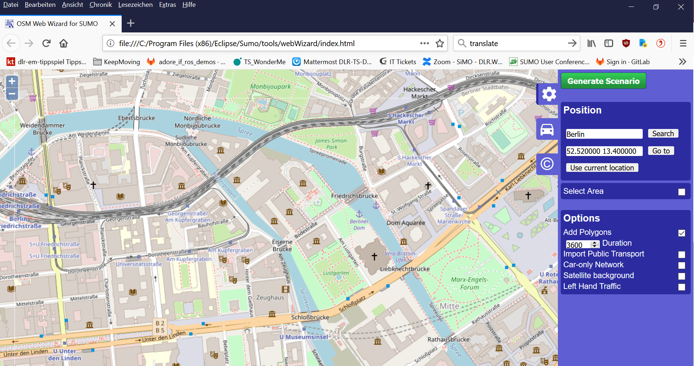

In our case it is the Skandinavienkai of the Port Lübeck, Germany. Here, there are ferries (passenger transport) and cargo vessels (container transport). 	

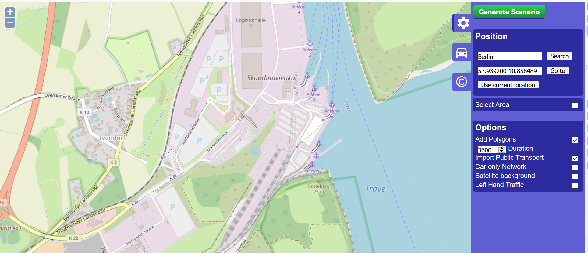

### Network Generation
Now take a look at the right side. You can choose the whole area visible on the screen or select an area by choosing the option `Select Area`. 
Also select the `Add Polygons` and `Import Public Transport` options to put this information directly from OSM to our network. 

### Demand Generation
The demand is defined by the demand generation panel. You can activate this panel by clicking on the car pictogram. Here you can choose every agent you need at your port area. If you have any special port vehicles like crane or stapler, you can not create them here. Ideas for possible implementations are described a little further below.
The OSM Web Wizard generates random demand, for more information see the documentation of the [osmWebWizard](../Tutorials/OSMWebWizard.md).

For our scenario we choose `cars`, `trucks`, `pedestrians`, `trains`, and of course `ships`.

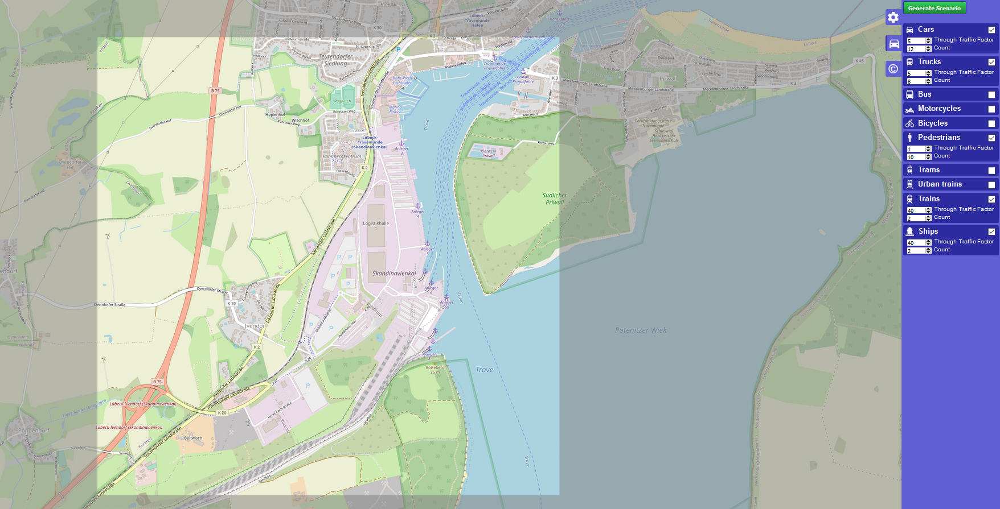

After you chose all the agents you need press the `Generate Scenario` button.  

The complete scenario is generated automatically. The scenario generation takes a couple of seconds or minutes (depending, among other factors, on the size of the scenario). Once the scenario generation process has finished, the sumo-gui starts and the simulation can be started by pressing the Play button.

Here is our scenario! But it looks a little strange because the waterways are very large, so we first have to zoom in to find the port (somewhere in the south).

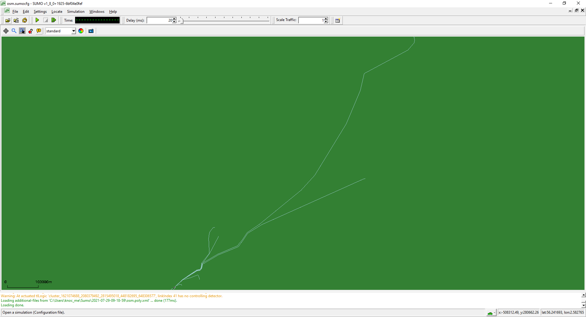

This is our port: (With additional polygons to get a better overview of the port.) 	

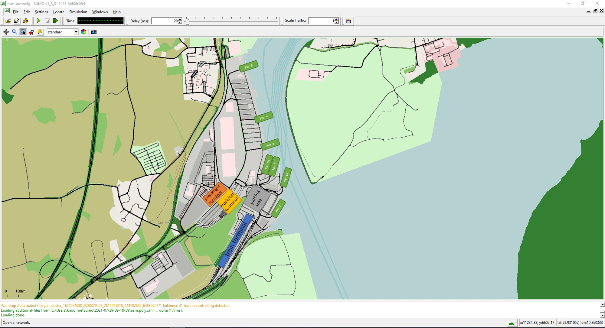

But as you can see, not all piers are connected to the waterways and if you take a closer look you will find more things to fix. So let´s open netedit to correct the network.  	

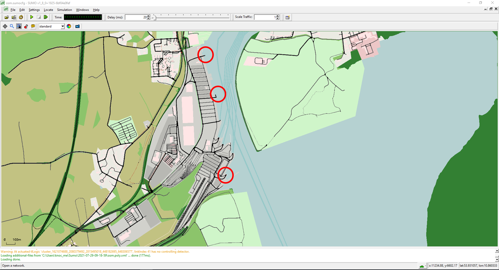

## Network editing
Now we open [netedit](../Netedit/index.md) to correct these parts. You can open it from sumo-gui with the shortcut `Ctrl + T`.

### Netedit:	
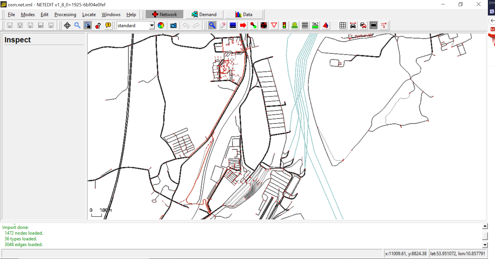

### 1) Shorten the waterways, so that only the originally selected area remains.

Use the inspect mode (`I`): Locate the waterways that extend beyond the area and separate these edges in both directions into an appropriate part at the port and a part that can be deleted. To do so, right click on the edge at the position where the edge should be separated.

<kbd>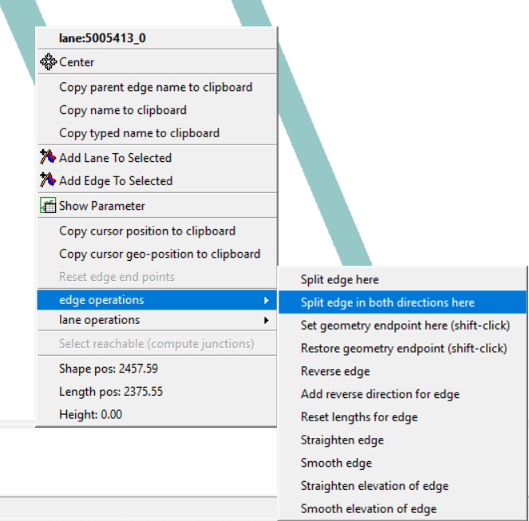</kbd>

Use the select mode (`S`):  Select the waterways far from the port and delete them.
<table><tr>
	<td>Before</td>
	<td>After</td>
</tr><tr>
	<td>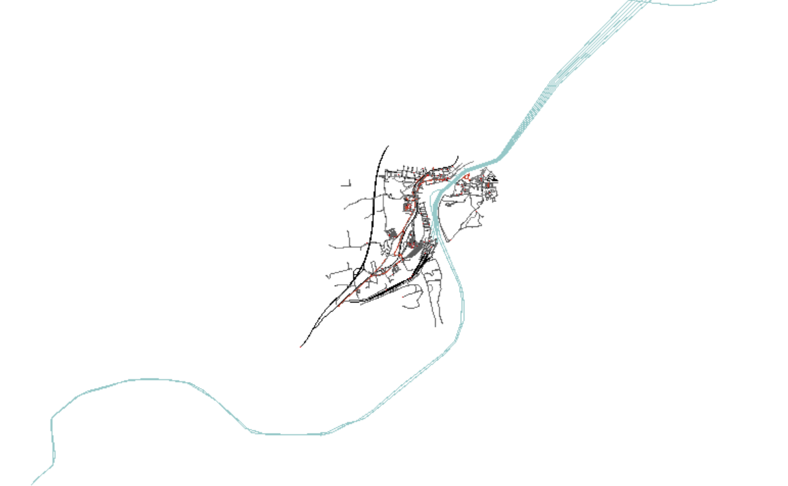</td>
	<td>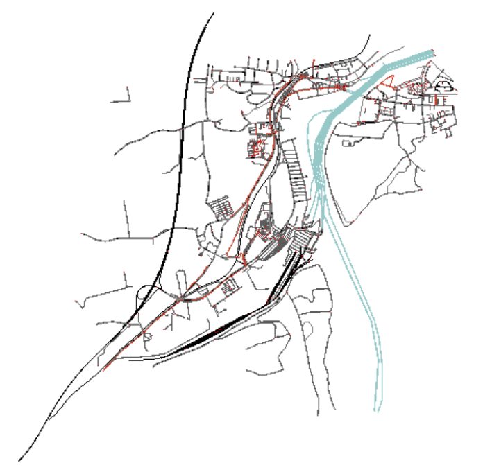</td>
</tr></table>

### 2) Delete everything that is superfluous
Use the select mode (`S`): Select all superfluous edges and delete them.
<table><tr>
	<td>Before</td>
	<td>After</td>
</tr><tr>
	<td>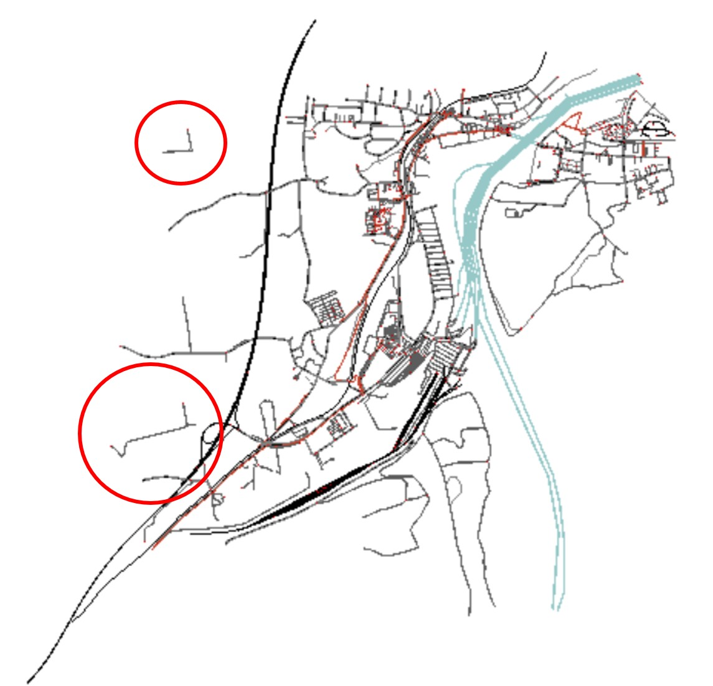</td>
	<td>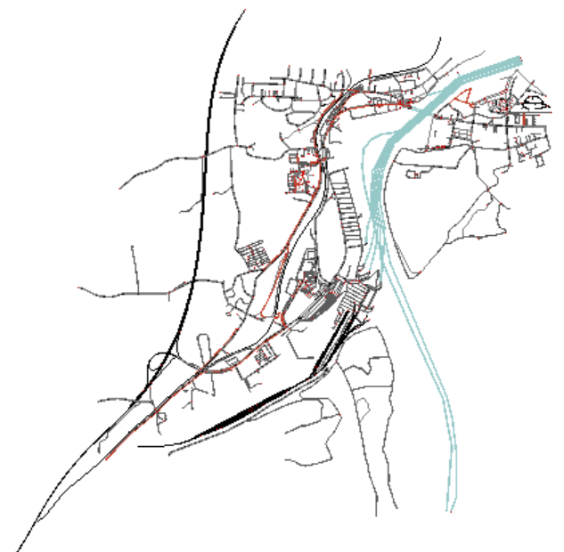</td>
</tr></table>

### 3) Add the missing connections between the piers and the waterways
Use the inspect mode (`I`): Split the waterway edge in both directions at the position where you want to add the connection to the pier.

<kbd>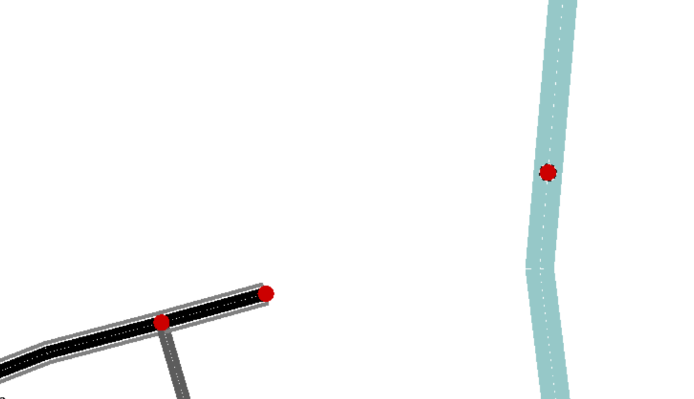</kbd>

Use the edge mode (`E`): Connect the pier with the waterway edge (twoway road).

<kbd>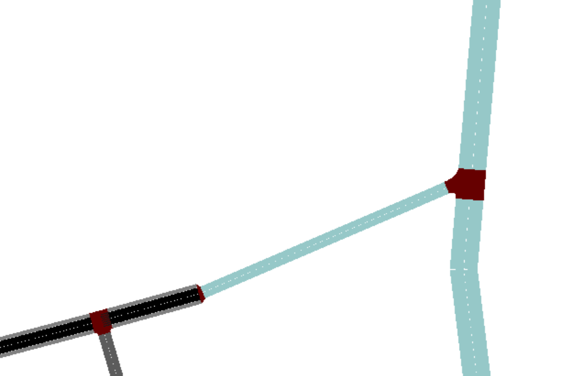</kbd>

Use the inspect mode (`I`): Select the new edge and set `allow = ship`

### 4) Change road vClasses at the port area
Here is our main port area.

<kbd>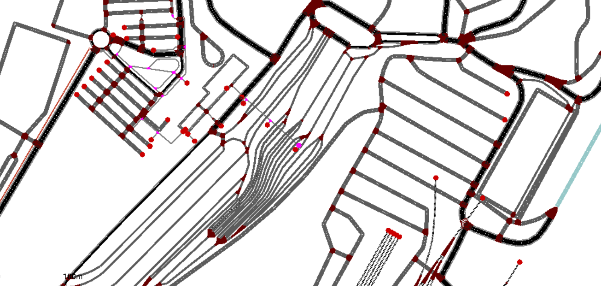</kbd>

If you have a look at the "allow"-parameter for the edges, you will see that they have different allowed vClasses. We prefer to have the same allowed vClasses for all edges (trucks, passenger car, pedestrian, delivery, taxi and bus)

Use the select mode (`S`): Select all roads (except the train tracks).

Use the inspect mode (`I`): Open the allow option on the left side and change the allowed vClasses.

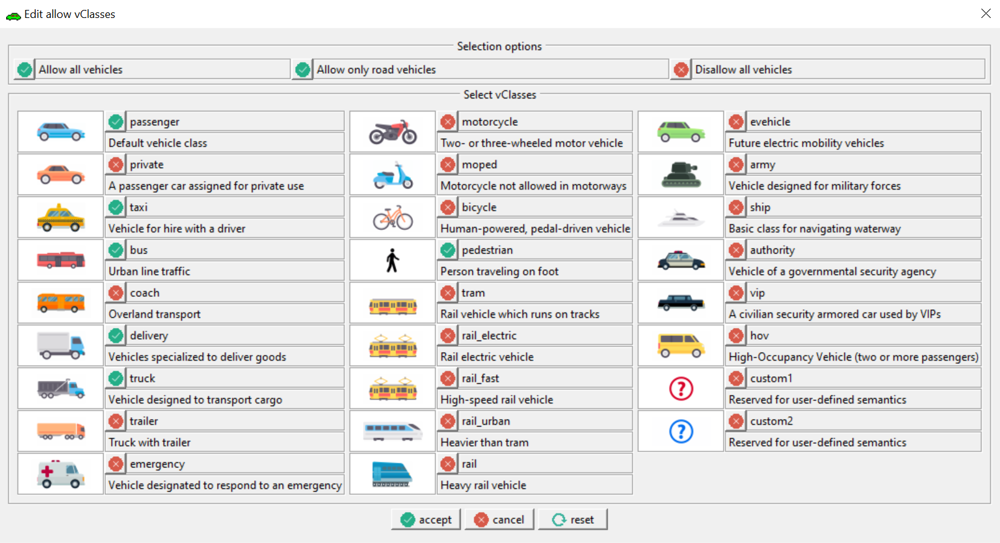

### 5) Train Tracks
The train tracks imported by the osmWebWizard from OSM just have one direction. 
Use netedit or netconvert to add bidirectional tracks.

#### Netconvert:
Use netconvert with option [`railway.topology.all-bidi`](../Simulation/Railways.md#handling_problems_in_bidirectional_railway_networks)

or

#### Netedit:
Use the select mode (`S`): Select all train tracks.

Use the inspect mode (`I`): Right click on a track, -> __edge operations__ -> __add reverse direction for edge__

Use the connection mode (`C`): Check and adapt the connections between the tracks (maybe it is easier to control if all tracks have the spread type `right` instead of `center`).

### 6) Create bus stops and container stops
Use netedit with the additional mode (`A`).
Select `busStop` or `containerStop` and define a name. Then place the stop at an edge.

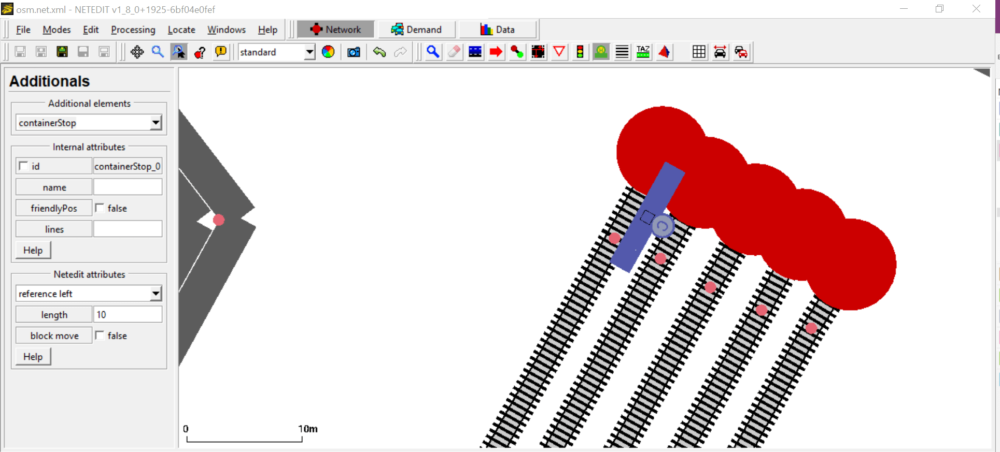

After adding all needed stops save them as an additional file (e.g. stops.add.xml).

!!! note
	If an agent shall go to a stop with an edge with no permission, you can use access lanes for the stop. 
	For more information see [public transport](../Simulation/Public_Transport.md#access_lanes).

These are the stops for our scenario: (H=busStop, C=containerStop)

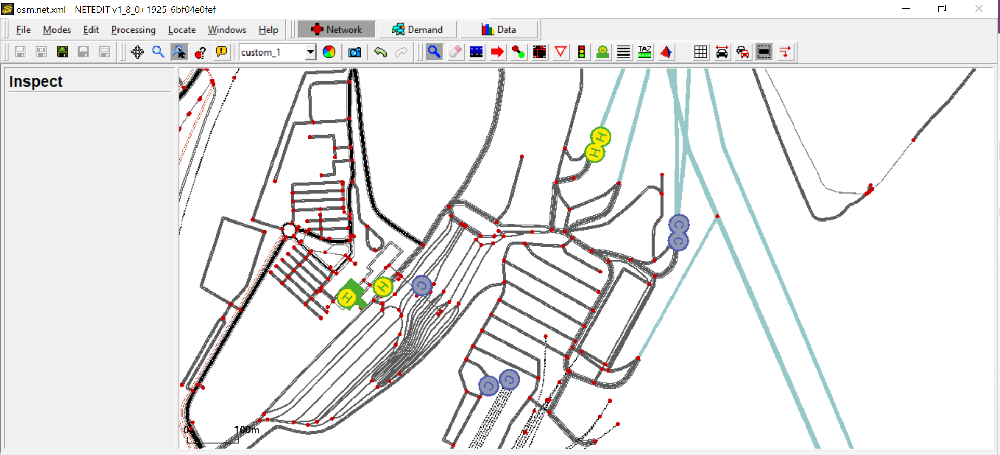

If the network is now correct, save the network. Run the file `build.bat` at the scenario folder (for us: <SUMO_HOME>/tools/2021-02-22-10-00-00/ ) to create a new demand suitable for the customized network. You can run the file `run.bat` to restart the simulation. 


Here you can see that in our scenario there are far too many ships. So it is time to have a deeper look into the demand. 

## Demand 

Before we edit the demand, it would be a good idea to bring together some information about it. If you are in luck, you get this data directly from the port. Otherwise, there are also some ways to get approximate values. For the ships it is possible to look for data from the automatic identification system (AIS). There are a lot of free sources and you get information about the ships and their movements. Often you can find information about the port from the ports website and from the local logistics companies. Information about passenger transport can be retrieved from OpenStreetMap and local public transport and ferry companies. 

### Demand editing 
If you just want to have a very simple scenario (without containers) then you just change the `Through Traffic Factor` and `count` within the file `build.bat` and generate a better simple demand. For more information see the [osmWebWizard](../Tutorials/OSMWebWizard.md).

If you want a more complex scenario delete the generated demand, first. :-)

In this tutorial we simulate one hour with one container ship, one passenger ship, one train and a lot of trucks, cars, containers and passengers. We also need a bus for the passengers, because at this port there is no connection between the passenger terminal and the piers. For the container movements we need some kind of trailer/ stapler to move the container from the train station to the pier.

Here is the list of all Agents we want to insert:
```text
1 passenger ship with:
	20 passenger cars: arrive per ship and go to the passenger terminal
	20 passenger cars: start at the passenger terminal and go to the ship
	20 pedestrians: arrive per ship and go to the passenger terminal
	20 pedestrians: start at the passenger terminal and go to the ship

1 container ship with:
	25 trucks: from train to ship
	25 trucks: from ship to train

1 train with:
	15 containers: from train to ship
	15 containers: from ship to train
	
1 bus: for the passenger transport between passenger terminal and the ship

5 trailer/stapler: for the container transport between the train and the ship
```

### Create a demand file
First, we need some adaptions to the vTypes to add the necessary capacities to load enough containers and persons. Create a file and add the following definitions for the vTypes:
```xml
<vType id="type_ship" vClass="ship" containerCapacity="25" personCapacity="20"/>
<vType id="type_train" vClass="rail" containerCapacity="15"/>
<vType id="type_truck_taxi" vClass="truck" containerCapacity="1" personCapacity="1" loadingDuration="30.0"/> 
<vType id="type_truck" vClass="truck" containerCapacity="1" loadingDuration="30.0"/> 
<vType id="type_car" vClass="passenger"/>
<vType id="type_bus_taxi" vClass="bus" personCapacity="20"/>          
<vType id="type_passenger" vClass="pedestrian"/>
```

#### Train
Add the trip for the train to the port and back.
```xml
<trip id="train" type="type_train" depart="0" departLane="best" from="149084838#0" to="-149084838#0" via="29497609">
	<stop containerStop="containerStop_trainstation" duration="100"/>
</trip>
```

#### Ships 
There are two possible ways to define a ship. Either by defining the complete route or by using the trip definition:
```xml
<vehicle id="ferry" depart="0.00" departPos="0" line="ferry" type="type_ship" color="0,255,0">
	<route edges="-127071510.253116 127071510"/>
	<stop busStop="busStop_waterway" duration="100"/>
</vehicle>

<trip id="containership" type="type_ship" depart="0" departLane="best" from="-5005413" to="5005413.18170" via="gneE2">
	<stop containerStop="containerStop_waterway" duration="100"/>
</trip>
```

#### Passenger Cars
For the passenger cars we use flow definitions:
```xml
<flow id="passengercartoship" begin="0" end="200" number="20" type="type_car" from="39549605" to="-128042010" via="619566331">
	<stop busStop="busStop_pier" until="800.00"/>
</flow>

<flow id="passengercarfromship" begin="730" end="750" number="20" type="type_car" from="-277007518" to="39549605" via="-197841302"/>
```

#### Staplers
Because there are no stapler implemented in SUMO, we use trucks equipped with a taxi device. Here, we give them `containerCapacity="1"` and `loadingDuration="30.0"` (the taxi device also needs `personCapacity="1"` because it does not work properly without it at the moment).
```xml
<flow id="stapler" begin="0" end="0" number="5" type="type_truck_taxi">
	<param key="has.taxi.device" value="true"/>
	<route edges="276781727#9"/>
	<stop containerStop="containerStop_truck_trainstation" duration="10.00"/>
</flow>
```

#### Containers
For the containers we use containerFlow definitions:
```xml
<containerFlow id="containerfromship" begin="triggered" number="15" color="255,0,0">
   <transport from="-5005413" containerStop="containerStop_waterway" lines="containership"/>
   <tranship containerStop="containerStop_pier"/>
   <transport containerStop="containerStop_truck_trainstation" lines="taxi"/>
   <tranship containerStop="containerStop_trainstation"/>
   <transport to="-149084838#0" lines="train"/>
</containerFlow>

<containerFlow id="containertoship" begin="triggered" number="15" color="255,0,255"> 
	<transport from="149084838#0" containerStop="containerStop_trainstation" lines="train"/>
	<tranship containerStop="containerStop_truck_trainstation"/>
	<transport containerStop="containerStop_pier" lines="taxi"/>
	<tranship containerStop="containerStop_waterway"/>
	<transport to="5005413.18170" lines="containership"/>
</containerFlow>
```

#### Trucks and Cars
For the trucks and cars we use flow definitions:
```xml
<flow id="passengercartoship" begin="0" end="200" number="20" type="type_car" from="39549605" to="-128042010" via="619566331">
	<stop busStop="busStop_pier" until="800.00"/>
</flow>
<flow id="trucktoship" begin="0" end="200" number="20" type="type_truck" from="39549605" to="-277007500#0" via="619566331">
	<stop containerStop="containerStop_pier" until="970.00"/>
</flow>
<flow id="passengercarfromship" begin="730" end="750" number="20" type="type_car" from="-277007518" to="84630550" via="-197841302"/>
<flow id="truckfromship" begin="870" end="920" number="20" type="type_truck" from="277007496#0" to="84630550" via="-197841302"/>
```

#### Bus
Consider the `line` attribute for the bus.
```xml
<trip id="bus" type="type_bus_taxi" depart="0" departLane="best" from="-197841302" via="-128042010" to="-197841302" line="bus">
	<stop busStop="busStop_busstation_terminal" until="300.00"/> 
	<stop busStop="busStop_pier" until="750.00"/> 
	<stop busStop="busStop_busstation_terminal" until="900.00"/> 
</trip>
```

#### Persons
For the persons we use flow definitions:
```xml
<personFlow id="pedestrianfromship" begin="triggered" number="20" color="0,255,0">
   <ride from="-127071510.253116" busStop="busStop_waterway" lines="ferry"/>
   <walk busStop="busStop_waterway"/>
   <walk busStop="busStop_pier"/>
   <ride busStop="busStop_busstation_terminal" lines="bus"/>
   <walk busStop="busStop_passenger_terminal"/>
</personFlow>

<personFlow id="pedestriantoship" begin="0" end="200" number="20">
   <walk from="-596327078#2" busStop="busStop_passenger_terminal"/>
   <walk busStop="busStop_busstation_terminal"/>
   <ride busStop="busStop_pier" lines="bus"/>
   <walk busStop="busStop_waterway"/>
   <ride to="127071510" lines="ferry"/>
</personFlow> 
```

# Examples

You can find the Skandinavienkai, Port Lübeck Germany scenario files here [tbd](port.md)

And two simple port scenarios here:

- Cologne
- Brunswick
