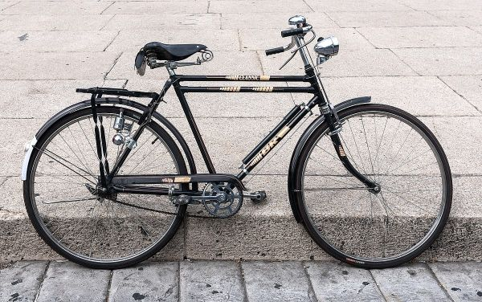
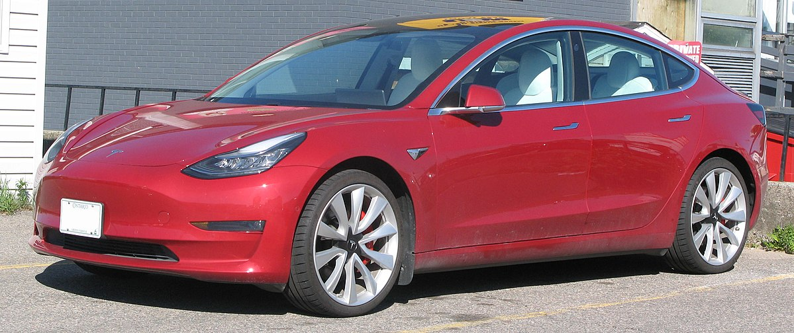

This page describes the vehicle parameter defaults depending on the
vehicle class. If no values are given the values for passenger are used.
It uses as default always the values in the first line for each vehicle
class. The other values (in the subsections) are just an information (to be used with own
vehicle types).

!!! note
    The correct setting may be dependent on the car-following model in use. This is especially true for `accel` and `decel` which
    usually do *not* denote the maximum values achievable by the vehicle but rather the convenient values. If you use a different model than Krauss you should probably revisit the values.

Please note that `personCapacity` and `mass` do usually not include a driver in the tables below.
(So a bicycle has a capacity of 1 and this does not mean the children's seat but the driver; and a mass of 10kg
obviously does not include the driver.) The only exception here is the default passenger car which has
a capacity of 4 while the average car out there has probably rather 5 places. But using all 5 places is
probably rather exceptional so the historic default has been kept and it is maybe the better value for taxi scenarios as well.
Please also note that the mass in the handbook
of a private car usually *includes* the average driver's weight.

Whether the exclusion is correct or not also depends on the way you set up the simulation. If persons are
modelled explicitly it is right, if not, you probably do not care about personCapacity and variable mass anyway,
but if you do please revisit your vType settings.

### On default emission classes
Note that with the transition to [HBEFA4](Models/Emissions/HBEFA4-based.md) there are no more aggregated emission classes like `HDV` available.
That means the default emission class for each vehicle class is usually the most frequent vehicle in the 2022 fleet composition as estimated in the HBEFA. This can vastly understimate real emissions which may be dominated by older vehicles, so if precision is important you are encouraged to use a distribution of vehicle types fitting your modelled vehicle fleet. It is also possible to go back to the [HBEFA3](Models/Emissions/HBEFA3-based.md) classes.

Please also note that the default emission class for all electric trains is `zero` and all other trains (and ships) still use the dirtiest diesel emissions of the HBEFA3 model. You are encouraged to model your train (and ship) explicitly if consumption is of interest. This includes adapting parameters like the mass (which means the empty vehicle mass) and loading.

## Pedestrians and Two-Wheelers

| `vClass` | example | `guiShape` | `length` `width` `height` | `mass` | `minGap` | `accel` | `decel` | `emer` `gency` `Decel` | `maxSpeed` | `desired` `MaxSpeed` | `person` `Capacity` | `emission` `Class` | `speed` `Dev` |
|--|--|--|--|--|--|--|--|--|--|--|--|--|--|
|pedestrian| <small>[(C) Pedestrian crossing, Omagh by Kenneth Allen](https://commons.wikimedia.org/wiki/File:Pedestrian_crossing,_Omagh_-_geograph.org.uk_-_4485453.jpg) [CC-BY-SA-2.0](https://creativecommons.org/licenses/by-sa/2.0/deed.en)</small>|pedestrian |0.215m(1) 0.478m(1) 1.719m(1)|70kg|0.25m|1.5m/s2(23)|2m/s2(23)|5m/s2|37.58km/h(41)|5km/h(23)|0|zero|0.1|
|bicycle| <small>[(C) Daniele Leonzio](https://commons.wikimedia.org/wiki/File:Bicycle,_Milan.jpg) [CC-BY-SA-4.0](https://creativecommons.org/licenses/by-sa/4.0/deed.en)</small>|bicycle |1.6m(17) 0.65m(17) 1.7m(*)|10kg|0.5m|1.2m/s2(19)|3m/s2(19)|7m/s2|50km/h|20km/h(19)|1|zero|0.1|
|moped| <small>[(C) Max schwalbe](https://commons.wikimedia.org/wiki/File:Simson_S51_B2-4_from_1980_original_condition_I.jpg) [CC-BY-SA-4.0](https://creativecommons.org/licenses/by-sa/4.0/deed.en)</small>|moped |2.1m(43) 0.8m(43) 1.7m(*)|80kg|2.5m|1.1m/s2(25)|7m/s2(26)|10m/s2|45km/h(24)|-|2|[HBEFA4/ Moped_le50cc_Euro-2](Models/Emissions/HBEFA4-based.md#motor_cycles)|0.1|
|motorcycle| <small>[(C) Thomas Wiersma](https://commons.wikimedia.org/wiki/File:Yamaha_R1_2006.jpg) [CC-BY-SA-4.0](https://creativecommons.org/licenses/by-sa/4.0/deed.en)</small>|motorcycle |2.2m(28) 0.9m(28) 1.5m(28)|200kg|2.5m|6m/s2(19)|10m/s2(27)|10m/s2|200km/h(28)|-|2|[HBEFA4/ MC_4S_gt250cc_preEuro](Models/Emissions/HBEFA4-based.md#motor_cycles)|0.1|
|scooter| <small>[(C) Rjcastillo](https://commons.wikimedia.org/wiki/File:Scooter_el%C3%A9ctrico_-_A740010.jpg) [CC-BY-4.0](https://creativecommons.org/licenses/by/4.0/deed.en)</small>|scooter |1.2m(\*) 0.5m(\*) 1.7m(\*)|10kg(\*)|0.5m(39)|1.2m/s2(39)|3m/s2(39)|7m/s2(\*)|25km/h(39)|20km/h|1|zero|0.1|

## Passenger Cars and Light Delivery

| `vClass` | example | `guiShape` | `length` `width` `height` | `mass` | `minGap` | `accel` | `decel` | `emer` `gency` `Decel` | `maxSpeed` | `desired` `MaxSpeed` | `person` `Capacity` | `emission` `Class` | `speed` `Dev` |
|--|--|--|--|--|--|--|--|--|--|--|--|--|--|
|passenger| <small>[(C) Vauxford](https://commons.wikimedia.org/wiki/File:2019_Toyota_Corolla_Icon_Tech_VVT-i_Hybrid_1.8.jpg) [CC-BY-SA-4.0](https://creativecommons.org/licenses/by-sa/4.0/deed.en)</small>|passenger |5(29) 1.8m(29) 1.5m(29)|1500kg|2.5m|2.6m/s2(29)|4.5m/s2(27)|9m/s2|200km/h(29)|-|4|[HBEFA4/ PC_petrol_Euro-4](Models/Emissions/HBEFA4-based.md#passenger_cars)|0.1|
|taxi| <small>[(C) Matti Blume](https://commons.wikimedia.org/wiki/File:Taxis_at_EDDT-(jha).jpg) [CC-BY-SA-2.0](https://creativecommons.org/licenses/by-sa/2.0/deed.en)</small>|taxi |5(29) 1.8m(29) 1.5m(29)|1500kg|2.5m|2.6m/s2(29)|4.5m/s2(27)|9m/s2|200km/h(29)|-|4|[HBEFA4/ PC_petrol_Euro-4](Models/Emissions/HBEFA4-based.md#passenger_cars)|0.05|
|evehicle| <small>[(C) Spsmiler](https://commons.wikimedia.org/wiki/File:GATEway-Podcar-NthGreenwich-London-S2620005.jpg) [CC0-1.0](https://creativecommons.org/publicdomain/zero/1.0/deed.en)</small>|evehicle |5(29) 1.8m(29) 1.5m(29)|1500kg|2.5m|2.6m/s2(29)|4.5m/s2(27)|9m/s2|200km/h(29)|-|4|zero|0.1|
|emergency| <small>[(C) Helitak430](https://commons.wikimedia.org/wiki/File:NSW_Ambulance_Australia.png) [CC-BY-SA-4.0](https://creativecommons.org/licenses/by-sa/4.0/deed.en)</small>|emergency |6.5m(37) 2.16m(37) 2.86m(37)|5000kg|2.5m|2.6m/s2(29)|4.5m/s2(27)|9m/s2|200km/h(29)|-|3|[HBEFA4/ LCV_diesel_N1-III_Euro-6ab](Models/Emissions/HBEFA4-based.md#light_vehicles)|0|
|delivery| <small>[(C) IFCAR](https://commons.wikimedia.org/wiki/File:2008_Dodge_Sprinter_DC.jpg) [Public Domain](https://en.wikipedia.org/wiki/en:public_domain)</small>|delivery |6.5m(37) 2.16m(37) 2.86m(37)|5000kg|2.5m|2.6m/s2(29)|4.5m/s2(27)|9m/s2|200km/h(29)|-|3|[HBEFA4/ LCV_diesel_N1-III_Euro-6ab](Models/Emissions/HBEFA4-based.md#light_vehicles)|0.05|

The `evehicle` has been added in a time when electric vehicles still seemed futuristic and is kept for backward compatibility.
The intended use is for any kind of new vehicle concept which should be visually distinguishable and is of unknown emission status (hence zero emissions).

### Recommended subclass settings

All passenger cars share the defaults listed above, the values below are just ideas what alternatives might be appropriate for different models:

| `vClass` | example | `guiShape` | `length` `width` `height` | `person` `Capacity` |
|--|--|--|--|--|
|passenger| <small>[(C) Alexander-93](https://commons.wikimedia.org/wiki/File:Peugeot_301_(2012)_IMG_8110.jpg) [CC-BY-SA-4.0](https://creativecommons.org/licenses/by-sa/4.0/deed.en)</small>|passenger/sedan ||5|
|passenger| <small>[(C) Ladislav "Fredy.00" Šafránek](https://commons.wikimedia.org/wiki/File:%C5%A0koda_Felicia_%26_%C5%A0koda_Felicia_Combi.JPG) [Public Domain](https://en.wikipedia.org/wiki/en:public_domain)</small>|passenger/hatchback ||5|
|passenger| <small>[(C) OSX](https://commons.wikimedia.org/wiki/File:2014_Mitsubishi_Outlander_(ZJ_MY14.5)_ES_4WD_wagon_(2015-05-29)_02.jpg) [Public Domain](https://en.wikipedia.org/wiki/en:public_domain)</small>|passenger/wagon ||5|
|passenger| <small>[(C) Kuha455405](https://commons.wikimedia.org/wiki/File:Nissan_Largo_1993.jpg) [CC-BY-SA-3.0](https://creativecommons.org/licenses/by-sa/3.0/deed.en)</small>|passenger/van |4.7m(16) 1.9m(16) 1.73m(16)|6|

## Trucks and Busses

| `vClass` | example | `guiShape` | `length` `width` `height` | `mass` | `minGap` | `accel` | `decel` | `emer` `gency` `Decel` | `maxSpeed` | `desired` `MaxSpeed` | `person` `Capacity` | `emission` `Class` | `speed` `Dev` |
|--|--|--|--|--|--|--|--|--|--|--|--|--|--|
|truck| <small>[(C) C-C-Baxter](https://commons.wikimedia.org/wiki/File:MAN_M2000_Pritschenwagen.jpg) [CC-BY-SA-3.0](https://creativecommons.org/licenses/by-sa/3.0/deed.en)</small>|truck |7.1m(30) 2.4m(30) 2.4m(30)|4500kg|2.5m|1.3m/s2(31)|4m/s2(27)|7m/s2|130km/h(35)|-|3|[HBEFA4/ RT_le7.5t_Euro-VI_A-C](Models/Emissions/HBEFA4-based.md#heavy_goods_vehicles)|0.05|
|trailer| <small>[(C) Dwight Burdette](https://commons.wikimedia.org/wiki/File:R%2BL_Carriers_truck_with_tandem_trailer,_Ypsilanti,_Michigan.jpg) [CC-BY-3.0](https://creativecommons.org/licenses/by/3.0/deed.en)</small>|truck/trailer |16.5m(13) 2.55m(13) 4m(13)|13000kg|2.5m|1m/s2(31)|4m/s2|7m/s2|130km/h(35)|-|3|[HBEFA4/ TT_AT_gt34-40t_Euro-VI_A-C](Models/Emissions/HBEFA4-based.md#heavy_goods_vehicles)|0.05|
|bus| <small>[(C) Iwouldstay](https://commons.wikimedia.org/wiki/File:EVAG_O530_3413_Holthuser_Tal.jpg) [CC-BY-SA-4.0](https://creativecommons.org/licenses/by-sa/4.0/deed.en)</small>|bus |12m(3) 2.5m(3) 3.4m(3)|12000kg|2.5m|1.2m/s2(18)|4m/s2(27)|7m/s2|85km/h(3)|-|85|[HBEFA4/ UBus_Std_gt15-18t_Euro-VI_A-C](Models/Emissions/HBEFA4-based.md#city_bus)|0.1|
|coach| <small>[(C) Leshe](https://commons.wikimedia.org/wiki/File:Baltic_Shuttle_Bus_in_Estonia.jpg) [CC-BY-SA-4.0](https://creativecommons.org/licenses/by-sa/4.0/deed.en)</small>|bus/coach |14m(9) 2.6m(9) 4.m(9)|25000kg|2.5m|2.0m/s2(*)|see above|see above|100km/h(32)|-|70(9)|[HBEFA4/ Coach_3-Axes_gt18t_Euro-VI_A-C](Models/Emissions/HBEFA4-based.md#coaches)|0.05

Please note that according to the HBEFA city busses with three axes are more frequent than the shorter ones but in order to keep the other values like length and mass consistent and have a stronger separation from the coaches it has been decided to use the emission class of a smaller bus.

### Recommended subclass settings

| `vClass` | example | `guiShape` | `length` `width` `height` | `minGap` | `accel` | `person` `Capacity` |
|--|--|--|--|--|--|--|
|trailer| <small>[(C) Mike Mozart](https://commons.wikimedia.org/wiki/File:Target_Store_Tractor_Trailer_Delivery_Truck._Target_Logo,_Target_Stores,_Target_Sign,_pics_by_Mike_Mozart_of_TheToyChannel_and_JeepersMedia_on_YouTube._-Target_-TargetStore_-TargetLogo_-TargetSign_-TargetTractorTrailer_-TargetStoreTruck.jpg) [CC-BY-SA-4.0](https://creativecommons.org/licenses/by-sa/4.0/deed.en)</small>|truck/semitrailer |16.5m(14) max. 2.55m(13) max. 4m(13)|2.5m|1.1m/s2(31)|3|
|bus| <small>[(C) Kemenymate](https://commons.wikimedia.org/wiki/File:200E_busz_(RVY-715).jpg) [CC-BY-SA-4.0](https://creativecommons.org/licenses/by-sa/4.0/deed.en)</small>|bus/flexible |17.9m(3) 2.5m(3) 3.0m(3)|2.5m|1.2m/s2(18)|\~150|

## Rail

| `vClass` | example | `guiShape` | `length` `width` `height` | `mass` | `minGap` | `accel` | `decel` | `emer` `gency` `Decel` | `maxSpeed` | `desired` `MaxSpeed` | `person` `Capacity` | `emission` `Class` | `speed` `Dev` |
|--|--|--|--|--|--|--|--|--|--|--|--|--|--|
|tram| <small>[(C) Kurt Rasmussen, custom license](https://commons.wikimedia.org/wiki/File:Berlin-bvg-sl-m10-gt6-12zrk-961796.jpg)</small>|rail/railcar |22m(7) 2.4m(7) 3.2m(7)|37900kg|2.5m|1.0m/s2(18)|3.0m/s2(27)|7m/s2|80km/h(36)|-|120(7\*)|zero|0|
|rail_urban| <small>[(C) Andreas Lippold](https://commons.wikimedia.org/wiki/File:Bahnhof_Berlin-Wannsee,_S-Bahn-Bereitstellung.jpg) [CC-BY-SA-4.0](https://creativecommons.org/licenses/by-sa/4.0/deed.en)</small>|rail/railcar |3\*36.5m(4) 3.0m(4) 3.6m(4)|59000kg|5m|1.0m/s2(4)|3.0m/s2(27)|7m/s2|100km/h(4)|-|3\*100|zero|0|
|rail| <small>[(C) Philip Halling](https://commons.wikimedia.org/wiki/File:Arriva_Trains_Wales_train_in_Hereford_Station_-_geograph.org.uk_-_5709854.jpg) [CC-BY-SA-2.0](https://creativecommons.org/licenses/by-sa/2.0/deed.en)</small>|rail |2\*67.5m(11) 2.84m(11) 3.75m(11)|79500kg(42)|5m|0.25m/s2(34)|1.3m/s2(33)|5m/s2|160km/h(11)|-|434(11)|[HBEFA3/ HDV_D_EU0](Models/Emissions/HBEFA3-based.md#hbefa3_heavy_duty_emission_classes)|0|
|rail_electric| <small>[(C) Rob Dammers](https://commons.wikimedia.org/wiki/File:426_027-9_Regio_DB_Wesel_-_Emmerich_(8661340238).jpg) [CC-BY-2.0](https://creativecommons.org/licenses/by/2.0/deed.en)</small>|rail |8*25m(12) 2.95m(12) 3.89m(12)|83000kg(42)|5m|0.5m/s2(33)|1.3m/s2(33)|5m/s2|220km/h(12)|-|425(12)|zero|0|
|rail_fast| <small>[(C) Rob Dammers](https://commons.wikimedia.org/wiki/File:Praest_DB_ICE_4610_ICE_123_Frankfurt_(51335112115).jpg) [CC-BY-2.0](https://creativecommons.org/licenses/by/2.0/deed.en)</small>|rail |8\*25m(12) 2.95m(12) 3.89m(12)|409000kg|5m|0.5m/s2(33)|1.3m/s2(33)|5m/s2|330km/h(12)|-|425(12)|zero|0|

### Recommended subclass settings

| `vClass` | example | `guiShape` | `length` `width` `height` | `maxSpeed` | `person` `Capacity` |
|--|--|--|--|--|--|
|rail| <small>[(C) Railcargo](https://commons.wikimedia.org/wiki/File:Rail_Cargo_Hungaria_Taurus_loc.jpg) [CC-BY-SA-3.0](https://creativecommons.org/licenses/by-sa/3.0/deed.en)</small>|rail/cargo |\~750m (19m + x\*16m)(5, 6, 8) \~4.4m(6) \~3.0m(6)|120km/h(5)|1|

## Other

| `vClass` | example | `guiShape` | `length` `width` `height` | `mass` | `minGap` | `accel` | `decel` | `emer` `gency` `Decel` | `maxSpeed` | `desired` `MaxSpeed` | `person` `Capacity` | `emission` `Class` | `speed` `Dev` |
|--|--|--|--|--|--|--|--|--|--|--|--|--|--|
|ship| <small>[(C) Tomasz Sienicki](https://commons.wikimedia.org/wiki/File:DANA_2004_ubt.jpeg) [CC-BY-SA-3.0](https://creativecommons.org/licenses/by-sa/3.0/deed.en)</small>|ship |17m 4m 4m|100000kg|2.5|0.1m/s2|0.15m/s2|1m/s2|4.12 (8 Knots)|-|4|[HBEFA3/ HDV_D_EU0](Models/Emissions/HBEFA3-based.md#hbefa3_heavy_duty_emission_classes)|0.1|
|subway| <small>[(C) Pudelek (Marcin Szala)](https://commons.wikimedia.org/wiki/File:Berlin_Hauptbahnhof_U-bahn_-_train_type_F.jpg) [CC-BY-SA-3.0](https://creativecommons.org/licenses/by-sa/3.0/deed.en)</small>|subway |98.7m(44) 2.65m(44) 3.4m(44)|141400kg(44)|-|-|-|-|80km/h(45)|-|-|-|-|
|aircraft| <small>[(C) Julian Herzog](https://commons.wikimedia.org/wiki/File:Airbus_A350-941_F-WWCF_MSN002_ILA_Berlin_2016_17.jpg) [CC-BY-4.0](https://creativecommons.org/licenses/by/4.0/deed.en)</small>|aircraft |70.51m(46) 60m(46) 19.33m(46)|162500kg(46)|-|-|-|-|969km/h(46)|-|425(46)|-|-|
|container| <small>[(C) IPLManagement](https://commons.wikimedia.org/wiki/File:40_Foot_High_Cube_Shipping_Container_Depot.jpg) [CC-BY-SA-4.0](https://creativecommons.org/licenses/by-sa/4.0/deed.en)</small>|container|6.058m(47) 2.43m(47) 2.59m(47)|2.33t(47)|-|-|-|-|-|-|-|-|-|
|drone| <small>[(C) Zarate123](https://commons.wikimedia.org/wiki/File:Unmanned_aerial_vehicle_aerial_photography_30.jpg) [CC-BY-SA-4.0](https://creativecommons.org/licenses/by-sa/4.0/deed.en)</small>|drone |294mm(48) 373mm(48) 101mm(48)|249g(48)|-|-|-|-|12m/s(48)|-|-|-|-|
|wheelchair| <small>[(C) Laboratoires Servier](https://commons.wikimedia.org/wiki/File:Orthopedics_3_--_Smart-Servier.png) [CC-BY-SA-3.0](https://creativecommons.org/licenses/by-sa/3.0/deed.en)</small>|wheelchair|103cm(49) 62cm(49) 90.5cm(49)|18.4kg(49)|-|-|-|-|-|-|-|-|-|
|cable_car| <small>[(C) Wilfredo](https://commons.wikimedia.org/wiki/File:Telef%C3%A9rico_de_Caracas_1.jpg) [CC-BY-SA-3.0](https://creativecommons.org/licenses/by-sa/3.0/deed.en)</small>|cable_car|-|-|-|-|-|-|12,5m/s(50)|-|-|-|-|

## Footnotes

- (1): <https://www.baua.de/DE/Angebote/Publikationen/AWE/AWE108.pdf?__blob=publicationFile>
- (2): <https://web.archive.org/web/20100531025842/https://www.motorrad-leuschner-d.de/motorraeder.html>
- (3): <https://web.archive.org/web/20110313224137/www.bvg.de/index.php/de/binaries/asset/download/470184/file/1-1>
- (4): <https://de.wikipedia.org/wiki/S-Bahn_Berlin>
- (5): <https://de.wikipedia.org/wiki/Schieneng%C3%BCterverkehr>
- (6): <https://de.wikipedia.org/wiki/Bombardier_Traxx>
- (7): <https://de.wikipedia.org/wiki/GTxN/M/S>
- (8): <https://de.wikipedia.org/wiki/Flachwagen>
- (9): <https://de.wikipedia.org/wiki/Reisebus>
- (11): <https://de.wikipedia.org/wiki/DBAG-Baureihe_425>
- (12): <https://de.wikipedia.org/wiki/ICE_3>
- (14): `https://www.truck.man.eu/man/media/de/content_medien/doc/business_website_truck_master_1/einsatzgebiete/de_2/man-lkw-tg-fernverkehr-volumen.pdf` (dead link)
- (15): <https://de.wikipedia.org/wiki/Opel_Vivaro>
- (16): <https://de.wikipedia.org/wiki/Renault_Espace_II>
- (17): Fußgeher- und Fahrradverkehr: Planungsprinzipien; Hermann Knoflacher; Böhlau Verlag Wien, 1995
- (18): RiLSA 2010
- (19): <https://www.colliseum.eu/wiki/images/b/bf/Geschwindigkeiten%2C_Verz%C3%B6gerungen_und_Beschleunigungen_nicht_motorisierter%2C_ungesch%C3%BCtzter_Verkehrsteilnehmer_am_Beispiel_Fahrrad_und_Inlineskates.pdf>
- (20): <https://tuprints.ulb.tu-darmstadt.de/905/1/Schroeder_Frank_FZD_Diss.pdf>
- (21): <https://www.unfallrekonstruktion.de/pdf/nickel.pdf>
- (22): <https://www.trb.org/publications/nchrp/nchrp_rpt_505.pdf> (p48)
- (23): `https://jml2012.indexcopernicus.com/fulltxt.php?ICID=1022800` (dead link) (pdf p.229-230)
- (24): <https://de.wikipedia.org/wiki/Kleinkraftrad>
- (25): <https://de.wikipedia.org/wiki/Vespa_LX>
- (26): <https://www.colliseum.eu/wiki/Bremsversuche_mit_dem_Kleinkraftrad_S_50_/_S_51>
- (27): <https://web.archive.org/web/20120622045505/https://www.unfallaufnahme.info/uebersichten-listen-und-tabellen/geschwindigkeiten-und-bremswege/index.html>
- (28): <https://de.wikipedia.org/wiki/BMW_R_1200_GS_K25>
- (29): <https://www.autoscout24.de/auto/technische-daten/mercedes-benz/vito/vito-111-cdi-kompakt-2003-2006-transporter-diesel/>
- (30): <https://www.car-plus.de/news/17-7-5-tonner-mieten#:~:text=Unser%207%2C5%2DTonner,-Sie%20mieten%20bei&text=Der%20Laderaum%20ist%206%2C10,mit%20einer%20Maul%2D%20oder%20Kugelkopfkupplung.>
- (31): <https://www.colliseum.eu/wiki/Lkw-Anfahrbeschleunigungswerte_f%C3%BCr_die_Praxis>
- (32): <https://de.wikipedia.org/wiki/Zul%C3%A4ssige_H%C3%B6chstgeschwindigkeit_im_Stra%C3%9Fenverkehr_(Deutschland)>
- (33): `https://www.ice-fansite.com/index.php?option=com_content&view=article&id=195:ice1-techdat&catid=50:icet&Itemid=69` (dead link)
- (34): <https://en.wikipedia.org/wiki/Orders_of_magnitude_(acceleration)>
- (35): https://www.researchgate.net/publication/311633504_Improving_Road_Safety_of_Tank_Truck_in_Indonesia_by_Speed_Limiter_Installation
- (36): <https://ka.stadtwiki.net/H%C3%B6chstgeschwindigkeit_(Bahn)>
- (37): <https://www.rettungsdienst.brk.de/leichte-sprache/abteilung/beschaffung/rettungswagen/rtw-by-2010.html>
- (39): <https://electric-scooter.guide/comparisons/electric-scooter-performance-tests/>
- (40): <https://www.chip.de/artikel/E-Scooter-Test-Die-besten-Elektro-Scooter-mit-Strassenzulassung_165587317.html>
- (41): Average speed on the 100m man's world record
- (42): Locomotive only
- (43): <https://de.wikipedia.org/wiki/Puch_MS_50>
- (44): <http://berliner-u-bahn.info/br_u.php>
- (45): <https://de.wikipedia.org/wiki/BVG-Baureihe_H>
- (46): <http://www.flugzeuginfo.net/acdata_php/acdata_7471_dt.php>
- (47): <https://de.wikipedia.org/wiki/ISO-Container>
- (48): <https://www.dji.com/de/mini-4-pro/specs>
- (49): <https://www.sanitaets-online.de/mobilitaet/rollstuehle/standard-rollstuhl/1153/bischoff-bischoff-rollstuhl-s-eco-300-sb-43>
- (50): <https://de.wikipedia.org/wiki/Pendelbahn#Geschwindigkeit_und_F%C3%B6rderleistung>
- (\*): estimated
