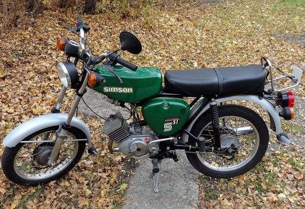

This page describes the vehicle parameter defaults depending on the
vehicle class. If no values are given the values for passenger are used.
It uses as default always the values in the first line for each vehicle
class. The other values (marked green) are just as an information (to be used with own
vehicle types).

<table class="tg">
  <tr>
    <th class="tg-dr3j">vClass (SVC)</th>
    <th class="tg-dr3j">example</th>
    <th class="tg-dr3j">shape (SVS)</th>
    <th class="tg-dr3j">length width height</th>
    <th class="tg-dr3j">minGap</th>
    <th class="tg-dr3j">amax(**)accel </th>
    <th class="tg-dr3j">b(**) decel</th>
    <th class="tg-dr3j">beemergency decel</th>
    <th class="tg-dr3j">vmax maxSpeed</th>
    <th class="tg-dr3j">vdesMax desiredMaxSpeed</th>
    <th class="tg-dr3j">seats</th>
    <th class="tg-dr3j"><a href="Models/Emissions/HBEFA3-based.html">emissionClass (HBEFA3)</a></th>
    <th class="tg-dr3j">speed deviation</th>
  </tr>
  <tr>
    <td class="tg-0lax">pedestrian</td>
    <td class="tg-0lax"></td>
    <td class="tg-0lax">pedestrian</td>
    <td class="tg-0lax">0.215m(1) 0.478m(1) 1.719m(1)</td>
    <td class="tg-0lax">0.25m</td>
    <td class="tg-0lax">1.5m/s2(23)</td>
    <td class="tg-0lax">2m/s2(23)</td>    
    <td class="tg-0lax">5m/s2</td>
    <td class="tg-0lax">10.44m/s2</td>
    <td class="tg-0lax">5km/h(23)</td>
    <td class="tg-0lax">-</td>
    <td class="tg-0lax">zero</td>
    <td class="tg-0lax">0.1</td>
  </tr>
  <tr>
    <td class="tg-c882" colspan="13">two-wheeled vehicle</td>
  </tr>
  <tr>
    <td class="tg-0lax">bicycle</td>
    <td class="tg-0lax"></td>
    <td class="tg-0lax">bicycle</td>
    <td class="tg-0lax">1.6m(17) 0.65m(17) 1.7m(*)</td>
    <td class="tg-0lax">0.5m</td>
    <td class="tg-0lax">1.2m/s2(19)</td>
    <td class="tg-0lax">3m/s2(19)</td>
    <td class="tg-0lax">7m/s2</td>
    <td class="tg-0lax">50km/h</td>
    <td class="tg-0lax">20km/h(19)</td>
    <td class="tg-0lax">1</td>
    <td class="tg-0lax">zero</td>
    <td class="tg-0lax">0.1</td>
  </tr>
  <tr>
    <td class="tg-0lax">moped</td>
    <td class="tg-0lax"></td>
    <td class="tg-0lax">moped</td>
    <td class="tg-0lax">2.1m(17) 0.8m(17) 1.7m(*)</td>
    <td class="tg-0lax">2.5m</td>
    <td class="tg-0lax">1.1m/s2(25)</td>
    <td class="tg-0lax">7m/s2(26)</td>
    <td class="tg-0lax">10m/s2</td>
    <td class="tg-0lax">45km/h(24)</td>
    <td class="tg-0lax">not limited (1e4km/h)</td>
    <td class="tg-0lax">2</td>
    <td class="tg-0lax">LDV_G_EU6</td>
    <td class="tg-0lax">0.1</td>
  </tr>
  <tr>
    <td class="tg-0lax">motorcycle</td>
    <td class="tg-0lax"></td>
    <td class="tg-0lax">motorcycle</td>
    <td class="tg-0lax">2.2m(28) 0.9m(28) 1.5m(28)</td>
    <td class="tg-0lax">2.5m</td>
    <td class="tg-0lax">6m/s2(19)</td>
    <td class="tg-0lax">10m/s2(27)</td>
    <td class="tg-0lax">10m/s2</td>
    <td class="tg-0lax">200km/h(28)</td>
    <td class="tg-0lax">not limited (1e4km/h)</td>
    <td class="tg-0lax">2</td>
    <td class="tg-0lax">LDV_G_EU6</td>
    <td class="tg-0lax">0.1</td>
  </tr>
  <tr>
    <td class="tg-c882" colspan="13">passenger car</td>
  </tr>
  <tr>
    <td class="tg-0lax" rowspan="5">passenger</td>
    <td class="tg-0lax"></td>
    <td class="tg-0lax">passenger</td>
    <td class="tg-0lax">5(29) 1.8m(29) 1.5m(29)</td>
    <td class="tg-0lax">2.5m</td>
    <td class="tg-0lax">2.6m/s2(29)</td>
    <td class="tg-0lax">4.5m/s2(27)</td>
    <td class="tg-0lax">9m/s2</td>
    <td class="tg-0lax">200km/h(29)</td>
    <td class="tg-0lax">not limited (1e4km/h)</td>
    <td class="tg-0lax">4</td>
    <td class="tg-0lax">PC_G_EU4</td>
    <td class="tg-0lax">0.1</td>
  </tr>
  <tr>
    <td class="tg-0lax"></td>
    <td class="tg-0lax">passenger/sedan</td>
    <td class="tg-0lax">see above</td>
    <td class="tg-0lax">see above</td>
    <td class="tg-0lax">see above</td>
    <td class="tg-0lax">see above</td>
    <td class="tg-0lax">see above</td>
    <td class="tg-0lax">see above</td>
    <td class="tg-0lax">see above</td>
    <td class="tg-0lax">5</td>
    <td class="tg-0lax">PC_G_EU4</td>
    <td class="tg-0lax">0.1</td>
  </tr>
  <tr>
    <td class="tg-0lax"></td>
    <td class="tg-0lax">passenger/hatchback</td>
    <td class="tg-0lax">see above</td>
    <td class="tg-0lax">see above</td>
    <td class="tg-0lax">see above</td>
    <td class="tg-0lax">see above</td>
    <td class="tg-0lax">see above</td>
    <td class="tg-0lax">see above</td>
    <td class="tg-0lax">see above</td>
    <td class="tg-0lax">5</td>
    <td class="tg-0lax">PC_G_EU4</td>
    <td class="tg-0lax">0.1</td>
  </tr>
  <tr>
    <td class="tg-0lax"></td>
    <td class="tg-0lax">passenger/wagon</td>
    <td class="tg-0lax">see above</td>
    <td class="tg-0lax">see above</td>
    <td class="tg-0lax">see above</td>
    <td class="tg-0lax">see above</td>
    <td class="tg-0lax">see above</td>
    <td class="tg-0lax">see above</td>
    <td class="tg-0lax">see above</td>
    <td class="tg-0lax">5</td>
    <td class="tg-0lax">PC_G_EU4</td>
    <td class="tg-0lax">0.1</td>
  </tr>
  <tr>
    <td class="tg-0lax"></td>
    <td class="tg-0lax">passenger/van</td>
    <td class="tg-c882">4.7m(16) 1.9m(16) 1.73m(16)</td>
    <td class="tg-0lax">see above</td>
    <td class="tg-0lax">see above</td>
    <td class="tg-0lax">see above</td>
    <td class="tg-0lax">see above</td>
    <td class="tg-0lax">see above</td>
    <td class="tg-0lax">see above</td>
    <td class="tg-0lax">6 </td>
    <td class="tg-0lax">PC_G_EU4</td>
    <td class="tg-0lax">0.1</td>
  </tr>
  <tr>
    <td class="tg-0lax">taxi</td>
    <td class="tg-0lax"></td>
    <td class="tg-0lax">taxi</td>
    <td class="tg-0lax">see passenger</td>
    <td class="tg-0lax">see passenger</td>
    <td class="tg-0lax">see passenger</td>
    <td class="tg-0lax">see passenger</td>
    <td class="tg-0lax">see passenger</td>
    <td class="tg-0lax">see passenger</td>
    <td class="tg-0lax">see passenger</td>
    <td class="tg-0lax">see passenger</td>
    <td class="tg-0lax">PC_G_EU4</td>
    <td class="tg-0lax">0.05</td>
  </tr>
  <tr>
    <td class="tg-0lax">emergency</td>
    <td class="tg-0lax"></td>
    <td class="tg-0lax">delivery</td>
    <td class="tg-0lax">6.5m(37) 2.16m(37) 2.86m(37)</td>
    <td class="tg-0lax">see above</td>
    <td class="tg-0lax">see above</td>
    <td class="tg-0lax">see above</td>
    <td class="tg-0lax">see above</td>
    <td class="tg-0lax">see above</td>
    <td class="tg-0lax">see above</td>
    <td class="tg-0lax">3</td>
    <td class="tg-0lax">LDV</td>
    <td class="tg-0lax">0</td>
  </tr>
  <tr>
    <td class="tg-0lax">delivery</td>
    <td class="tg-0lax"></td>
    <td class="tg-0lax">delivery</td>
    <td class="tg-0lax">6.5m(37) 2.16m(37) 2.86m(37)</td>
    <td class="tg-0lax">see above</td>
    <td class="tg-0lax">see above</td>
    <td class="tg-0lax">see above</td>
    <td class="tg-0lax">see above</td>
    <td class="tg-0lax">see above</td>
    <td class="tg-0lax">see above</td>
    <td class="tg-0lax">3</td>
    <td class="tg-0lax">LDV</td>
    <td class="tg-0lax">0.05</td>
  </tr>
  <tr>
    <td class="tg-c882" colspan="13">truck</td>
  </tr>
  <tr>
    <td class="tg-0lax">truck</td>
    <td class="tg-0lax"></td>
    <td class="tg-0lax">truck</td>
    <td class="tg-0lax">7.1m(30) 2.4m(30) 2.4m(30)</td>
    <td class="tg-0lax">2.5m</td>
    <td class="tg-0lax">1.3m/s2(31)</td>
    <td class="tg-0lax">4m/s2 (27)</td>
    <td class="tg-0lax">7m/s2</td>
    <td class="tg-0lax">130km/h(35)</td>
    <td class="tg-0lax">not limited (1e4km/h)</td>
    <td class="tg-0lax">3</td>
    <td class="tg-0lax">HDV</td>
    <td class="tg-0lax">0.05</td>
  </tr>
  <tr>
    <td class="tg-0lax" rowspan="2">trailer</td>
    <td class="tg-0lax"></td>
    <td class="tg-0lax">truck/semitrailer</td>
    <td class="tg-0lax">16.5m(14) max. 2.55m(13) max. 4m(13)</td>
    <td class="tg-0lax">2.5m</td>
    <td class="tg-0lax">1.1m/s2(31)</td>
    <td class="tg-0lax">see above</td>
    <td class="tg-0lax">see above</td>
    <td class="tg-0lax">see above</td>
    <td class="tg-0lax">see above</td>
    <td class="tg-0lax">3</td>
    <td class="tg-0lax">HDV</td>
    <td class="tg-0lax">0.05</td>
  </tr>
  <tr>
    <td class="tg-0lax"></td>
    <td class="tg-0lax">truck/trailer</td>
    <td class="tg-0lax">max. 18.75m(13) max. 2.55m(13) max. 4m(13)</td>
    <td class="tg-0lax">2.5m</td>
    <td class="tg-0lax">1m/s2(31)</td>
    <td class="tg-0lax">see above</td>
    <td class="tg-0lax">see above</td>
    <td class="tg-0lax">see above</td>
    <td class="tg-0lax">see above</td>
    <td class="tg-0lax">3</td>
    <td class="tg-0lax">HDV</td>
    <td class="tg-0lax">0.05</td>
  </tr>
  <tr>
    <td class="tg-c882" colspan="13">bus</td>
  </tr>
  <tr>
    <td class="tg-0lax" rowspan="2">bus</td>
    <td class="tg-0lax"></td>
    <td class="tg-0lax">bus</td>
    <td class="tg-0lax">12m(3) 2.5m(3) 3.4m(3)</td>
    <td class="tg-0lax">2.5m</td>
    <td class="tg-0lax">1.2m/s2(18)</td>
    <td class="tg-0lax">4m/s2(27)</td>
    <td class="tg-0lax">7m/s2</td>
    <td class="tg-0lax">85km/h(3)</td>
    <td class="tg-0lax">not limited (1e4km/h)</td>
    <td class="tg-0lax">~85</td>
    <td class="tg-0lax">Bus</td>
    <td class="tg-0lax">0</td>
  </tr>
  <tr>
    <td class="tg-0lax"></td>
    <td class="tg-0lax">bus/flexible</td>
    <td class="tg-0lax">17.9m(3) 2.5m(3) 3.0m(3)</td>
    <td class="tg-0lax">2.5m</td>
    <td class="tg-0lax">1.2m/s2(18)</td>
    <td class="tg-0lax">see above</td>
    <td class="tg-0lax">see above</td>
    <td class="tg-0lax">see above</td>
    <td class="tg-0lax">see above</td>
    <td class="tg-0lax">~150</td>
    <td class="tg-0lax">Bus</td>
    <td class="tg-0lax">0</td>
  </tr>
  <tr>
    <td class="tg-0lax">coach</td>
    <td class="tg-0lax"></td>
    <td class="tg-0lax">bus/coach</td>
    <td class="tg-0lax">14m(10) 2.6m(10) 4.m(10)</td>
    <td class="tg-0lax">2.5m</td>
    <td class="tg-0lax">2.0m/s2(*)</td>
    <td class="tg-0lax">see above</td>
    <td class="tg-0lax">see above</td>
    <td class="tg-0lax">100km/h(32)</td>
    <td class="tg-0lax">not limited (1e4km/h)</td>
    <td class="tg-0lax">70(9)</td>
    <td class="tg-0lax">Coach</td>
    <td class="tg-0lax">0.05</td>
  </tr>
  <tr>
    <td class="tg-c882" colspan="13">rail</td>
  </tr>
  <tr>
    <td class="tg-0lax">tram</td>
    <td class="tg-0lax"></td>
    <td class="tg-0lax">rail/railcar</td>
    <td class="tg-0lax">~22m(7) ~2.4m(7) ~3.2m(7)</td>
    <td class="tg-0lax">2.5m</td>
    <td class="tg-0lax">1.0m/s2(18)</td>
    <td class="tg-0lax">3.0m/s2(27)</td>
    <td class="tg-0lax">7m/s2</td>
    <td class="tg-0lax">80km/h(36)</td>
    <td class="tg-0lax">not limited (1e4km/h)</td>
    <td class="tg-0lax">~120(7, *)</td>
    <td class="tg-0lax">zero</td>
    <td class="tg-0lax">0</td>
  </tr>
  <tr>
    <td class="tg-0lax">rail_urban</td>
    <td class="tg-0lax"></td>
    <td class="tg-0lax">rail/railcar</td>
    <td class="tg-0lax">36.5m(*2/*4)(4) 3.0m(4) 3.6m(4)</td>
    <td class="tg-0lax">2.5m</td>
    <td class="tg-0lax">1.0m/s2(4)</td>
    <td class="tg-0lax">3.0m/s2(27)</td>
    <td class="tg-0lax">7m/s2</td>
    <td class="tg-0lax">100km/h(4)</td>
    <td class="tg-0lax">not limited (1e4km/h)</td>
    <td class="tg-0lax">~300(*2/*4)</td>
    <td class="tg-0lax">zero</td>
    <td class="tg-0lax">0</td>
  </tr>
  <tr>
    <td class="tg-0lax" rowspan="2">rail</td>
    <td class="tg-0lax"></td>
    <td class="tg-0lax">rail</td>
    <td class="tg-0lax">67.5m(*2)(11) 2.84m(11) 3.75m(11)</td>
    <td class="tg-0lax">2.5m</td>
    <td class="tg-0lax">0.25m/s2(34)</td>
    <td class="tg-0lax">1.3m/s2(33)</td>
    <td class="tg-0lax">5m/s2</td>
    <td class="tg-0lax">160km/h(11)</td>
    <td class="tg-0lax">not limited (1e4km/h)</td>
    <td class="tg-0lax">~434(*2)(11)</td>
    <td class="tg-0lax">HDV_D_EU0</td>
    <td class="tg-0lax">0</td>
  </tr>
  <tr>
    <td class="tg-0lax"></td>
    <td class="tg-0lax">rail/cargo</td>
    <td class="tg-0lax">750m (~18.9m + x*~16m)(5, 6, 8) ~4.4m(6) ~3.0m(6)</td>
    <td class="tg-0lax">2.5m</td>
    <td class="tg-0lax">0.25m/s2(34)</td>
    <td class="tg-0lax">1.3m/s2(33)</td>
    <td class="tg-0lax">5m/s2</td>
    <td class="tg-0lax">120km/h(5)</td>
    <td class="tg-0lax">not limited (1e4km/h)</td>
    <td class="tg-0lax">1</td>
    <td class="tg-0lax">HDV_D_EU0</td>
    <td class="tg-0lax">0</td>
  </tr>
  <tr>
    <td class="tg-0lax">rail_electric</td>
    <td class="tg-0lax"></td>
    <td class="tg-0lax">rail</td>
    <td class="tg-0lax">~25m(*8)(12) 2.95m(12) 3.89m(12)</td>
    <td class="tg-0lax">2.5m</td>
    <td class="tg-0lax">0.5m/s2(33)</td>
    <td class="tg-0lax">1.3m/s2(33)</td>
    <td class="tg-0lax">5m/s2</td>
    <td class="tg-0lax">330km/h(12)</td>
    <td class="tg-0lax">not limited (1e4km/h)</td>
    <td class="tg-0lax">425(12)</td>
    <td class="tg-0lax">zero</td>
    <td class="tg-0lax">0</td>
  </tr>
  <tr>
    <td class="tg-c882" colspan="13">electric vehicle</td>
  </tr>
  <tr>
    <td class="tg-0lax">evehicle</td>
    <td class="tg-0lax"></td>
    <td class="tg-0lax">evehicle</td>
    <td class="tg-0lax">see passenger</td>
    <td class="tg-0lax">see passenger</td>
    <td class="tg-0lax">see passenger</td>
    <td class="tg-0lax">see passenger</td>
    <td class="tg-0lax">see passenger</td>
    <td class="tg-0lax">see passenger</td>
    <td class="tg-0lax">see passenger</td>
    <td class="tg-0lax">see passenger</td>
    <td class="tg-0lax">zero</td>
    <td class="tg-0lax">0.1</td>
  </tr>
  </tr>
    <tr>
    <td class="tg-0lax">e-scooter</td>
    <td class="tg-0lax"></td>
    <td class="tg-0lax">e-scooter</td>
    <td class="tg-0lax">1.1m(*) 0.4m(*) 1.2m(*)</td>
    <td class="tg-0lax">1.5m(39)</td>
    <td class="tg-0lax">2m/s2(39)</td>
    <td class="tg-0lax">4m/s2(39)</td>
    <td class="tg-0lax">7m/s(*)</td>    
    <td class="tg-0lax">20 km/h(39)</td>
    <td class="tg-0lax">not limited (1e4km/h)</td>
    <td class="tg-0lax">1(*)</td>
    <td class="tg-0lax">zero</td>
    <td class="tg-0lax">0.1</td>
  </tr>
  <tr>
    <td class="tg-c882" colspan="13">ship</td>
  </tr>
  <tr>
    <td class="tg-0lax">ship</td>
    <td class="tg-0lax"></td>
    <td class="tg-0lax">ship</td>
    <td class="tg-0lax">17m 4m 4m</td>
    <td class="tg-0lax">2.5</td>
    <td class="tg-0lax">0.1m/s2</td>
    <td class="tg-0lax">0.1m/s2</td>
    <td class="tg-0lax">1m/s2</td>
    <td class="tg-0lax">4.12 (8 Knots)</td>
    <td class="tg-0lax">not limited (1e4km/h)</td>
    <td class="tg-0lax"></td>
    <td class="tg-0lax">HDV_D_EU0</td>
    <td class="tg-0lax">0.1</td>
  </tr>
</table>

- (1): <https://www.baua.de/DE/Angebote/Publikationen/AWE/AWE108.pdf?__blob=publicationFile>
- (2): <https://web.archive.org/web/20100531025842/http://www.motorrad-leuschner-d.de/motorraeder.html>
- (3): <https://web.archive.org/web/20110313224137/www.bvg.de/index.php/de/binaries/asset/download/470184/file/1-1>
- (4): <https://de.wikipedia.org/wiki/S-Bahn_Berlin>
- (5): <https://de.wikipedia.org/wiki/Schieneng%C3%BCterverkehr>
- (6): <https://de.wikipedia.org/wiki/Bombardier_Traxx>
- (7): <https://de.wikipedia.org/wiki/GTxN/M/S>
- (8): <https://de.wikipedia.org/wiki/Flachwagen>
- (9): <https://de.wikipedia.org/wiki/Reisebus>
- (10): <http://www.neoplan-bus.com/cms/media/de/content/downloads/skyliner/NEOPLAN_SKYLINER.pdf>
- (11): <https://de.wikipedia.org/wiki/DBAG-Baureihe_425>
- (12): <https://de.wikipedia.org/wiki/ICE_3>
- (14): <https://www.truck.man.eu/man/media/de/content_medien/doc/business_website_truck_master_1/einsatzgebiete/de_2/man-lkw-tg-fernverkehr-volumen.pdf>
- (15): <https://de.wikipedia.org/wiki/Opel_Vivaro>
- (16): <https://de.wikipedia.org/wiki/Renault_Espace>
- (17): Fußgeher- und Fahrradverkehr: Planungsprinzipien; Hermann Knoflacher; Böhlau Verlag Wien, 1995
- (18): RiLSA 2010
- (19): <https://www.colliseum.eu/wiki/images/b/bf/Geschwindigkeiten%2C_Verz%C3%B6gerungen_und_Beschleunigungen_nicht_motorisierter%2C_ungesch%C3%BCtzter_Verkehrsteilnehmer_am_Beispiel_Fahrrad_und_Inlineskates.pdf>
- (20): <http://tuprints.ulb.tu-darmstadt.de/905/1/Schroeder_Frank_FZD_Diss.pdf>
- (21): <http://www.unfallrekonstruktion.de/pdf/nickel.pdf>
- (22): <http://www.trb.org/publications/nchrp/nchrp_rpt_505.pdf> (p48)
- (23): `http://jml2012.indexcopernicus.com/fulltxt.php?ICID=1022800` (dead link) (pdf p.229-230)
- (24): <https://de.wikipedia.org/wiki/Kleinkraftrad>
- (25): <https://de.wikipedia.org/wiki/Vespa_LX>
- (26): <http://www.colliseum.net/wiki/Bremsversuche_mit_dem_Kleinkraftrad_S_50_/_S_51>
- (27): <https://web.archive.org/web/20120622045505/http://www.unfallaufnahme.info/uebersichten-listen-und-tabellen/geschwindigkeiten-und-bremswege/index.html>
- (28): <https://www.bmw-motorrad.de/>
- (29): <https://web.archive.org/web/20140227232934/http://www.volkswagen.de/de/models/golf_7/trimlevel_overview.s9_trimlevel_detail.suffix.html/der-golf-cup~2Fcup.html>
- (30): <https://web.archive.org/web/20160320031009/https://www.buchbinder.de/de/fahrzeuge.html>
- (31): <http://www.colliseum.net/wiki/Lkw-Anfahrbeschleunigungswerte_f%C3%BCr_die_Praxis>
- (32): <https://de.wikipedia.org/wiki/Zul%C3%A4ssige_H%C3%B6chstgeschwindigkeit_im_Stra%C3%9Fenverkehr_(Deutschland)>
- (33): `http://www.ice-fansite.com/index.php?option=com_content&view=article&id=195:ice1-techdat&catid=50:icet&Itemid=69` (dead link)
- (34): <https://en.wikipedia.org/wiki/Orders_of_magnitude_(acceleration)>
- (35): https://www.researchgate.net/publication/311633504_Improving_Road_Safety_of_Tank_Truck_in_Indonesia_by_Speed_Limiter_Installation
- (36): <http://ka.stadtwiki.net/H%C3%B6chstgeschwindigkeit_(Bahn)>
- (37): https://www.rettungsdienst.brk.de/leichte-sprache/abteilung/beschaffung/rettungswagen-rtw/rtw-by-2010.html
- (38): <https://www.berlin.de/binaries/asset/image_assets/5859948/source/1565347986/624x468/>
- (39): <https://electric-scooter.guide/comparisons/electric-scooter-performance-tests/>
- (40): <https://www.chip.de/artikel/E-Scooter-Test-Die-besten-Elektro-Scooter-mit-Strassenzulassung_165587317.html>
- (\*): estimated
- (\*\*): need to be revisited to fit to model behavior
